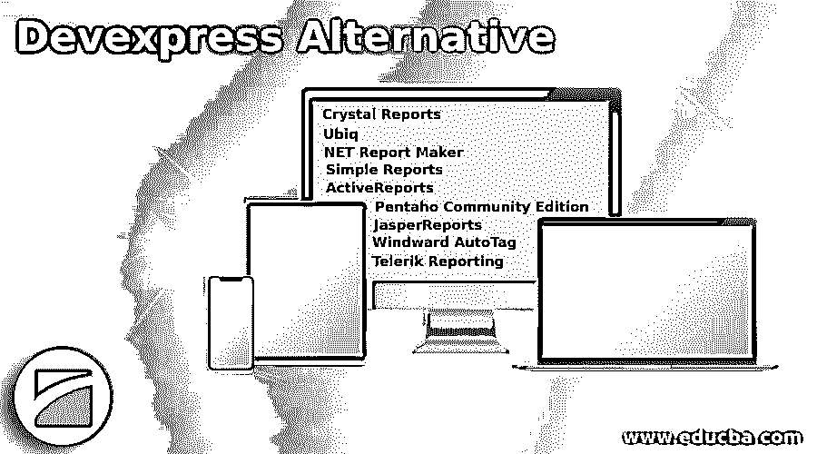

# Devexpress 替代

> 原文：<https://www.educba.com/devexpress-alternative/>

## Devexpress 简介

DevExpress 是一个报告平台，用于通过。NET 框架。这是显示复杂信息的一种简单易行的方式，以便做出最佳选择，并为组织提供直观的报告解决方案。DevExpress 通过高度定制的功能为用户提供出色的性能。通过这一个性化功能，用户将能够通过增强的报表控件以及多维数据透视表和图表创建信息清晰无比的报表和演示。在本主题中，我们将了解 Devexpress 替代方案。

### Devexpress 的替代方案

让我们来看看 DevExpress 的替代方案。

<small>网页开发、编程语言、软件测试&其他</small>

#### 1.水晶报表

Crystal Reports 是一个动态演示和报告工具。在这种情况下，最重要的事情是，它几乎使所有数据成为交互式的报表，可以从应用程序、网站和移动设备在线或离线访问。他们的报告可以用多达 24 种国际语言编写。

强大的报告选项，灵活且可定制，支持 MS Excel、移动、广泛的信息连接等。是水晶报告的其他特点。Crystal Reports 是一款全面的商业智能软件，旨在使用一系列数据源支持的强大、专业的报告工具生成报告。

#### 2.Ubiq

Ubiq 是一个在线商业智能平台，主要用于数据和报告可视化。Ubiq 是一个 PostgreSQL 和 MySQL 报告和分析平台。Ubiq 提供了一个方便的仪表板、简单的报告甚至仪表板创建、数据分析系统和拖放功能、过滤系统和功能的可用性、用于共享目的的团队建设和对各种类型数据源的支持——本地、远程和云——Ubiq 的主要优势和优点。

#### 3.网络报告制作者

ASP.NET 报告制造商是一个专业的报告工具，设计和支持动态网页的创建，如 MS Access 或任何其他数据库。它为用户提供了报告和生成行业级信息的工具，允许用户立即为他们的网站创建详细的摘要报告甚至交叉表报告。ASP.NET 报表生成器为每个人提供解决方案，从 JavaScript 图表到 Flash 图表。不再有客户端控制要求，因为所有这些手续都从 ASP.NET 报表生成器生成的脚本中免除，并最终可用。

#### 4.简单报告

用于各种专业报告的简单报告生成器是一个简单的报告。它为开发人员和设计人员创建报告和数据查询提供了一个独立的仪表板。它是一个强大的平台，用于管理各种数据源并同时混合它们。简单报告非常简单，也很容易创建即席报告。简单报告不仅仅是简单的报告创建，还包括专业和有吸引力的报告创建和设计。

#### 5.活动报告

ActiveReports 是 a.NET 的报告平台，用于现代业务需求的可视化。它允许用户使用 Visual Studio 创建各种报表，Visual Studio 还具有广泛的 API 功能和 ActiveReports 的组件。更好的是，为用户提供报告系统，他们还可以免费获得各种表格和报告。这是基于 WinForms，ASP.NET 和 HTML。报表服务器也是免费的。

#### 6.Pentaho 社区版

Pentaho Community Edition 是为各种规模的公司提供的解决方案，包括基本的报告解决方案、数据表示、分析和各种其他功能，以节省业务时间和资金。除了使用所有这些功能之外，BA 服务器和 PDI 市场条目可以由 Pentaho 社区版的用户从官方网站访问。

#### 7.贾斯珀报告

JasperReports 是开发人员、设计人员和网站管理员报告 Java 并对其进行分析的平台，您可以从这里访问 JasperReports 图形设计工具。JasperReports 是 Java 最好的开源报告者之一。来自任何数据源的数据都可以用于生成 pixel 文档，这些文档可以以各种文档格式(Excel，包括 PDF、OpenOffice、HTML 和 MS Word)进行查看、打印或导出。

#### 8.向风自动标签

对于用于个人和商业目的的个人报告和设计工具，Windward AutoTag 是免费的。它也被称为 AutoTag Report Builder，允许开发人员和程序员使用 AutoTag for Word 和 AutoTag for Excel 设计、格式化和编辑所有类型的 MS Office 报表。它自动添加到 MS Word 和 Excel 中，并允许用户将他们的文档和平板电脑连接到任何详细信息来源。Windward AutoTag 也最适合商业专业人士，需要单一报告的公司可以获得更多来源。

#### 9.Telerik 报道

Telerik reporting 是一个报告引擎，为所有 HTML5、WinForms、NET、Ajax、ASP、Mobile、Touch 等提供报告查看器。这是一个移动、Web 和桌面交互式特别报告应用程序。Telerik reports 提供来自 OLAP 的报告、数据引擎和信息绑定、用户名风格的报告和交互式特别报告。Telerik 报告为任何应用程序提供关键功能。主要优点是几乎所有的功能和工具都集成在一起，帮助用户为个人或商业目的生成直观的报告。

### 推荐文章

这是 Devexpress 替代方案的指南。这里我们讨论各种 DevExpress 替代方案。您可以根据自己的需求选择任何一种。您也可以看看以下文章，了解更多信息–

1.  [Lucidchart 替代方案](https://www.educba.com/lucidchart-alternative/)
2.  [XnView 备选方案](https://www.educba.com/xnview-alternatives/)
3.  [Pro 工具替代方案](https://www.educba.com/pro-tools-alternative/)
4.  [OneNote 备选方案](https://www.educba.com/onenote-alternative/)

