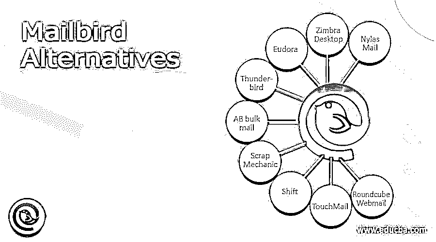

# 邮件鸟替代品

> 原文：<https://www.educba.com/mailbird-alternatives/>

## 邮件鸟替代品介绍

Mailbird 是一个 Windows 电子邮件客户端。该客户不仅支持 Gmail 电子邮件账户，还支持脸书、Dropbox、Google Drive 和其他服务。Mailbird 的设计和功能与 Mac Sparrow 几乎完全相同，非常适合那些寻找同等 Windows 系统的人。不是所有的 Mailbird 的功能都包含在这个免费的测试版中，但是你会很好地体验它的功能。

### 邮件鸟替代品列表

让我们一个一个地看看邮鸟替代品。

<small>网页开发、编程语言、软件测试&其他</small>

#### 1\. Nylas Mail

Nylas Mail 是第三方电子邮件客户，为您提供笔记本电脑或个人电脑应用程序的替代产品。该应用程序有一个最小的界面，可以免费下载和操作，并挑战一些最好的电子邮件客户，包括航空邮件和邮箱。您可以使用应用程序自定义您的电子邮件体验和收件箱。Nylas Mail 有一个单一的收件箱，可以在一个地方接收几个电子邮件帐户的信息。丰富的联系人档案为用户提供了更多的灵活性，使其成为一个很好的商业产品。简介可能包括传记、位置、社交媒体简介等详细信息。

#### 2.Zimbra 桌面

Zimbra Desktop 是首批向我们展示其功能的 Web 2.0 应用之一。今天的 2.0 应用程序一代让它有点落后，但它仍然是一个有趣的工具。Zimbra Desktop 是一个 AJAX 工作工具，可以离线和在线工作。例如，您可以通过 Zimbra 编写电子邮件，添加新模板和离线编辑文档，并在重新连接时自动将更改同步到 Zimbra 服务器。

#### 3.尤朵拉（女子名）

Eudora 提供的不仅仅是一个普通的电子邮件平台，它实际上充满了酷和有用的功能。视障人士可以选择大声朗读他们的电子邮件，这对商务会议也很有用。动画 gif 和 HTML 也可以很容易地查看，而范围的顶端是网络钓鱼，垃圾邮件保护和加密。虽然这对于商务专业人士中的普通电子邮件用户来说是一个很好的工具，但是它的功能太多了。

#### 4.雷鸟

如果你还在旅行，并且是雷鸟的忠实粉丝，这个节目应该会对你的祈祷有很大的回应。雷鸟便携版可以从 u 盘运行，所以你可以随时随地轻松使用。无论你去哪里，你都可以带着你的电子邮件，尽管当你下载它们的时候，你可以很快地填写一个电子闪存盘。这是雷鸟便携版更有用的特点之一。幸运的是，雷鸟便携版只需要 30-40 MB 的空间。

#### 5.散装邮件

AB Bulk Mailer 提供了一种快速而简单的方法，让企业主可以向客户发送电子邮件。AB 批量邮件主要是一个自动化的电子邮件经销商。这通常是与许多客户沟通所必需的(例如在促销或销售期间)。信息本身可以以 HTML 或文本格式传输，当处理大量信息时，可以使用几个电子邮件服务器来减少延迟。

#### 6.废品技工

Scrap Mechanic 是一款多人机器游戏，玩家从制造新机器的废料中获取材料。这些可以包括车辆，新的创作，陷阱等等。挑战是通过使用游戏的工具来创造最独特和最实用的发明。要制造一台完美的机器，要选择各种各样的废金属零件。

#### 7.变化

Shift 是一个独特的桌面应用程序，使您能够在 Gmail 帐户之间轻松切换。如果您经常同时打开多个门户，或者需要访问公司或个人电子邮件，这是一个很好的选择。在下载完整的软件包之前，有一个免费的试用版。该系统还支持 Google 日历和 Google Drive。

#### 8.TouchMail

触摸邮件是为那些希望使用基于 PC 的软件，但更喜欢触摸屏界面的便利性的人设计的。这个免费的应用程序可以很容易地下载，并提供了一种快速访问所有收到的电子邮件的方法，无论你在哪里使用智能手机或平板电脑。

#### 9.round cube web 邮件

Roundcube Webmail 是一个免费的电子邮件客户端，您可以使用它进行电子邮件管理。从一开始，您就应该意识到这个客户端是一个基于浏览器的开源项目。虽然它的功能并不比 Gmail 等其他产品多，但这位客户仍然提供了一笔不错的交易。它有一个轻量级的目录访问协议(LDAP)和一个直观的地址簿，可以帮助您在键入时找到您想要的联系人。该公司和生产力工具也支持 HTML 电子邮件。如果这些功能不满足，您可以选择为更多的客户组件提供插件。

### 结论

在这篇文章中，我们看到了 Mailbird 的替代品。您可以根据自己的需求选择任何一种。我希望这篇文章对你有所帮助。

### 推荐文章

这是一份邮件鸟替代品指南。在这里，我们分别讨论介绍，邮件鸟替代品列表。您也可以看看以下文章，了解更多信息–

1.  [SQLite 替代品](https://www.educba.com/sqlite-alternatives/)
2.  [XnView 备选方案](https://www.educba.com/xnview-alternatives/)
3.  [混合面板替代品](https://www.educba.com/mixpanel-alternatives/)
4.  [观念选择](https://www.educba.com/notion-alternatives/)

