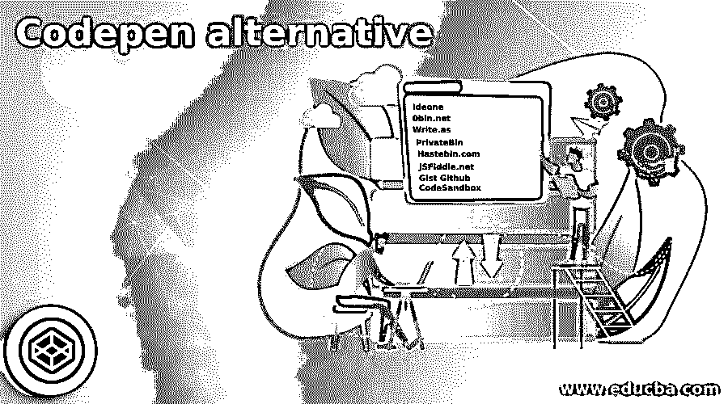

# 代码笔替代

> 原文：<https://www.educba.com/codepen-alternative/>

## CodePen 简介

CodePen 是一个基于云的代码平台，它使 web 开发人员能够调整他们的 JavaScript、CSS 和 HTML5 代码片段。它可以与许多 JavaScript 预处理器、库和框架无缝协作，并且有广泛的选项。免费广告版限制开发者只能开发一个项目，并提供一系列专业版本，起价为每月 8 美元。这是一个支持广告的版本。这些版本删除了广告，允许多个(包括个人)项目，还提供资产托管、实时视图和嵌入式主题。还存在其他特殊的合作和教学模式。

### CodePen的替代品

以下是如下所述的备选方案:

<small>网页开发、编程语言、软件测试&其他</small>

#### 1.是吗

Ideone.com 是一个在线编译和调试源代码的强大工具，可以在 60 种流行的编程语言中运行。这是一个包含许多集成工具的完整解决方案，可以帮助您轻松管理代码。您需要首先选择一种编程语言，输入带有可选输入数据的源代码，然后准备就绪。该平台的工作非常简单。Ideone 是专门为专家和初学者设计的，它提供了许多工作正常的示例代码，可以解决您的主要问题

#### 2.0bin.net

0bin.net 是世界上客户端领先的加密剪贴板，可以在没有数据库的情况下启动。它是 Pastebin.com 的替代产品，并为所有类似服务提供了一些新功能。该网站允许每个人拥有一个 Pastebin，同时他们欢迎所有可以添加的内容。编程，纯文本，视频，图像，和更多的内容被 Obin.net 接受。Obin.net 提供了易于理解和简单的界面，在此帮助下，您可以轻松上传和编写您的内容，并与您的朋友和其他人分享。

#### 3.写作. as

Write.as 是在基于网络的平台上发布任何你想要的东西的最简单的方法。这个平台是专门为作家、有思想的人和任何需要快速思考的人设计的。它为你的思想提供了不受干扰的空间。编辑器允许你发表和写作，所以没有流，流动，或跟随窃取你的焦点。它分离了阅读体验。另一个重要的事实是，它会自动保存你，即使你在离开前没有保存，它也一直在等待。

#### 4.PrivateBin

PrivateBin.info 是一个基于 web 的开源 Pastebin，对服务器上粘贴的数据一无所知。在这个平台上，您的数据在浏览器中用伽罗瓦计数器的 256 位 AES 模式进行加密和解密。它提供了所有类似的服务，包括一些新的特性，如数据存储、代码采样和传输到服务器的数据加密等。你也可以上传比其他人使用这个平台做得更好的图片和 GIF 文件。Privtaebin 还为您提供核心功能，如翻译系统、各种模板、多种语言、语法高亮显示等等，要使用这些功能，您只需填写一些必需的信息，然后用您的电子邮件 id 注册即可。

#### 5.Hastebin.com

Hastebin.com 是一个开发、上传和与开发者共享代码的工具。将文本粘贴到文本字段中，然后按保存按钮；你可以很容易地在一个新的标签页中分享 Hastebin 链接。该平台是专门为那些可以与团队成员共享代码的开发人员设计的。与其他工具相比，这个工具是最漂亮、最容易使用的。它提供了许多工具来改善您的体验，以使它变得更快。

#### 6.JSFiddle.net

JSFiddle.net 是一个在线社区，测试和显示 HTML，CSS 和 JavaScript 代码片段创建和合作。它也被称为 JavaScript 云游乐场，允许 web 开发人员更改代码并实时查看调整的结果。该平台不仅支持 JavaScript 和版本，还支持 HTML 和 CSS 代码。除此之外，它还支持 JQuery、Angular JS、ReactiveJS 等流行的 JavaScript 框架。在这个平台的帮助下，你可以很容易地在世界各地分享你的代码。

#### 7.Gist Github

Gist Github 是一个基于 web 的免费应用程序，允许您创建代码片段，并在整个社区中以所有编程语言共享。您可以在 Github 社区中开发和共享的应用程序是一个令人印象深刻的集合。它是 Pastebin 平台的替代产品，提供所有相同的工具和服务，并具有程序员会觉得更好的高级特性。Gist 社区允许用户为几乎任何目的按下一个不断增长的代码片段列表。用户可以添加额外的代码来帮助其他人使用这个平台。

#### 8.CodeSandbox

CodeSandbox 是一个被认为是 IDE 和 web 开发原型工具的平台。该平台允许用户快速、经常地测试他们的想法。用户只需使用网络浏览器，就可以在任何地方进行编码，而无需配置任何其他软件。该解决方案为用户提供了一个模板，如 React、Vue 或 Angular，用户类型可以更新应用程序或网站。此外，用户可以实时查看变化。该平台允许开发人员制作静态网站，并完成 Web 应用程序和组件。

### 推荐文章

这是一个 CodePen 替代指南。这里我们已经讨论了 Codepen 的替代方案，您可以根据自己的需求选择其中任何一个。您也可以看看以下文章，了解更多信息–

1.  [Crello 替代方案](https://www.educba.com/crello-alternatives/)
2.  [Nodemon 替代方案](https://www.educba.com/nodemon-alternative/)
3.  [网页包备选](https://www.educba.com/webpack-alternative/)
4.  [混合面板替代品](https://www.educba.com/mixpanel-alternatives/)

