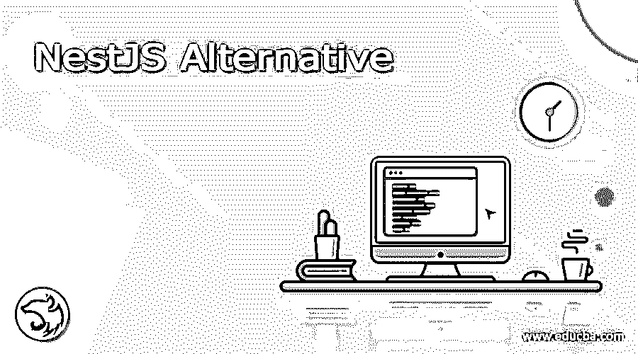

# NestJS 替代方案

> 原文：<https://www.educba.com/nestjs-alternative/>

## NestJS 替代方案介绍

NestJS 是渐进节点。用于构建高效、可伸缩的服务器端应用程序的 JS 框架。它拥有 JavaScript 的所有新特性，带来了设计模式和成熟的解决方案。它提供了允许用户使用其他库的灵活性。它采用的生态系统是各种服务器端应用程序的成熟主干。对于 nextJs，有各种各样的选择可以提供与 NestJS 相同的功能。ExtJs，Jhipster，Angular，Express JS，DevExpress，D3。Js、Moment.js、Backbone.js、createjs 和 Chart。Js 是一些替代品。

### NestJS 替代方案

以下是 NestJS 备选方案列表

<small>网页开发、编程语言、软件测试&其他</small>

#### 1.外部 Js:

Ext Js 是 NestJS 的最佳替代方案。它是用于构建跨 web 应用平台的纯 JavaScript 应用框架。使用 DHTML、Ajax 和 DOM 脚本来构建平台。Ext Js 提供了一组基于 GUI 的控件来实现 web 应用程序。文本字段、文本区域、数据选择器、单选按钮、复选框、列表框、组合框、网格控件、树控件、工具栏、标签面板、菜单、滑动条、矢量图形图表是 Ext Js 提供的一些控件。它有不同的版本，一个是现代工具包，另一个是经典工具包。

#### 2.杰普斯特:

NestJS 的另一个最佳选择是 Jhipster。Its 是一个免费的开源应用程序生成器，用于使用 angular 或 react 和 spring 框架开发现代 web 应用程序和微服务。它是用 Java 写的。Jhipster 生成全栈应用和微服务。它还直接或通过搭建生成 CRUD 实体。它提供了各种工具，在服务器端使用 java 堆栈，在客户端使用响应式 web front 来生成项目。

#### 3.角度:

它是用 typescript 语言编写的免费开源 web 应用程序框架。角度组件是模块的一部分，或者我们可以说，模块包含实现应用程序的业务逻辑的组件，还包含调用时将触发的模板。随着时间的推移，Angular 在性能、处理事件、提供对不同浏览器的支持以及类型检查方面都有所改进。

#### 4.快递. js:

Express.js 是一个免费开源的 Node.js 的 web 服务器框架，可以快速高效地用于开发和创建移动应用。您可以在 web 浏览器上运行 web 应用程序。Web 应用程序因为只有 Express.js 需要 JavaScript，所以程序员和开发人员创建 web 应用程序和 API 更容易。Express.js 是一个 Node.js 应用程序，它确保大多数程序员现在都在使用 JavaScript。您可以使用 Express.js 创建单个、多页面或混合的 Web 应用程序。Express.js 很简单，它允许在服务器的 web 端构建更加简化的 MVC 基础设施。

#### 5.D3。Js:

D3.js 是 NestJs 的最佳替代方案。它代表数据驱动文档，是一个 JavaScript 库，用于在 web 浏览器中生成动态、交互式的数据可视化。D3.js 使用各种标准，比如。SVG(可缩放矢量图形)、CSS(级联样式表)和 HTML5。它提供了内置的功能，允许用户创建 SVG 对象，选择元素和样式，并添加动态效果和工具提示。

#### 6.Moment.js:

Moment.js 是一个 JavaScript 包，它使得用 JavaScript 解析、验证、操作和显示日期/时间变得简单。Moment.js 允许您基于您的位置以人类可读的方式显示日期。Moment.js 可以通过脚本方式在浏览器中使用。它也与 Node.js 兼容，可以通过 npm 包管理器安装。

#### 7.主干网:

Nest 的另一种选择。Js 是 Backbone.Js，它是一个 javascript 库，具有 RESTful JSON 接口，基于模型-视图-控制器应用程序设计范例。它被设计用于开发单页 web 应用程序，并用于跟踪 web 应用程序的各个部分。backbone.js 最好的特性之一是它的轻量级特性，因为它唯一的硬依赖是一个 JavaScript 库和下划线. js，加上 jQuery 以使用完整的库。与声明式编程风格相比，Backbone.js 采用命令式编程风格。

#### 8.CreateJS:

Nest.js 的另一个替代方案是 CreateJS，这是一个模块化框架和工具的集合，它们一起或单独工作，使用 HTML5 在开放的 web 上生成交互式内容。它的预加载库允许用户管理和协调资产和数据的加载。CreateJS 库适用于所有现代桌面和移动浏览器，并且已经过严格测试，以确保在尽可能广泛的浏览器中的性能和稳定性。

#### 9.Chart.js:

另一种选择是图表。Js，是用于可视化数据的开源 javascript 库。它支持 8 种类型的图表，即条形图，折线图，气泡图，饼图，极坐标图，散点图，雷达图。它在所有现代浏览器中的 HTML5 画布上呈现。它以最好的数据可视化库而闻名。它提供了数据集之间清晰的视觉区别。除了这些功能，它还提供动画功能。

#### 10.Ember.js:

Ember.js 是一个 JavaScript 平台 MVC(模型视图控制器)，用于客户端大型 web 应用的开发。与其他 JavaScript MVC 框架相比，它允许您编写有序和结构化的代码。这有助于你结合 Ember.js 网站创建“雄心勃勃”的软件应用。该路径在 Ember.js 中用作模型。控制模板处理模型中的数据，以及视图和控制器。如果您想创建一个单页面的 web 应用程序来推动可能的事情，Ember.js 是您的正确选择。

### 结论

在本文中，我们讨论了 NextJs 的各种替代方案，比如 extJs、Jhipster、Angular、Express JS、DevExpress、D3。Js、Moment.js、Backbone.js、CreateJS、Chart.js，每个都有自己的特点和局限性。根据您的需求和用途，您可以选择其中之一。

### 推荐文章

这是一个 NestJS 替代指南。在这里，我们讨论了 NestJS 替代品的介绍、列表及其各自的特点和局限性。您也可以看看以下文章，了解更多信息–

1.  [Adobe 试听备选方案](https://www.educba.com/adobe-audition-alternative/)
2.  [WPS 办公备选方案](https://www.educba.com/wps-office-alternative/)
3.  [PowerPoint 替代品](https://www.educba.com/powerpoint-alternatives/)
4.  [GTmetrix 备选方案](https://www.educba.com/gtmetrix-alternative/)

