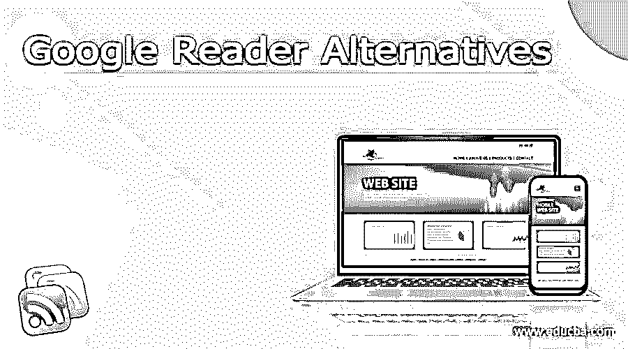

# 谷歌阅读器替代品

> 原文：<https://www.educba.com/google-reader-alternatives/>

## 谷歌阅读器替代品介绍

谷歌阅读器是谷歌旗下的 RSS/Atom 提要聚合器。它由谷歌开发人员克里斯·韦瑟雷尔在 2005 年初设计，并于 2005 年 10 月 7 日通过谷歌实验室发布。谷歌阅读器越来越受欢迎，以至于它支持各种各样的程序，这些程序把它作为向用户提供新闻和信息的平台。谷歌阅读器还有一些其他的替代品，如 G2Reader、Feedly、CommaFeed、Digg Reader、Old Reader、dotdot、Reeder、Feedspot、Taptu 和 Tiny Tiny RSS。

### 谷歌阅读器替代品

以下是谷歌阅读器的替代品。

<small>网页开发、编程语言、软件测试&其他</small>

#### 1.G2Reader:

G2Reader 是一个基于网络的 RSS 阅读器，支持 OPML 上传，设计简单明了。在 Google Reader 用户最初离开后，G2Reader 有点迟钝，但该团队最近重建了其服务器，因此，G2Reader 现在在速度方面完全有能力。它包括一个奇妙的功能，允许你将关键词添加到设置中，并在它们出现在你的 feed 材料中时高亮显示它们。它是免费的，有多种语言版本。

#### 2.饲料:

Feedly 不处理 OPML 文件，这可能是它唯一的缺陷，因为这个基于网络的阅读器在几乎所有其他方面都很出色。Feedly 已经转向基于云的方式存储账户数据，确保你的 RSS 内容在你所有的设备上同步。整理你的订阅源的功能，比如重新排列和分组到文件夹中，是非常棒的。它提供了一个简单、可调整的设计(带有查看列表、预览或扩展项目的选项)，Feedly 会推荐更多你可能会感兴趣的内容。

#### 3.CommaFeed:

对于 DIY 者来说，CommaFeed 是 RSS 阅读器的首选。它已经是谷歌阅读器最大的竞争对手之一，而且只会越来越好。CommaFeed 是一个基于网络的服务，也是一个开源项目，你可以自己开发，让你轻松切换到不同的阅读器。自定义 CSS 可以用来改变这个阅读器的外观。它还包括共享功能。

#### 4.Digg 阅读器:

这款基于网络的 RSS 阅读器具有鼓励你探索新内容的功能，但它不会强迫你以类似杂志的格式阅读它们，这可能是一些 RSS 订阅纯粹主义者喜欢的。它有很多自定义选项，用于订阅列表和文件夹管理。它也不支持 OPML 文件上传，尽管有一个漂亮的外观和更新相当快。融入了一些社交元素，一些设置默认设置为公开而非私密。

#### 5.老读者:

旧阅读器是几年前为应对谷歌阅读器取消社交功能而开发的，由于其简单性和可靠性，它仍然是顶级 RSS 阅读器之一，毫无疑问是社交 RSS 爱好者的最佳选择。您可以“关注”其他用户的订阅源，也可以被别人关注。它的工作方式几乎和 2010 年的谷歌阅读器一模一样。它有十几种语言版本，支持 OPML 上传。目前没有适用于老版本阅读器的移动应用。

#### 6\. Dotdotdot:

Dotdotdot 是阅读长篇文章和故事的好工具。它是 iPhone 和 iPad 应用程序自带的基于浏览器的 RSS 阅读器。它还提供不受干扰的网络阅读，最适合长篇内容，以及阅读和管理电子书的能力。Dotdotdot 不能搜索文章内容、标题或作者，但它使用户能够突出显示、标记和引用文本。不支持 OPML 文件。

#### 7.里德:

Reeder 是一个 OS X 桌面应用程序，它为你的 RSS 订阅带来了很多谷歌阅读器没有的功能。它很灵活，很容易与谷歌阅读器配合使用，尽管它不支持 OPML 上传。它有一个免费的 iPhone 应用程序(最近变得免费)和一个即将推出的 iPad 版本。有几个分享的可能性和一个奇妙的搜索框，但没有 Windows 或 Android 应用程序。

#### 8.馈电点:

Feedspot 是一个商业在线 RSS 阅读器，具有简单的界面和实现。它具有多种功能，可以在外部和服务内部共享内容，以及将内容保存到 Evernote、Pocket 和 Instapaper 等其他服务中。Feedspot 还不错，但并不完美，因为重组 feeds 的工具并不是很强大，而且还有一些额外的缺陷。

#### 9\. Taptu:

这是一个免费的基于网络的 RSS 阅读器，旨在更像一个数字杂志，拥有来自大型新闻机构的足够多的推荐源。然而，你不能添加 OPML 的文件，组织你的订阅源的设施也有点简陋。另一方面，如果你想将你的社交媒体流整合到你的 RSS 阅读程序中，Taptu 是一个非常好的阅读器，因为它允许你从脸书、Twitter 和其他社交网络平台上下载内容。Taptu 的移动应用程序适用于 Android、苹果和黑莓。

#### 10.小小小小 RS:

Tiny Tiny RSS 是一个 DIY 平台，允许你创建自己的 RSS 阅读器。它包含了谷歌阅读器所缺乏的一些有用的功能，但是性能上的困难降低了整体体验。微小微小的 RSS 不适合那些希望事情简单的人。它的加载速度也慢得令人难以忍受。另一方面，它允许您完全控制 RSS 阅读器的外观和感觉。还有一款安卓应用。

### 结论

在本文中，我们讨论了 google reader 的各种替代产品，如 G2Reader、Feedly、CommaFeed、Digg Reader、Old Reader、dotdot、Reeder、Feedspot、Taptu 和 Tiny Tiny RSS。每种都有自己的特点和局限性。希望你喜欢这篇文章。

### 推荐文章

这是谷歌阅读器替代品指南。在这里，我们分别讨论一下谷歌阅读器的介绍和列表。您也可以看看以下文章，了解更多信息–

1.  [生育选择](https://www.educba.com/procreate-alternatives/)
2.  [对话流选项](https://www.educba.com/dialogflow-alternatives/)
3.  [weely 替代方案](https://www.educba.com/weebly-alternatives/)
4.  [测试轨道备选方案](https://www.educba.com/testrail-alternatives/)

