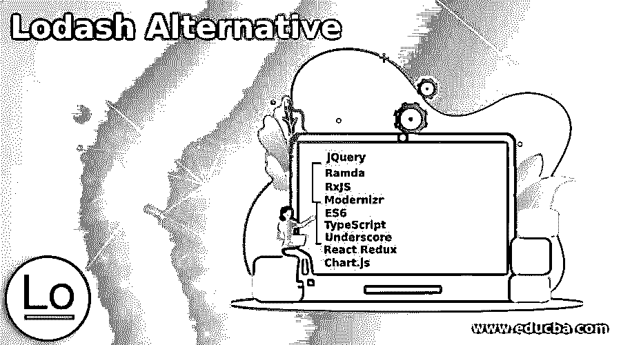

# 洛达什替代方案

> 原文：<https://www.educba.com/lodash-alternative/>

## Lodash 简介

以下文章提供了 Lodash 替代方案的概要。Lodash 是一个 JavaScript 库，它使用函数式编程范式为常见的编程任务提供实用函数。Lodash 是一个支持当前环境的开源项目，在 MIT 许可下提供。Lodash 通过消除处理数组、数字、对象、字符串等的麻烦，使 JavaScript 变得更加简单。Lodash 有多种版本和模块格式。我们将在这里看到，Lodash 在市场上有一些替代品。

### Lodash 替代品列表

以下是 Lodash 替代品列表:

<small>网页开发、编程语言、软件测试&其他</small>

#### 1.jQuery

jQuery 是 Lodash 的最佳选择。jQuery 是一个 JavaScript 框架，它使得遍历和操作 HTML DOM 树以及事件处理、CSS 动画和 Ajax 变得更加容易。它是免费的开源软件，使用麻省理工学院的自由许可证。它让开发人员能够在 JavaScript 库之上构建插件。开发人员可以用它来创建低层交互和动画的抽象、高级效果和高层的主题化小部件。

#### 2.拉姆达

Ramda 是一个函数集合，旨在使 JavaScript 函数式编程简单而强大，同时保持语言的真实性。它的目标是将函数式编程引入 JavaScript，而不改变语言的本质或感觉。Ramda 声明其操作方法是一种更有效和高效的函数式编程。特别是，它的方法是使用功能优先的方法设计的。因此，大多数方法将任何所需的函数作为它们的初始参数，使得合成变得容易得多。

#### 3.RxJS

RxJS 是当今最流行的 web 开发库之一。学习 Rx 的理由从来没有像现在这样充分，因为它提供了一种健壮的、功能性的方法来处理事件，并集成到越来越多的框架、库和实用程序中。RxJS 附带了许多用于创建新的可观测量的实用程序。这些函数使得从事件、计时器和承诺等事物中观察变得更加容易。

#### 4.现代化 zr

Modernizr 是一小段 JavaScript 代码，用于确定下一代 web 技术在用户的浏览器中是否可用。Modernizr 采用功能检测，允许您根据用户浏览器的实际功能轻松调整用户体验，而不是基于“UA 嗅探”将整个范围的浏览器列入黑名单。Modernizr 使用 Modernizr 对象来跟踪所有特性检测的结果。这表明将为每个测试添加一个相关的属性。

#### 5.是六个

ECMAScript 6 被称为 ES6。ES6 是 ECMAScript 的第六个版本，于 2015 年发布，也被称为 ECMAScript 2015。ECMA 脚本最流行的用法是客户端脚本，特别是在互联网上。Node.js 正被迅速用于创建基于服务器的应用和更大的服务。ES6 用于支持客户端语言，并且正在成为 ECMA 国际标准化的最流行的脚本语言之一。诸如 JScript、JavaScript 和 ActionScript 之类的语言受这种语言及其规范的支配。

#### 6.以打字打的文件

Typescript 是 JavaScript 和一些 JavaScript 高级功能的组合。它也是一系列工具和一门语言相结合的结果。它只是一个与其他 JS 文件一起工作的 JavaScript。它是可运输的。语法契约是类型脚本接口，它有助于实体语法的定义。它定义了接口的方法、事件和属性，这些都是接口的成员。它还负责创建定义成员的类。

#### 7.强调

在不改变任何核心 JavaScript 对象的情况下，Underscore.js 是 JavaScript 的一个实用工具包，它为标准函数嫌疑(每个、映射、简化、过滤……)提供支持。Underscore 1.x 向后兼容任何完全实现 ES3 的引擎，同时还利用了即将推出的功能，如 Object。键、类型化数组和 ES 模块(当它们可用时)。

#### 8.反应还原

Redux 是一个状态容器，它可以帮助您开发 JavaScript 应用程序，这些应用程序易于跨客户端、服务器和本机平台进行测试并可靠地运行。它通常作为状态管理工具与 React 一起使用，但也可以与任何其他 JavaScript 框架或库一起使用。因为它的大小小于 2KB(包括依赖项)，所以您不必担心它会增加应用程序的资产大小。

#### 9.Chart.js

Chart.js 是一个社区维护的开源库(在 GitHub 上),它使得使用 JavaScript 可视化数据变得简单。Chartist 和 Google 图表类似。它可以显示八种不同的图表类型(包括条形图、折线图和饼图)，所有这些图表都具有响应性。换句话说，你只需要设置你的图表一次，Chart.js 会处理这些繁重的工作，并确保它始终可读(例如，如果图表变小了，就删除一些无关紧要的细节)。

### 结论 Lodash 替代方案

在本文中，我们看到了 Lodash 的各种替代方案，如 jQuery、Ramda、RxJS、Modernizr、ES6、TypeScript、下划线、React Redux 和 Chart.js。

### 推荐文章

这是一份 Lodash 替代品指南。为了更好地理解，我们在这里讨论 lodash 替代品的介绍和列表。您也可以看看以下文章，了解更多信息–

1.  [WPS 办公备选方案](https://www.educba.com/wps-office-alternative/)
2.  [电报选择](https://www.educba.com/telegram-alternatives/)
3.  [MobaXterm 替代方案](https://www.educba.com/mobaxterm-alternative/)
4.  [分享替代方案](https://www.educba.com/shareit-alternatives/)

