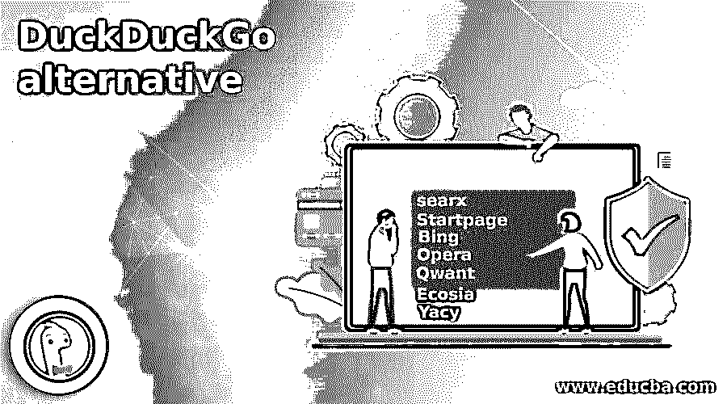

# DuckDuckGo 替代

> 原文：<https://www.educba.com/duckduckgo-alternative/>

## Duckduckgo 替代方案介绍

DuckDuckGo 的完全现代化的浏览器和移动应用程序现在在一个包中提供了内置的跟踪阻止网络、更智能的加密和私有搜索。在 Safari、Firefox、Chrome 和 Android 等最大的平台上都可以使用。你必须使用 DuckDuckGo 来保持你的搜索在私人和数据配置文件之外，政府和其他法律要求。无论你处于何种浏览模式，我们都不会跟踪你。当你在 DuckDuckGo 上搜索时，就好像你从来没有去过那里一样。我们只是不保存任何可以将您的搜索与个人联系起来的信息，甚至不将它们与以后可以链接到您的浏览历史联系起来。请参阅我们的隐私政策了解更多详情。在本主题中，我们将了解 DuckDuckGo 替代方案。

### DuckDuckGo 的替代

让我们来看看 duckduckGO 的替代方案:

<small>网页开发、编程语言、软件测试&其他</small>

#### 1\. searx

searx 是一个免费的 GNU Affero 通用公共许可证 3 元搜索引擎，旨在保护其用户的隐私。为此，searx 不会在搜索引擎中共享 IP 地址，也不会为收集结果的用户共享搜索历史。搜索引擎提供的 cookies 被阻止，以防止用户根据更改的结果进行分析。默认的 searx 查询通过 HTTP POST 请求在 web 服务器日志中传输，以防止用户进行关键字查询。Searx 受到了该项目的启发，尽管在他实现点对点用户的尝试中没有实现排名结果。

#### 2\. Startpage

您首先需要了解起始页如何保护您的搜索信息。Startpage.com 是一个网络浏览器搜索引擎，类似于 Internet Explorer 或 Safari，你可以在 Firefox 上打开它。你可以把你的浏览器带到网上任何你想去的地方；主页只是你可以访问的网页之一。Startpage 是一种特殊类型的网站，称为“搜索引擎”，是一种有用的编目网站，当您要查找的信息不确定时，可以使用它。你可能知道其他搜索引擎，如谷歌、雅虎和必应。只是我们更小，更私密。我们提供同样的服务。

#### 3.堆

Bing，有时也被称为 Bing 搜索，是一个基于微软的搜索引擎，主要是一个可以通过 Bing.com 访问的搜索引擎。尽管必应仍然主要以其搜索引擎网站而闻名，但你不能仅仅通过这种方式访问它的网络搜索服务。如果你想使用 Bing，你也可以通过微软 Edge 和 Bing 使用 Bing 移动应用。

#### 4.歌剧

Opera 于 1995 年 4 月 1 日首次发布，是由 Opera 软件开发的互联网浏览器。专为移动平台和台式机设计，包括流行的手机选择。Opera 号称是世界上最快的浏览器，有一个免费的 Opera Mail 电子邮件客户端。照片显示的是电脑希望网站上 Opera 9.6 的网页浏览器外观。Opera 最受欢迎的功能的速度、选项卡式浏览、紧急控制和语音控制。

#### 5\. Qwant

如果你还没看过《社交困境》，我们会警告你:你会希望你所有的社交媒体账户都被删除。在脸书、抖音和 Instagram 等应用中，网飞纪录片着眼于危害社会的方式，不仅仅是因为它对精神健康的影响。社交困境还表明，社交媒体利用监控和数据挖掘中的资本主义来获取财务利润，并帮助传播阴谋论和错误信息，但幸运的是，所有网站和应用程序都不会使用用户跟踪。与谷歌不同，Qwant 是一个隐私友好的搜索引擎，不会保留你的信息。

#### 6.Ecosia

Ecosia 是一个非营利性的搜索引擎，其广告收入来自搜索到树。它没有 DuckDuckGo 的隐私焦点，也没有谷歌的搜索结果。然而，它有一个独特的任务。这个搜索引擎越来越多，越来越广为人知。例如，从苹果的 iOS 14 和 iPadOS14 开始，Ecosia 是 Safari 中少数几个可以用作默认搜索引擎的选项之一。谷歌 Chrome 也是一个集成选项。

#### 7.Yacy

YaCy 是一个免费的分布式搜索引擎，建立在对等网络原则上。源代码是用所谓的 YaCy peer，Java 编写的，分布在几百台计算机上。点对点(P2P)是一种计算机网络，以其缩写形式使用分布式体系结构。这意味着系统中的每台计算机或设备都有一个共同的任务。对等网络中的设备被称为对。没有“平等”的权利，在网络的中心，没有管理设备。

### 推荐文章

这是 DuckDuckGo 替代方案的指南。这里我们讨论 Duckduckgo 的替代方案，你可以根据自己的需求选择其中任何一个。您也可以阅读以下文章，了解更多信息——

1.  [观念选择](https://www.educba.com/notion-alternatives/)
2.  [SPSS 备选方案](https://www.educba.com/spss-alternative/)
3.  [Gliffy 替代方案](https://www.educba.com/gliffy-alternative/)
4.  [VueScan 替代方案](https://www.educba.com/vuescan-alternative/)

