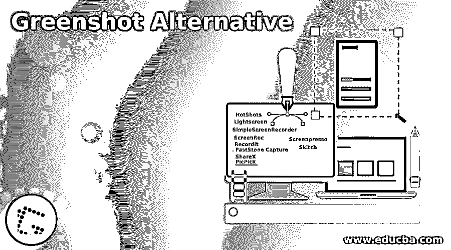

# 绿色替代方案

> 原文[https://www.educba.com/greenshot-alternative/](https://www.educba.com/greenshot-alternative/)

## Greenshot 简介

以下文章提供了绿色快照替代方案的概述。Greenshot 是一个免费的开源屏幕和截图工具，允许用户在 windows 操作系统上快速截图和做笔记。该工具用于捕捉显示快照，也用于执行各种编辑功能。例如，用户能够突出显示图像的特定部分，然后与其他人共享。Greenshot 的主要功能是快速截屏选择的窗口部分，简单的基本截屏编辑，导出多种格式的截屏，直接打印和与他人分享。

### 绿色快照备选列表

下面给出了绿色快照备选方案列表:

<small>网页开发、编程语言、软件测试&其他</small>

#### 1.简单屏幕记录器

SimpleScreenRecorder 是基于 Qt 的 screencast 的一个软件解决方案，可以帮助你录制整个计算机屏幕或部分视频音频。该软件是专为那些希望录制演示，玩游戏和其他任务的人设计的。解决方案包含所有工具和功能，可帮助您捕捉和修改您的记录，简单易用。此外，该计划同步视频音频捕捉属性，这降低了视频帧速率，如果计算机太慢，多线程。

#### 2.光幕

Lightscreen 是 Microsoft Windows 设计的轻量级屏幕拍摄软件解决方案。该软件用于截图保存和编目的自动化。它作为一个隐藏的后台进程，调用一个热键，并保存截图文件到您的光盘，如用户所愿。该解决方案非常简单易用，可以让你轻松捕捉屏幕并无限制地分享。一个有趣的事实是，你可以捕捉屏幕的区域，捕捉你需要的，调整大小和调整它的最大灵活性。

#### 3.热门人物

HotShots 是一个允许用户拍摄和编辑截图的工具。该软件既可以在 Linux 上运行，也可以在 Windows 上运行。它还允许用户编辑他们的截图，例如，突出显示一个区域。甚至用户可以滚动浏览软件来捕捉或拍摄整个网页。用户可以指向任何部分，一方面，同样地，屏幕截图的任何部分可以被移除。此外，用户可以自动执行任务，如显示快速工作菜单、将图像复制或注释到剪贴板。截屏时，用户可以隐藏界面，添加或删除鼠标光标。此外，快照使用户能够在文件名中添加日期和时间，当所有任务完成后，他们还可以启用卷。最后，在你的截图上，用户可以画出表格、线条等字符。

#### 4.ScreenRec

ScreenRec 是一个免费的轻量级软件，允许用户捕捉或捕获屏幕截图。在使用这个软件，没有忙乱和广泛的培训是必要的；它很容易使用。用户可以用这个软件简单地选择捕获区域，或者全部或者部分，并且可以在捕获区域中完成工作和记录声音。用户可以拥有一个私有的、安全的云连接，与其他用户分享他们的图片或截图，并且不需要上传时间。该软件将所有注册信息保存在一个在线图书馆中，以防止用户搜索其电子邮件，并通过一次点击获得他需要的资料。

#### 5\. Recordit

Recordit 是一个记录软件，允许用户在任何操作系统上记录他们的桌面屏幕活动。该应用程序是一个 GIF 工具，让用户记录他们的屏幕长达五分钟。该应用程序也可以用于 GIF。点击软件按钮即可轻松工作；用户可以简单地开始和停止下载过程。

#### 6.FastStone 捕获

FastStone Capting 是一个一体化的通用 Windows 操作系统屏幕截图和屏幕录制平台，用于拍摄在 Windows 中打开的应用程序的选定区域的快照，并记录屏幕上的内容。它是最好的应用程序之一，有两个主要功能:截屏和用户记录。

#### 7.ShareX

ShareX 是一个免费的开源屏幕截图和屏幕截图应用程序，它被集成到各种生产力和工具中。与传统的 Windows 打印系统相比，其特点和功能包括捕获显示器的完整屏幕截图。这些帧可用于完整图像捕获、窗口记录、监视器捕获、矩形图像捕获。此外，所有捕获的截图在多个框架中可用。

#### 8.PicPick

PicPick 是一个工具来捕捉和设计您的电脑图像，编辑它，保存它，并与他人分享。这是一个捕捉和设计屏幕的独特工具。这是最好的截图之一，集成了图像编辑器工具设计、颜色选择器、像素标尺等等。易于使用的界面使显示器任何部分的用户都可以更容易地拍摄屏幕截图并与其他人分享。

#### 9.屏幕按压

Screenpresso 是一个基于屏幕截图的两个区域的终极屏幕收集工具，可以拍摄整个窗口或某个给定区域的快照。除了捕捉截图，它还提供视频屏幕的捕捉。这个工具是为那些对组织培训课程和向观众展示详细工作感兴趣的人设计的。

#### 10.斯基奇

Skitch 是一个快照软件，可以对窗口的任何活动部分进行截图。Skitch 是为 Mac 用户设计的。高度先进的 Skitch 图片捕捉系统使用户能够捕捉多个截图，并最终访问编辑它们。它甚至允许用户与其他人分享拍摄的照片。

### 结论——绿色替代方案

在本文中，我们看到了各种捕捉截图的绿色快照。您可以根据自己的需求选择任何一种。

### 推荐文章

这是一个绿色替代指南。在这里，我们分别讨论绿色快照备选方案的介绍和列表。您也可以看看以下文章，了解更多信息–

1.  [Boxcryptor 替代方案](https://www.educba.com/boxcryptor-alternative/)
2.  [观念选择](https://www.educba.com/notion-alternatives/)
3.  [米拉诺特备选方案](https://www.educba.com/milanote-alternative/)
4.  [Gliffy 替代方案](https://www.educba.com/gliffy-alternative/)

