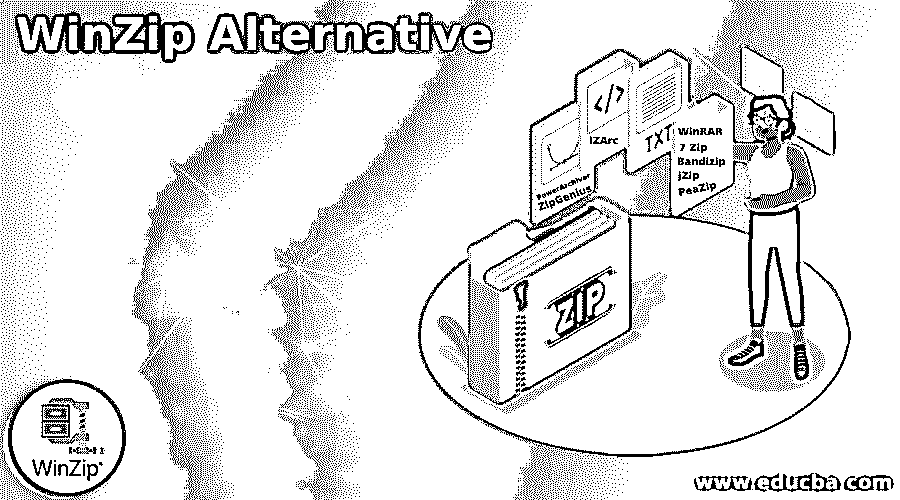

# WinZip 替代

> 原文：<https://www.educba.com/winzip-alternative/>

## WinZip 简介

以下文章提供了 WinZip 替代方案的概要。WinZip 是一个文件归档器和压缩器，它以 Zip 文件格式创建归档文件，并解压缩其他归档文件格式。它还有各种系统集成工具。它解包 LHA，RAR，邮编，LZH，邮编，BZ2 和 7Z。它可以解码 HQX，B64 和 UUE 文件。它提供备份来检索丢失的文件，备份过程是自动化的。它提供像 Windows、macOS、iOS 和 Android 这样的操作系统。市场上有一些其他替代产品，它们提供与 WinZip 相同的功能和其他功能。

### WinZip 替代列表

以下是 WinZip 替代文件的列表:

<small>网页开发、编程语言、软件测试&其他</small>

#### 1.我赢了

WinRAR 是 WinZip 的最佳替代品。这是一个为 Windows 操作系统开发的试用版文件归档工具。它创建和查看 RAR 或 ZIP 文件格式的档案，并解压缩许多档案文件格式。此外，它在存档文件中嵌入了每个文件的 CRC32 或 BLAKE2 校验和，使用户能够测试存档的完整性。

#### 2.7 拉链

7 zip 是一个免费的开源文件归档工具。它使用自己的 7z 存档格式，但可以读写其他几种存档格式。它支持许多其他压缩和非压缩归档格式，如 gzip、xz、tr、zip、bzip2 和 WIM。7 Zip 支持文件管理器以及其他标准的归档工具。这个文件管理器有一个带有选项的工具栏，例如创建存档、测试存档以检测错误、提取存档、复制、移动或删除文件以及打开文件属性菜单。

#### 3 .班迪齐奇

Bandizip 是 WinZip 的另一种选择，它是一个用于 Microsoft windows 的文件归档程序。它允许用户提取多个文件，并帮助他们打开提取的文件夹很容易。它支持档案格式，如 RAR，7Z，RAR5 和 ZIP。它使用户能够压缩多卷和密码的档案。它支持超过 4 GB 的文件压缩。此外，它支持 AES 256 加密算法，为用户提供安全性。

#### 4.jZip

jZip 是一个强大的解压 Zip 文件的工具。它基于 7 zip 技术。它可以创建 zip 兼容文件和其他存档软件。它易于使用的特性使它非常流行提取任何类型的压缩文件。使用 jZip，用户可以归档各种格式的文件；RAR 是最受欢迎的。RAR 文件是压缩的档案，这些档案被设计用来存储单个和一组相关的文件，同时最小化它们的内存大小以节省存储空间。

#### 5.PowerArchiver

WinZip 的另一个最佳选择是 PowerArchiver，它支持 Microsoft windows。它可以创建恐惧 ZIP，Tar，7z 存档格式和各种磁盘映像格式。它还可以读取 RAR 和 ACE 文件，但不能创建它们。PowerArchiver 也因 EasyZip 而闻名。它还提供了命令行版本和 Microsoft Outlook 插件。其最新版本还允许用户在微软 office 2007 和 Windows 7 中使用功能区 GUI。如果用户愿意，他们可以恢复到旧式工具栏。

#### 6\. PeaZip

PeaZip 是另一个最好的选择 WinZip 是一个开源的文件管理器和文件归档器。它支持微软视窗、Linux、ReactOS 和 BSD 等操作系统。它支持自己的存档格式，称为 PEA 存档格式和其他主流格式。它允许用户使用命令行自动运行提取和归档操作，导出 GUI 前端中定义的作业。它提供各种功能，如档案转换，安全文件删除，分裂和加入文件，寻找重复的文件，批量重命名，字节到字节的文件比较，加密档案，校验和或散列文件等。

#### 7.ZipGenius

ZipGenius 是一个支持 Microsoft windows 的文件归档工具。它可以处理近 24 种文件格式，包括所有最常见的格式，以及密码保护的档案。它有两个版本，一个是标准版，另一个是套件版。它支持 TWAIN 设备，如扫描仪和数码相机。此外，zipGenius 可以将文件提取到 CD/DVD 刻录机。为了提供安全性，它支持加密算法，如河豚，CZIP，Twofish 和 Rijndael AES。

#### 8.IZArc

IZArc 是一个支持微软视窗的免费归档程序。它支持像 rar、tar、zip、gzip 和 gz 这样的归档格式。为了提供安全性，它还使用 AES256 算法。它允许用户执行文件的压缩和解压缩。它提供了一个拖放界面。IZArc 还可以转换 CD 图像。它允许用户在存档文件中添加或查看注释，可以修复损坏的存档文件并扫描任何存档文件中的病毒。

#### 9.拉链提取器

压缩解压程序是用来打开文件，如 RAR，压缩，7Z 和你的电脑和谷歌驱动器上的文件。这个软件从谷歌驱动器中解压文件。它允许用户预览和下载 ZIP 文件夹中的文件，而无需提取整个文件。Zip 解压支持密码保护的文件。

### 结论–WinZip 替代方案

在这篇文章中，我们已经看到了各种 WinZip 替代品，如 WinRAR，7 Zip，Bandizip，jZip，PowerArchiver，PeaZip，ZipGenius，IZArc 和 Zip Extracter。

### 推荐文章

这是一个 WinZip 替代指南。为了更好地理解，我们在这里讨论 WinZip 替代方案的介绍和列表。您也可以看看以下文章，了解更多信息–

1.  [7-Zip 备选方案](https://www.educba.com/7-zip-alternatives/)
2.  [Dropbox 替代品](https://www.educba.com/dropbox-alternatives/)
3.  [Gliffy 替代方案](https://www.educba.com/gliffy-alternative/)
4.  [观念选择](https://www.educba.com/notion-alternatives/)

