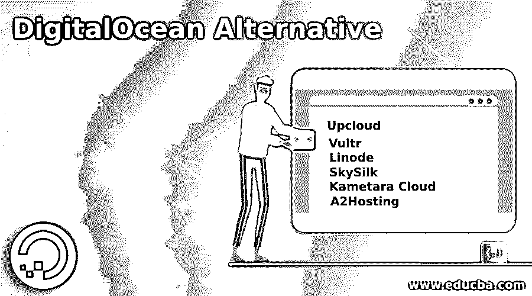

# 数字海洋替代方案

> 原文：<https://www.educba.com/digitalocean-alternative/>

## 数字海洋替代方案介绍

主要为基础设施即服务的开发者提供服务的云供应商称为数字海洋，它与 AWS 具有类似的功能，并与之竞争。任何类型的数据都可以存储在数字海洋存储空间中，用户可以将存储容量从 1GB 扩展到 16TB。我们有适当的数字海洋文档，因此大多数用户都喜欢相同的文档。凭借这一优势，我们的网站和用户界面具有良好的美学外观，吸引用户尝试数字海洋。在本主题中，我们将了解数字海洋替代方案。

### 数字海洋的替代品

数字海洋是免费提供的，当我们寻找替代品时，我们应该关注免费或低价提供的应用程序。

<small>网页开发、编程语言、软件测试&其他</small>

#### 1.Upcloud

想要定制业务并希望为他们开发的所有应用程序提供个人风格的初创公司更喜欢 Upcloud。服务器分布在六个国家，它提供块存储作为存储选项。我们还有由软件控制的云服务器和网络，因此用户可以根据自己的需求使用带宽。此外，还提供了元数据服务来解决客户的查询，并为每台服务器提供了可定制的服务器映像。定价从 5 美元/月到 80 美元/月不等。

#### 2.填妥了吗

Vultr 的用户界面非常易于使用，设计时考虑到了开发人员。所有选项都可以通过一次下载获得，因此用户不需要花费太多时间。Vultr 提供的 IP 地址可以更改，因此定制的 IP 地址有助于用户根据相同的 IP 地址进行选择。托管选项也非常丰富，用户可以根据自己对云的需求进行选择。在数据安全性非常高的地方，还提供了块存储。提供了各种创造性的功能，用户可以选择所需的选项并存储他们的数据。价格从 2.5 美元/月到 640 美元/月不等。CPU、带宽和内存各不相同。

#### 3.利诺德

Linode 是一家位于费城的私有云服务提供商，帮助内存需求高的用户和专用服务器存储数据。提供块存储是为了以高安全性保护数据，并满足大量数据的需求。Linode 专门致力于虚拟专用服务器(VPS)托管，他们的大多数竞争对手都无法与 Linode 匹敌。客户服务和值得信赖的托管使 Linode 从竞争对手中脱颖而出。然而，由于提供 VPS 服务，Linode 的成本很高。此外，我们不能在 Linode 中使用共享服务器。控制面板也不太吸引顾客，因为这很难理解和管理。如果一个人对利诺德不确定，他们可以使用 7 天的退款保证。

#### 4.天丝

提供了私有云和公共云选项，客户可以从中选择自己的选项并为自己创建环境。SkySilk 提供的服务和功能的结合有助于用户在各行各业部署他们的项目。如果用户需要扩展技术选项，他们可以轻松完成。价格从每月 2 美元不等。SkySilk 可以轻松实现自动化和部署。SkySilk 提供自动备份，资源组选项非常灵活，用户可以轻松地更改资源。用户可以在不同的安全层存储他们的数据。基础设施也很好，零容错，在任何云使用点都没有故障。后端服务器的工作和访问只提供给云工程师，因此用户可以确保数据得到很好的保护。

#### 5\. Kametara Cloud

随用随付的选择让 Kametara 从其他云服务器中脱颖而出。用户只需要为他们的服务付费，这使得他们在云存储方面节省了资金。此外，我们还有一个灾难恢复选项，可以帮助恢复意外删除的数据。可以从公共或私有或虚拟服务器轻松完成服务器迁移。Kametara 提供 30 天免费试用，用户可以试用这些资源，如果不满意，可以转向其他云选项。价格从每月 5 美元到 1000 美元不等，客户可以根据自己的云需求进行选择。Kametara 提供的基础设施和配置使其成为数字海洋的替代方案。

#### 6.a2 托管

数字海洋的另一种选择，也是博客作者最喜欢的选择，WordPress、VPS 和一些云选项以低成本提供。PHP，Python，SQL，DotNet 语言都可以，这让开发者对这个云平台爱不释手。所有软件更新都在数据中心完成，并且在必要时提供安全补丁。提供了涡轮服务器，用户可以以最快的速度上传数据。全天候提供客户服务，用户可以通过邮件或电话联系服务中心。用户可以根据自己的需求以更低的价格扩展云存储。我们可以以每月 5 美元的价格使用 a2 主机。

我们还有其他云选项，如 DreamHost、CloudSigma、Host1Plus、Cloudways 和 ToggleBox。专业的技术团队和良好的以太网连接使 InterServer 在其他云应用程序中脱颖而出。BlueHost Cloud 提供各种域名注册和托管解决方案，帮助博客作者开发自己的博客网站。大西洋(dot)网络提供块存储和云服务器，用户可以在任何云服务器上轻松完成大带宽项目。一款帮助客户在任何操作系统中轻松部署项目的亚马逊产品名为 Amazon Lightsail。它像 AWS 一样工作，并且有各种存储选项。Scaleway 是云提供商，可通过固态硬盘访问虚拟云，并根据客户需求提供各种应用。

有了上面解释的所有云服务，很难说哪一个是最好的数字海洋替代方案。这取决于云存储的使用。如果是针对开发者，他们可以选择 Kametara 或 Vultr，如果是针对博客作者，他们更喜欢 A2Hosting 或 BlueHost Cloud。

### 推荐文章

这是数字海洋替代方案指南。在这里，我们讨论数字海洋的适当文档及其替代方案和优势。您也可以看看以下文章，了解更多信息–

1.  [数字电路](https://www.educba.com/digital-circuit/)
2.  [什么是数字证书？](https://www.educba.com/what-is-digital-certificate/)
3.  [数字营销实习](https://www.educba.com/digital-marketing-internship/)
4.  [数字营销资质](https://www.educba.com/digital-marketing-qualification/)

