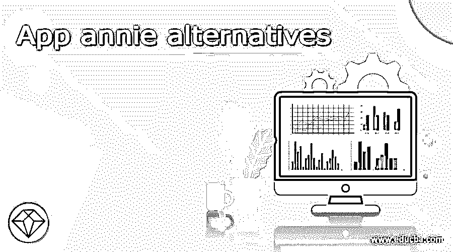

# App annie 备选方案

> 原文：<https://www.educba.com/app-annie-alternatives/>

## App Annie 替代品介绍

App Annie 是唯一支持整个应用生命周期的数据平台。这是无与伦比的服务和援助的结合。一个优秀的平台，App Annie，帮助你创造出与竞争对手完全不同的移动战略。如果你使用一个鼓励用户停留在你的网站上的平台，他们就更有可能停留在你的网站上。其他类似的系统有一套有限的工具，使这个系统对用户更有吸引力。您可以不受任何限制地访问所有功能并添加更多功能。无与伦比的数据准确性、全球支持和行业标准定价只是 App Annie 的部分功能。在本主题中，我们将详细了解 app Annie 的替代产品。

### App Annie 的替代品

让我们逐一看看 App Annie 的替代产品

<small>网页开发、编程语言、软件测试&其他</small>

#### 1.com

Histats 允许网站所有者实时监控其网站的流量。此外，Histats.com 的用户可以通过检查在网站上停留的时间、访问者浏览的文章数量以及用于访问网站上特定文章的标签或关键字(如果适用)来监控其用户的活动。为了创建与访问者行为相关的内容，Histats.com 是一个有用的工具。可以以图形、图表和基于文本的格式生成报告。例如，在 Histats.com 上，用户可以使用图表和图形模式查看一天中的新访问者数量、总访问者数量和页面访问量。

#### 2.解毒剂

其中一个最好的原因是 AFSAnalytics 为用户提供的功能。大多数 web track 和访问者跟踪工具提供了关于新访问者数量、访问者总数和已访问页面数量的信息。它的独特之处在于，它允许用户跟踪访问者的位置、IP 地址，甚至他们正在使用的操作系统。分析访客数量和访客行为并不是 AFSAnalytics 的唯一目标。

#### 3.乌拉巴

营销组织可以使用 Woopra 的实时商业客户分析来优化客户行为。该服务提供个人网站访问者的数据，以及公司网站所有访问者的汇总分析报告。除了报告之外，每个用户还可以实时获得全面的个人资料。细分、漏斗和保留等功能都是其报告功能的一部分。WordPress、Marketo、HubSpot、Box 等。，只是你可以集成 Woopra 的几个工具。作为一个网站管理员，你需要了解你的访问者的智力，以便在网络世界中变得聪明。

#### 4.Clicky

Clicky 是一款网络分析工具，可实时提供网站访客的实时数据。在这个平台上，你会找到所有你需要的网络营销工具。每个访问者的用户名和电子邮件地址都会显示出来，同时还会显示他们在你的网站上采取的行动。Clicky 的热图功能为您提供完成特定目标的访问者的数据。由于你的网站上有一个小工具可以显示你的网站上当前有多少访问者，所以你的网站和你正在查看的当前页面上的访问者都被计算在内。另外，如果你的任何网站离线，它会立即通知你，这样你就可以立即采取必要的措施。

#### 5.鼠标流

通过 Mouseflow，用户可以跟踪网站上的鼠标点击和移动。作为一个网络分析平台，Mouseflow 向你展示访问者在你的网站上的行为。此外，访问者可以使用手指执行各种操作，如阅读帖子、点击他们感兴趣的链接、移动鼠标等等。因此，借助这一工具，你将能够增加销售额，提高转化率。

#### 6\. AWStats

除了分析网站和邮件服务器的性能，AWStats 还分析 FTP 服务器、流媒体和网站访问者访问的各种其他渠道的性能。由于所有这些平台，分析渠道可以用于不同的渠道，包括网站。

#### 7.Ptengine

在数字世界中，Ptengine 为网站管理员和数字营销人员提供网络分析和热图。说到简单易用的网络分析平台，Ptengine 是最受欢迎的平台之一。

#### 8.生存

您可以使用 Survicate 的现场调查来了解更多关于您的潜在客户，他们的主要关注点和他们的需求。它帮助你了解你的访问者想要什么，是什么阻止他们得到它，是什么阻止他们实现这个目标。在购买过程的不同阶段，Survicate 会找出摩擦点和异议。

#### 9.Bizible

在 Salesforce 中，Bizible 是一个允许公司有效跟踪线下收入并将其追溯到准确的在线营销来源的系统。例如，它包括跟踪在线广告和页面浏览量以及推荐源跟踪等功能。

### 推荐文章

这是 App annie 备选方案指南。在这里，我们讨论 App Annie 的替代品。您可以根据自己的需求选择任何一种。您也可以看看以下文章，了解更多信息–

1.  [贝宝替代品](https://www.educba.com/paypal-alternatives/)
2.  [混合面板替代品](https://www.educba.com/mixpanel-alternatives/)
3.  [观念选择](https://www.educba.com/notion-alternatives/)
4.  [RStudio 备选方案](https://www.educba.com/rstudio-alternative/)

