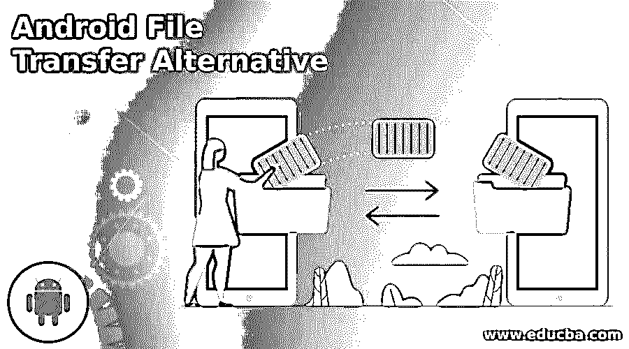

# Android 文件传输替代方案

> 原文：<https://www.educba.com/android-file-transfer-alternative/>

## Android 文件传输简介

使用 Android 文件传输是免费的，那么我们为什么要寻找 Android 文件传输的替代品呢？嗯，它并不总是最容易使用的软件，而且当出现问题时，你也不一定能得到支持。您可能会丢失宝贵的图像、视频或其他文件。你有危险。在这里，我们将看看 Android 文件传输的一些最佳替代方案，以及任何 Android 文件传输替代方案的优点和缺点。

### Android 文件传输的替代方案

以下是 Android 文件传输备选方案列表:

<small>网页开发、编程语言、软件测试&其他</small>

#### 1.OpenMTP

OpenMTP 是我们列表中的另一个大的免费项目。这款开源的 Mac 文件传输软件完全免费，可以在大多数 Android 设备上运行。只需下载软件，并开始使用 USB 将您的设备连接到 Mac。Android 文件可以快速地从你的 Android 系统发送到你的 Mac 电脑——速度实际上比许多只通过 Wi-Fi 连接到你的 Mac 电脑的应用程序要快。

通过简单的拖放文件传输功能，传输所有类型的文件既快速又简单，并且您可以在网格和列表视图之间轻松查看所有文件。使用便捷的键盘快捷键，传输过程更加简单。通过定期更新，OpenMTP 是安全可靠的。

#### 2.适用于 Mac 的 Coolmuster Android 助手

如果你正在寻找适用于 Mac 的 Android 文件传输替代方案，那么值得考虑 cool muster Android Assistant for Mac。使用该软件，您可以将不同类型的文件从 Android 设备传输、管理和编辑到 Mac。功能包括 1-click Backup、让您直接从电脑发送和回复文本的 SMS Manager，以及用于选择和下载 Android 设备应用程序、卸载或备份到 Mac 的 App Manager。应用程序也是可用的。cool muster Android Assistant for Mac 是免费试用版，并提供 90 天的退款保证。

#### 3.Android 版 MobiKin 助手

MobiKin 的 Android 助手是一个强大的工具，可以将信息从您的 Android 设备传输到 Mac 或 Windows PC。你可以从应用程序、文本和联系人中备份和恢复几乎任何类型的细节，你可以使用该软件调用日志、照片和音乐进行点击备份和备份。您也可以在 Mac 上更改手机的联系人列表，并直接在电脑上添加或移除播放列表。Android 版 MobiKin Assistant 提供一年免费试用许可，费用为 29.95 美元，并定期收费。

#### 4.iSkysoft 电话转移

Mac 是一款可以与黑莓、小米操作系统、安卓、iPhone 或诺基亚 Symbyan 兼容的工具。它与 iSkysoft MobileTrans 电话转移功能配合使用。你可以将几乎任何类型的数据从一部旧手机转移到一部新手机上，或者将其备份到你的 Mac 电脑上。使用该软件可以很容易地在移动设备之间备份和恢复数据。

#### 5.Vibosoft Android 手机管理器

Vibosoft Android Mobile Manager 是一款软件，可以让您将所有内容从 Android 设备传输到计算机，包括联系人、应用程序、多媒体文件、短信等。Vibosoft Android Mobile Manager 甚至可以使用该软件直接从 Mac 向您的手机联系人发送短信，或者从 Android 预览文件和文件夹，并通过一键备份和恢复功能从 Mac 管理它们。

#### 6.Wondershare TunesGo

Wondershare TunesGo 是一款 Android 和 iOS 手机管理器。您可以利用一些功能，如 GIF maker、允许您查看移动设备上所有数据的磁盘模式，以及针对所有应用程序的大型脚本导出和备份的有效应用程序管理，并提供 Windows 和 Mac 版本。选择年度订阅、生活许可证和家庭许可证——每年 29.95 美元起，适用于一台装有 Android 版本的 PC。该套件的版本包括 iOS 软件和 Android。也可以选择使用。

#### 7 . fone 博士

他们有 Android 和 IOS 手机管理器版本，但如果你有两个设备，你就必须同时购买这两个程序。Android 版本允许你将图像从 Android 传输到 Mac，以及几乎任何类型的数据，从音乐、视频、照片到联系人甚至短信。删除文件可以让你轻松管理你的数据，并包括一个 HEIC 照片转换器。很容易看出为什么这个软件如此受欢迎，它是一个铃声制作工具，一个媒体文件转换器和一个应用程序管理工具。

### 结论

在这篇文章中，我们看到了在 android 中传输文件或媒体的各种替代方法。您可以根据自己的需求选择任何一种。

### 推荐文章

这是一个 Android 文件传输替代指南。这里我们分别讨论 android 文件传输替代方案的介绍和列表。您也可以看看以下文章，了解更多信息–

1.  [WPS 办公备选方案](https://www.educba.com/wps-office-alternative/)
2.  [电报选择](https://www.educba.com/telegram-alternatives/)
3.  [MobaXterm 替代方案](https://www.educba.com/mobaxterm-alternative/)
4.  [分享替代方案](https://www.educba.com/shareit-alternatives/)

