# 有角的

> 原文：<https://www.educba.com/angular/>

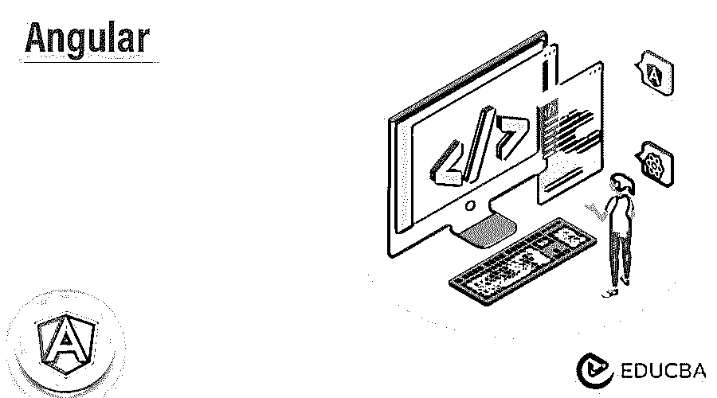


## 角度介绍

Angular 只不过是一个用于开发桌面和移动应用程序的平台。通过使用 angular，我们可以构建我们的应用程序，并重用我们的代码和能力来为部署目标构建我们的应用程序。通过使用它，我们可以实现平台上可能的最大速度，我们正在使用 web workers 和服务器端渲染来实现同样的速度。

### 关键要点

*   Angular framework 是一个固执己见的框架，这意味着它规定了开发人员在开发应用程序时需要遵循的风格和规则。
*   它只不过是框架的平台，用于将基于客户端的 web 应用程序构建成类型脚本和 HTML。

### 什么是有角？

它是一个开源的 JavaScript 框架，被写入到 typescript 中。它由 Google 维护，主要目的是开发一个包含单个页面的应用程序。作为一个框架，angular 有一个明显的优势，它为开发人员提供了标准的结构。它将允许开发人员以可管理的方式创建大型应用程序。它只不过是用来构建 web 应用程序的现代 MVCC 框架和平台。

<small>网页开发、编程语言、软件测试&其他</small>

### 如何在 Angular 中创建一个 Web 开发者的平台？

为了开发这个平台，我们需要在我们的系统中安装 angular。以下步骤显示了我们如何安装 Angular CLI。

1.下面我们在 ubuntu 系统上安装 angular CLI。我们正在使用 npm 命令进行安装，如下所示。

**代码:**

```
npm install -g @angular/cli
```

**输出:**

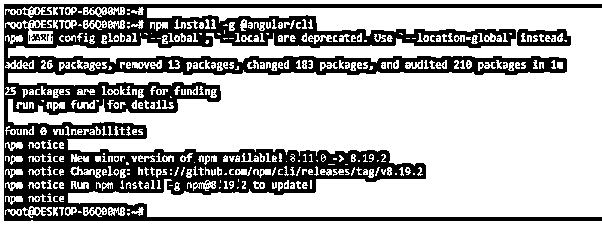


2.使用 ng new 命令创建工作空间。在创建工作区时，我们需要定义项目名称。根据项目名称，它将创建工作空间。在下面的示例中，我们将工作空间名称创建为 angular_cli。

**代码:**

```
ng new angular_cli
```

**输出:**

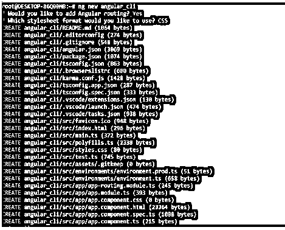


3.创建应用程序后，我们需要使用 ng server 命令运行应用程序。要运行应用程序，我们需要进入指定的目录。我们不能在目录之外运行应用程序。在下面的例子中，我们可以看到我们正在使用应用程序的指定目录运行应用程序，如下所示。当运行下面的命令时，它将创建和构建我们的项目包。

**代码:**

```
cd angular_cli/
ng serve
```

**输出:**

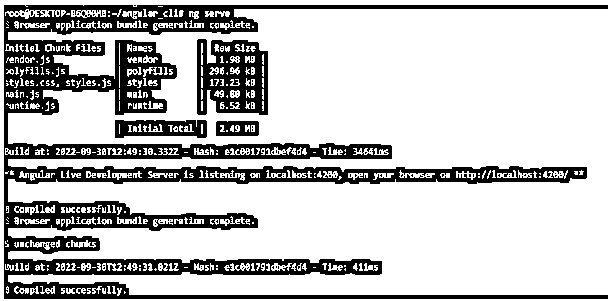


### 角度版本支持

角度版本级别将指示在发布时引入的更改级别。语义版本化的使用有助于我们理解在更新新版本时潜在的影响。

角度版本号将包含如下三个部分:

*   大调小调
*   修补
*   较小的

例如，我们可以说 7.2.11，因为 7 表示主要版本，2 表示次要版本，11 表示修补程序。版本号根据版本中包含的更改级别而递增。

主要版本包含新功能，但开发人员希望在更新期间得到帮助。在更新到新的主要版本时，我们需要运行更新脚本，重构代码，还需要学习新的 API。次要版本包含小功能。次要版本是向后兼容的，因为不需要版本开发人员的帮助，但是我们可以在开始使用添加到版本中的新 API、功能和特性时有选择地修改我们的应用程序和库。我们正在将对等依赖关系更新为次要版本。补丁版本包含低风险和缺陷修复版本。

下面是版本及其最新补丁，版本从 9 开始。

*   版本 9.1.13
*   版本 11.2.14
*   版本 13.3.11
*   版本 10.2.5
*   版本 12.2.1
*   版本 14.2.11

### 角度工具

有多种开发工具可用于开发应用程序。以下是我们可以使用的工具。

#### 1.角度状态检查器

这个工具允许检查每个元素范围的状态。下图显示了状态检查器。

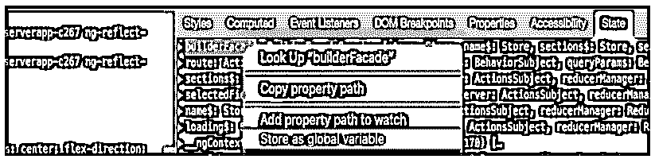


#### 2.少量

Bit dev 平台用于开发和构建共享组件库以获取组件。

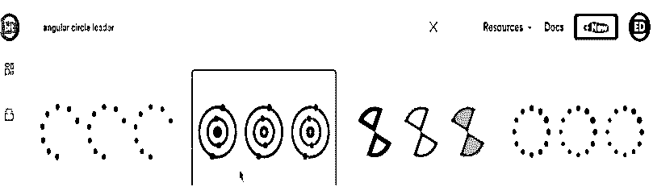


#### 3.角度 CLI

这个工具是由谷歌开发的，允许我们启动这个项目。

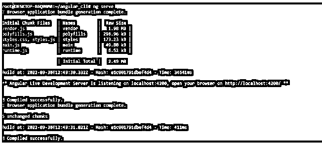


#### 4.语言服务

该工具对于开发人员自动更正单词和自动完成代码非常有用。

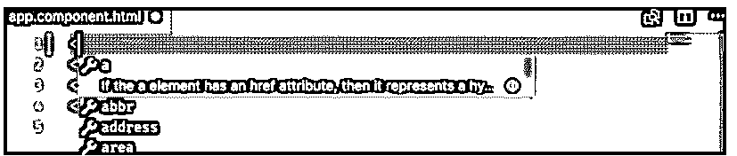


#### 5.共析器

这个工具正在验证我们的组件的选择器是否正确实现。

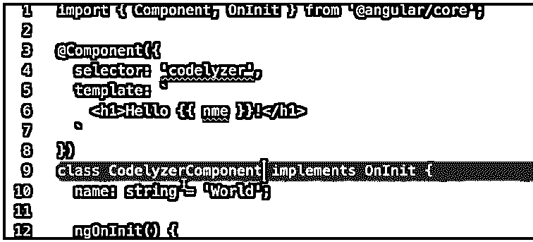


#### 6.角度的片段

该工具声明了一个新的组件和指令。

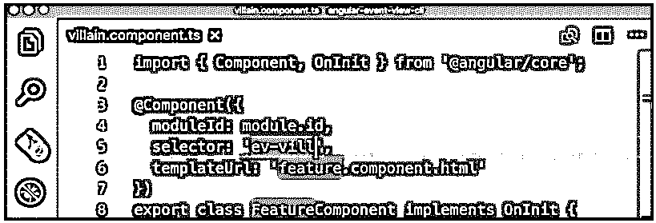


### 棱角分明的建筑

该架构分为四个概念。下面给出了角形建筑的模块，如下所示:

*   成分
*   数据绑定模板
*   模块
*   依赖注入和服务

**1。组件:**框架架构的核心是一个组件，它只不过是 angular 应用程序的构建块。每个应用都是通过使用角度分量来实现的。通过使用 html 模板，我们可以从相应的 javascript 类中访问数据。

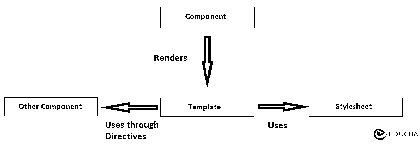


**2。模板:**模板不过是 html 的超集。模板包括 html 的所有功能。

**3。数据绑定:**用于绑定组件模板中的数据。我们可以使用 app 组件的属性来绑定插值。

**4。模块:** Angular 模块就是功能及其相关特性的集合。这是通过使用单个上下文对多个服务和组件进行分组。Angular 应用程序包含多个模块，但我们只能将其中一个模块设置为根模块

以下示例显示了如下模块:

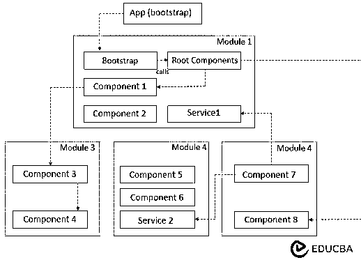


**5。服务:**服务就是提供特定功能的 JavaScript 类。建筑中的服务只做一件事。服务的主要用途是可重用性。

### 角度的特征

下面给出了依赖于角形结构的特征。

*   **文档对象模型–**DOM 将 HTML 或 XML 文档视为一个树形结构，其中每个节点代表文档的一部分。Angular 使用的是常规 DOM。
*   **Typescript—**这个特性将定义 java script 类型，帮助我们编写 javascript 代码。typescript 的所有代码都将使用 javascript 编译。
*   **数据绑定—**数据绑定功能流程，使用户能够通过使用网络浏览器来操作网页的元素。
*   **测试—**使用 jasmine 的测试框架。这个框架为用户提供了多种功能。
*   **Angular architecture—**它支持 MVC 框架。它为应用程序的结构化和双向化提供了清晰的指导。

### 有角度的例子

下面是提到的例子:

#### 示例#1

在下面的示例中，我们正在创建 app.component.ts 文件。

**代码:**

```
import { Component } from '@angular/core';
@Component({
 			 selector: 'app-root',
 			 templateUrl: './app.component.html',
  			styleUrls: ['./app.component.css']
})
export class AppComponent {
  		title = 'angular_cli'; }
```

**输出:**

#### 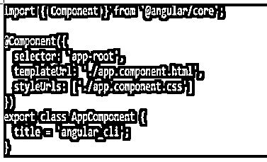


例二

下面的例子显示了我们如何创建 index.html 文件。该文件在 src 文件夹中创建。

**代码:**

```
<!doctype html>
<html lang="en">
<head>
….
</html>
```

**输出:**

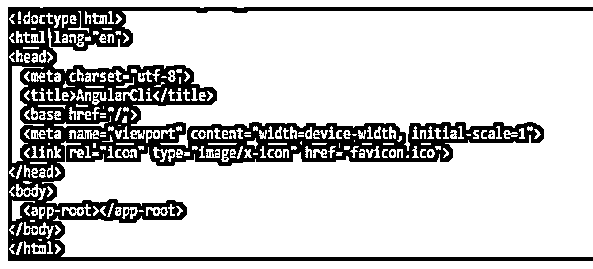


### 常见问题解答

下面是提到的常见问题:

#### Q1。有角有什么用？

**答:**用于开发基于客户端和基于 web 的应用。这用于实现 typescript 库的可选和核心功能。

#### Q2。Angular 架构中定义了哪个模块？

**答:**该架构定义了四种类型的模块，即组件、模块、数据绑定和服务。

#### Q3。什么是元数据组件类？

**答:**元数据组件类用于包含我们已经提供的信息。

### 结论

通过使用 angular，我们可以在 angular 中构建我们的应用，并重用我们的代码和能力来构建我们的应用。它将使开发人员能够以可维护的方式创建大型应用程序。它只不过是一个用于构建 web 应用程序的现代 MVCC 框架和平台。

### 推荐文章

这是一本有角度的指南。在这里，我们讨论介绍、Angular 版本支持、架构、特性和示例。您也可以看看以下文章，了解更多信息–

1.  [角状材料下拉菜单](https://www.educba.com/angular-material-dropdown/)
2.  [角度应用](https://www.educba.com/angularjs-application/)
3.  [角形材料步进器](https://www.educba.com/angular-material-stepper/)
4.  [角度滤波器阵列](https://www.educba.com/angularjs-filter-array/)


