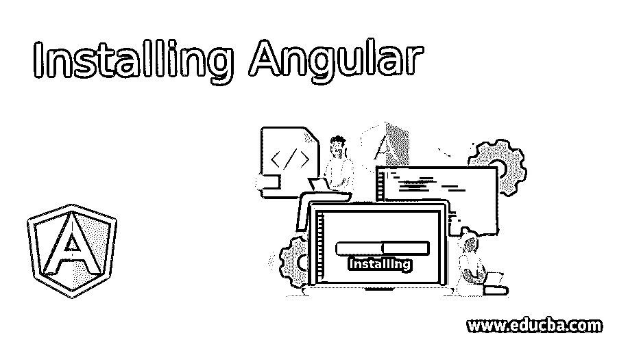
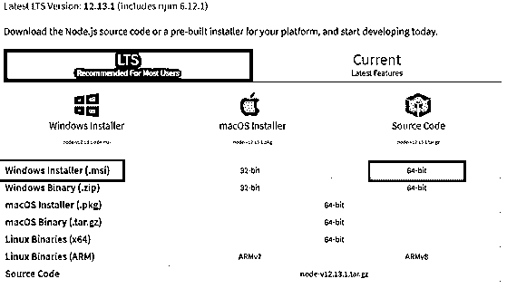
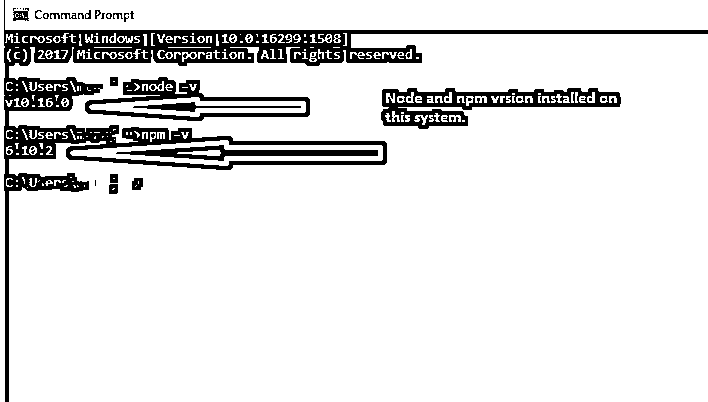
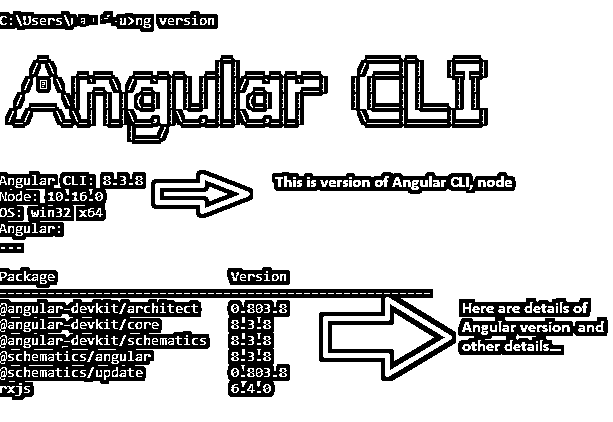
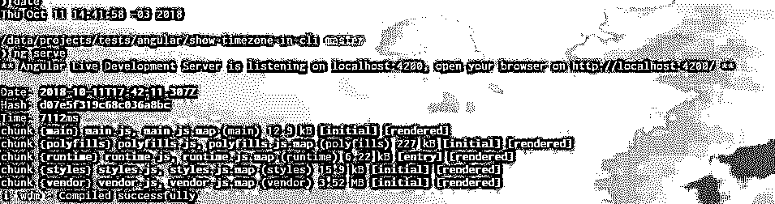

# 安装角形

> 原文：<https://www.educba.com/installing-angular/>




## 角度安装介绍

Angular 是构建现代 web 应用程序的通用框架。为了使用 angular 构建应用程序，必须在本地机器上安装和配置一些先决条件。该软件使开发环境在我们的本地设备上准备就绪，我们可以开始开发 Angular 应用程序。

列出了软件和安装该软件的步骤；这些是在我们的本地机器上创建开发环境所需要的。

<small>网页开发、编程语言、软件测试&其他</small>

### 角度开发环境的先决条件

角度开发需要安装了 Node 8.9+和 NPM 5.5.1+的开发机；本文将逐一介绍所有这些步骤，创建一个 angular App，并通过 Angular CLI(命令行界面)运行和更新它。我们还将讨论常见的 angular CLI 命令及其用法。

#### 1.诺杰斯和 NPM

Node.js 是一个按时运行的开源 Javascript 在 node.js 中，Javascript 运行在浏览器之外；这也称为服务器端 Javascript。我们需要 node.js 拥有一个本地 web 服务器，并在脚本或项目文件中加载更改。NPM(节点包管理器)是一个 Javascript 应用程序的依赖管理工具。NPM(节点包管理器)帮助我们在项目中安装依赖项、库和其他项目支持工具；Angular 也支持 NPM。

要使用这些工具，首先我们需要安装 NodeJS。可以从节点的官方网站下载该节点的安装程序文件:

[https://nodejs . org/en/download/](https://nodejs.org/en/download/)




根据您的操作系统，您可以下载相关版本并将其安装在您的本地计算机上。安装节点后，可以通过打开命令提示符并在命令行界面上使用/键入以下命令来验证节点的成功安装和性能:

```
node –v
npm –v
```




安装节点会自动在计算机上安装 npm(节点程序包管理器)。如上图截图所示，输入 node–v，回车后，我们可以看到 v 10 . 16 . 0；这是安装在我们本地机器上的节点版本。同样，我们可以使用 npm–v 命令来检查设备上安装的 NPM 版本。

#### 2.以打字打的文件

我们可以用 JavaScript 开发 Angular 代码或应用程序，但 typescript 是 Angular 的标准开发语言。TypeScript 是 JavaScript 的超集。它带来了 JavaScript 中类型的特性，最终用于大型应用开发；typescript 编译成 JavaScript，可以像 JavaScript 一样在浏览器上运行。

##### 安装 TypeScript

```
npm install -g typescript
```

该命令中的-g 表示它被全局安装在工作站上，以便 TypeScript 编译器可以在任何项目中使用。

**Angular CLI (Angular 命令行界面):** Angular 命令行界面是创建、开发和更新 Angular 应用程序的标准工具:

```
npm install -g @angular/CLI
```

此命令将全局安装 Angular CLI，以便可以从本地计算机的任何文件夹或项目中使用它。




命令 ng 版本提供了安装在本地系统中的角度、节点和其他基本软件包的详细信息。

### Angular CLI 中常用的命令

这里我们讨论 angular CLI 中常用的命令:

#### 1.ng-新

Angular CLI 使我们可以轻松创建应用程序；它做了许多自动配置供使用，并提供了一个启动和运行的角度项目。在命令行上，我们可以键入:

```
ng new application-name
```

这是一个新的我的测试应用。该命令将创建一个名为 my-test-app 的新工作角度应用程序。

#### 2.ng 生成

ng-generate 是 angular CLI 命令，用于开发组件、路由、服务和管道；该命令还为这些有角度的构建块创建一个测试外壳。Angular CLI 还提供了更短的命令版本；我们可以只使用“g”来替换 generate。按照 Angular CLI 的标准文档，它会根据提供的选项来开发和修改文件。

```
ng generate [options]
ng g [options]
```

该命令可以采用以下选项:

*   应用
*   指示的
*   班级
*   连接
*   图书馆
*   组件
*   管
*   服务
*   网络工程
*   appShell
*   成分
*   列举型别
*   防护装置
*   服务人员
*   普遍的

#### 3.ng 添加

ng add 命令下载已发布库的 npm 包并将其添加到项目中，同时配置项目；ng add 命令仅适用于 Angular CLI 6+

```
ng add
@ngrx/store ng
add @angular/pwa
```

#### 4.ng 构建

ng 构建一个必要的 CLI 命令；该命令将 Angular 应用程序编译到名为 dist 的输出文件夹中，该命令必须从工作空间目录中执行，并且可以在 angular.json 文件中指定输出或构建文件夹。使用该命令可以创建库(Angular 6+提供)和应用程序。

```
ng build <project>
[options] ng b <project>
[options]
```

这里的< project>可以是 angular 应用或者库。在选项中，我们可以有 Angular 提供的构建选项；这里最常用的选项是–prod，用于生产构建。它在内部使用 webpack 工具生成一个表单。

#### 5.发球

ng 也是一个常用的 Angular CLI 命令。Ng 帮助构建和服务一个项目(在一个端口创建一个本地 web 服务器，并为我们提供 URL 链接)并在任何文件中的更改上进行重建。

```
ng serve <project>
[options] ng s <project>
[options]
```

我们可以在这个命令的附加选项中指定端口号，比如:

```
ng serve –port
4201 ng s –port
4201
```

一旦这个命令开始成功地服务于我们的项目，我们可以看到这样的消息，Angular live development server 正在侦听 <u>https://localhost:4200</u> (或者您指定的端口)。在 <u>https://localhost:4200</u> 上打开浏览器(4200 是 Angular 应用程序的默认配置端口)




#### 6.ng e2e

也可以使用 Angular CLI 在 Angular 应用程序中运行测试用例；下面是在 Angular 中运行端到端测试用例的命令。Ng e2e 命令首先构建，然后使用量角器运行测试。该命令应该在工作区目录中执行。

```
ng e2e <project>
[options] ng e <project>
[options]
```

#### 7.ng 试验

我们也可以从 Angular CLI 运行单元测试用例；ng-test 在目录中运行单元测试

```
ng test <project> [options]
ng t <project> [options]
```

#### 8.ng 帮助

ng help 提供了 Angular CLI 中所有可用命令的列表，因此当我们需要帮助或有关 Angular CLI 中任何命令的信息时，可以使用它。

### 推荐文章

这是一个安装角的指南。在这里，我们讨论 angular CLI 中的简介、常用命令以及 angular 开发环境的先决步骤。您也可以看看以下文章，了解更多信息–

1.  [角度验证](https://www.educba.com/angularjs-validation/)
2.  [角度特征](https://www.educba.com/angular-features/)
3.  [角滤波器](https://www.educba.com/angularjs-filters/)
4.  [角度控制器](https://www.educba.com/controllers-in-angularjs/)


