# 角度材料步进机

> 原文：<https://www.educba.com/angular-material-stepper/>

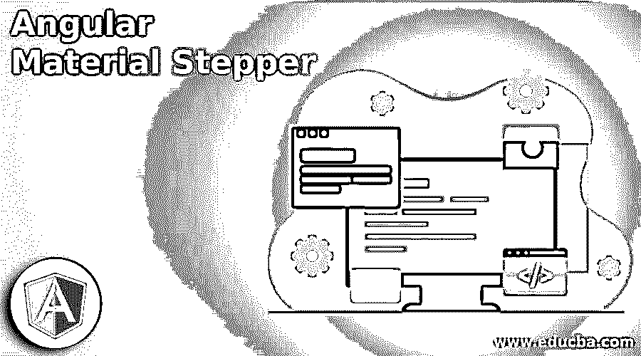


## 角形材料步进机简介

Angular material stepper 提供了一个向导，用于将内容分成符合逻辑的步骤。我们可以在步进器基础上构建材质步进器，步进器基础负责驱动步进工作流的逻辑。材料踏步机延伸了 CDK 的踏步机和材料设计的设计风格。这是非常有用和重要的。

### 什么是角材料步进机？

*   基本上，material 提供了许多用于开发基于 web 的应用程序的组件。我们可以在基于网络的应用中使用 steeper。
*   我们可以通过使用属性名作为方向在两种变体之间切换。这两种材料步进机的工作原理是一样的，唯一不同的是步进机的方向。
*   基本上，材料步进器负责 CDK 步进器基金会的逻辑，这是驱动步进器的工作流程。角材料步进器将扩展材料和 CDK 步进器的设计风格。
*   我们在 AngularJS 项目中使用了<mat-stepper>属性来使用材质塞子。</mat-stepper>

### 角度材料步进器变体

它通过添加 mat-step 组件实现到应用程序中。

<small>网页开发、编程语言、软件测试&其他</small>

正如我们所知，材料步进机的变种分为两种类型。angularJS 中提供的两种角度材料步进器变体如下:

*   Mat 水平步进机
*   Mat 垂直步进机

基本上，素材步进器分为垂直和水平两种类型。

每种类型的描述如下:

#### 1.水平步进机

*   水平步进机的结构包含包装器，它有多个步骤。通过使用材料水平步进器，每一步都是通过添加 mat-step 组件来创建的。
*   垫水平步进器将在水平方向添加步进器。
*   下面的例子显示了如下水平步进器。

**代码:**

```
<mat-horizontal-stepper>
  <mat-step label = "Angular stepper 1">
  Angular material stepper 1
</mat-step>
  <mat-step label = "Angular stepper 2">
  Angular material stepper 2
</mat-step>
  <mat-step label = "Angular stepper 3">
  Angular material stepper end.
</mat-step>
</mat-horizontal-stepper>
```

**输出:**

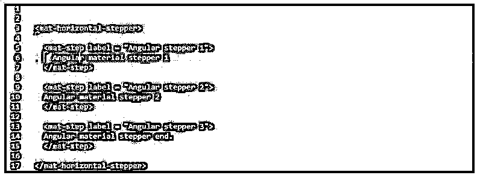


#### 2.垂直步进机

*   垂直步进机的结构包含包装器，它有多个步进。通过使用材质垂直步进器，每一步都是通过添加 mat-step 组件来创建的。
*   垫水平步进器将在垂直方向添加步进器。下面的例子显示了垂直步进如下。

**代码:**

```
<mat-vertical-stepper>
  <mat-step label = "Angular stepper 1">
  Angular material stepper 1
</mat-step>
  <mat-step label = "Angular stepper 2">
  Angular material stepper 2
</mat-step>
  <mat-step label = "Angular stepper 3">
  Angular material stepper end.
</mat-step>
</mat-vertical-stepper>
```

**输出:**

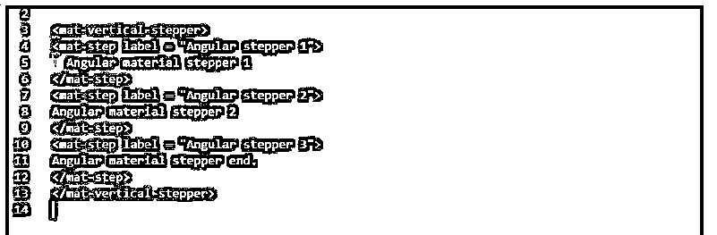


### 角形材料步进器多组

我们将在多个组中使用它来形成一个应用程序。我们可以在 angular6、angular7、angular8 和 angular9 的版本中使用它。

要在多个组中使用 angular material stepper 创建应用程序，我们需要导入 stepper、输入、列表、动画和按钮模块来创建简单的 web 应用程序。

要创建多个组，我们需要将下面的代码添加到 module.ts 文件中。

**代码:**

```
import { BrowserModule } from '@angular/platform-browser';
import { NgModule } from '@angular/core';
import { AppComponent } from './app.component';
import { BrowserAnimationsModule } from '@angular/platform-browser/animations';
……….
providers: [],
bootstrap: [AppComponent]
})
export class AppModule { }
```

**输出:**

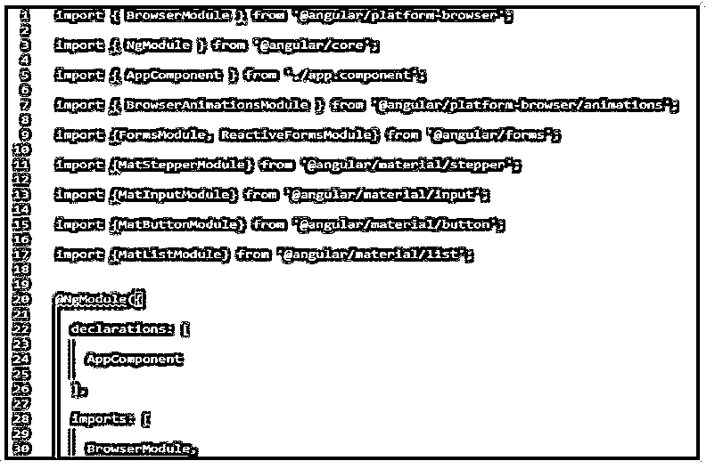


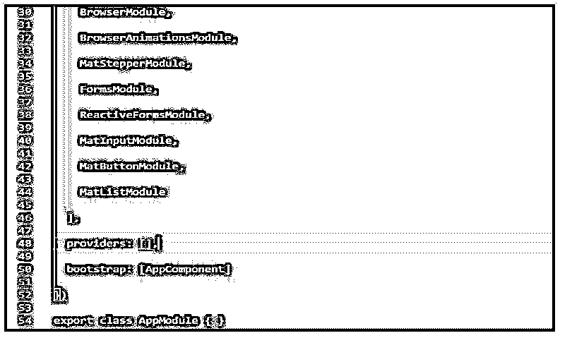


要创建多个组，我们需要将代码添加到应用程序组件 ts 文件中。我们将下面的代码添加到组件 ts 文件中。

**代码:**

```
import { Component } from '@angular/core';
import {FormBuilder, FormGroup, Validators} from '@angular/forms';
@Component ( {
selector: 'app-root',
templateUrl : './app.component.html',
styleUrls: ['./app.component.css']
} )
………………..
}
submit(){
  console.log (this.firstFormGroup.value);
  console.log (this.secondFormGroup.value);
}
}
```

**输出:**

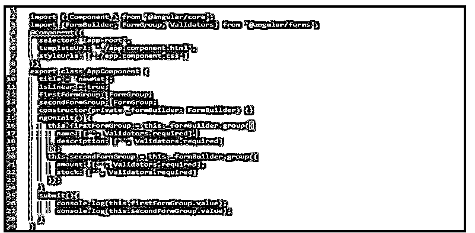


要创建多个组，我们需要将代码添加到应用程序组件 html 文件中。我们将下面的代码添加到组件 html 文件中。

**代码:**

```
<h1> Angular material stepper multiple groups </h1>
<h3> Angular material stepper </h3>
<mat-horizontal-stepper [linear] = "isLinear" #stepper>
……………………….
<button mat-button (click) = "submit()">Submit</button>
</div>
</mat-step>
</mat-horizontal-stepper>
```

**输出:**

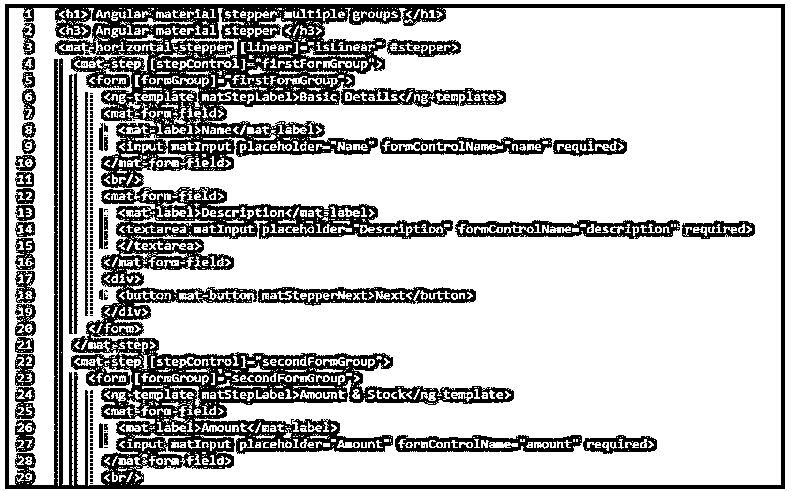


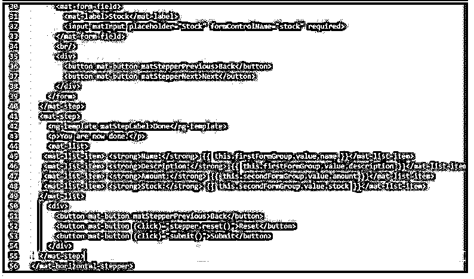


### 角形材料步进机示例

下面是一个材质步进器的例子。首先，我们正在为角步进器创建一个新项目。

为了创建一个材质步进器的例子，我们需要在我们的系统中安装 angular CLI。

**代码:**

```
npm install -g @angular/cli
```

**输出:**

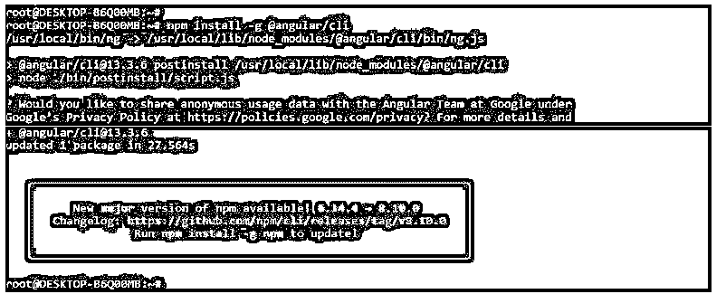


现在，我们正在创建一个名为“角度材质步进器”的工作空间。下面的例子显示了创建我们的角度项目的工作空间如下。我们将添加一个角度路由选项，并将样式表格式选择为 CSS。

**代码:**

```
ng new angular-material-stepper
```

**输出:**

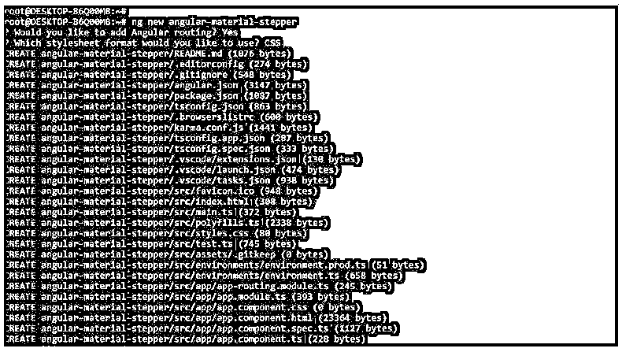


在这一步创建了角度材质自动完成项目的工作空间后，我们正在安装角度 CDK、角度动画和材质，如下所示。

**代码:**

```
npm install @angular/material –save
```

**输出:**

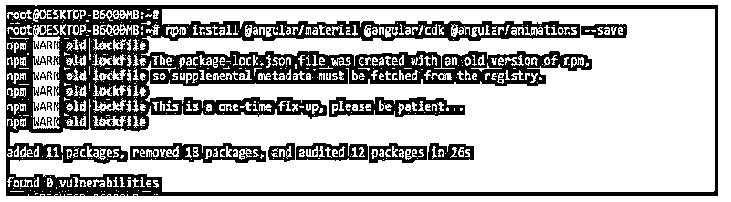


在安装了角度材质、cdk 和动画之后，我们在我们的项目中添加了同样的东西，如下所示。以下示例显示了如何添加角度材料库，如下所示。

**代码:**

```
cd angular-material-stepper/
ng add @angular/material
```

**输出:**

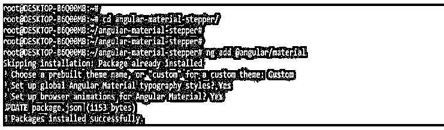


现在，我们需要在 app.module.ts 文件中添加以下代码。在下面的例子中，我们正在导入步进模块。

**代码:**

```
import { BrowserModule } from '@angular/platform-browser';
import { NgModule } from '@angular/core';
………………….
providers: [],
bootstrap: [AppComponent]
})
export class AppModule { }
```

**输出:**

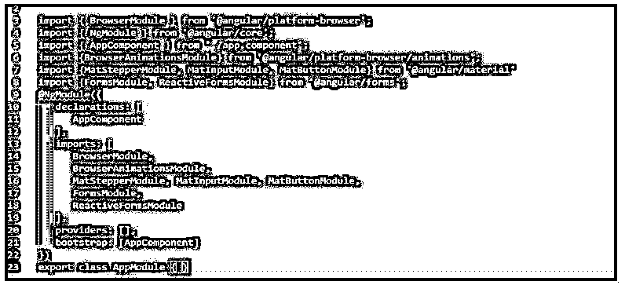


现在，我们需要在 app.component.ts 文件中添加以下代码。

**代码:**

```
import { Component } from '@angular/core';
import { FormControl } from "@angular/forms";
…………………..
secondCtrl: ['', Validators.required]
  });
```

**输出:**

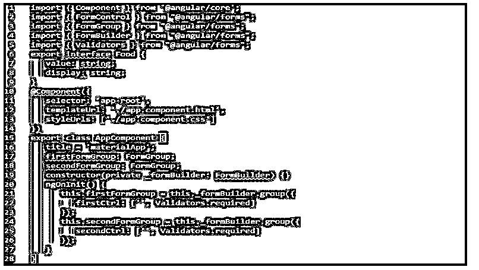


现在我们需要在 app.component.html 文件中添加下面的代码。

**代码:**

```
<mat-horizontal-stepper [linear] = "isLinear" #stepper>
<mat-step [stepControl] = "firstFormGroup">
…………………
</mat-step>
</mat-horizontal-stepper>
```

**输出:**

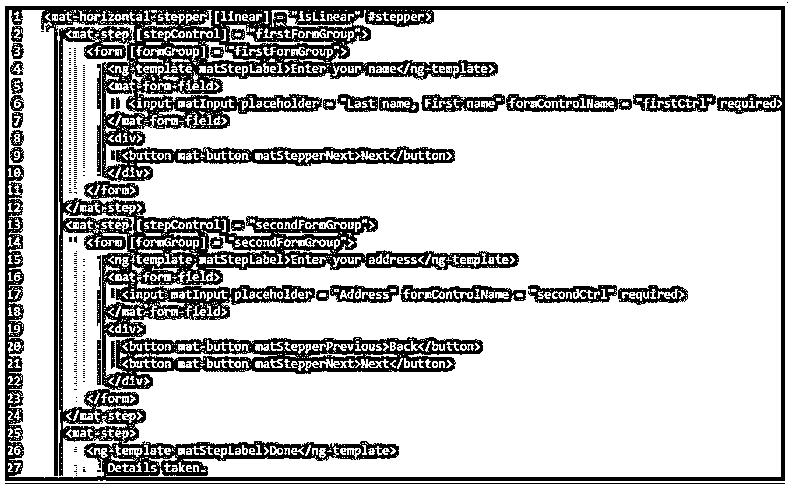


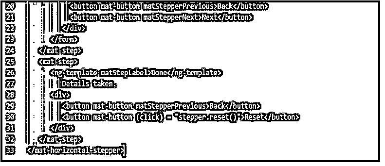


下图显示了 material stepper 示例项目的输出，如下所示。

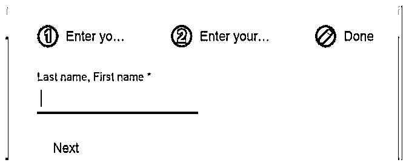


### 结论

在一个使用表单提交的基于 web 的应用程序中，保持我们的页面整洁和用户可理解是很重要的，同时我们需要使用各种有棱角的材料。基本上，有角的材料是步进器的组成部分，通过使用它，我们可以创建基于步进的形式。

### 推荐文章

这是一个有角度的材料步进指南。在这里，我们讨论了简介，有角度的材料步进变量，多组，和例子。您也可以看看以下文章，了解更多信息–

1.  [有角度的材料覆盖图](https://www.educba.com/angular-material-overlay/)
2.  [棱角分明的物质 NPM](https://www.educba.com/angular-material-npm/)
3.  [角状材料单选按钮](https://www.educba.com/angular-material-radio-button/)
4.  [有角度的素材滑块](https://www.educba.com/angular-material-slider/)


