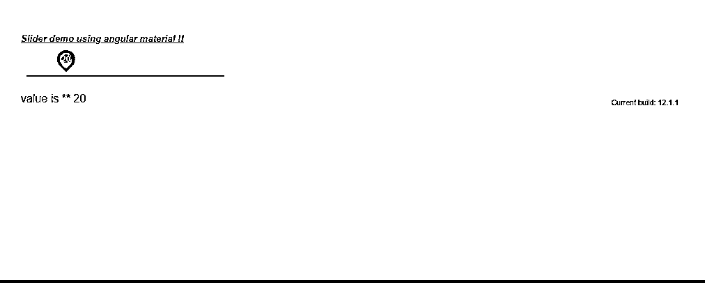

# 角度材料滑块

> 原文：<https://www.educba.com/angular-material-slider/>

## 角度材质滑块简介

角度材料为我们提供了一个更重要的功能，通过使用滑块从任何范围选择任何值来选择范围；这允许用户通过键盘、鼠标等选择数值。为了实现这一点，我们必须导入模块，以便在我们的应用程序中使用它。我们也可以使用 material 提供的基本滑块，它会给出默认的样式；否则，我们可以使用 CSS 修改它。在滑块中，我们可以调整这个范围内的最小值和最大值；用户可以选择一个值，并为我们的滑块指定初始值。在本教程的下一节中，我们将看到如何在我们的 angular 应用程序中实现和使用它，而不需要太多详细的配置来更好地理解。

**语法**

<small>网页开发、编程语言、软件测试&其他</small>

在本节中，我们将看到在我们的应用程序中实现滑块的语法；为此，我们将使用 build 指令中的材料，使它变得又快又快；为了更清楚，让我们从它开始，见下文；

`<mat-slider min="min value" max="1max value" ></mat-slider>`

从上面的语法可以看出，我们使用的是‘mat-slider’，这是素材库提供的一个内置指令，很容易使用和实现。在本教程的下一节中，我们将看到实现这一点的必要配置；现在，让我们看看练习语法；

例如:

`<mat-slider min="0" max="10" step="1" value="0"></mat-slider>`

### 如何在有角度的素材中创建滑块？

到目前为止，我们已经知道，通过使用角度材质滑块，我们可以允许用户从指定的给定范围中选择一个值。在这一节中，我们将看到为了实现这一点，我们需要进行哪些更改和配置；让我们开始吧；

1) **MatSliderModule** :这是素材库的模块，帮助我们创建滑块。该模块必须存在或导入到根目录或您要在其中创建滑块的子模块中。供参考，请看下面的代码，粘贴到根模块；也在 ngmodule 中声明。

例如:

`import {MatSliderModule} from '@angular/material/slider';`

2)

 **1.  **min:** 这个属性用于设置滑块的最小值
2.  **max:** 这个属性用于设置滑块的最大值。
3.  **步骤:**这将增加滑块的某个特定值；假设我们将最小值设置为 0，最大值设置为 10，并且将步长设置为 1，那么滑块每次都会增加 1。

现在，让我们从需要采取的步骤开始，以便为初学者初步加强我们的角度材料项目；见下文；

1)首先，安装 Angular CLI，它使我们能够下载项目所需的包和库。您可以通过在命令上键入以下命令来下载它，请确保您已经安装了 node，见下文；

例如:

`npm install -g @angular/cli)`

以上命令将在我们的系统中全局安装 CLI 因此，我们可以在需要时全局使用它。

3)现在，在这一步中，我们将尝试从头开始创建新的 angular 项目；这个项目将不是一个材料项目，我们必须通过在我们的项目中安装材料依赖关系来添加它。所以只需在你的命令提示符下执行下面的命令，并按回车键见下文；

例如:

ng 新的项目名称

`ng new my-first-project`

此命令将创建名为 my-first-project 的项目；您可以用提到的任何名称创建您的项目。

4)为了确保万无一失，请尝试下面提到的一个命令，将所有需要的库安装到我们的项目中，

例如:

`npm install`

5)现在，您可以通过键入下面提到的简单命令来测试和运行您的项目。这只是为了确保我们在正确的轨道上，并且我们的项目没有任何错误或缺陷。

例如:

`ng serve`

6)进入浏览器，尝试使用以下 URL 运行应用程序:

例如:

http://localhps:4200

默认情况下，angular 项目运行在端口 4200 上；如果需要，您可以根据自己的需要进行更改。

7)现在一切都设置好了，我们有了我们的 angular 项目，现在我们只要在命令提示符下运行下面的命令，就可以将素材库添加到我们的项目中；

例如:

`ng add @angular/material`

### 角度材质滑块示例

下面是使用角度素材库构建滑块的示例；

**1)index.html 代码:**

`<!DOCTYPE html>
<html lang="en">
<head>
<meta charset="utf-8">
<meta name="viewport" content="width=device-width, initial-scale=1.0">
<link href="https://fonts.googleapis.com/icon?family=Material+Icons&display=block" rel="stylesheet">
<title>Slider demo ..</title>
</head>
<body class="mat-app-background">
<slider-demo>Loading... </slider-demo>
Current build: 12.1.1
</body>
</html>`

**2)模块代码**

`import {NgModule} from '@angular/core';
import {MatSliderModule} from '@angular/material/slider';
@NgModule({
exports: [
MatSliderModule,
] })
export class SliderDemo {}`

**3) demo.slider.component.ts 代码:**

`import {Component} from '@angular/core';
/**
* @title Slider demo.
*/
@Component({
selector: 'slider-demo',
templateUrl: 'demo.slider.component.html',
styleUrls: ['demo.slider.component.css'],
})
export class SliderFormattingExample {
slidervalue: number =0;
formatLabel(val: number) {
if (val >= 1000) {
this.slidervalue = val;
return val;
}
return val;
}
}`

**4)demo.slider.component.html 代码:**

`<h5><u><i>Slider demo using angular material !!</i></u></h5>
<mat-slider
thumbLabel
[displayWith]="formatLabel"
tickInterval="100"
step="10"
min="0"
max="100"
name ="slidervalue" [(ngModel)] ="slidervalue"></mat-slider>
 
value is ** {{slidervalue}}`

**输出:**

### 结论

滑块易于使用、开发和维护。素材库通过添加简单的指令“mat-slider ”,不需要太多的配置，使得实现起来更加容易。我们可以通过使用滑块提供的不同属性来修改滑块。

### 推荐文章

这是一个有角度的材料滑块指南。在这里，我们讨论的步骤，创造滑块使用角材料，这是非常容易，可读性。您也可以看看以下文章，了解更多信息–

1.  [角度 CLI](https://www.educba.com/angular-cli/)
2.  [角度 7 特征](https://www.educba.com/angular-7-features/)
3.  [角度时间选择器](https://www.educba.com/angular-time-picker/)
4.  [角度 2 指令](https://www.educba.com/angular-2-directives/)

**