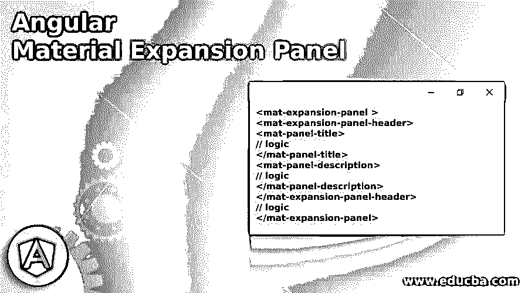
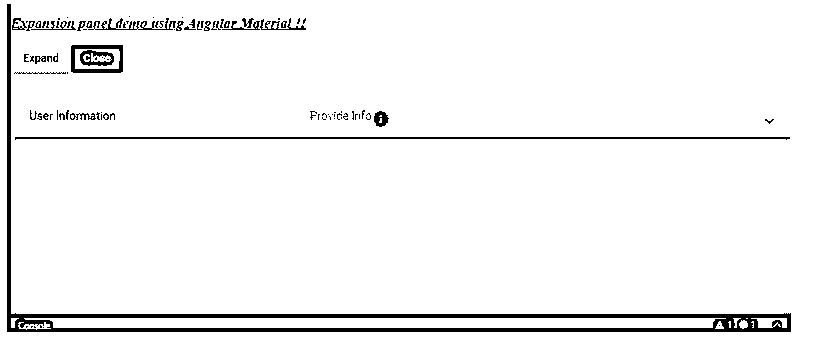
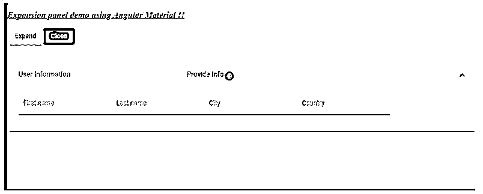

# 角形材料膨胀板

> 原文：<https://www.educba.com/angular-material-expansion-panel/>

## 角材展开板简介

棱角分明的材料为我们提供了一个更精确的特征，一个扩展面板；这有助于我们显示任何功能的详细视图或摘要。此外，我们可以根据需要在其中包含任何类型的操作。例如，我们可以使用一个扩展面板，其中我们不希望用户在没有点击或没有他们的意图的情况下查看初始摘要。虽然默认情况下它是关闭的，但我们可以在做一些属性更改后将其打开。为了实现这一点，我们可以使用一个有内置模块的素材库；我们可以通过对现有项目进行更改，直接使用这些模块来实现这一功能。

**角度素材展开面板的语法**

<small>网页开发、编程语言、软件测试&其他</small>

在使用它之前，我们必须对项目进行一些修改，但是首先，我们可以看一下语法，这是由材料给出的。

`<mat-expansion-panel >
<mat-expansion-panel-header>
<mat-panel-title>
// logic
</mat-panel-title>
<mat-panel-description>
// logic
</mat-panel-description>
</mat-expansion-panel-header>
// logic
</mat-expansion-panel>`

从上面的语法可以看出，我们正在尝试使用' mat-expansion-panel '和其他选择器来实现素材库中的扩展面板。每一个都有自己的意义。

### 扩展面板在角形材料中是如何工作的？

因为我们知道为什么要使用它，以及提供了什么样的模块素材库来实现这个特性，所以我们可以使用它来显示我们的任何功能的详细摘要，或者它主要依赖于我们的需求。

在这里，我们将看到我们需要在现有项目中进行哪些配置和更改来实现这一点。

#### 1.MatExpansionModule

Angular material 为我们提供了这个模块，帮助我们在应用程序中创建扩展面板。通过使用这个，我们可以很容易地创建面板，而不需要太多的代码，并且它给了我们各种选项来显示我们的内容，包括标题和描述等等。，特色。为了在我们的应用程序中实现这一点，我们需要在我们的根模块或我们希望实现这一点的任何子模块中存在这个模块“MatExpansionModule”。

查看下面的代码，并将其放入根模块中\；

**代码:**

`import {MatExpansionModule} from '@angular/material/expansion';`

#### 2.垫膨胀板

这个选择器我们可以用来在 UI 上显示或创建我们的扩展面板，它包含了我们想要在点击时显示的内容。此外，它提出了一些我们可以使用的属性；其中一些提到如下:

*   **hideToggle:** 用于隐藏选择器。
*   **展开:**选择器是否可展开。
*   **afterExpand:** 每当面板展开时发出事件。
*   **关闭:**当面板关闭时发出一个事件。
*   **销毁:**每当面板被销毁时发出一个事件。
*   **打开:**每当面板打开时发出一个事件。

现在完成所有这些后，我们可以检查从头开始设置 angular 项目所需遵循的步骤。

按照以下步骤使用素材库创建您的角度项目。

1.只需使用下面的命令安装下面的角度配置项；它易于使用和运行。

**代码:**

`npm install -g @angular/cli`

2.现在，我们可以通过执行下面的命令来创建角度项目。此外，我们可以为我们的应用程序指定项目的名称。

**代码:**

`ng new your project name
>> ng new my-first-project`

3.现在，我们可以通过在项目路径中运行下面的命令来安装角度依赖项。

**代码:**

`npm install`

4.做完这些之后，我们现在可以通过执行下面的命令来运行我们的项目了；它应该在命令提示符下运行，没有任何错误。

**代码:**

`ng serve`

5.现在，我们可以使用下面的 URL 从本地 env 运行我们的应用程序，端口 4200，默认没有设置。

**http://localhps:4200**

6.现在，最后一步是在项目中执行和安装素材库，这将在下面提到。

**代码:**

`ng add @angular/material`

在此之后，我们将能够在项目中使用扩展面板。

### 角形材料膨胀板示例

下面提到了不同的例子:

**a . index.html 代码:**

`<link href="https://fonts.googleapis.com/icon?family=Material+Icons" rel="stylesheet">
<my-expansion-demo>loading..</my-expansion-demo>`

**b . demo . expansion . component . ts 代码:**

`import { Component, ViewChild } from '@angular/core';
import {MatAccordion} from '@angular/material/expansion';
@Component({
selector: 'my-expansion-demo',
templateUrl: './demo.exapnsion.component.html',
styleUrls: [ './demo.exapnsion.component.css' ] })
export class DemoExpansion {
name = 'Angular';
@ViewChild(MatAccordion) acc: MatAccordion;
}`

**c . demo.exapnsion.component.html 代码:**

`

<h3><u><i>Expansion panel demo using Angular Material !!</i></u></h3>
<button mat-raised-button color="accent"(click)="acc.openAll()">Expand</button>
<button mat-raised-button color="primary" (click)="acc.closeAll()">Close</button>

  
<mat-accordion class="example-headers-align" multi>
<mat-expansion-panel>
<mat-expansion-panel-header>
<mat-panel-title>
User Information
</mat-panel-title>
<mat-panel-description>
Provide Info
<mat-icon>info</mat-icon>
</mat-panel-description>
</mat-expansion-panel-header>
<mat-form-field appearance="fill">
<mat-label>First name</mat-label>
<input matInput>
</mat-form-field>
<mat-form-field appearance="fill">
<mat-label>Last name</mat-label>
<input matInput>
</mat-form-field>
<mat-form-field appearance="fill">
<mat-label>City</mat-label>
<input matInput>
</mat-form-field>
<mat-form-field appearance="fill">
<mat-label>Country</mat-label>
<input matInput>
</mat-form-field>
</mat-expansion-panel>`

**d. module.ts 代码:**

`import {NgModule} from '@angular/core';
import {MatExpansionModule} from '@angular/material/expansion';
@NgModule({
exports: [
MatExpansionModule,
] })
export class DemoMaterialExpansionModule {}`

**输出:**

**初始外观:**

**点击图标后:**

尝试单击关闭并展开，在可展开面板上执行相同的操作。

### 结论

我们已经看到了使用素材库创建扩展面板时需要遵循和注意的所有步骤，以及您应该遵循的所有步骤，正如本文中提到的要成功创建您的第一个扩展面板，它非常易于使用、处理、维护，并且易于被开发人员理解。

### 推荐文章

这是一个有角度的材料展开面板的指南。在这里我们讨论一下绪论，膨胀板是如何在有棱角的材料中工作的？还有例子。您也可以看看以下文章，了解更多信息–

1.  [AngularJS ng 级](https://www.educba.com/angularjs-ng-class/)
2.  [角度 CLI](https://www.educba.com/angular-cli/)
3.  [角度日期过滤器](https://www.educba.com/angularjs-date-filter/)
4.  [角度 7 形式验证](https://www.educba.com/angular-7-form-validations/)

