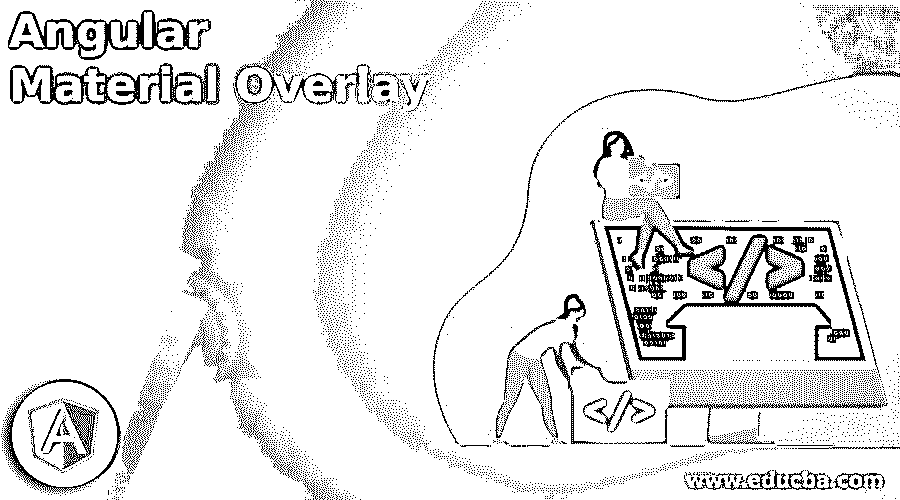
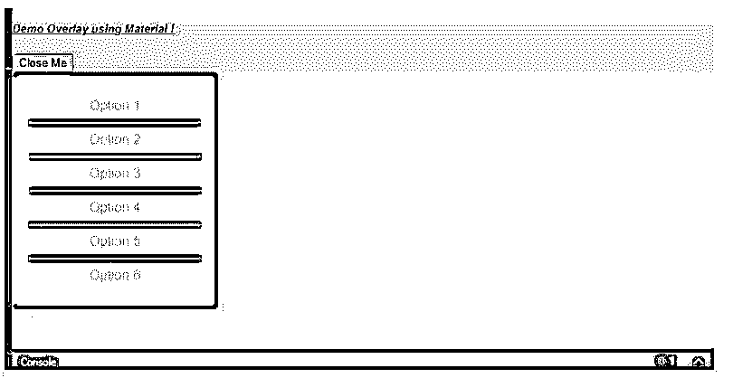

# 有角度的材料覆盖

> 原文：<https://www.educba.com/angular-material-overlay/>

## 角度材料覆盖简介

棱角分明的材质为我们提供了又一个可以用来在屏幕上创建浮动面板的东西；这就是所谓的“叠加”。为了使用它，我们必须做一些比平常更多的配置，它存在于 cdk 中，所以我们需要设置风格和其他东西。当我们必须在浮动面板上显示某些内容时，我们可以在应用程序中创建一个覆盖图；此外，我们可以使用它们从我们拥有的选项列表中进行选择。在角度应用中，它可以用于许多其他目的。此外，在材料的帮助下，我们可以通过做一个小的设置和应用程序级配置，在我们的应用程序中轻松实现这一点。

**角度材质叠加的语法**

<small>网页开发、编程语言、软件测试&其他</small>

正如我们已经看到的，我们必须进行一些与 cdk 相关的配置，但是这里我们将看到 Angular 定义的在应用程序中使用 overlay 的标准方式，

`< ng-template cdkConnectedOverlay [cdkConnectedOverlayOrigin]="val" [cdkConnectedOverlayOpen]="val" >`

我们正在尝试使用 cdk 提供的不同属性来使用和创建覆盖，即“cdkConnectedOverlay”、“cdkConnectedOverlayOrigin”和“cdkConnectedOverlayOpen”，也是为了更好地了解实现的整个步骤过程。

### 覆盖在有角度的材料中是如何工作的？

覆盖帮助我们在屏幕上显示浮动面板；我们可以用纽扣或其他东西把它们系上。但是它不是直接使用的；我们必须为此进行额外的配置和设置。

**1。OverlayModule:** 这是在 cdk 中重新呈现的模型，帮助我们处理有角度材料中的覆盖；这个模块需要存在于根模块或者任何我们想要使用和创建它的子模块中。之后，在 ng module les 标签中导入它。

**代码:**

`import {OverlayModule} from '@angular/cdk/overlay';`

2.它还有各种方法，可以用来执行不同的操作。

下面提到了一些方法:

*   **创建:**该方法用于创建覆盖图。
*   **位置:**该方法用于配置和构建叠加的位置。
*   **getContainerElement:** 该方法用于获取覆盖图的容器元素。
*   **getfullscreelement:**打开元素及其子元素进入全屏模式。
*   **全局:**该方法用于创建覆盖的全局位置。
*   **add:** 该方法用于在可用覆盖列表中添加一个新的覆盖。

从头开始设置角度项目所需的必要步骤，还添加了素材库和 cdk 覆盖。

1.首先，我们必须安装 Angular CLI 这将有助于我们制作和构建我们的角度应用程序。

我们可以执行下面的命令来全局安装 CLI。

**代码:**

`npm install -g @angular/cli`

2.现在，我们可以通过运行下面的命令来创建 angular 项目；这个命令将帮助我们创建具有指定名称的项目。

**代码:**

`ng new your project name
>> ng new my-first-project`

根据您的选择'我的第一个项目'。

3.现在，最初，我们必须运行 npm install 命令来安装我们项目所需的依赖项。这个命令在我们的应用程序中创建几个包含依赖关系的文件夹。

**代码:**

`npm install`

4.在这之后，我们可以启动服务器并通过执行下面的命令来查看变化。成功安装后，我们现在只需执行。

**代码:**

`ng serve`

5.在下面的 URL 上运行项目，它将是本地的，运行在端口 4200 上。

**http://localhps:4200**

6.现在，我们可以使用下面的命令安装素材库；在这之后，我们将能够在我们的项目中使用覆盖，执行它。

**代码:**

`ng add @angular/material`

### 角度材料覆盖的示例

下面给出了角度材料覆盖的示例:

**a . index.html 代码:**

`<!DOCTYPE html>
<html lang="en">
<head>
<meta charset="utf-8">
<meta name="viewport" content="width=device-width, initial-scale=1.0">
<link href="https://fonts.googleapis.com/icon?family=Material+Icons&display=block" rel="stylesheet">
<title>Demo Overlay</title>
</head>
<body class="mat-app-background">
<demo-overlay>Loading..</demo-overlay>
</body>
</html>`

**b. demo.overlay.component.ts 代码:**

`import {Overlay, OverlayOrigin, OverlayConfig, OverlayRef} from '@angular/cdk/overlay';
@Component({
selector: 'demo-overlay',
templateUrl: 'demo.overlay.component.html',
styleUrls: ['demo.overlay.component.css'],
})
export class AppOverlayComponent {
isOverlayOpen = false;
}`

**c . demo.overlay.component.html 代码:**

`<h5><u><i>Demo Overlay using Material !</i></u></h5>
<button (click)="isOverlayOpen = !isOverlayOpen" type="button" cdkOverlayOrigin #demotrigger="cdkOverlayOrigin">
{{isOverlayOpen ? "Close Me" : "Open Me"}}
</button>
<ng-template
cdkConnectedOverlay
[cdkConnectedOverlayOrigin]="demotrigger"
[cdkConnectedOverlayOpen]="isOverlayOpen">
<ul class="demo-list">
<li>Option 1 </li>
<li>Option 2</li>
<li>Option 3</li>
<li>Option 4</li>
<li>Option 5</li>
<li>Option 6</li>
</ul>
</ng-template>`

**d. module.ts 代码:**

`import {NgModule} from '@angular/core';
import {OverlayModule} from '@angular/cdk/overlay';
@NgModule({
exports: [
OverlayModule,
] })
export class DemoOverlayMaterialModule {}`

**e . demo . overlay . component . CSS 代码:**

`.demo-list > li {
list-style-type: none;
border-bottom: solid 2px #529e0a;
padding: 10px 0;
}
.demo-list {
width: 200px;
border: solid 1px rgb(134, 19, 19);
border-radius: 5px;
background: rgb(59, 18, 124);
text-align: center;
padding: 20px;
margin: 0;
}
.demo-list > li:last-child {
border-bottom: none;
}`

**输出:**

**点击打开:**

### 结论

遵循全篇；它将帮助你创建、理解叠加；按照所有的步骤，你将能够创建它，没有任何错误。使用和实现并不简单；我们必须为此付出额外的努力；这需要一个额外的设置，但是很简单，易读，易维护。

### 推荐文章

这是一个有角度的材料覆盖指南。在这里，我们讨论的介绍，如何覆盖工作在有角的材料？还有例子。您也可以看看以下文章，了解更多信息–

1.  [AngularJS ng 级](https://www.educba.com/angularjs-ng-class/)
2.  [角度 CLI](https://www.educba.com/angular-cli/)
3.  [角度日期过滤器](https://www.educba.com/angularjs-date-filter/)
4.  [角度 7 形式验证](https://www.educba.com/angular-7-form-validations/)

