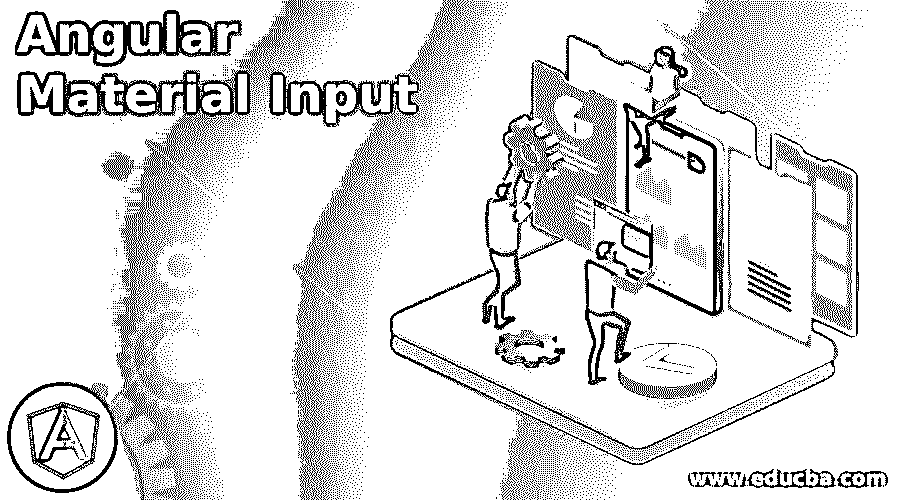
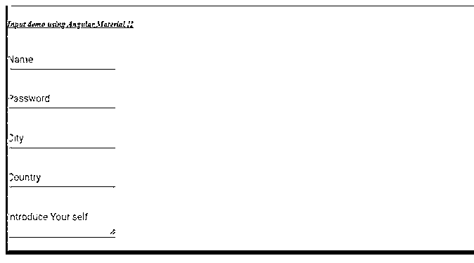

# 角度材料输入

> 原文：<https://www.educba.com/angular-material-input/>




## 角度材料输入简介

在角度材料中，我们可以创建输入字段正常和文本类型，素材库为我们提供了一个模块，通过它可以很容易地创建，而且默认的样式和动画将出现在它上面。通过使用 material 提供的模块，我们可以将这些字段包装在 mat 表单中，并且能够在 mat 表单中使用它们。

一旦我们安装了素材库，我们就可以使用素材库中的输入模块了。当我们必须创建用户表单并接受用户的输入时，输入是有用的，我们处理这些数据以执行进一步的操作。输入在表单上被广泛使用，从用户那里获取任何类型的输入，使 UI 对用户友好，这里我们将看到应用程序中输入字段的实际用法。

<small>网页开发、编程语言、软件测试&其他</small>

### 角度材料输入的语法

正如我们已经知道的，material 为我们提供了一个模块来创建 angular 中的输入文件，它提供了默认的样式和动画。在这里，我们将看到使用素材模块和选择器创建输入的标准语法。

```
<mat-form-field appearance="fill">
<mat-label> your label </mat-label>
<input matInput placeholder=" " value=" ">
</mat-form-field>
```

正如你在上面的语法中所看到的，我们正试图使用‘matInput’来利用素材库输入，它现在可以直接放在‘mat-form-field’中。

### 输入如何在有角度的材料中工作？

到目前为止，我们已经知道为什么我们使用输入字段，材料为我们提供了输入模块，可以很容易地导入并开始使用素材库创建输入字段。在这里，我们将看到为了使用素材库中的输入字段需要完成的一些配置。

**1。MatInputModule:** 这是我们可以用来创建输入的模块，但是首先它必须出现在根模块或者任何我们想要在表单域中创建输入的子模块中。查看下面的代码，并使用 Ngmodule 标签将导入粘贴到根模块中。

**代码:**

```
import {MatInputModule} from '@angular/material/input';
```

2.它提供了不同的属性，我们可以在输入字段上使用这些属性来执行一些操作，下面提到了其中的一些:

*   **matAutosize:** 这是一个布尔值，用于自动调整文本区域的大小。
*   **benabled:** 用于启用自动调整大小，取值为真或假。
*   **minRows:** 用于显示文本区域使用的最小行数。
*   **maxRows:** 用于设置文本区域需要的最大行数。

3.它还提出了下面提到的几种方法:

*   **复位:**用于将文本区域复位到原来的大小。
*   **resizeToFitContent:** 调整大小以适应内容。

现在我们将看到创建 angular 应用程序所需的步骤，并在最后添加了素材库。我们想从头开始创建 angular 项目，然后使用上述步骤，如果您已经有 angular 项目，那么只需使用 CLI 上的最后一个命令将素材库添加到它。

1.首先，我们将使用下面的命令安装 angular Ci，它将帮助我们制作 angular 应用程序。

**代码:**

```
npm install -g @angular/cli
```

2.通过使用 angular cli，使用项目名称执行以下命令来创建 angular 项目。

**代码:**

```
ng new your project name
```

```
ng new my-first-project
```

根据您选择'我第一个项目'

3.通过在提示符下运行下面的命令来安装依赖项。

**代码:**

```
npm install
```

4.启动服务器只需点击下面的命令。

**代码:**

```
ng serve
```

5.现在，我们可以在下面的 URL 中测试我们的应用程序，它运行在默认端口 4200 上，可以根据需要进行更改。

http://localhps:4200

6.现在，最后一步是在我们的 angular 项目中安装材质依赖，并开始使用它的输入模块。

**代码:**

```
ng add @angular/material
```

### 角度材料输入的示例

下面给出了使用素材库创建输入字段的示例，我们现在已经在根文件中配置了该模块，并且只需创建项目并开始使用它。

我们已经创建了不同的文件，并在其中放置代码，只需复制 HTML 代码和 ts 文件，只需复制代码，使用在线编辑器运行它。

**a . index.html 代码:**

```
<link href="https://fonts.googleapis.com/icon?family=Material+Icons" rel="stylesheet">
<demo-input>loading</demo-input>
```

**b. demo-input.component.ts 代码:**

```
import { Component } from '@angular/core';
@Component({
selector: 'demo-input',
templateUrl: './demo-input.component.html',
styleUrls: [ './demo-input.component.css' ]
})
export class AppInputComponent {
}
```

**c . demo-input.component.html 代码:**

```
<h5><u><i>Input demo using Angular Material !!</i></u></h5>
<form>
<mat-form-field appearance="">
<mat-label>Name</mat-label>
<input matInput placeholder="Ex. Pizza" value="">
</mat-form-field>
<br/>
<mat-form-field appearance="">
<mat-label>Password</mat-label>
<input matInput placeholder="Ex. Pizza" value="">
</mat-form-field>
<br/>
<mat-form-field appearance="">
<mat-label>City </mat-label>
<input matInput placeholder="Ex. Pizza" value="">
</mat-form-field>
<br/>
<mat-form-field appearance="">
<mat-label>Country</mat-label>
<input matInput placeholder="Ex. Pizza" value="">
</mat-form-field>
<br/>
<mat-form-field appearance="">
<mat-label>Introduce Your self</mat-label>
<textarea matInput placeholder="Write something"></textarea>
</mat-form-field>
</form>
```

**d. module.ts 代码:**

```
import { NgModule } from "@angular/core";
import { AppInputComponent } from "./app.component";
@NgModule({
imports: [MatInputModule],
declarations: [AppInputComponent],
bootstrap: [AppInputComponent]
})
export class AppModule {}
```

**输出:**




### 结论

使用素材库很容易使用，也为我们提供了输入模块，通过它我们可以很容易地用默认的样式和动画实现表单中的字段。此外，需要最小的配置来正确地实现这一点，这对于开发人员来说也是可读的、可维护的和易于使用的。

### 推荐文章

这是一个角度材料输入的指南。这里我们讨论一下导论，输入在有角的物质中是如何起作用的？和示例。您也可以看看以下文章，了解更多信息–

1.  [AngularJS ng 级](https://www.educba.com/angularjs-ng-class/)
2.  [角度 CLI](https://www.educba.com/angular-cli/)
3.  [角度日期过滤器](https://www.educba.com/angularjs-date-filter/)
4.  [角度 7 形式验证](https://www.educba.com/angular-7-form-validations/)


