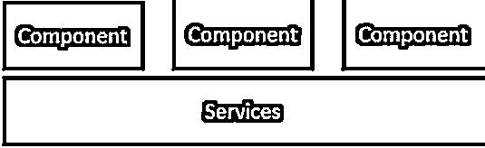
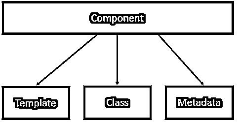
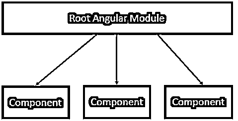
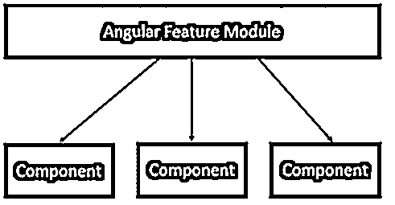
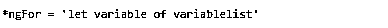
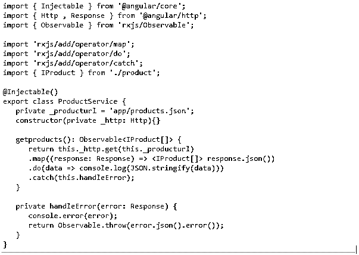
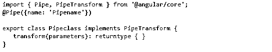
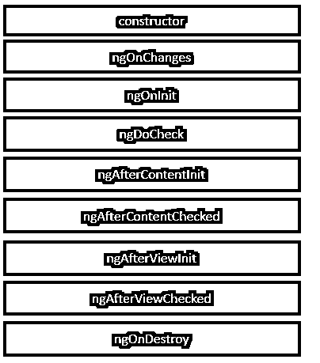

# 什么是 Angular 2？

> 原文：<https://www.educba.com/what-is-angular-2/>

## 什么是 Angular 2？

Angular 2 是一个 JavaScript 开源平台，用于创建 HTML 和 JavaScript Web 应用程序。本指南讨论了 Angular 2 框架的不同方面，包括基本原理、Angular 的配置以及如何使用框架的不同方面。这是一个前端应用程序的领先平台，谷歌的 Angular 团队定期更新该平台。它完全是基于组件的。它包括各种树结构组件，具有父组件和子组件。

### 角度 2 中的模

在应用程序中，逻辑边界由 Angular 2 放在一起。这些功能可以分成不同的模块，而不是把所有的东西都放在一个应用程序中。以下是构成模块的一些部件——

<small>网页开发、编程语言、软件测试&其他</small>

*   为了访问应用中的功能，需要加载的组件在引导阵列的帮助下被通知给 Angular JS。该组件需要在引导数组中声明，以便在 Angular JS 应用程序中，它可以跨其他组件使用。
*   管道、派生、组件等通过导出数组导出，以便在其他模块中使用。
*   在导入数组的帮助下，可以从其他 Angular JS 模块导入功能。

### 体系结构

angular2 的架构如下:

上图描述了 Angular 2 应用的结构。应用程序的功能由作为逻辑边界的每个组件定义。在分层服务的帮助下，跨组件的功能被共享。

组件由类、模板和元数据定义。属性和方法由类组成。该类的功能得到了扩展，并借助元数据进行了修饰。应用程序的 HTML 视图可以在模板的帮助下定义。

这个应用程序有一个根模块和几个分隔功能的组件。

类似于根角度模块，特征模块有几个分配功能的组件。

在 Angular JS 应用程序中，代码的逻辑部分由组件定义。

*   绑定和派生由模板完成，模板包含应用程序的 HTML 并呈现应用程序的视图。
*   属性和方法存在于类中，该类支持应用程序的视图，并在 TypeScript 中定义。它有类名、属性名、属性类型和值。
*   使用装饰器，定义了元数据，其中包含额外的数据。

### 特征

HTML 的功能在称为指令的自定义 HTML 元素的帮助下得到扩展。Angular 2 中的指令是 ngif 和 ngFor。

*   在 true 场景中，元素在 ngif 元素的帮助下被添加到 HTML 代码中，但是如果它的计算结果为 False，则不会被添加。由代表。

*   根据 for 循环条件，使用 ngFor 元素。

数据绑定是 Angular 2 的特性之一。到类的属性中，HTML 标记的属性可以是一个绑定。

在 Angular 2 中，错误处理是应用程序的一个选项。包含 ReactJS catch 库，并使用 catch 函数。下面是错误处理代码。

对于错误处理函数，链接包含在 catch 函数中。错误由错误处理函数发送到控制台。在错误被扔回到主程序后，继续执行。这将错误重定向到控制台。

在主页上选择一个选项后，用户会在路由的帮助下被引导到不同的页面。

在这种情况下，数据可以在几个过滤器和管道的帮助下进行转换。

*   转换成小写。

*   转换成大写。

*   从输入字符串中，可以分割出一段数据。切片起始位置由 start 参考，结束位置由 end 参考。

*   在 date 函数的帮助下，可以将输入字符串转换为日期格式。

*   在货币函数的帮助下，输入字符串被转换为货币格式。

*   输入字符串用 percentage 函数转换成百分比格式。

自定义管道也可以在 Angular 2 的帮助下创建。

*   Pipename 定义管道的名称。
*   管道类定义自定义管道类。
*   为了处理管道，使用了 transform 函数。
*   参数通过参数传递给管道。
*   返回类型定义管道的返回类型。

### Angular 2 的生命周期

从开始到应用程序结束，Angular 2 应用程序有其生命周期。

这张图描绘了 Angular 2 的整个生命周期。下面是描述。

*   数据绑定属性值的更改由 ngOnChanges 方法描述。
*   Angular 显示数据绑定属性后，在组件初始化期间，调用 ngOnInit 方法。
*   当 Angular 本身无法检测到变化时，使用 ngDoCheck 进行检测。
*   在组件的视图中，当 Angular 投影外部内容时，会调用 ngAfterContentInit 作为响应。
*   一旦 Angular 检查了投影的内容，就会调用 ngAfterContentChecked 作为响应。
*   一旦 Angular 初始化了组件的视图和子视图，就调用 ngAfterInit。
*   Angular 检查组件和子视图后，调用 ngAfterViewChecked。
*   在 Angular 销毁指令或组件之前，非政府组织进行销毁，这就是所谓的清理阶段。

服务是 Angular 2 的另一个属性，当不同的模块需要一个共同的功能时会用到它。在各种模块中，数据库功能可以重用。创建服务可以使用数据库功能。

### 我们为什么需要它？

*   它提供了有助于调试和理解代码的功能；开发和编辑体验也将得到增强。
*   在 Angular 2 的帮助下，编码变得更加一致。
*   [Angular 2 提供了](https://www.educba.com/angular-2-components/)广泛的绑定能力。它的属性绑定特性允许控制 DOM。借助于事件绑定，可以实现对视图中任何事件的反应。
*   Angular 2 提供了完整的路由功能。
*   它拥有广泛的文档和社区支持，为几乎所有面临的问题提供了解决方案。

### 结论

它是最受欢迎的 web 开发框架之一，也是构建下一个 web 应用程序所需的框架。

### 推荐文章

这是一本关于什么是 Angular 2 的指南？.在这里，我们讨论 Angular 2 的简介、模块、特性以及生命周期。您也可以浏览我们推荐的其他文章，了解更多信息——

1.  [如何安装 Angular 2？](https://www.educba.com/install-angular-2/)
2.  [R 编程语言](https://www.educba.com/r-programming-language/)
3.  [角度 2 指令](https://www.educba.com/angular-2-directives/)
4.  [什么是 AngularJS](https://www.educba.com/what-is-angularjs/)

