# 如何安装 Angular 2？

> 原文：<https://www.educba.com/install-angular-2/>

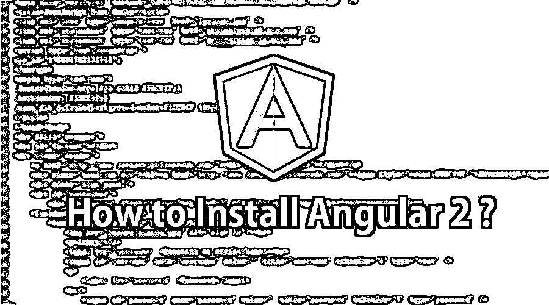

## 到底什么是有角的？

Angular 是一个 JavaScript 开源前端框架，创建了反应式单页应用程序(SPAs ),由 Google 的开发者开发。Angular 已经证明了开源 JavaScript 框架中的广泛控制，并且由于其出色的功能技术，它在开发人员和企业之间得到了非常高的评价。Angular 是一个创新的客户端 MVW 框架，目前广泛用于移动应用和 web 应用开发。它是用支持 ES6 (ECMA 脚本 2015)标准化的类型脚本编写的。微软开发的 Typescript，它是 JavaScript 的超集。这将转换代码并转换成 JavaScript 或 ES5 格式。Typescript 是强类型的，它允许编写 OOPS 功能，如类、接口和模块语句，就像 [C#或 Java](https://www.educba.com/java-vs-c-sharp/) 一样，这可以提高执行速度并减少运行时错误。

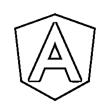

<small>网页开发、编程语言、软件测试&其他</small>

### Angular 2 的特性

以下是 angular 2 的主要特性。

#### 成分

Angular 的早期版本引起了控制器的注意，但现在完全改变了对控制器上的组件的关注。组件有助于将应用程序创建成几个模块。这有助于在一段时间内更有效地管理应用程序。

#### 组件

该模块与一个类完全相同。模块通常由用于执行某个单一任务的代码块来描述。Angular 具有模块化的能力，通过将一个应用程序分成几个模块来构建它。Export 关键字用于从模块中导出组件类。按照惯例，每个角度应用程序至少有一个角度模块，称为 app 模块。

**举例:**

#### 模板

模板是决定组件浏览的关键角色。可以声明组件的视图是使用模板识别的。它是用 [HTML](https://www.educba.com/html-works/) 创建的，包括绑定和指令。

**举例:**

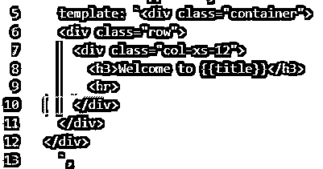

#### [计]元数据

这对提高课堂效率很有帮助。为此，在 Typescript 中，通过修饰类来标识。例如，要在 Angular 应用程序中指定任何组件，请使用该类的元数据(即@Component decorator)。

装饰器是一个将元数据放到类中的函数，它可以是成员，也可以是方法参数。

#### 数据绑定

最有效的特性，数据绑定，是模型和视图之间的桥梁。它会自动同步。Angular 支持四种类型的绑定——属性绑定、事件绑定、插值和双向绑定。

#### 指示的

指令是定制的 [HTML 属性](https://www.educba.com/html-attributes/)，有助于 HTML 的持久化能力。要创建一个指令，需要在类的连接元数据上使用@Directive decorator。三种类型的指令——组件、装饰器和模板。

#### 服务

每当在应用程序的不同模块中通常需要单一生产力时，就使用服务。基本上，是用来共享应用程序中的数据和行为。该服务没有基类。经常使用的服务是日志服务、数据服务、消息服务等。

#### 依赖注入

角度依赖注入。依赖注入(DI)是 Angular 2+的一个基本概念，它使一个类能够从另一个类收集依赖。通常在 Angular 中，依赖注入是通过将一个服务类注入到一个节或模块类中来执行的。

**举例:**

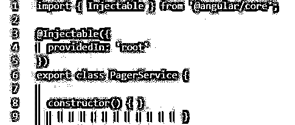

有许多文本编辑器完全支持 Typescript。无论是开箱即用或带有插件，包括所有这些如下。

1.  Visual Studio。
2.  Visual Studio 代码。
3.  原子。
4.  月食。
5.  网络风暴。

Visual Studio 代码是最好的选择，因为它是开源的，可以在 Linux、Windows 和 MacOS 上运行。它提供了支持 Typescript 的强大功能，包括

*   自动完成
*   智能感知
*   语法检查
*   重构

要下载 Visual Studio 代码，请访问位于[https://code.visualstudio.com/download](https://code.visualstudio.com/download)的网站。

### 安装角度 2 的步骤

现在，开始安装 Angular 2

**第一步:**要安装 Angular 2，首先从 https://nodejs.org/en/download/[网站](https://nodejs.org/en/download/)下载 node.js 包。

在您的系统中安装下载的 npm(节点程序包管理器)存储库。

*   如果您使用 Windows 系统，请安装 Windows installer。
*   如果使用 MacOS 系统，安装 MacOS 安装程序。

检查您的系统兼容版本，如 32 位或 64 位。

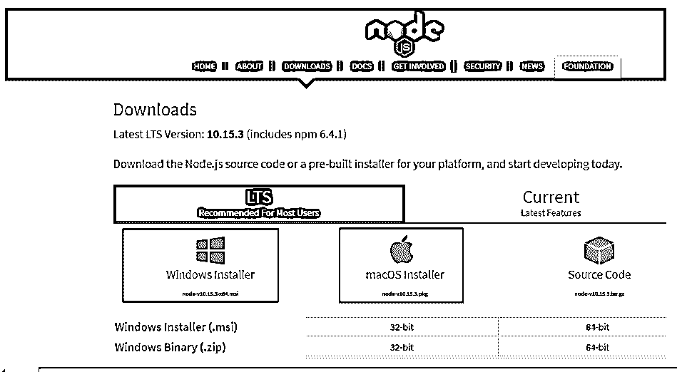

**第二步:**安装节点，

现在**，**双击下载的 node-v10 15.3-x64.msi 文件运行安装程序，并在安装程序屏幕上单击下一步按钮。

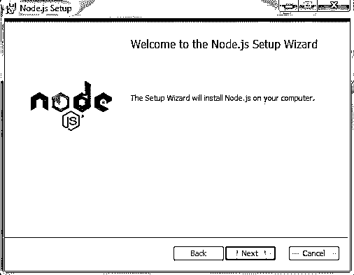

**步骤 3:** 现在，点击复选框，接受许可协议**中的条款。**然后点击下一步按钮。

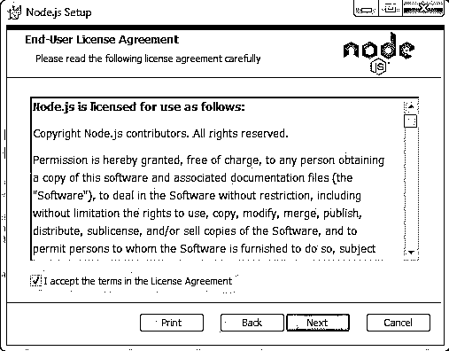

**步骤 4:** 在下一个屏幕上，根据需要更改安装路径或单击下一步按钮。

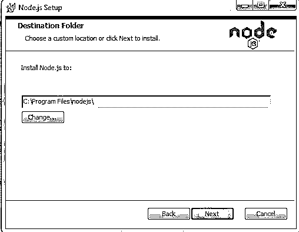

**步骤 5:** 在下一个功能选择屏幕上，保持默认选择，并点击下一步按钮。

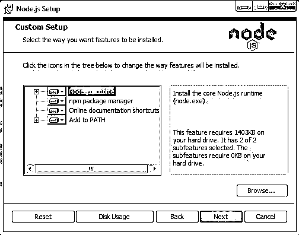

**步骤 6:** 现在，要安装 Node.js，点击 install 按钮。

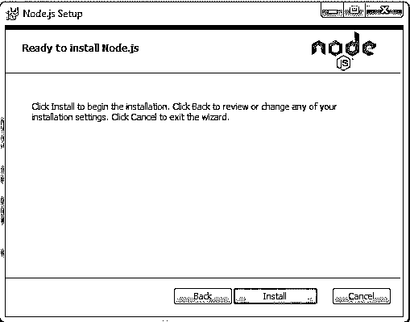

**步骤 7:** 在下一个屏幕上，等待安装完成。

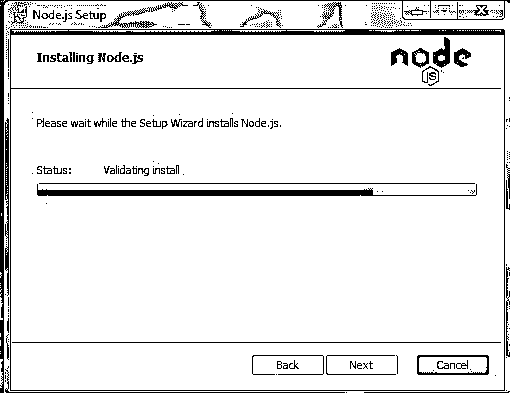

**第八步:**现在，点击完成按钮。

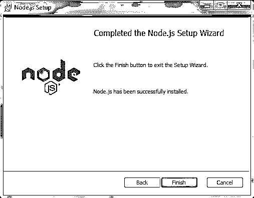

**步骤 9:** 打开机器上的命令提示符，键入以下命令，并检查 nodejs 版本和 npm 版本:

`c:/>node -v`

`c:/>npm -v`

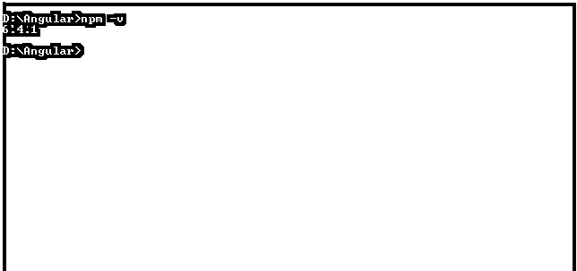

**第十步:**一旦安装完成。访问位于 https://angular.io/cli[的站点](https://angular.io/cli)，获取 Angular CLI(命令行界面)。

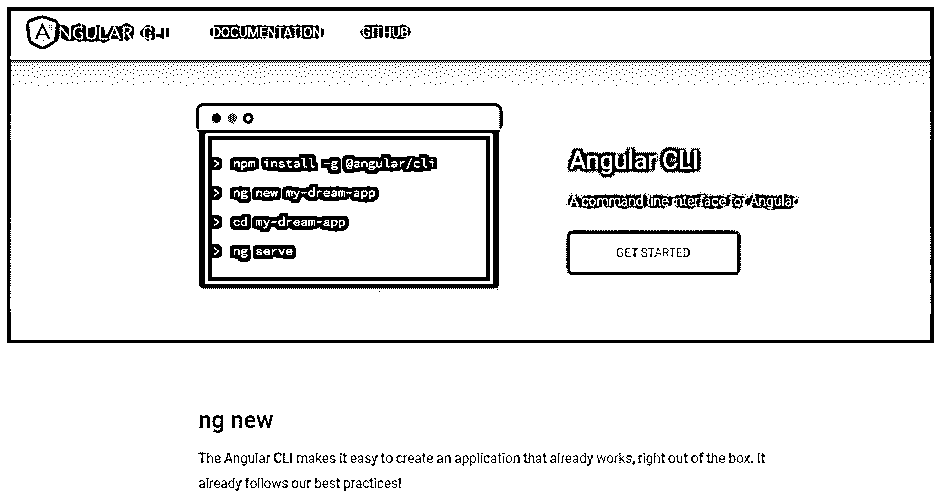

**步骤 11:** 在您的机器上打开命令提示符，键入命令“NPM install–g @ Angular/CLI ”,然后按 enter 键安装 Angular 2 CLI(命令行界面)。

**Note:** If you use MacOS/Linux just put sudo before the npm, “sudo npm install –g @angular/cli”

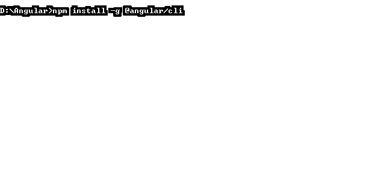

第 12 步:输入“ng new first-app”并按回车键创建第一个应用。

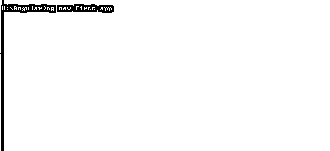

**步骤 13:** 安装 Angular 2 app 时，Angular CLI 会问你一些问题。

*   您想要添加角度路由吗？(是/否)->否
*   哪个样式表标准想要使用？(使用箭头键)-> CSS

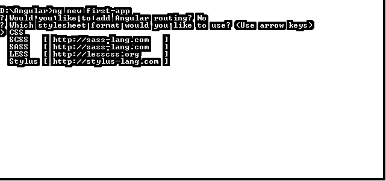

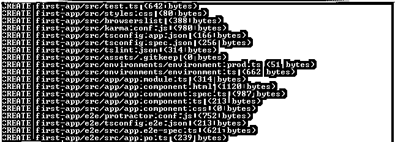

**步骤 14:** 在第一个应用程序中，使用 Angular CLI 添加所有软件包

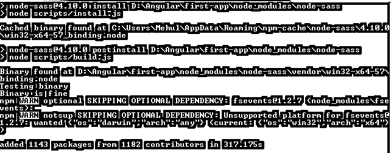

一旦你安装了所有的软件包，这意味着应用程序在磁盘上创建。

**第 15 步:**在命令提示符下输入“ng–version”命令，按回车键找到角度版本

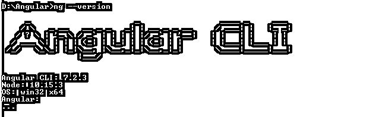

**步骤 16:** 现在输入命令“cd first-app”进入 app 目录或文件夹。

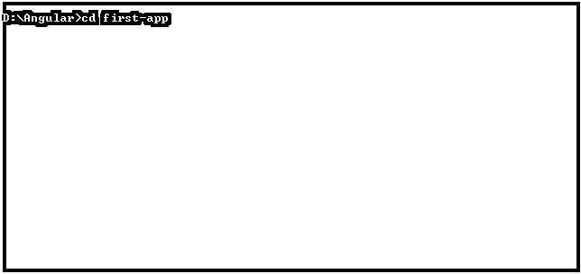

**第十七步:**最后，创建“第一个 App”Angular App；现在输入命令“ng serve”。

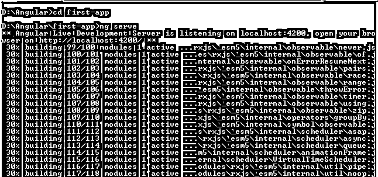

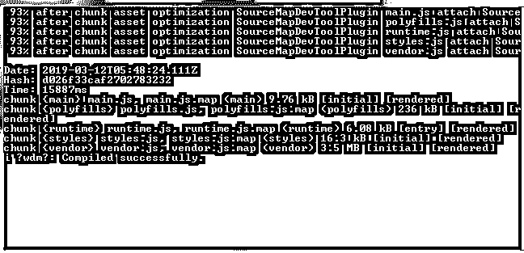

**第十八步:**现在，打开浏览器，在地址栏输入 http://localhost:4200，回车，在浏览器中运行第一个应用 Angular app。

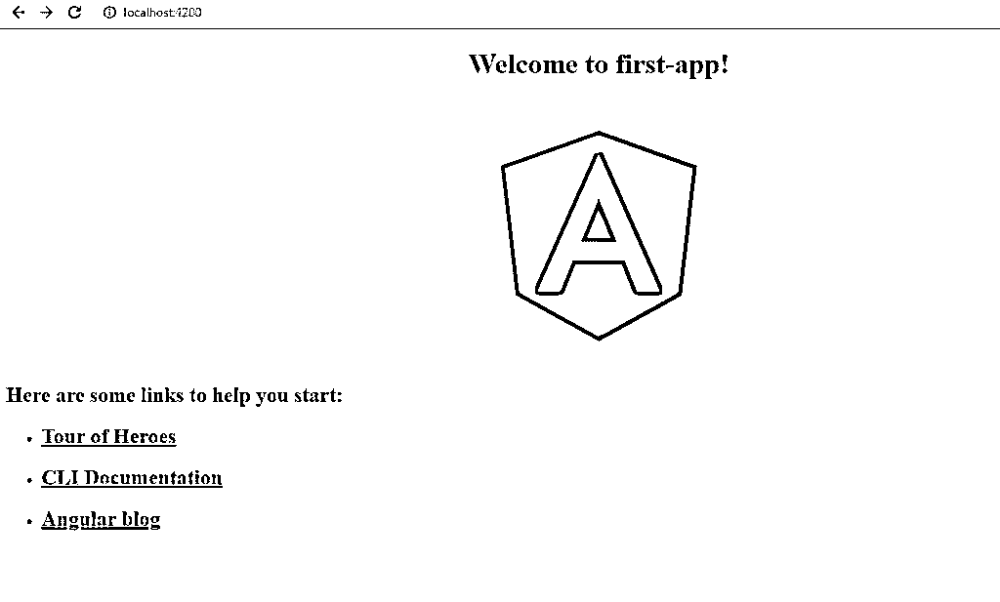

### 推荐文章

这是安装 Angular 2 的指南。这里我们讨论了 Angular 2 的主要特性以及安装 Angular 2 的不同步骤。您也可以阅读以下文章，了解更多信息——

1.  [棱角 2 小抄](https://www.educba.com/angular-2-cheat-sheet/)
2.  [棱角 2 面试问题](https://www.educba.com/angular-2-interview-questions/)
3.  角度 2 相对于视图 JS
4.  [角度命令](https://www.educba.com/angular-commands/)

