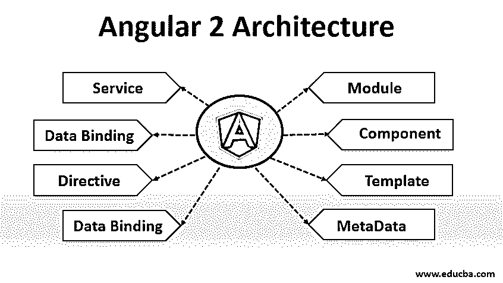
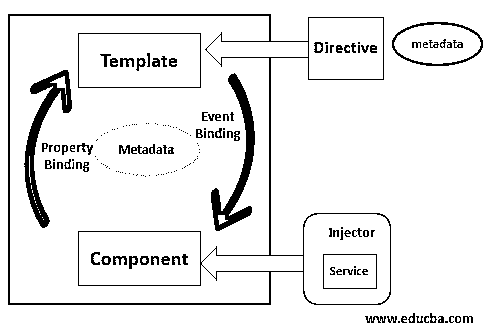

# Angular 2 架构

> 原文：<https://www.educba.com/angular-2-architecture/>




## Angular 2 架构简介

下面的文章详细介绍了 angular 2 架构。Angular 是用打字稿写的。它有一个非常不同的项目结构，与 angular 以前的版本相比，我们可以说完全不同。它是一个用 typescript 和 html 构建或设计客户端界面的平台。这可以分开我们的逻辑也可以遵循面向对象编程。所以 angular 2+版本结构良好，标准化，为开发人员提供了更多的可读性。

### 带图表的前 8 个 Angular 2 架构

角度应用的基本块是一个模块，它包含各种对象作为一个数组。它还包含引导模块，应用程序流将从该模块开始。

<small>网页开发、编程语言、软件测试&其他</small>




有角度的建筑基本上包含八个主要的东西:

*   组件
*   成分
*   模板
*   [计]元数据
*   服务
*   数据绑定
*   指示的
*   [依赖注入](https://www.educba.com/dependency-injection-in-spring/)

#### 1.组件

它基本上是负责执行单一任务的代码块或代码段，它是一个独立的任务。角度应用可以包含任意数量的模块。我们也可以将这些模块以类的形式导出。角度应用程序应该至少有一个模块。模块类必须用以下批注来修饰，即@NgModule 它采用元数据对象。

它有许多特性，如下所述。

*   **声明:**用于声明属于当前模块的视图类。我的 angular 提供了三种类型的类，即组件、管道和指令。在这里，我们定义了我们的自定义组件。
*   **导入:**用于导入其他模块，以便在现有模块中使用。那可以是任何东西。
*   **提供者:**这些用来创建服务，它们可以关联到应用程序的任何部分。
*   **Bootstrap:** 根模块必须设置这个属性，它将托管所有其他模块。

**举例:**

```
import { FormsModule } from '@angular/forms';
import { HttpModule } from '@angular/http';
import { DialogOverviewExampleDialog } from './app.component.dialog';
import { BookService } from './book.service';
@NgModule({
declarations: [
AppComponent,
DialogOverviewExampleDialog
],
imports: [
BrowserModule,
AppRoutingModule,
HttpModule
],
providers: [BookService],
bootstrap: [AppComponent]
})
export class AppModule { }
```

#### 2.成分

组件是一个包含应用程序的核心业务逻辑的类。它包含了这个类被调用时将要显示的模板。它还包含该模板的相应 css。同样，它包含从服务器读取数据并将其呈现到模板或显示器的服务。该组件通过 API 的方法和属性与模板进行交互。

对于类，mush 上有@Component 注释。这还包含各种属性，如:

*   选择器:我们需要为此指定一个唯一的名称。哪个将作为这个 html 页面的唯一标签？
*   **templateUrl:** 你要渲染的 html 的路径。
*   **styleUrls:** 是一个数组 css 文件路径。
*   **供应商:**如果我们有的话。

**举例:**

```
import { Component } from '@angular/core';
import { BookService } from './book.service';
@Component({
selector: 'app-root',
templateUrl: './app.component.html',
styleUrls: ['./app.component.css']
})
export class AppComponent
```

#### 3.[计]元数据

在 angular 中，我们可以使用装饰器来定义元数据。例如，如果我们在 angular 中制作任何组件，但是 angular 如何将它标识为组件？我们需要使用 annotation @Component 来告诉它。

#### 4.模板

模板是我们想要显示的 HTML。这是一个简单的 HTML 页面，向用户显示数据。

**举例:**

下面是一个一起实现元数据和模板的例子。

```
@Component({
selector: 'app-root',
templateUrl: './app.component.html',
styleUrls: ['./app.component.css']
})
```

#### 5.数据绑定

数据绑定是角度架构的主要组成部分。它允许我们在组件和模板之间进行通信，这对于以数据的形式向用户呈现我们的业务逻辑是非常必要的。angular 2 提供了四种类型的数据绑定。

**插值:**用于显示模板或视图的组件属性。为此，我们使用双花括号。我们可以用它来显示任何东西，如字符串、数字、数组等。

**举例:**

```
{{ your_property_name }}
class AppComponent
{
name: string;
object: any;
}
{{ name }}
{{ object.roll_number }}
```

**属性绑定:**属性绑定允许我们直接访问 HTML 的元素属性。我们可以直接将变量赋给 HTML 元素。

**举例:**

```
[value]="demo"
```

在这里，我们使用属性绑定直接将 demo 赋值。

**事件绑定:**这个绑定使用事件来绑定值。我们有各种可用的事件，例如点击。

**举例:**

```
(cilck) = "methodName($event)"
```

它使用括号，后跟您要调用的函数名。在被调用的函数中，我们可以编写我们的逻辑。

**双向绑定:**这基本上是属性绑定和事件绑定的结合。其中我们可以同时调用我们的方法并将值绑定到元素属性。

**举例:**

```
<input [(ngModel)]="username">
<p>Hello {{username}}!</p>
```

#### 6.服务

它是一个可注入的类，用于在不同的类或应用程序之间共享数据。它还负责调用服务器并获取要显示的数据。任何用@ Injectable 注释并进行服务器调用的类都可以被认为是服务。

**举例:**

```
import { Injectable } from '@angular/core';
import { Headers, Http, RequestOptions } from '@angular/http';
@Injectable()
export class BookService {}
```

#### 7.指示的

它们为 DOM 元素提供了一种特殊的行为。它们是扩展的 HTML 属性。

*   **Decorator 指令:**有很多像 ngModel、ngFor、ngIF 等内置指令。angular 提供了许多内置指令。
*   组件指令:它是@指令的扩展，具有面向模板的特性。
*   **模板指令:**也称结构指令。[它将 HTML 转换成可重复使用的](https://www.educba.com/html-events/)模板。

#### 8.依赖注入

依赖注入在许多框架中使用。它是一种用于解决依赖性问题的设计模式。

在这里，我们将对象作为依赖项传递。它使我们的应用程序松散耦合，使我们的模块相互独立。通过使用依赖注入，我们使我们的应用程序可读、松散耦合、可测试、可重用和可维护。

### 结论

所以 angular 2 +版本都是基于 typescript 来满足 [ES6 规格](https://www.educba.com/what-is-es6/)。其中有一个组件是模块的一部分。通过使用 angular2 结构，我们可以将我们的应用程序分成小的 sun 组件。

### 推荐文章

这是 Angular 2 架构的指南。在这里，我们讨论了前 8 个 Angular 2 架构，包括模块、组件、模板等，并给出了相应的例子。您也可以浏览我们推荐的其他文章，了解更多信息——

1.  [角度基础](https://www.educba.com/angularjs-events/)
2.  [AngularJS 架构](https://www.educba.com/angularjs-architecture/)
3.  [角度命令](https://www.educba.com/angular-commands/)
4.  [角度 2 指令](https://www.educba.com/angular-2-directives/)


