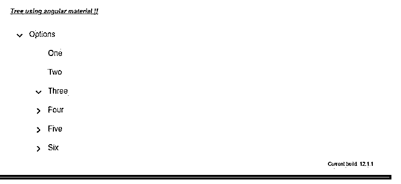

# 有角材料树

> 原文：<https://www.educba.com/angular-material-tree/>

## 角材料树简介

Angular material 为我们提供了创建树的方法，树是我们数据的结构化数据表示。这样，我们可以只在一个标签中表示列表或公共值集。在此之前，我们有 cdk-tree，它使我们能够创建这种类型的结构，material directive 建立在它的基础上，它基本上为我们提供了两种类型的树结构，一种是平面的，另一种是嵌套的，平面的可以很容易地查看，因为它们只在一个级别上，但是嵌套的可以有很多列表。棱角分明的材质也为我们提供了默认的风格和设计。在这里，我们将详细了解如何在我们的应用程序中使用 angular material 来创建这种嵌套的平面类型树，以使 UI 与用户更具交互性，并使其实现更清晰。

### 角度材料树的语法

下面给出了素材库中树的语法。

<small>网页开发、编程语言、软件测试&其他</small>

`<cdk-tree-node></cdk-tree-node>: this tag is used to get the leaf node`

`<cdk-tree-node></cdk-tree-node>: This tag is used to create the expandable nodes.`

为了正确运行这个树结构，我们将不得不详细查看需要进行的配置。此外，我们需要有这个库在项目中使用的大量编码。例如，我们将参考角材料文档。

### 如何在有角的材质中创建树？

现在我们已经知道，要使用材质创建树结构，我们需要使用 cdk-tree，因为它只建立在材质之上，它还支持两种类型的树结构，一种是平面树，另一种是嵌套树。

在这里，我们将看到实现这一点所需的所有配置。

#### 1.CdkTreeModule

这是我们需要导入到根模块或任何我们想要显示树的子模块中的模块，请参考下面的代码，并将其复制到您的根模块中。

**举例:**

`import {CdkTreeModule} from '@angular/cdk/tree';`

#### 2.嵌套树节点

它是 cdk-node 的子节点，如果你想在父节点上创建子节点，同时也是一个列表的列表的嵌套结构，那么我们可以利用这个指令，标签' cdk-nested-tree-node '可以用来在父节点中创建这种类型的结构。

3.它具有下面提到的一些特性:

*   **等级:**代表我们拥有的等级数。
*   **isExpanded:** 取一个 Boolean 作为父节点是否有子节点的值来表示。
*   **数据:**我们要展示的是数据本身。

最初为了加快我们的角材料项目需要采取的步骤。

1.首先安装 angular CLI，它使我们能够下载项目所需的包和库。您可以通过在命令中键入以下命令来下载它，以确保您已经安装了该节点。

**举例:**

`npm install -g @angular/cli)`

上述命令将在我们的系统中全局安装 CLI，因此我们可以在需要时全局使用它。

2.现在，在这一步中，我们将尝试从头开始创建新的 angular 项目，该项目不是一个材质项目，我们稍后必须通过在项目中安装材质依赖来添加它。所以只需在命令提示符下执行下面的命令，然后按回车键。

**举例:**

`ng new your project name
>> ng new my-first-project`

该命令将创建名为 my-first-project 的项目，您可以使用提到的任何名称创建您的项目。

3.只是为了确保尝试下面提到的一个命令，将所有需要的库安装到我们的项目中。

**举例:**

`npm install`

4.现在，您可以通过键入下面提到的简单命令来测试和运行您的项目。这只是为了确保我们在正确的轨道上，我们的项目已经创建，没有任何错误或缺陷。

**举例:**

`ng serve`

5.进入浏览器，尝试使用以下 URL 运行应用程序:

**http://localhps:4200**

默认情况下，angular 项目在端口 4200 上运行，如果需要，您可以根据需要更改它。

6.现在一切都设置好了，我们有了我们的 angular 项目，现在我们将通过在命令提示符下运行下面的命令，将素材库添加到我们的项目中。

**举例:**

`ng add @angular/material`

### 角度材料树示例

下面是提到的例子:

**index.html 代码:**

`<!DOCTYPE html>
<html lang="en">
<head>
<meta charset="utf-8">
<meta name="viewport" content="width=device-width, initial-scale=1.0">
<link href="https://fonts.googleapis.com/icon?family=Material+Icons&display=block" rel="stylesheet">
<title>Demo tree material</title>
</head>
<body class="mat-app-background">
<tree-demo>Loading .. </tree-demo>
Current build: 12.1.1
</body>
</html>`

**module.ts 代码:**

`import {NgModule} from '@angular/core';
import {CdkStepperModule} from '@angular/cdk/stepper';
import {CdkTableModule} from '@angular/cdk/table';
import {CdkTreeModule} from '@angular/cdk/tree';
@NgModule({
exports: [
CdkStepperModule,
CdkTableModule,
CdkTreeModule,
] })
export class DemoMaterialModule {}`

**demo.tree.component.ts 代码:**

`import {ArrayDataSource} from '@angular/cdk/collections';
import {FlatTreeControl} from '@angular/cdk/tree';
import {Component} from '@angular/core';
const MY_TREE_DATA: TreeDemo[] = [
{
name: 'Options',
expandable: true,
level: 0,
}, {
name: 'One',
expandable: false,
level: 1,
}, {
name: 'Two',
expandable: false,
level: 1,
}, {
name: 'Three',
expandable: true,
level: 1,
}, {
name: 'Four',
expandable: true,
level: 1,
}
, {
name: 'Five',
expandable: true,
level: 1,
}
, {
name: 'Six',
expandable: true,
level: 1,
}
];
interface TreeDemo {
expandable: boolean;
name: string;
level: number;
isExpanded?: boolean;
}
/**
* @title Tree demo using material
*/
@Component({
selector: 'tree-demo',
templateUrl: 'demo.tree.component.html',
styleUrls: ['demo.tree.component.css'],
})
export class DemoTreeMaterial {
treeControl = new FlatTreeControl<TreeDemo>(
node => node.level, node => node.expandable);
dataSource = new ArrayDataSource(MY_TREE_DATA);
hasChild = (_: number, node: TreeDemo) => node.expandable;
getMyParentNode(node: TreeDemo) {
const nodeIndex = MY_TREE_DATA.indexOf(node);
for (let i = nodeIndex - 1; i >= 0; i--) {
if (MY_TREE_DATA[i].level === node.level - 1) {
return MY_TREE_DATA[i];
}
}
return null;
}
shouldRender(node: TreeDemo) {
let parent = this.getMyParentNode(node);
while (parent) {
if (!parent.isExpanded) {
return false;
}
parent = this.getMyParentNode(parent);
}
return true;
}
}`

**demo.tree.component.html 代码:**

`<h5><u><i>Tree using angular material !!</i></u></h5>
<cdk-tree [dataSource]="dataSource" [treeControl]="treeControl">
<cdk-tree-node *cdkTreeNodeDef="let node" cdkTreeNodePadding
[style.display]="shouldRender(node) ? 'flex' : 'none'"
class="example-tree-node">
<button mat-icon-button disabled></button>
{{node.name}}
</cdk-tree-node>
<cdk-tree-node *cdkTreeNodeDef="let node; when: hasChild" cdkTreeNodePadding
[style.display]="shouldRender(node) ? 'flex' : 'none'"
class="example-tree-node">
<button mat-icon-button cdkTreeNodeToggle
[attr.aria-label]="'Toggle ' + node.name"
(click)="node.isExpanded = !node.isExpanded"
[style.visibility]="node.expandable ? 'visible' : 'hidden'">
<mat-icon class="mat-icon-rtl-mirror">
{{treeControl.isExpanded(node) ? 'expand_more' : 'chevron_right'}}
</mat-icon>
</button>
{{node.name}}
</cdk-tree-node>
</cdk-tree>`

**输出:**

### 结论

通过使用它，我们可以以树节点结构的形式表示我们的数据，但是它不是很容易直接使用，我们必须进行配置以便在我们的应用程序中使用它，还需要对 s 和 html 组件进行大量编码，这需要在正确使用它之前对它有基本的了解。

### 推荐文章

这是一个有角材料树的指南。这里我们讨论一下入门，如何在有角的素材中创建树？还有例子。您也可以看看以下文章，了解更多信息–

1.  [AngularJS ng 级](https://www.educba.com/angularjs-ng-class/)
2.  [角度 CLI](https://www.educba.com/angular-cli/)
3.  [角度日期过滤器](https://www.educba.com/angularjs-date-filter/)
4.  [角度 7 形式验证](https://www.educba.com/angular-7-form-validations/)

