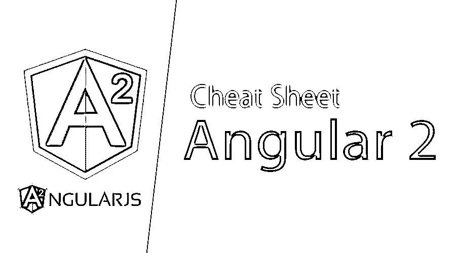

# Angular 2 备忘单

> 原文：<https://www.educba.com/angular-2-cheat-sheet/>

## Angular 2 备忘单介绍

Angular 2 是一个基于 JavaScript 构建的开源框架。它主要用于开发前端 web 应用程序。它是安古拉吉斯的继承者。它是用打字稿写的。它是由谷歌开发的。Angular 2 建立在使用 ES6 的现代 JavaScript 之上。Angular 2 有更好的事件处理能力，强大的模板，更好的支持移动设备和桌面网络应用。它还与移动设备兼容，并跨所有平台，如 Windows、Mac 和 Linux。

Angular 2 具有开发应用程序的关键特性，包括组件、类型脚本和服务。Angular 2 有不同的组件，它们是模块、组件、模板、元数据和服务。组件有助于将应用程序构建到许多模块中，这有助于更长时间地维护应用程序。不同的代码集由服务功能所维护和使用的应用程序的不同模块使用。模块有助于将应用程序分解成一个逻辑块，并编码以执行特定的任务。

<small>网页开发、编程语言、软件测试&其他</small>

### Angular 2 备忘单上的命令和内容

Angular 2 cheat sheet 拥有丰富的库，可升级，可扩展，交互式，并包含许多内置的方法来计算常见的操作。模板、NgModules、内置指令、表单和其他可用配置有不同的语法，如下所示:

| **模板语法** | **描述** |
| <input> | 它将属性“值”绑定到表达式结果“名称” |
|  | 它将属性“角色”绑定到表达式结果“我的角色” |
|  | 当 click 事件被触发时，它将调用 read Text 方法。 |
|  | 它将属性绑定到插值字符串 |
| 你好{ {我的名字}} | 它将上下文绑定到插值字符串 |
|  | 它建立了双向绑定。 |
| … | * symbol 将当前元素转换为嵌入的 temp。 |
| 学生:{ {学生？.sname}} | ?是导航操作符告诉学生字段是可选的 |
|  | 它绑定样式属性 width 来表示结果 mysize。 |
| <video #movieplayer …> | 用于模板中的数据绑定和事件绑定表达式。 |
| 车号:{ { vehicle number &#124; myCarNuFormat } } | 它通过管道 mycarNuformat 转换车辆编号的当前值。 |
|  | 它消除了 HTML 组件中元素的歧义 |
|  | 它将类的存在绑定在真理表达上。 |

**Ngmodule:–**不同的 ng module 指令有:

| **指令** | **描述** |
| @ ng module({声明..}) | 它定义了一个包含指令等的模块。 |
| 声明:[MyRedComponent，MyBlueComponent，MyDatePipe] | 它将告诉属于这个模块的组件、指令和管道的列表。 |
| 导出:[MyRedComponent，MyDatePipe] | 它将列出可见的组件和管道以导入该模块 |
| 导入:[BrowserModule，SomeOtherModule] | 它将列出要导入到该模块中的模块 |
| 提供者:[MyService，{ provide: … }] | 它提供了对模块内容可见的依赖注入提供者的列表 |
| entry components:[某个组件，其他组件] | 它将提供可到达模板中未引用的组件列表。 |

还有其他可用的指令、组件变更检测和生命周期挂钩，它们可以作为类方法来实现，如下所示:

| **指令** | **描述** |
| 构造函数(myService: MyService，…) { … } | 它用于注入依赖关系。 |
| ngOnChanges(changeRecord) { … } | 它在每次更改输入属性之后、处理内容或子视图之前被调用 |
| ngOnInit() { … } | 它在构造函数和初始化属性之后被调用 |
| ngDoCheck() { … } | 每次检查组件或指令的属性时都会调用它。它用于扩展执行海关检查。 |
| ngAfterContentInit() { … } | 当组件或指令内容已经初始化时，在 ngOninit 之后调用它。 |
| ngAfterContentChecked() { … } | 每次检查组件或指令的内容后都会调用它。 |
| ngafterviewit(){…} | 当组件视图和子视图指令已经初始化时，在 ngaftercontentint 之后调用它。 |
| ngAfterViewChecked() { … } | 在每次检查该指令所在的组件视图和子视图后，都会调用它。 |
| ngOnDestroy() { … } | 在销毁实例之前，它被调用一次。 |

### 使用 Angular 2 备忘单命令的免费提示和技巧

1.  在 Angular2 备忘单中，platformBrowserDynamic()。bootstrap module(app module)；使用指定的根 can 组件帮助引导应用程序。
2.  在 Angular2 中，bootstrap: [MyAppComponent]将在引导该模块时列出要引导的组件。
3.  这是 angualr2 中的内置指令，用于根据表达式删除或重新创建 Dom 树的一部分。

4.  它将列表元素及其内容转换成模板，并用于实例化列表中每一项的视图。
5.  该指令用于根据表达式值或简单的词语(如 oops 中的 switch case)来选择模板。
6.  ，这些指令允许你使用 CSS 给一个 [HTML 元素](https://www.educba.com/cheat-sheet-html/)分配样式，并且这个 [CSS](https://www.educba.com/uses-of-css/) 可以被直接访问。
7.  该指令将元素上的 CSS 类绑定到可信映射值。
8.  该指令为表单控件提供了双向绑定、解析和验证。
9.  选择器:'。' cool-button:not(a)'这是指令配置，指定了在模板中标识该指令的 [CSS 选择器](https://www.educba.com/types-of-css-selectors/)。它不支持父子选择器。
10.  *pro* viders: [MyService，{ provide: … }]为指令和子级提供依赖注入提供者列表。
11.  { provide: MyService，useClass: MyMockService }它将为类设置或覆盖服务的提供程序。
12.  {提供:我的值，使用值:4 }它会将提供者值设置或覆盖为 4

### 结论

Angular 2 备忘单有许多功能和不同的指令，模块可用于开发，这有助于使应用程序更具交互性，便于用户和开发人员跟踪问题和功能。它是广泛的，可重复用于其他应用程序。Angular2 的[使用了与 AngularJS 早期版本完全不同的类型脚本](https://www.educba.com/typescript-interview-questions/)。

angular 2 备忘单更容易学习，因为它的学习曲线对初学者和学生来说都是简单而直接的。使用 angular 进行开发时，JavaScript 知识将是一个优势。重新掌握自己的技能总是好的。

### 推荐文章

这是 Angular 2 备忘单的指南。在这里，我们已经讨论了 Angular 2 备忘单的内容和命令以及免费提示和技巧。您也可以阅读以下文章，了解更多信息——

1.  [备忘单 JQuery](https://www.educba.com/cheat-sheet-jquery/)
2.  [角度 2 分量](https://www.educba.com/angular-2-components/)
3.  [Angular 2 架构](https://www.educba.com/angular-2-architecture/)
4.  [棱角 2 面试问题](https://www.educba.com/angular-2-interview-questions/)

