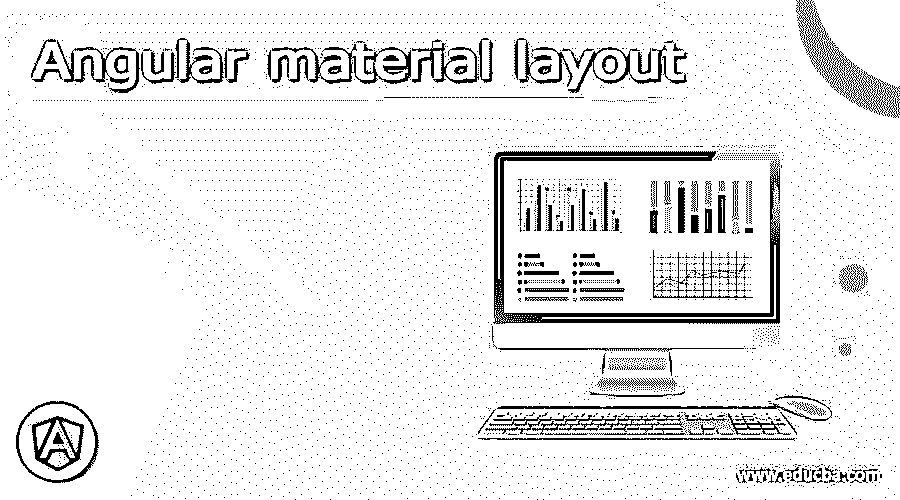
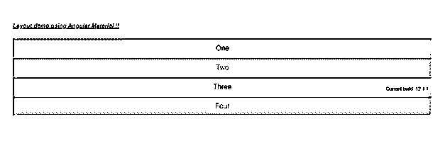

# 有角度的材料布局

> 原文：<https://www.educba.com/angular-material-layout/>




## 角度材料布局介绍

棱角分明的材料提供了一个布局，在里面创造我们的组件；布局基本上是一个指令，它有助于为其子节点显示或表示布局。我们基本上有两种布局:flex 和 grid 角度材料为我们提供了一个内置模块和指令，在我们的应用中创建这种布局。我们都知道网格布局，通过使用一些配置，它也很容易创建。我们也有一些用于分配布局值的属性，主要是“行”和“列”；我们可以将这个参数设置为某个值。此外，我们可以通过使用提供的布局属性来使布局具有响应性。在本教程的下一节中，我们将更仔细地看看实现，以及为了正确运行我们的应用程序需要做哪些更改，并为初学者提供详细的示例。

**语法**

<small>网页开发、编程语言、软件测试&其他</small>

正如我们所知道的，布局为我们提供了许多与 HTML 标签一起使用的属性，这使得它们具有响应性；在这一节中，我们将仔细研究“行”和“列”的语法。让我们开始吧；

```
<div layout = "row" layout-xs = "column">
// define your component
</div>
<div layout = "column" layout-xs = "column">
// define your component
</div>
```

正如你在上面的语法中看到的，我们正在尝试使用“layout-xs”，这是 angular material 中布局 API 的属性之一。在本教程的下一节中，我们将更详细地研究这个布局的实现，以便更加清晰和理解。

### 如何在有角度的素材中使用布局？

现在我们已经对材料中的布局有了了解；它用于使我们的应用程序具有响应性；响应式意味着应用程序 UI 在所有设备屏幕上看起来都一样。在 material 中，我们有 layout API，它为我们提供了许多准备，我们可以用它来设置组件的宽度和高度。基本上，我们有两个布局组件，我们将在本教程中经常使用；让我们仔细看看它们中的每一个，见下文；

1) **列**:通过使用这个，我们可以垂直排列我们的项目，默认情况下它们的最大宽度为 100%；此外，高度将类似于我们在容器中的项目。

2) **row** :通过使用这个，我们可以水平排列项目，默认情况下，它们的最大高度为 100%，宽度取决于容器中的项目。

现在我们将仔细看看布局 API 提供的不同类型的属性；为了让页面有反应，我们开始吧；

1) **layout-xs** :用于设置组件的宽度，小于 600 px。

2) **layout-gt-xs** :用于设置组件的宽度，大于等于 600 px。

3) **布局**:用于设置默认布局。

4) **layout-xl** :设置默认宽度大于等于 1920px 的布局。

5) **layout-gt-lg** :这将设置默认宽度大于等于 1920px 的布局。

6) **布局-lg** :用于设置宽度在 1280 到 1920px 之间的布局。

7) **布局-gt-md** :用于设置宽度大于等于 1280 px 的布局。

8) **布局-md** :用于设置宽度在 960-1280 px 之间的布局。

9) **布局-sm** :用于设置宽度在 600-960 px 之间的布局。

10) **layout-gt-sm** :用于设置宽度大于等于 960 px 的布局。

现在，让我们从需要采取的步骤开始，以便为初学者初步加强我们的角度材料项目；见下文；

1)首先，安装 Angular CLI，它使我们能够下载项目所需的包和库。您可以通过在命令上键入以下命令来下载它，请确保您已经安装了 node，见下文；

**例如:**

npm install -g @angular/cli)以上命令将在我们的系统中全局安装 CLI；因此，我们可以在需要时全局使用它。

3)现在，在这一步中，我们将尝试从头开始创建新的 angular 项目；这个项目将不是一个材料项目，我们必须通过在我们的项目中安装材料依赖关系来添加它。所以只需在你的命令提示符下执行下面的命令，并按回车键见下文；

**语法:**

```
ng new your project name
```

**例如:**

```
ng new my-first-project
```

此命令将创建名为 my-first-project 的项目；您可以用提到的任何名称创建您的项目。

4)为了确保万无一失，请尝试下面提到的一个命令，将所有需要的库安装到我们的项目中，

**例如:**

```
npm install
```

5)现在，您可以通过键入下面提到的简单命令来测试和运行您的项目。这只是为了确保我们在正确的轨道上，并且我们的项目没有任何错误或缺陷。

**例如:**

```
ng serve
```

6)进入浏览器，尝试使用以下 URL 运行应用程序:

**例如:**

```
http://localhps:4200
```

默认情况下，angular 项目运行在端口 4200 上；如果需要，您可以根据自己的需要进行更改。

7)现在一切都设置好了，我们有了我们的 angular 项目，现在我们只要在命令提示符下运行下面的命令，就可以将素材库添加到我们的项目中；

**例如:**

```
ng add @angular/material
```

### 角形材料布局示例

1) demo.layout.component.ts 代码

```
<h5><u><i>Layout demo using Angular Material !!</i></u></h5>
<div id = "layoutContainer"
style = "height:100px;" >
<div layout = "row" layout-xs = "column">
<div flex class = "yellow compo">One</div>
<div flex = "20" class = "grey compo">Two</div>
</div>
<div layout = "column" layout-xs = "column">
<div flex = "33" class = "yellow compo">Three</div>
<div flex = "66" class = "grey compo">Four</div>
</div>
</div>
```

2) demo.layout.component.css 代码:

```
mat-grid-tile {
background: rgb(13, 91, 117);
}
.compo {
color:rgb(21, 9, 192);
padding:10px;
text-align:center;
border-style: inset;
}
.yellow {
background:rgb(238, 208, 111);
}
.grey {
background:rgb(191, 191, 207);
}
```

**输出:**




### 结论

通过使用这一点，我们可以很容易地将我们的页面或用户界面分成任意数量的小容器，这些容器可以包含任何数据或组件；这个组件将被称为布局的子组件，这是易于使用，处理和维护的开发人员，因此建议有，也提供了其他屏幕大小的响应屏幕，而无需对代码进行大量更改。

### 推荐文章

这是一个有角度的材料布局指南。在这里，我们讨论如何使用角度材料的布局，以及例子和输出。您也可以看看以下文章，了解更多信息–

1.  [有棱角的材料图标](https://www.educba.com/angular-material-icons/)
2.  [角度 CLI](https://www.educba.com/angular-cli/)
3.  [角的 ng-if](https://www.educba.com/angularjs-ng-if/)
4.  [角的 ng 模型](https://www.educba.com/angularjs-ng-model/)


