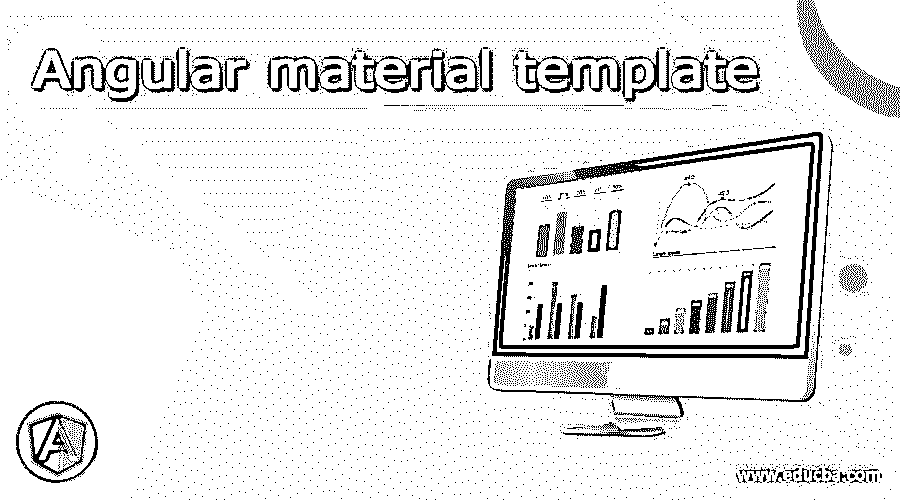
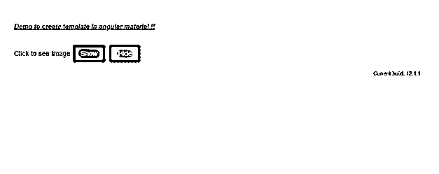
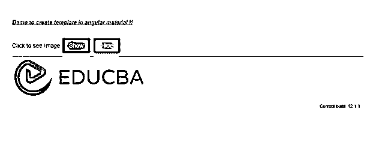

# 角形材料模板

> 原文：<https://www.educba.com/angular-material-template/>




## 角度材料模板介绍

Angular material 为我们提供了一种使用素材库标签和模块创建模板的简单方法。模板只不过是我们为应用程序创建的 HTML 页面。在模板内部，我们可以使用任何素材库模块标签，这对创建和设计我们的模板很有价值。但是为了使用它，该模块应该存在于根模块文件中。要创建我们自己的模板，我们可以简单地创建 html 文件并在其中编写代码；该材料将为我们提供默认的风格和设计，使我们的应用程序看起来更加用户友好，通过使用不同的材料模块来创建模板，我们可以使开发非常快，因为它已经建成，我们只需根据我们的需要使用。在本教程的下一节中，我们将更仔细地研究它的实现。

**语法**

<small>网页开发、编程语言、软件测试&其他</small>

正如我们已经知道，模板可以很容易地在素材库中创建；我们可以使用构建模块中的任何材料来执行所需的操作；让我们仔细看看创建它的语法，见下文；

**demo . temp . component . html:**

```
<mat-card>Simple card</mat-card>
```

如您所见，我们正在尝试使用素材库创建模板，并尝试使用它的一个组件“mat-card”。这样一来；我们可以使用里面任何可用的组件。此外，除此之外，我们还可以编写自己的代码。

### 如何在角材中创建模板？

我们可以使用素材库模块轻松创建模板。这一节将会看到如何在模板中使用不同的组件来创建和设计我们的第一个使用素材库的模板。首先，我们来看看为什么需要它；为了创建和使用组件，我们必须在根模块文件中有所需的模块；让我们来看看在 angular 中使用下面的材料创建模板所需的步骤；

1)在您的项目中创建一个. html 到 hml 文件；在这之后，我们可以把它放在里面来设计我们的模板；在这一节中，我们将不得不看看这个简单的文件，它将帮助我们得到一个更好的想法，见下文；

**例如:**

```
<button mat-flat-button color="primary">Hello</button>
<button mat-flat-button color="accent">world</button>
```

在上面的例子中，我们使用了 cerate 并在 temple 中使用了“button ”,但是为了这个目的，我们必须有一个来自 material 的按钮模块，以便使用标签时没有任何错误，并且能够看到 angular 素材库提供的样式和动画。这样，我们可以使用模板中的任何组件来创建它。

按照以下步骤使用素材库在 angular 中创建一个示例项目，之后我们将能够创建模板，并能够使用构建模块中的素材库来创建我们的模板；让我们陈述如下:

*   将 angular CLI 全局下载到您的 windows 计算机中；遵循下面的命令。此外，它将帮助我们直接安装任何角度依赖。

**例如:**

```
npm install -g @angular/cli)
```

3)现在我们可以使用 CLI 创建我们的第一个 angular 项目，在命令提示符下执行下面的命令，在这里你可以指定你的项目的名称，你可以使用任何名称见下面的命令为 windows 提供项目名称；

**例如:**

```
ng new your project name
>> ng new my-first-project
```

您可以通过转到执行命令的指定项目位置来检查项目。

4)创建项目后，我们无法看到角度依赖性，直到我们运行以下命令；它将为我们创建并安装所需的依赖项，在命令提示符下执行以下命令；

**例如:**

```
npm install
```

5)现在使用下面的命令运行应用程序，它将为我们启动服务器，之后，我们可以测试我们的应用程序，如果您在运行它时在命令提示符上看到任何错误；

**例如:**

```
ng serve
```

6)默认在 4200 上运行，在浏览器上键入以下 URL 来测试您的应用程序，见下文；

**例如:**

```
http://localhps:4200
```

7)安装素材库以便在应用程序中使用，然后创建模板

**例如:**

```
ng add @angular/material
```

现在，我们准备使用材料库创建模板。我们已经提到了在应用程序中创建模板的步骤。

### 角形材料模板示例

使用素材库组件的插入符号模板的示例，为了演示的目的，我们使用按钮组件来隐藏和显示“图像”。

1)印度. html 代码:

```
<!DOCTYPE html>
<html lang="en">
<head>
<meta charset="utf-8">
<meta name="viewport" content="width=device-width, initial-scale=1.0">
<link href="https://fonts.googleapis.com/icon?family=Material+Icons&display=block" rel="stylesheet">
<title>demo template</title>
</head>
<body class="mat-app-background">
<demo-temp>Loading ..</demo-temp>
Current build: 12.1.1
</body>
</html>
```

**2) module.ts 代码:**

```
import {NgModule} from '@angular/core';
import {MatButtonModule} from '@angular/material/button';
@NgModule({
exports: [
MatButtonModule,
]
})
export class TemplateDemoMaterial {}
```

//在此包含所有必需的模块，以便在应用程序中使用它们来创建模板而不出错。

**3) demo.temp.component.ts 代码:**

```
import {Component} from '@angular/core';
/**
* @title demo template
*/
@Component({
selector: demo-temp',
templateUrl: 'demo.temp.componen.html',
styleUrls: ['demo.temp.componen.css'],
})
export class DemoTemplate {
imgshow: boolean = false;
show(){
this.imgshow = true;
}
hide(){
this.imgshow = false;
}
}
```

**4)demo.temp.component.html 代码:**

```
<h5><u><i> Demo to create template in angular material !! </i></u></h5>

<div class="example-label">Click to see Image</div>
<div class="example-button-row">
<button mat-raised-button color="primary" (click)= "show()">Show </button>
<button mat-raised-button color="accent" (click)= "hide()">Hide</button>
</div>

<mat-divider></mat-divider>
<div *ngIf="imgshow">

</div>
```

**输出:**

**之前点击:**




**点击后:**




### 结论

通过使用模板，我们可以设计我们的应用程序并在 UI 上看到一些东西。该模板负责显示数据并让用户对其执行任何操作。它与 ts 文件交互并在 UI 上显示数据。因此，在我们编写所有逻辑的地方创建和维护是非常容易的。

### 推荐文章

这是一个有角度的材料模板指南。在这里，我们讨论如何创建一个有角度的材料模板以及例子和输出。您也可以看看以下文章，了解更多信息–

1.  [有棱角的材料图标](https://www.educba.com/angular-material-icons/)
2.  [角度 CLI](https://www.educba.com/angular-cli/)
3.  [角度 7 形式验证](https://www.educba.com/angular-7-form-validations/)
4.  [角的 ng-if](https://www.educba.com/angularjs-ng-if/)


