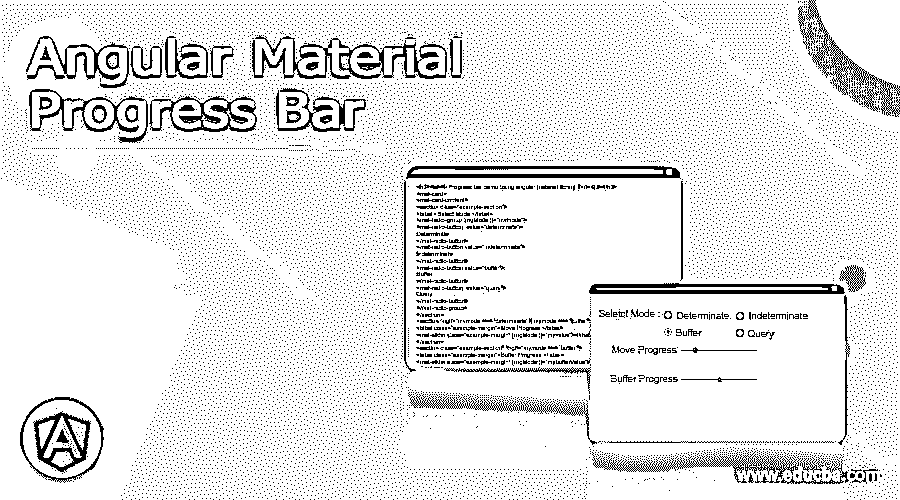
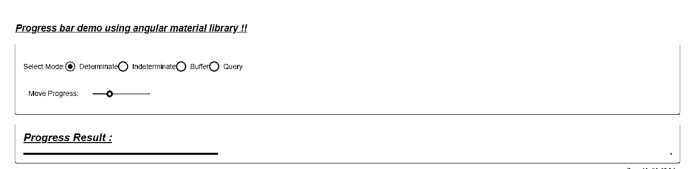
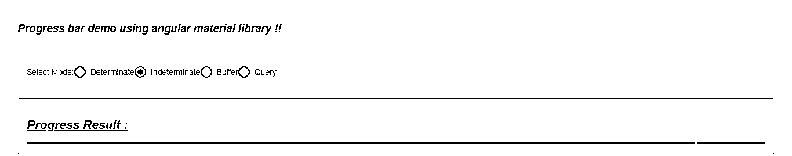
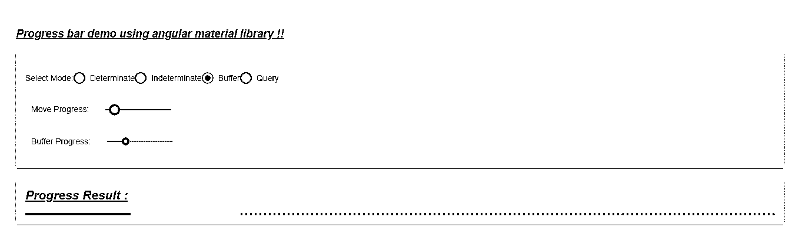
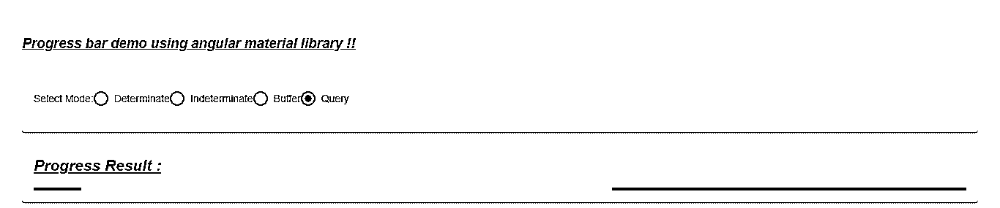

# 角度材料进度条

> 原文：<https://www.educba.com/angular-material-progress-bar/>

## 角度材料进度条的定义

Angular material 为我们提供了进度条，帮助我们跟踪活动，这意味着它告诉我们特定活动的进度。我们将用一些颜色填充该条，以跟踪任务的活动。通过在进度条中添加默认样式和设计，棱角分明的材质使其更具吸引力和用户友好性。此外，我们可以使用素材库提供的内置模块和指令来使用和实现它。为了使用它，我们将对 angular 应用程序进行一些配置，为了更好地理解和清楚起见，我们将在下一节详细介绍这些配置。

**语法:**

<small>网页开发、编程语言、软件测试&其他</small>

在这一节中，我们将更详细地了解它的语法，我们基本上使用了 angular material 本身提供的指令，所以让我们从细节开始吧

`<mat-progress-bar mode="your_mode" value="your_value"></mat-progress-bar>`

正如你所看到的，我们正在尝试使用“mat-progress-bar”来创建进度条，我们还必须指定进度条的模式，为了更好地理解，我们将详细讨论这一部分。

### 如何在有角度的素材中创建进度条？

到目前为止，我们已经知道，通过使用有角度的材料进度条，我们可以很容易地向用户指定任务或活动的进度。这有助于用户指定完成任务需要多少时间，也使用户的等待过程变得有点互动，他们也知道该过程需要时间来完成，并且它是在后台发生的。在素材库中，我们有内置模块，可以帮助我们轻松创建进度条，所以让我们开始吧；

#### 1.MatProgressBarModule

这个模块是由素材库提供的，素材库有助于轻松快速地创建进度条。我们需要将它导入到我们的根模块或任何想要创建进度条的子模块中。请参考下面的代码；

**举例:**

`import {MatProgressBarModule} from '@angular/material/progress-bar';`

在根模块类中使用上面的代码。

#### 2.mat 进度条

现在我们有了这个选择器，就是“mat-progress-bar ”,为什么在 HTML 或模板上使用这个标签，我们可以根据需要呈现进度条。Belo 查看使用它的示例代码片段，在此之前让我们仔细看看进度条的不同类型的模式细节；

1.  a)确定
2.  b)不确定
3.  c)缓冲器
4.  d)查询

现在，让我们从需要采取的步骤开始，以便为初学者初步加强我们的角度材料项目，见下文；

*   首先，安装 angular CLI，它使我们能够下载项目所需的包和库。您可以通过在命令上键入以下命令来下载它，请确保您已经安装了 node，见下文；

**举例:**

`npm install -g @angular/cli)`

上述命令将在我们的系统中全局安装 CLI，因此我们可以在需要时全局使用它。

*   现在，在这一步中，我们将尝试从头开始创建新的 angular 项目，该项目将不是一个材质项目，我们稍后必须通过在项目中安装材质依赖项来添加该项目。因此，只需在您的命令提示符下执行下面的命令，并按回车键，见下文；

**举例:**

`ng new your project name
>> ng new my-first-project`

该命令将创建名为 my-first-project 的项目，您可以使用提到的任何名称创建您的项目。

*   为了确保尝试下面提到的一个命令，将所有需要的库安装到我们的项目中，

**举例:**

`npm install`

*   现在，您可以通过键入下面提到的简单命令来测试和运行您的项目。这只是为了确保我们在正确的轨道上，我们的项目已经创建，没有任何错误或缺陷。

**举例:**

`ng serve`

*   进入浏览器，尝试使用以下 URL 运行应用程序:

**举例:**

http://localhps:4200

默认情况下，angular project 在端口 4200 上运行，如果需要，您可以根据需要进行更改。

*   现在一切都设置好了，我们有了我们的 angular 项目，现在我们只要在命令提示符下运行下面的命令，就可以将素材库添加到我们的项目中；

**举例:**

`ng add @angular/material`

### 角度材料进度条示例

有角度的材料进度条示例如下:

**1。demo.progress.component.ts 代码:**

`import {Component} from '@angular/core';
import {ThemePalette} from '@angular/material/core';
import {ProgressBarMode} from '@angular/material/progress-bar';
/**
* @title demo porgress bar
*/
@Component({
selector: 'progress-bar-demo',
templateUrl: 'demo.progress.component.html',
styleUrls: ['demo.progress.component.css'],
})
export class DemoProgressBar {
color: ThemePalette = 'primary';
mymode: ProgressBarMode = 'determinate';
myvalue = 30;
mybufferValue = 56;
}`

**2。demo.porgress.component.html 代码:**

`<h3><u><i>Progress bar demo using angular material library !!</i></u></h3>
<mat-card>
<mat-card-content>

<label >Select Mode:</label>
<mat-radio-group [(ngModel)]="mymode">
<mat-radio-button  value="determinate">
Determinate
</mat-radio-button>
<mat-radio-button value="indeterminate">
Indeterminate
</mat-radio-button>
<mat-radio-button value="buffer">
Buffer
</mat-radio-button>
<mat-radio-button  value="query">
Query
</mat-radio-button>
</mat-radio-group>

<label class="example-margin">Move Progress:</label>
<mat-slider class="example-margin" [(ngModel)]="myvalue"></mat-slider>

<label class="example-margin">Buffer Progress:</label>
<mat-slider class="example-margin" [(ngModel)]="mybufferValue"></mat-slider>

</mat-card-content>
</mat-card>
 
<mat-card>
<mat-card-content>
<h2><u><i>Progress Result : </i></u></h2>

<mat-progress-bar
[color]="color"
[mode]="mymode"
[value]="myvalue"
[bufferValue]="mybufferValue">
</mat-progress-bar>

</mat-card-content>
</mat-card>`

**3。module.ts 代码:**

`import {NgModule} from '@angular/core';
import {MatProgressBarModule} from '@angular/material/progress-bar';
import {MatProgressSpinnerModule} from '@angular/material/progress-spinner';
@NgModule({
exports: [
MatProgressBarModule,
MatProgressSpinnerModule,
] })
export class DemoProgressBarModule {}`

**4。index.html 代码:**

`<!DOCTYPE html>
<html lang="en">
<head>
<meta charset="utf-8">
<meta name="viewport" content="width=device-width, initial-scale=1.0">
<link href="https://fonts.googleapis.com/icon?family=Material+Icons&display=block" rel="stylesheet">
<title>Demo progress bar</title>
</head>
<body class="mat-app-background">
<progress-bar-demo>Loading..</progress-bar-demo>
Current build: 12.1.1
</body>
</html>`

每种模式的输出:

**确定性模式:**

不确定模式:

**缓冲模式:**

**查询方式:**

### 结论

正如我们已经讨论了进度条的用法和实现，该材料使我们很容易实现。此外，我们只需指定正确的模块并导入它，然后直接在模板上使用 tis。它易于开发人员使用、实现和维护。

### 推荐文章

这是一个有角度的材料进度条指南。在这里我们也讨论定义和如何创建进度条的角度材料？以及一个例子。您也可以看看以下文章，了解更多信息–

1.  [角度范围](https://www.educba.com/scope-in-angularjs/)
2.  [角度指令与组件](https://www.educba.com/angular-directives-vs-components/)
3.  [角度 CLI](https://www.educba.com/angular-cli/)
4.  [角度数过滤器](https://www.educba.com/angularjs-number-filter/)

