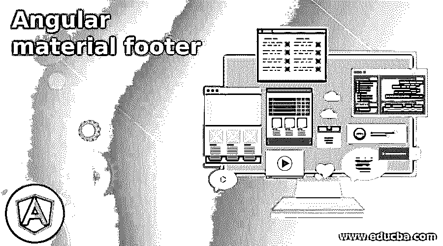
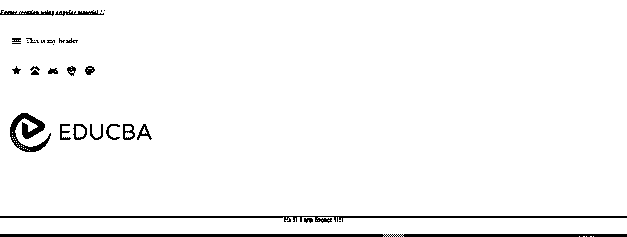

# 有角度的材料页脚

> 原文：<https://www.educba.com/angular-material-footer/>

**

** 

## 角形材料页脚简介

在 Angular 中，我们可以通过使用“mat-sidenav-container”来创建一个页脚，这是一个容器，我们可以在其中放置所有需要在页面上显示给用户的化合物。标签的页脚 div 将放在这个标签的末尾，在 CSS 文件本身中没有什么配置。但是这个容器使它很容易使用，因为我们可以定义标题内部主体动作，以及我们想要的方式定义页脚。没有直接的方法来创建一个页脚，只是通过在有角度的材料中添加标签，我们必须有一些 CSS 来正确地工作。在本教程的下一节中，我们将看到如何在 angular 应用程序中实现这一点，只需对代码进行一些或更多的修改，但这些修改将非常简单且易于理解。

**语法**

<small>网页开发、编程语言、软件测试&其他</small>

正如我们已经知道的，我们没有任何直接的方法来使用或创建 angular material 中的页脚，但我们仍然可以利用“mat-sidenav-container”来正确地维护我们的内部标签，让我们仔细看看它的语法，如下所示；

`<mat-sidenav-container fullscreen>
// your logic for header and other panel ../

your header

</mat-sidenav-container>`

正如你所看到的，我们试图在“mat-sidenav-container”中定义页脚，但是仅仅这样是不行的，我们还将在本教程的下一部分对 CSS 文件进行修改，以使其适合初学者。

### 角形材料中的页脚是如何工作的？

到目前为止，我们已经知道我们不能在素材库中直接创建页脚，但是我们可以用不同的方法来创建它。在本文中，我们将通过使用“mat-sidenav-container”来了解常规方法，这是一个内置的材料模块，有助于管理其中的不同组件。在这一节中，我们将更深入地了解在我们的应用程序中使其正常工作所需的配置，所以让我们开始吧；

**1) MatSidenavModule:** 这个需要在包里面导入。这将有助于很好地管理组件。因为它是一个用来放置标题、页眉、页脚的容器。作为参考，请遵循下面的代码行，这是在根模块或我们希望使用它的任何子模块内的项目中所必需的，见下文；

**如:**

`import {MatSidenavModule} from '@angular/material/sidenav';`

2)在这方面，我们还利用了“mat-toolbar ”,通过它我们可以向 UI 添加动作、标题和其他组件。为此，我们必须将这个模块导入到应用程序中，以便正确使用它。

**参考见以下代码:**

**例如:**

`import {MatToolbarModule} from '@angular/material/toolbar';`

为了更好地理解，将它和“MatSidenavModule”一起导入到同一个文件中。

3)现在我们可以创建一个简单的“div”标签来创建我们在素材库中的标签，所有这些应该一起使用，否则在页面上单独使用页脚是没有用的。下面我们将在我们的文件中做一些 CSS 修改，将页脚放在页面的末尾，让我们仔细看看这段代码；

**例如:**

`.footer {
position: fixed;
bottom: 0;
}`

这两个属性在我们的页脚示例中非常重要，如果我们不将底部设为“0”，那么它将不会显示在底部，因此我们的功能将会中断。现在让我们仔细看看安装了素材库的 angular 应用程序，如果你是初学者，请按照下面的步骤从头开始使用 angular 应用程序。

### 例子

使用构建模块中的材料创建页脚的示例，只需少量 CSS 和修改，让我们开始吧；

**1)索引。html 代码:**

`<!DOCTYPE html>
<html lang="en">
<head>
<meta charset="utf-8">
<meta name="viewport" content="width=device-width, initial-scale=1.0">
<link href="https://fonts.googleapis.com/icon?family=Material+Icons&display=block" rel="stylesheet">
<title>footer demo</title>
</head>
<body class="mat-app-background">
<my-app>loading</my-app>
</body>
</html>`

**2) demo.footer.component.ts 代码:**

`import { Component, ElementRef, ViewChild, AfterViewInit } from '@angular/core';
import { MatToolbar } from '@angular/material/toolbar';
@Component({
selector: 'my-app',
templateUrl: './demo.footer.component.html',
styleUrls: [ './demo.footer.component.css' ] })
export class DemoFooterComponent implements AfterViewInit {
@ViewChild("toolbar") toolbar: MatToolbar;
@ViewChild("main") main: ElementRef;
@ViewChild("footer") footer: ElementRef;
constructor(){
}
ngOnInit(){
}
ngAfterViewInit(){
}
}`

**3)demo.footer.component.html 代码:**

`<mat-sidenav-container fullscreen>
<h5><u><i>Footer creation using angular material !!</i></u></h5>
<mat-sidenav #sidenav class="sidenavstyle">
<mat-list>
<mat-list-item > Item 1 </mat-list-item>
<mat-list-item > Item 2 </mat-list-item>
<mat-list-item > Item 3 </mat-list-item>
<mat-list-item > Item 4 </mat-list-item>
<mat-list-item > Item 5 </mat-list-item>
</mat-list>
</mat-sidenav>
<mat-toolbar color="primary" #toolbar>
<button mat-icon-button color="accent" aria-label="Example icon button with a menu icon" (click)="sidenav.open()">
<mat-icon>menu</mat-icon>
</button>
This is my header
</mat-toolbar>
<mat-toolbar color="primary" #toolbar>
<button mat-icon-button color="accent" aria-label="Example icon button with a menu icon" >
<mat-icon>star</mat-icon>
</button>
<button mat-icon-button color="accent" aria-label="Example icon button with a menu icon" >
<mat-icon>pets</mat-icon>
</button>
<button mat-icon-button color="accent" aria-label="Example icon button with a menu icon" >
<mat-icon>android</mat-icon>
</button>
<button mat-icon-button color="accent" aria-label="Example icon button with a menu icon" >
<mat-icon>flutter_dash</mat-icon>
</button>
<button mat-icon-button color="accent" aria-label="Example icon button with a menu icon" >
<mat-icon>palette</mat-icon>
</button>
</mat-toolbar>
       
<mat-toolbar>

</mat-toolbar>

Hi !! I am footer !!!!

</mat-sidenav-container>`

**4) demo.footer.component.css 代码:**

`.footer {
position: fixed;
bottom: 0;
width: 100%;
height: 40px;
background-color: rgb(221, 148, 13);
color: rgb(9, 2, 24);
text-align: center;
margin: 0px;
}
.content {
position: absolute;
background-color: blueviolet;
width: 98%;
border: 1px solid rgb(18, 141, 38);
margin: 5px;
/* bottom: -50px; */
height: 80%;
max-height: 100%;
overflow: auto;
}
.sidenavstyle{
background-color: rgb(4, 61, 21);
color: rgb(208, 206, 216);
}`

**输出:**

### 结论

angular 中没有直接的模块或指令来创建页脚，但是我们仍然可以利用内置模块来更快更容易地进行开发。按照文章中的上述步骤，使用 angular 素材库轻松创建您的第一个页脚。

### 推荐文章

这是一个有角度的材料页脚指南。在这里，我们将讨论页脚如何在角度材料中工作，以及示例和输出。您也可以看看以下文章，了解更多信息–

1.  [有棱角的材料图标](https://www.educba.com/angular-material-icons/)
2.  [角度日期过滤器](https://www.educba.com/angularjs-date-filter/)
3.  [角度时间选择器](https://www.educba.com/angular-time-picker/)
4.  [角度如何工作](https://www.educba.com/how-angular-works/)

