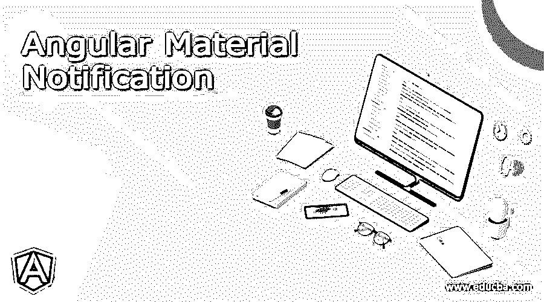
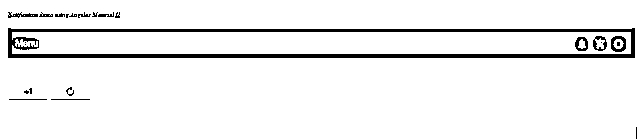
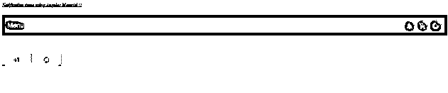

# 角度材料通知

> 原文：<https://www.educba.com/angular-material-notification/>




## 角度材料通知简介

在 angular 中我们可以使用徽章来显示通知，使用一个素材库，这是一个由素材库提供的内置模块，非常容易使用。也便于操作和维护。我们可以使用徽章来代替通知，它在 UI 上显示元素的状态，这有助于用户了解他们的活动，他们也可以知道下一步要做什么。它基本上由一个小圆圈组成，代表用户需要采取的动作数量或其他一些功能的状态。这是一个非常有用的特性，也很容易实现。在本文的下一节中，我们将看到用于在素材库中显示通知的徽章的实际实现，还将详细介绍在我们的应用程序中配置徽章的步骤，以便初学者更好地理解它。

**语法:**

<small>网页开发、编程语言、软件测试&其他</small>

正如我们所知，我们必须进行某些配置，以便在我们使用材料的应用程序中使用徽章或通知，但与此同时，我们必须遵循特定的语法，以便为此创建用户界面，下面看到的语法更清晰；

```
<p>
Text you want to show
</p>
```

正如你在上面的语法中所看到的，我们正在尝试使用“matBadge ”,它用于使用素材库在 angular 应用程序中显示和创建我们的通知。同样在接下来的部分，我们将看到关于它的实现和工作的详细解释。

### 通知如何在有角度的材料中起作用？

到目前为止，我们已经知道可以使用素材库提供的徽章模块轻松创建 angular 中的通知。此外，它是一个小圆圈，用于表示特定用户的通知数量。该通知帮助用户识别他们的动作，并且有时该通知包含为了完成某些过程而需要采取的动作。我们可以在角形材料的任何组件上展示这些徽章或通知，例如按钮、图标文本等。在本文中，我们将详细查看每个示例，但在此之前，我们先来看看需要进行哪些不同的配置，以便在现有应用程序中正确无误地使用这些配置，步骤如下:

1)matbaddgemmodule:此模块需要导入到根模块或任何子模块中，在这些子模块中，我们希望为用户创建此通知功能。作为参考，请参见下面的代码，从中可以找到该模块或包，并将其放在您的根模块文件中；
**如:**

```
import {MatBadgeModule} from '@angular/material/badge';
```

2) matBadge:这是用于在 UI 上显示和创建我们的通知功能的部分，并帮助我们显示特定用户或一般用户可用的通知的当前数量。它有许多不同的属性，下面会提到；

a)颜色:用于设置通知标记的颜色。
b)隐藏:用于检查徽章或通知组件是否隐藏。
c)内容:用来展示内容。
d)禁用:如果徽章被禁用。
e)位置:用于设置徽章或通知的位置。
f)尺寸:用于设置徽章的尺寸。

现在，我们将更仔细地看看为初学者从零开始创建 angular 应用程序所需的步骤，以及如何在其中添加素材库，使用其不同的模块，见下文；

1)安装 angular CLI 以简化我们的工作。按照以下命令在您的系统中全局安装，
例如:

```
npm install -g @angular/cli
```

2)现在我们已经准备好创建新的 angular 项目，我们只需执行下面的命令，项目将在提到的特定路径上创建；

**例如:**

```
ng new your project name
```

```
>> ng new my-first-project
```

根据您选择'我第一个项目'

3)在我们的项目中安装依赖项，不需要它，这是一个可选步骤，您可以跳过；

**例如:**

```
npm install
```

4)在此之后，我们现在可以通过下面的命令启动我们的应用程序；
例如:

```
ng serve
```

5)为了在 UI 上看到变化，我们必须有相同的 URL，现在，它是 localhost，端口是 4200；

**例如:**

http://localhps:4200

6)现在最后一步是通过执行下面的命令来安装素材库，现在你可以看到所有的模块了；

**例如:**

```
ng add @angular/material
```

### 例子

**1)index.html 代码:**

```
<link href="https://fonts.googleapis.com/icon?family=Material+Icons" rel="stylesheet">
<my-notification>loading..</my-notification>
```

2)demo-notification . component . ts 代码:

```
import { Component } from '@angular/core';
@Component({
selector: 'my-notification',
templateUrl: './demo-notification.component.html',
styleUrls: [ './demo-notification.component.css' ]
})
export class DemoNotification {
notificationNumberCount: number;
constructor() {
this.notificationNumberCount = 5;
}
increment() {
this.notificationNumberCount++;
}
clear() {
this.notificationNumberCount = 0;
}
}
```

**3)demo-notification.component.html 代码:**

```
<h5><u><i>Notification demo using Angular Material !!</i></u></h5>
<mat-toolbar color="primary">
Menu

<button mat-icon-button >
<mat-icon class="icon">notifications</mat-icon>
 0">{{notificationNumberCount}}
</button>
<button mat-icon-button >
<mat-icon class="icon">add_shopping_cart</mat-icon>
 0">{{notificationNumberCount}}
</button>
<button mat-icon-button >
<mat-icon class="icon">circle_notifications</mat-icon>
 0">{{notificationNumberCount}}
</button>
</mat-toolbar>
<br/><br/> <br/>
<button mat-raised-button (click)="increment()">
<mat-icon class="icon">plus_one</mat-icon>
</button>
<button mat-raised-button (click)="clear()">
<mat-icon class="icon">autorenew</mat-icon>
</button>
```

**4) module.ts 代码:**

```
import { NgModule } from '@angular/core';
import { BrowserModule } from '@angular/platform-browser';
import {
MatToolbarModule,
MatButtonModule,
MatIconModule
} from '@angular/material';
import { DemoNotification } from './demo-notification.component';
@NgModule({
imports: [ BrowserModule, FormsModule, BrowserAnimationsModule, MatToolbarModule, MatButtonModule, MatIconModule ],
declarations: [ DemoNotification ],
bootstrap: [ DemoNotification ]
})
export class DemoModule { }
```

**输出:**

**默认:**




**多次点击+1 后:**




**点击旁边的撤销按钮后:**


### 结论

正如我们在本文中看到的，可以使用素材库提供的徽章模块轻松创建材料中的通知，这不是一个难以遵循的过程，并且可以使用上述步骤轻松实现。我们还可以根据应用程序的需要和要求使用其不同的属性。

### 推荐文章

这是一个有角度的材料通知指南。这里我们讨论通知的定义、语法、如何在有角度的材料中工作？代码实现示例。您也可以看看以下文章，了解更多信息–

1.  [角度 ng-包含](https://www.educba.com/angularjs-ng-include/)
2.  [有棱角的材料图标](https://www.educba.com/angular-material-icons/)
3.  [角度范围](https://www.educba.com/scope-in-angularjs/)
4.  [角度 CLI](https://www.educba.com/angular-cli/)


