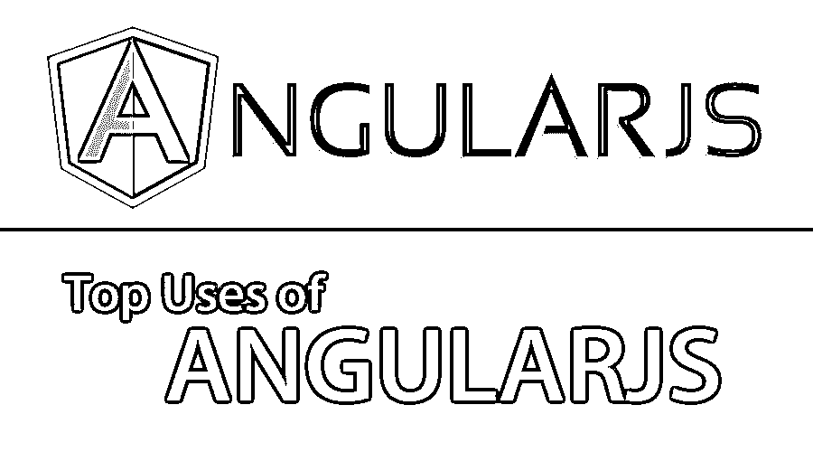
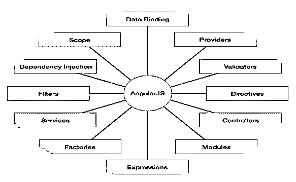

# 角度 JS 的使用

> 原文：<https://www.educba.com/uses-of-angular-js/>

## Angular JS 用途介绍

Angular JS 是一个基于 JavaScript 的开源前端 web 应用程序框架，由 Google 和一个由个人和公司组成的社区维护，旨在解决开发单页面应用程序时遇到的许多挑战。Angular JS 不是一种编程语言，而是一种用于单页面应用程序的 JavaScript 框架。单页面应用(SPA)意味着 Angular JS 是一个强大的 JavaScript 框架，用于构建动态 web 应用(T1)。

### 角度 JS

*   Angular JS 是由两位开发人员 Misko Hevery 和 Adam Abrons 在 2009 年作为一个附带项目创建的。这两个人最初开始这个项目是为了建立一个端到端的工具，允许[网页设计师与](https://www.educba.com/10-features-of-effective-web-designer-portfolio/)前端和后端交互。
*   它是用 JavaScript 写的。 [Angular 在市场上受欢迎的原因是它有一套现成的模块来简化单页面应用程序的构建。](https://www.educba.com/angular-commands/)
*   Angular JS 遵循 MVC 结构。我们都知道 MVC 代表模型视图控制器，是开发 web 应用程序的流行软件设计模式之一。

现在就来了一个问题，Angular JS 中模型视图和控制器实际代表的是什么。

<small>网页开发、编程语言、软件测试&其他</small>

**模型**它是负责维护数据的模式的最低层。

**控制器—**是组件和指令。我们将在后面的章节中讨论这一点。

**视图-**Angular 和浏览器处理的模板(HTML)在视图下。

Angular JS 有许多特性，我们将在本节稍后讨论。在它的众多特性中，像数据绑定和依赖注入这样的特性消除了目前人们在不使用 Angular JS 的情况下必须编写的许多代码，并且所有这些都发生在浏览器中，这使它成为任何服务器技术的理想伙伴。

Angular JS 的一些重要部分的图示。

**来源:**互联网

### Angular JS 的特点和用途

使用 Angular JS 有几个好处。请查看以下章节，Angular JS 在这些章节中得到了广泛而有效的应用。以下是主要用途列表:

*   #### instruction

指令是 DOM 元素(比如元素、属性、CSS 等等)上的标记。它有一组内置指令，为您的应用程序提供功能。我们也可以在 Angular JS 中创建自己的指令。

一些内置指令如下:

ng-app，ng-init，ng-model。

*   #### data binding

它是模型和视图之间的同步。ng-bind 和 ng-model 指令提供了数据绑定的功能。

*   #### range

这些是引用模型的对象。
作用域是 HTML(视图)和 JavaScript(控制器)之间的绑定部分。它是一个具有可用属性和方法的对象，可用于视图和控制器。所以，简而言之，它是控制器和视图之间的连接部分。在 Angular JS 中，范围与$scope 一起使用。

**注意:**如果我们让一个控制器和一个参数被传递，用一个$scope 是可能的。那么只有视图(HTML)可以访问这些属性。

*   #### controller

控制器控制角度 JS 应用的数据。控制器是常规的 JavaScript 对象。角度 JS 的应用由控制器控制。控制器由 ng-controller 定义

*   #### Service

服务是 Angular JS 附带的一个函数或对象。我们也可以为 Angular JS 的应用提供服务。服务范围仅限于应用程序。

Angular JS 提供了近 30 种内置服务。

**例子:**

**$location:** 它只不过是我们在 HTML 中所做的“widow . location*的一种替代。*

 ***$http:** 它向服务器发出请求，并让应用程序处理响应。

让我们转移到另一个用途:

*   **过滤器:**过滤器在 Angular JS 中用于格式化数据。我们还可以通过向您的模块注册一个新的过滤器工厂函数来创建我们自己的过滤器。以下是一些过滤器提供:货币，日期，过滤器，json，限制，小写，数字，排序，大写。

*   **模板:**它为查看者提供来自控制器和模型的信息。

*   **路由:**有助于切换视图。在 Angular JS 应用程序中，ngRoute 模块帮助应用程序切换到不同的页面，而无需加载整个应用程序。

*   **模型视图:**如上所述，负责维护数据和视图的模型模式的最低层代表由角度应用程序和浏览器处理的模板(HTML)。

*   **深度链接:**它允许在 URL 中对应用程序的状态进行编码，以便可以将其加入书签。然后，应用程序可以从 URL 恢复到相同的状态

*   依赖注入:依赖注入是一种软件设计模式，处理组件如何获得它们的依赖关系。在 Angular JS 中，注入器子系统负责创建组件，解析它们的依赖关系，并根据需要向其他组件提供依赖关系。

### 有角度的 JS 的优缺点

以下是优点和缺点:

#### 优势

它有以下几个优点:

1.  简单和改进的设计架构。
2.  DOM 操作。
3.  编写更少的代码。
4.  提高开发效率。
5.  代码可重用性。
6.  代码是单元可测试的。
7.  允许依赖注入。
8.  双向数据绑定。
9.  创建自定义指令的能力。
10.  提供过滤器。

#### 不足之处

以下是一些应该记住的缺点:

1.  不安全。需要服务器端的身份验证和授权来保证应用程序的安全。
2.  不可降解。这意味着如果 JavaScript 被禁用，那么查看者将看到基本页面。
3.  JavaScript 支持是强制性的。
4.  学习困难。

### 结论

所以我们已经学习了角度 JS 的用法和一些基本信息。我们也碰到了它的许多部分中的几个，这有助于我们学习一些关于它的知识。我们也遇到了它的优点和缺点，我们应该记住为应用程序选择 Angular JS。它是当今世界的趋势市场技术之一。

### 推荐文章:

这是在现实世界中使用 Angular JS 的指南。这里我们已经讨论了 Angular JS 的不同特性和用途，Angular JS 的优点，以及它的缺点。您也可以阅读以下文章，了解更多信息——

1.  [Photoshop 的使用](https://www.educba.com/uses-of-photoshop/)
2.  [树莓酱的用途](https://www.educba.com/uses-of-raspberry-pi/)
3.  [JavaScript 的使用](https://www.educba.com/uses-of-javascript/)*