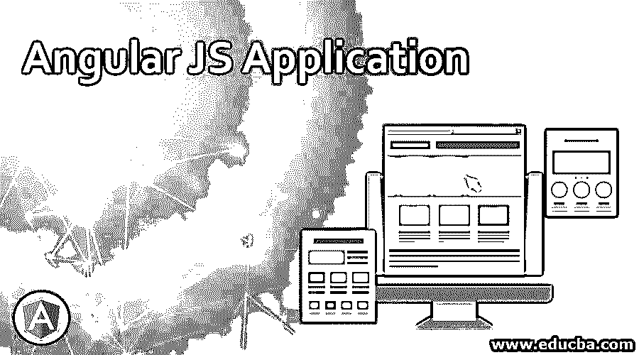
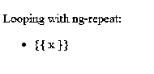
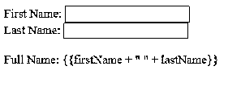
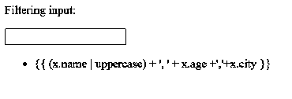
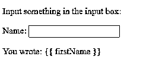

# Angular JS 应用

> 原文：<https://www.educba.com/angular-js-application/>




## Angular JS 应用简介

Angular JS 是一款开源应用。[是用 JavaScript 写的](https://www.educba.com/what-is-javascript/)。Angular JS 是谷歌在 2010 年开发的。Angular JS 应用程序还提供了对 web 应用程序和页面的动态参考。Angular JS 允许您为应用程序扩展 HTML 词汇表。使用 Angular JS 是因为当 HTML 试图用于声明 web 应用程序中的动态视图时会出错。Angular JS 被称为构建最适合应用程序开发的框架的工具集。

Angular JS 框架的特性可以被修改或替换，重新使用以适应更多或独特的工作流，并供将来参考。它是完全可扩展的，也可以和其他库一起工作。AngularJS 应用程序代码在旧的 javascript 对象中是普通的。它使您的代码易于测试、维护和重用。在 Angular JS 中，不需要像在其他方法中那样，为了将模型包装在访问器方法中而从专有类型中继承。Angular JS 遵循了最新的开发理念。

<small>网页开发、编程语言、软件测试&其他</small>

### 角度 JS 应用的概念

概念及其示例如下:

#### 1.扩展 HTML 属性的指令

feature 指令是独一无二的，在其他框架中也是可用的。这些指令很容易编写，并且可以是通用的，因为它们可以编写一次并多次重复使用。指令非常有用，有很多理由使用它们，比如:当您对定制网格或其他功能有特殊需求时，您想要的指令实际上还不存在。Angular JS 应用指令以' ng-'开头，如 ng-pp、ng-controller、ng-view、ng-model、ng-class、ng-click、ng-src 等。

**举例:**

**代码:**

```
<!DOCTYPE html>
<html>
<script src= "http://ajax.googleapis.com/ajax/libs/angularjs/1.3.14/angular.min.js"></script>
<body>
<div ng-app="" ng-init="names=['Jame','Nuan','Yesid']">
<p>Looping with ng-repeat:</p>
<ul><li ng-repeat="x in names">  {{ x }}
</li>     </ul>   </div>    </body>
</html>
```

**输出:**




#### 2.范围

它用于控制器和视图之间的通信。它将视图绑定到在 controller Angular JS 应用程序中定义的视图模型和函数，支持嵌套或分层范围。它是 Angular JS 应用程序的数据源，可以在需要时添加或删除属性。在进行 CRUD 操作时，所有的数据操作和数据赋值都是通过作用域对象进行的。

#### 3.控制器

这些用于定义视图的范围，而范围可以被认为是视图可能使用的一些绑定的变量和函数。

**举例:**

**代码:**

```
<!DOCTYPE html>
<html>
<script src= "http://ajax.googleapis.com/ajax/libs/angularjs/1.3.14/angular.min.js"></script>
<body>
<div ng-app="myApp" ng-controller="myCtrl">
First Name:
<input type="text" ng-model="firstName">
<br>
Last Name:
<input type="text" ng-model="lastName">
<br>
<br>
Full Name: {{firstName + " " + lastName}}
</div>
<script>
var app = angular.module('myApp', []);
app.controller('myCtrl', function ($scope) {
$scope.firstName = "James";
$scope.lastName = "Anderson";
});
</script>
</body>
</html>
```

**输出:**




#### 4.数据绑定

它同步模型和视图之间的数据。这意味着模型中的变化将更新视图。ng-model 指令用于双向数据绑定。

**举例:**

当用户在文本框中键入内容时，更改后的值以大写和小写形式显示在双向数据绑定标签中。

#### 5.服务

当状态已经在应用程序间共享，并且需要一个数据存储解决方案时，使用它。它可以是单例的，也可以被其他组件使用，如指令、控制器和其他服务。使用的服务是$http，$location，$log，$route，$filter，$document，$timeout，$exceptionHandler。

#### 6.按指定路线发送

它有助于将应用程序划分为多个视图，并将多个视图绑定到控制器。它将 SPA 划分为多个视图，对应用进行逻辑划分，使其更易于管理。

**示例:默认路由**

**代码:**

```
App.config(['$routeProvider',
function($routeProvider)
{
$routeProvider.
when('/List',
{
templateUrl: 'Views/list.html',
controller: 'ListController'
}).
when('/Add',
{
templateUrl: 'Views/add.html',
controller: 'AddController'
).
otherwise({
redirectTo: '/List'
});
}]);
```

#### 7.过滤

这些用于扩展绑定表达式和指令的行为。它允许格式化数据和格式化值或应用某些条件。过滤器[在 HTML](https://www.educba.com/what-is-html/) 中用管道内部表达式调用。

**举例:**

**代码:**

```
<html>
<head>
<script src= "http://ajax.googleapis.com/ajax/libs/angularjs/1.3.14/angular.min.js"></script>
<script>
var app = angular.module('myApp', []);
app.controller("namesCtrl", function ($scope) {
$scope.friends = [
{ name: "Karl", age: 27, city: "Bangalore" },
{ name: "Lewis", age: 55, city: "Newyork" },
];
});
</script>
</head>
<div ng-app="myApp" ng-controller="namesCtrl">
<p>Filtering input:</p>
<p>
<input type="text" ng-model="test">
</p>
<ul>
<li ng-repeat="x in friends | filter:test | orderBy:'name'">
{{ (x.name | uppercase) + ', ' + x.age +','+x.city }}
</li>
</ul>
</div>
</html>
```

**输出:**




#### 8.公式

表达式{{}}是在 HTML 中指定数据绑定位置并使用表达式进行数据绑定的声明性方式。它可以添加到 HTML 模板中，并且不支持控制流语句，但是它支持在显示数据之前对数据进行格式化的过滤器。

**举例:**

**代码:**

```
<!DOCTYPE html>
<html>
<script src= "http://ajax.googleapis.com/ajax/libs/angularjs/1.3.14/angular.min.js"></script>
<body>
<div ng-app="" ng-init="firstName='John'">
<p>Input something in the input box:</p>
<p>Name:
<input type="text" ng-model="firstName">
</p>
<p>You wrote: {{ firstName }}</p>
</div>
</body>
</html>
```

**输出:**




#### 9.模块

模块是应用程序的容器，应用程序控制器属于模块。它是一个函数集合，将应用程序分成小的、可重用的功能组件。一个模块可以用一个唯一的名称来标识，并且可以依赖于其他模块。

**举例:**

**代码:**

```
<! DOCTYPE html>
<html>
<script src="http://ajax.googleapis.com/ajax/libs/angularjs/1.3.14/angular.min.js"></script>  <body>
<div ng-app="myApp" ng-controller="myCtrl"> //Referring module name myApp
{{ firstName + " " + lastName }}
</div>
<script src="myApp.js"></script>
<script src="myCtrl.js"></script>
</body>
</html>
```

#### 10.测试

为了测试 Angular JS 应用程序代码，测试框架被广泛使用，比如 Jasmine 和 karma。这些测试框架主要支持嘲讽，并且在各种插件 Angular JS 应用程序的帮助下，使用 JSON 文件高度可配置[。](https://www.educba.com/json-interview-questions/)

### 结论

Angular JS 提供了一个具有独特指令和强大特性的框架。指令帮助我们构建新的 HTML 语法，它主要是特定于应用程序的。它被用作可重用的组件。该组件允许您隐藏复杂的结构和其他行为。重点将只放在应用程序做什么，以及应用程序看起来如何分开。Angular JS 应用程序现在越来越受欢迎，因为它易于学习和开发。前端开发人员在市场上有很多机会。如果你擅长 JavaScript，那么 Angular JS 对你来说并不难学，用这项技术更新你的技能将是一个好主意。

### 推荐文章

本文是 Angular JS 应用程序的指南。这里我们讨论了 Angular JS 应用程序的概念，并给出了一些例子，以便更好地理解。您也可以阅读以下文章，了解更多信息——

1.  [角度 5 和角度 4](https://www.educba.com/angular-5-vs-angular-4/)
2.  [角度 JS 的用途](https://www.educba.com/uses-of-angular-js/)
3.  [余烬 js vs Angular js](https://www.educba.com/ember-js-vs-angular-js/)
4.  [节点。JS vs 角度 JS](https://www.educba.com/node-js-vs-angular-js/)