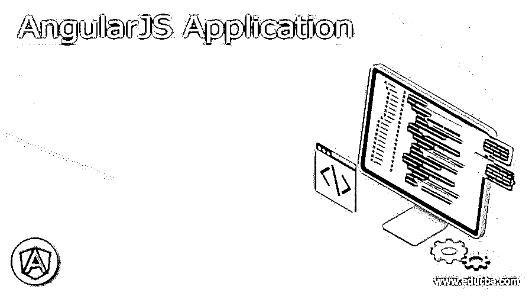

# AngularJS 应用

> 原文：<https://www.educba.com/angularjs-application/>




## AngularJS 应用简介

这是一个关于 AngularJS 应用的概述。它是用 Javascript 编写的，Angular JS Application 是一个开源框架，它赋予网页或 web 应用程序以动态特性。Angular JS 是谷歌在 2010 年开发的。除了 web 应用程序，Angular JS 还可以用于构建移动或桌面应用程序。Angular JS 具有声明性模板、依赖注入、指令等特性。

Angular JS 使用了 [HTML 语言](https://www.educba.com/cheat-sheet-html/)来扩展其语法，并帮助更有效地创建应用程序。Angular JS 用于使其动态化，因为 HTML 主要用作静态语言。Angular JS 遵循 MVC(模型视图控制器)的概念。MVC 背后的主要思想是区分数据层、逻辑层和视图层。视图从模型中接收数据，用于向用户显示。当用户通过执行动作与应用程序交互时，控制器已经改变了模型中的数据，并且在视图告诉模型关于改变之后显示信息。在 Angular JS 中，数据存储在对象的属性中，控制器是 JS 类，视图是 DOM(文档对象模型)。

<small>网页开发、编程语言、软件测试&其他</small>

### 角度应用的概念

AngularJS 应用的概念及其示例如下:

#### 1.扩展 HTML 属性的指令

feature 指令是独一无二的，在其他框架中也是可用的。这些指令很容易编写，并且可以是通用的，因为它们可以编写一次并多次重复使用。这些指令非常有用，当您有特殊需求时，比如定制网格或其他功能时，有很多理由使用它们，但是您想要的指令实际上还不存在。角度指令以“ng-”开头，如 ng-pp、ng-controller、ng-view、ng-model、ng-class、ng-click、ng-src 等。

```
<!DOCTYPE html>
<html>
<script src= "http://ajax.googleapis.com/ajax/libs/angularjs/1.3.14/angular.min.js"></script>
<body>
<div ng-app="" ng-init="names=['Jame','Nuan','Yesid']">
<p>Looping with ng-repeat:</p>
<ul><li ng-repeat="x in names">  {{ x }}
</li>     </ul>   </div>    </body>
</html>
```

#### 2.范围

它用于控制器和视图之间的通信。它将视图绑定到控制器 Angular JS 中定义的视图模型和函数，支持嵌套或分层作用域。它是 AngularJS 的数据源，可以在需要时添加或删除属性。在进行 CRUD 操作时，所有的数据操作和数据分配都是通过 scope 对象进行的。

#### 3.控制器

这些用来定义视图的作用域，作用域可以被认为是视图可能使用的一些绑定的变量和函数。

```
<!DOCTYPE html>
<html>
<script src= "http://ajax.googleapis.com/ajax/libs/angularjs/1.3.14/angular.min.js"></script>
<body>
<div ng-app="myApp" ng-controller="myCtrl">
First Name:
<input type="text" ng-model="firstName"><br>
Last Name:
<input type="text" ng-model="lastName">
<br>
<br>
Full Name: {{firstName + " " + lastName}}
</div>
<script>
var app = angular.module('myApp', []);
app.controller('myCtrl', function ($scope) {
$scope.firstName = "James";
$scope.lastName = "Anderson";
});
</script>
</body>
</html>
```

#### 4.数据绑定

它同步模型和视图之间的数据。这意味着模型中的变化将更新视图。ng-model 指令用于双向数据绑定。

**例:**当用户在文本框中输入时，改变后的值在标签中以大写和小写显示，这是双向数据绑定。

#### 5.服务

当状态已经在应用程序间共享，并且需要一个数据存储解决方案时，使用它。它可以是单例的，也可以被其他组件使用，如指令、控制器和其他服务。使用的服务是$http，$location，$log，$route，$filter，$document，$timeout，$exception Handler。

#### 6.按指定路线发送

t 有助于将应用程序划分为多个视图，并将多个视图绑定到控制器。它将 SPA 划分为多个视图，对 app 进行逻辑划分，使其更易于管理。

```
default route.
App.config(['$routeProvider',
function($routeProvider)
{
$routeProvider.
when('/List',
{
templateUrl: 'Views/list.html',
controller: 'ListController'
}).
when('/Add',
{
templateUrl: 'Views/add.html',
controller: 'AddController'
).
otherwise({
redirectTo: '/List'
});
}])
```

#### 7.过滤

这些用于扩展绑定表达式和指令的行为。它允许格式化数据和格式化值或应用某些条件。在 HTML 中，过滤器是通过表达式中的管道调用的。

```
<html>
<head>
<script src= "http://ajax.googleapis.com/ajax/libs/angularjs/1.3.14/angular.min.js"></script>
<script>
var app = angular.module('myApp', []);
app.controller("namesCtrl", function ($scope) {
$scope.friends = [
{ name: "Karl", age: 27, city: "Bangalore" },
{ name: "Lewis", age: 55, city: "Newyork" },
];
});
</script>
</head>
<div ng-app="myApp" ng-controller="namesCtrl">
<p>Filtering input:</p>
<p>
<input type="text" ng-model="test">
</p>
<ul>
<li ng-repeat="x in friends | filter:test | orderBy:'name'">
{{ (x.name | uppercase) + ', ' + x.age +','+x.city }}
</li>
</ul>
</div>
</html>
```

#### 8.公式

表达式{{}}是在 HTML 中指定数据绑定位置并使用表达式进行数据绑定的声明性方式。它可以添加到 HTML 模板中，并且不支持控制流语句，但是它支持过滤器在显示数据之前格式化数据。

```
<!DOCTYPE html>
<html>
<script src= "http://ajax.googleapis.com/ajax/libs/angularjs/1.3.14/angular.min.js"></script>
<body>
<div ng-app="" ng-init="firstName='John'">
<p>Input something in the input box:</p>
<p>Name:
<input type="text" ng-model="firstName">
</p>
<p>You wrote: {{ firstName }}</p>
</div>
</body>
</html> 
```

#### 9.模块

模块是应用程序的容器，应用程序控制器属于一个模块。它是一个功能集合，将应用程序分成小的、可重用的功能组件。该模块可以通过唯一的名称来标识，并且可以依赖于其他模块。

```
<! DOCTYPE html>
<html>
<script src="http://ajax.googleapis.com/ajax/libs/angularjs/1.3.14/angular.min.js"></script>  <body>
<div ng-app="myApp" ng-controller="myCtrl"> //Referring module name myApp
{{ firstName + " " + lastName }}
</div>
<script src="myApp.js"></script>
<script src="myCtrl.js"></script>
</body>
</html>
```

#### 10.测试

为了测试 angular JS 代码，测试框架像 Jasmine 和 karma 一样被广泛使用。这些测试框架主要支持模仿，并且在各种插件的帮助下，使用 JSON 文件是高度可配置的。

### 结论

Angular JS 提供了一个框架，可以在很短的时间内高效地开发 web 应用程序。Angular JS 总是可用于单元测试。主要用于 SPA，发展更快。对于 [JavaScript 开发者](https://www.educba.com/web-development-tools/)来说很容易理解，也简单易学。Angular JS 对于初学者来说仍然有用，因为他们可以很容易地掌握它。

Angular 正在加快前端开发的步伐，因为它使开发速度更快。大型应用程序可以很容易地在角处理。它可以更好地执行组件。Angular 是指有非常强的区域和重要的特征可以使用。Angular 发布了其更高版本，也具有新的功能和更好的性能。

### 推荐文章

这是一份 AngularJS 应用指南。在这里，我们讨论了 AngularJS 应用的不同概念，并举例说明。您也可以阅读以下文章，了解更多信息——

1.  [Web 测试应用](https://www.educba.com/web-testing-application/)
2.  [高级 AngularJS 面试题](https://www.educba.com/angularjs-interview-questions-for-experienced/)
3.  [有角度的材料形式示例](https://www.educba.com/angular-material-form-example/)
4.  [网络服务测试](https://www.educba.com/web-services-testing/)