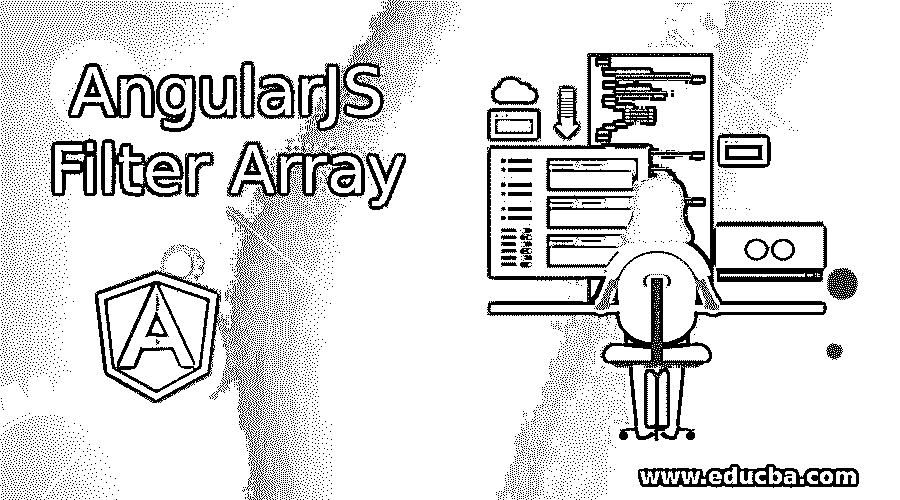
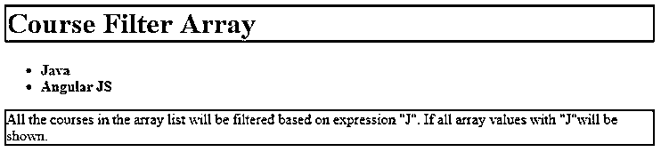
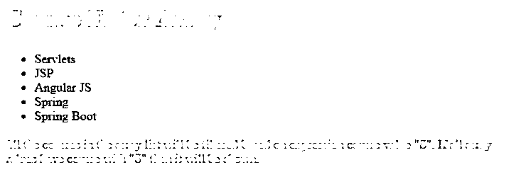
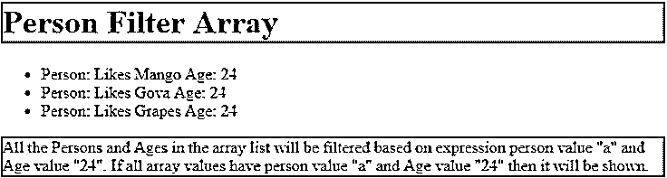
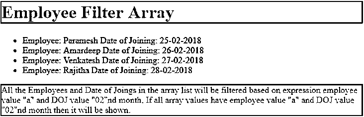

# AngularJS 滤波器阵列

> 原文：<https://www.educba.com/angularjs-filter-array/>

## AngularJS 滤波器阵列简介

Angular JS 中的 Filter array 表示根据传递给过滤器的条件过滤数组项。当用于根据名称、价格、日期、特殊字符等从数组中获取数据时，过滤器数组起着至关重要的作用。在本主题中，我们将学习 AngularJS 滤波器阵列。

开发人员可以创建他们的自定义过滤器。例如，数组中的过滤器应用在管道符号(|)后，后面跟有如下表达式。

<small>网页开发、编程语言、软件测试&其他</small>

arrayReference |筛选器:表达式

**实时场景:**当我们从亚马逊网站上购买一件商品时，我们首先搜索的是一件商品。它用不同的价格、品牌、报价、尺寸等填充数以千计的产品。但作为客户，我们不希望所有这些产品；然后，我们对结果集应用了一个过滤器。这种应用要求过滤器阵列起着至关重要的作用。

**优势**

*   通过丢弃不必要的数据来填充准确的数据。
*   易于在 Angular JS 中应用。
*   由如此多的预定义过滤器提供。

### 如何在 AngularJS 中创建滤镜数组？

以 2 种方式应用角度 JS 中的滤波器阵列:

#### 1.用表达式过滤

**语法:**

`{{ arrayReference | filter : expression}}
arrayReference: It has given array data.
Filter: Says Angular JS to filter the data.
Expression: It select the data from an array if the given expression is true.`

#### 2.带比较器的滤波器

`{{ arrayReference | filter : 'key': expression, 'value':expression}}
key': expression, 'value':expression: is said to the comparator. It compares both key and value pairs, if both expressions are true then the result will be shown.`

*   过滤器阵列基于表达式和比较器工作。
*   允许有角度的 JS 在 html 库下面必须添加。

``

### 重要角度术语

*   **ng-app:** 该指令定义了主要的 Angular JS 应用流程。
*   **Ng-model:** 该指令将 HTML 数据绑定到 Angular JS 应用程序中。
*   **Ng-init:** 该指令初始化 Angular JS 应用程序变量。
*   **ng-controller:** 该指令使应用程序成为控制器。
*   **var app = angular . module(' applicationName '，[]):** 用 application name 创建应用程序。
*   **$scope:** 它是一个内置的对象，包含主要的应用程序数据及其方法。
*   **Ng-repeat:** 迭代一个数组。

### AngularJS 滤波器阵列示例

下面是下面提到的 AngularJS 滤波器阵列的例子

#### 示例#1

用课程名称表达式过滤课程。

**角 JS 代码:**CourseFilter.html

`<!DOCTYPE html>
<html>
<head>
<title>AngularJS Filter</title>

</head>
<body>

<h1 class="c">Course Filter Array</h1>
<ul>
<strong>
<li ng-repeat="course in courses | filter : 'J'">
{{ course }}
</li>
</strong>
</ul>

All the courses in the array list will be filtered based on expression "J". If all array values with "J"will be shown.

</body>
</html>`

**输出:**

#### 实施例 2

用其值过滤课程关键字。

**角 JS 代码:**FilteringKeyValue.html

`<!DOCTYPE html>
<html>
<head>
<title>AngularJS Filter</title>

</head>
<body>

<h1 class="c">Course Filter Array</h1>
<ul>
<li ng-repeat="x in courses | filter : {'course' : 'S'}">{{x.course}}</li>
</ul>

All the courses in the array list will be filtered based on expression course value "S". If all array values have course with "S" then it will be shown.

</body>
</html>`

**输出:**

#### 实施例 3

过滤键和值对。

**角 JS 代码:**FilteringKeyValuePair.html

`<!DOCTYPE html>
<html>
<head>
<title>AngularJS Filter</title>

</head>
<body>

<h1 class="c">Person Filter Array</h1>
<ul>
<li ng-repeat="p in persons | filter : {'person' : 'a','Age':'24'}">{{"Person: "+p.person+" Age: "+p.Age}}</li>
</ul>

All the Persons and Ages in the array list will be filtered based on expression person value "a" and Age value "24". If all array values have person value "a" and Age value "24" then it will be shown.

</body>
</html>`

**输出:**

#### 实施例 4

使用员工姓名和加入日期过滤数组列表。

**角 JS 代码:**EmployeeDOJ.html

`<!DOCTYPE html>
<html>
<head>
<title>AngularJS Filter</title>

</head>
<body>

<h1 class="c">Employee Filter Array</h1>
<ul>
<li ng-repeat="e in employee | filter : {'employee' : 'a','DOJ':'02'}">{{"Employee: "+e.employee+" Date of Joining: "+e.DOJ}}</li>
</ul>

All the Employees and Date of Joings in the array list will be filtered based on expression employee value "a" and DOJ value "02"nd month. If all array values have employee value "a" and DOJ value "02"nd month then it will be shown.

</body>
</html>`

**输出:**

### 结论

Angular JS 中的过滤器数组根据表达式和比较器过滤数据。它可以过滤字符串，数字，日期，特殊字符等。

### 推荐文章

这是一个 AngularJS 滤波器阵列的指南。这里我们讨论如何在 AngularJS 中创建过滤器数组，并给出例子和输出。您也可以阅读以下文章，了解更多信息——

1.  [角度控制器](https://www.educba.com/controllers-in-angularjs/)
2.  [角度动画](https://www.educba.com/angularjs-animations/)
3.  [什么是 AngularJS](https://www.educba.com/what-is-angularjs/)
4.  [角度版本](https://www.educba.com/angularjs-versions/)

