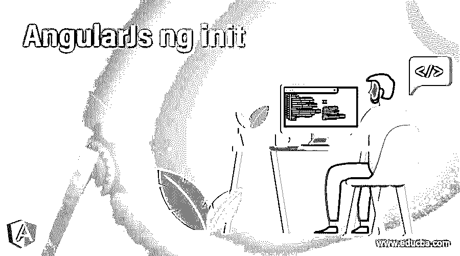
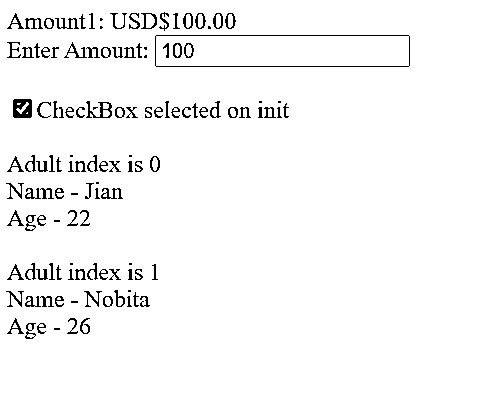
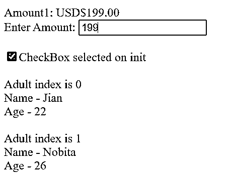
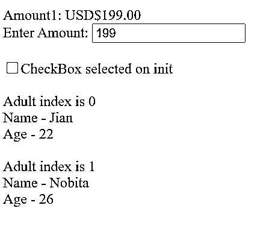

# 安圭拉的 ng init

> 原文：<https://www.educba.com/angularjs-ng-init/>

## 初始角度介绍

AngularJS ng-init 是一个内置的 AngularJS 指令，在 HTML 视图中仅用于初始化特定范围内的变量，而不是在控制器或组件中初始化和修改它。ng-init 允许用户在 HTML 视图的当前范围内计算特定的表达式。这可以用于任何 HTML 标签，如 div、select、input、span 等。该指令主要用于为 ng-repeat 元素添加一个特殊的附加属性，仅用于 HTML 视图中的有限范围。

**语法**

<small>网页开发、编程语言、软件测试&其他</small>

用不同的 HTML 标签编写 ng-init 指令有多种方法

**使用输入类型为**的 ng-init

`<input type=”checkbox” ng-init=”anyExpression” ng-model=”modelValue”></input>`

**对选择类型使用 ng-init**

`<select ng-init=”anyExpression” ng-options=”reason as reason.desc for reason in reasonsList”></select>`

**将 ng-init 与 div/span 一起使用**

`
 Update Request </div?`

ng-init 指令可以用于任何 HTML 元素，它的作用域仅限于该元素的作用域

### ng init 指令在 AngularJS 中是如何工作的？

在 AngularJS 框架中，重要的是要知道 AngularJS 框架提供的所有内置指令都将始终用 ng 前缀表示。

ng-init 指令用于仅在 HTML 视图中初始化特定范围内的变量，而不是在控制器或组件中初始化和修改它。ng-init 允许用户在 [HTML 视图](https://www.educba.com/what-is-html/)中评估当前范围内的特定表达式。ng-init 指令的工作方式是，一旦 HTML 视图遇到在任何 HTML 元素中声明的 ng-init 指令，它就对 ng-init 指令中定义的表达式和变量进行求值，并且该变量可以在 HTML 视图的范围内进一步使用。严格建议不要在 HTML 模板中使用 ng-init 来处理复杂和高级的逻辑，因为对于这样的操作，可以使用控制器和组件，这被认为是一种理想的方式。ng-init 的使用仅限于 HTML 模板中需要局部变量别名的地方，或者向 ng-repeat 指令或 ng-options 添加任何特殊属性的地方。当您需要仅在开发周期中初始化特定变量，或者需要通过服务器端脚本注入数据时，可以使用它。

ng-init 指令以优先级 450 执行，它也可以与 AngularJS 中的过滤器一起使用。因此，使用 ng-init 和过滤器的语法应该是正确的。

### 初始角度示例

以下是 AngularJs ng init 的示例:

**Index.html**

`<!doctype html>
<html ng-app="initApp">
<head>

</head>
<body>

Amount1: {{amount1 | currency:"USD$"}}
 
Enter Amount: <input ng-model="amount1"/>   
<input type="checkbox" ng-model="mainCheckBox"
ng-init="mainCheckBox = true"/>CheckBox selected on init   

Adult index is {{adultIndex}}  
Name - {{adult.name}}  
Age - {{adult.age}}    

</body>
</html>`

**Script.js**

`angular.module('initApp', []);
function initController($scope) {
$scope.amount1 = 1234.56;
$scope.adultsList = [{'name': 'Jian', 'age': 22}, {'name': 'Nobita', 'age': 26}];
}`

以上示例显示了在 AngularJS 应用程序的 HTML 视图中使用 ng-init 指令的不同方式。我们采用了各种 HTML 元素来展示 ng-init 指令在 HTML 模板中的使用。此指令用于 HTML div 元素，其中初始数量值设置为 100，如果您看到此 ng-model 也在控制器中初始化，但 HTML ng-init 优先于控制器值，100 被设置为初始数量，并且同样显示在输入字段中，因为使用了相同的 ng-model 值。如果在输入类型中更新了模型值，它将反映并覆盖初始值。另一个例子是将 ng-init 与输入类型 checkbox 一起使用，这里的要求是，当页面第一次加载时，应该选择这个复选框，所以这里使用 ng-init，其中 checkbox 的模型值在 init 上设置为 TRUE，默认情况下在每次加载页面时选择这个复选框。稍后，可以选择或取消选择该复选框，该值将相应地更新。第三个示例展示了如何在 ng-repeat 或 select ng-options 指令中使用 ng-init 来跟踪$index，它表示数组列表中每个元素的索引。这个变量可以在 ng-repeat 标记内使用，其作用域仅限于在 ng-repeat 作用域之外不能被访问。

`
`

在这个 div 块中，模型值 amount 被初始化为 100，作为缺省初始值。

`<input ng-model="amount1"/>`

这里，amount 模型值被绑定到输入类型，如果在 HTML 模板中更新了输入值，那么模型值也会得到更新。

`<input type="checkbox" ng-model="mainCheckBox" ng-init="mainCheckBox = true"/>`

在这个输入类型复选框中，init 值被设置为 True，这样在第一次加载页面时，该复选框总是被选中。

`
`

成人索引是{{adultIndex}}

这里 ng-init 与 ng-repeat 指令一起使用，其中在名为 Adult index 的局部变量中跟踪$index，并且该变量进一步用于表示成人列表中的成人索引。

**输出:**

输出 1:第一次加载页面时

输出 2:当值的数量被更新时

输出 3:当复选框被修改时

### 结论

ng-init 是 AngularJS 中的一个指令，它的使用受到限制，只要 ng-repeat 或 ng-options 标记中需要特殊属性的别名，就可以使用它，只在开发阶段评估数据，并且您需要跟踪它。除此之外，强烈建议在控制器中使用和评估表达式和变量，并在 angularJS 中使用 ng-controller。在不同的 HTML 标签中使用这个指令有多种形式，有了过滤器，只需要正确的语法，就可以开始了。

### 推荐文章

这是一个角度初始化的指南。这里我们讨论 ng-init 指令如何在 AngularJS 中工作，并给出输出示例。您也可以看看以下文章，了解更多信息–

1.  [AngularJS 服务](https://www.educba.com/angularjs-services/)
2.  [职业生涯](https://www.educba.com/career-in-angularjs/)
3.  [角度选择](https://www.educba.com/angularjs-alternatives/)
4.  [AngularJS 架构](https://www.educba.com/angularjs-architecture/)

