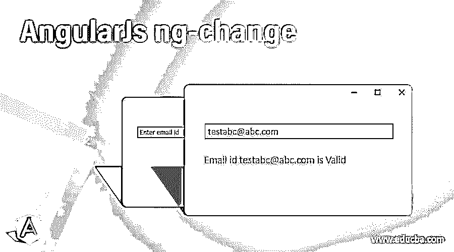
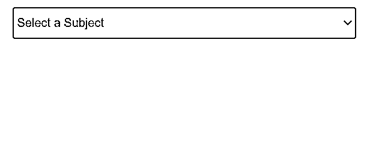
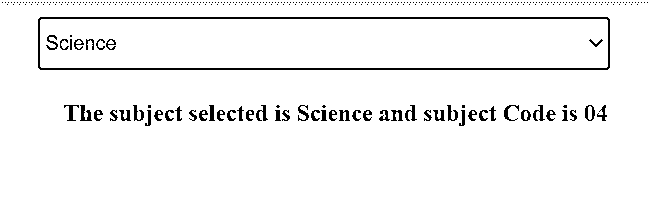
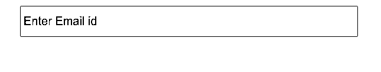
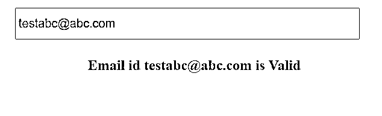

# 角度变化

> 原文：<https://www.educba.com/angularjs-ng-change/>

## 角度变化简介

AngularJS ng-change 是一个内置的 AngularJS 指令，可以在 HTML 视图页面上使用。顾名思义，每当这个指令作为属性放在 HTML 元素中时，那么每当 HTML 元素经历模型值的变化时，它就调用 ng-change 指令，后者调用函数或执行 ng-change 指令中定义的表达式。在这个话题中，我们将学习角度的变化。

**语法**

<small>网页开发、编程语言、软件测试&其他</small>

以下是下面提到的语法

*   **与输入元素一起使用**

`<input type="email" ng-change="onChangeOfEmail()"
ng-model="emailValue" placeholder="Enter Email id"/>`

*   **与选择元素一起使用**

`<select ng-model="selectedSubject" ng-change="onChangeOfSubjects()"
ng-options="subject as subject.value for subject in subjects">
<option value="" selected>Select a Subject</option>
</select>`

*   **与 TEXTAREA 元素一起使用**

`<textarea  ng-change="onChangeOfTextArea()"  ng-model="textAreaValue"/>`

除此之外，ng-change 指令还可以用于输入类型 email、tel、checkbox、单选按钮、name 以及接受用户输入并与用户交互的所有类型的 HTML 标记。

### Angular CLI 如何工作？

在 AngularJS 框架中，知道 AngularJS 框架提供的所有内置指令总是用 ng 表示是非常重要的。例如，ng-change 指令可以与输入、选择和文本区域 HTML 元素一起使用，这些元素使用 ng-model 指令与某个模型值绑定。触发 ng-change 的方式是每当 AngularJS 读取 ng-model 中的任何变化时，它就调用 ng-change 指令中定义的表达式或函数。ng-change 表达式在遇到提交给模型值的输入值更改时，会立即执行。因此，需要注意的是，没有 ng-model 指令，ng-change 就无法工作。此外，ng-change 的处理速度比 JavaScript onchange 事件快得多，后者仅在更改结束时触发，比如当用户退出表单或按下 return 键时。

**AngularJS ng-change 指令也有一些限制—**

*   如果新更改的模型值不是一个有效值，那么 ng-change 将不会被触发，因为 ng-model 默认值变为 null
*   如果模型值在控制器中而不是在视图中被更改，那么 ng-change 不会被触发，因为它与视图紧密耦合
*   如果从$parsers 转换管道返回的模型值保持不变，那么 ng-change 就不会被触发

### 角度变化的例子

下面提到了不同的例子:

#### 示例#1

**Index.html**

`<html ng-app="subjectapp">
<head>

</head>
<body>
<div ng-controller='SubjectController'>
<select class="subject-dropdown" ng-model="selectedSubject"
ng-change="onChangeOfSubjects()"
ng-options="subject as subject.value for subject in subjects">
<option value="" selected>Select a Subject</option>
</select>
<div class="text-msg" ng-if="selectedSubject">The subject selected is {{subjectValue}}
and subject Code is {{subjectCode}}

</body>
</html>`

**Script.js**

`angular.module('subjectapp', [])
.controller('SubjectController', function($scope) {
$scope.subjects = [{'key': '01', 'value': 'English'},
{'key': '02', 'value': 'History'},
{'key': '03', 'value': 'Mathematics'},
{'key': '04', 'value': 'Science'},
{'key': '05', 'value': 'French'}];
$scope.onChangeOfSubjects = onChangeOfSubjects;
function onChangeOfSubjects() {
$scope.subjectValue = $scope.selectedSubject.value;
$scope.subjectCode = $scope.selectedSubject.key;
}
});`

在上面的例子中，我们试图用一个 select 标签在 UI 上显示一个主题列表，这样它将显示在下拉列表中，有各种可用的主题。我们在 select HTML 标记中添加了一个 ng-change 指令，所以只要下拉列表的值从当前的 ng-model 值改变，ng-change 就会被触发。这个 ng-change 将执行相应控制器中定义的函数 onChangeOfSubjects。此外，由于主题是一个键值对的对象，我们将显示所选主题的名称及其对应的主题代码。确保在脚本标签中包含 AngularJS 依赖项，以便能够使用 AngularJS 的 ng-repeat 指令。

`ng-change="onChangeOfSubjects()"`

这里 onChangeOfSubjects 方法将在 ng-change 被触发时执行。它可以接受任意数量的参数，我们不传递任何参数，因为我们将在控制器中使用范围模型值。

`ng-model="selectedSubject"`

如上所述，ng-change 只能与 ng-model 一起工作，所以我们在 select 中使用了 ng-model。

仅仅通过使用一些简单和容易的 CSS 样式，我们将能够查看上述代码的输出。

**输出:**

#### 实施例 2

**Index.html**

`<html ng-app="emailapp">
<head>

</head>
<body>
<div ng-controller='EmailController'>
<input class="email-input" type="email"
ng-change="onChangeOfEmail()"
ng-model="emailValue" placeholder="Enter Email id"/>
<p class="text-msg" ng-if="emailValue">Email id {{emailValue}} is {{validityValue}}

</body>
</html>`

**Script.js**

`angular.module('emailapp', [])
.controller('EmailController', function($scope) {
$scope.onChangeOfEmail = onChangeOfEmail;
function onChangeOfEmail() {
var re = /^(([^<>()[\]\\.,;:\s@\"]+(\.[^<>()[\]\\.,;:\s@\"]+)*)|(\".+\"))@((\[[0-9]{1,3}\.[0-9]{1,3}\.[0-9]{1,3}\.[0-9]{1,3}\])|(([a-zA-Z\-0-9]+\.)+[a-zA-Z]{2,}))$/;
$scope.validityValue = re.test($scope.emailValue) ? 'Valid' : 'Invalid';
}
});`

在上面的例子中，我们试图使用 input 标签在 UI 上接受作为电子邮件 id 的输入，以便它将显示电子邮件 id。我们在输入 HTML 标记中添加了一个 ng-change 指令，所以只要输入了电子邮件 id 或者更改了当前的 ng-model 值，就会触发 ng-change。这个 ng-change 将执行 onChangeOfEmail 函数，它是在相应的控制器中定义的。在这个控制器方法中，我们将根据定义的模式验证电子邮件 id 是否是有效的电子邮件 id。如果有效，我们将范围变量值赋为有效，如果无效，则将无效字符串赋为有效值。确保在脚本标签中包含 AngularJS 依赖项，以便能够使用 AngularJS 的 ng-repeat 指令。

`ng-change=" onChangeOfEmail ()"`

这里 onChangeOfEmail 方法将在 ng-change 被触发时执行。这个方法将检查它是否是一个有效的电子邮件 id。

`ng-model=" emailValue "`

如上所述，ng-change 只能与 ng-model 一起工作，所以我们在 select 中使用了 ng-model。

仅仅通过使用一些简单和容易的 CSS 样式，我们将能够查看上述代码的输出。

**输出:**

### 结论

AngularJS 中的 ng-change 指令是另一个使用最广泛和最有用的内置 AngularJS 指令，它可以与 HTML 元素一起使用，以处理 UI 上的任何输入更改，并通过使用函数调用在控制器中执行所需的操作。同样，知道语法是所有需要的，你已经准备好了。

### 推荐文章

这是一个角度变化的指南。在这里，我们将讨论 Angular CLI 如何与示例和 AngularJS ng-change 指令一起工作，并且没有什么限制。您也可以看看以下文章，了解更多信息–

1.  [角滤波器](https://www.educba.com/angularjs-filters/)
2.  [职业生涯](https://www.educba.com/career-in-angularjs/)
3.  [Angular 2 架构](https://www.educba.com/angular-2-architecture/)
4.  [角度 CLI 命令](https://www.educba.com/angular-cli-commands/)

