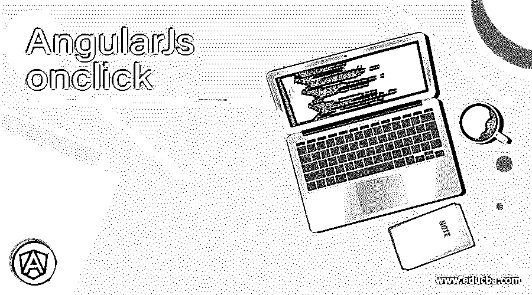
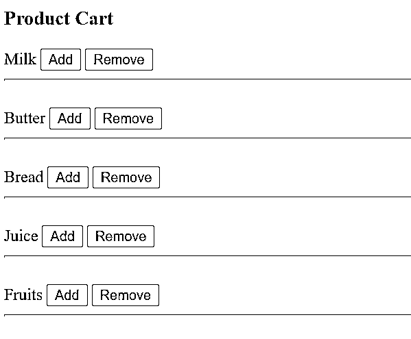
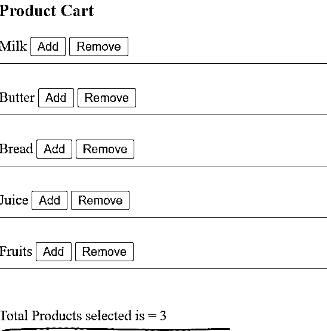
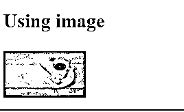
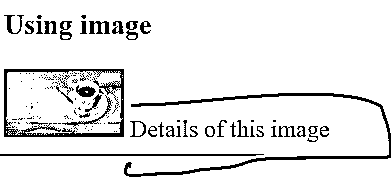

# AngularJs onclick

> 原文：<https://www.educba.com/angularjs-onclick/>

## AngularJs onclick 简介

AngularJS ng-click 是一个内置的 AngularJS 指令，主要用于处理 HTML 视图上的 click 事件，并根据需要处理控制器中的数据。ng-click 指令可以用于多个 HTML 元素，如按钮、输入、选择、复选框等。这为开发人员提供了在单击元素时定义自定义行为的能力。在这个主题中，我们将学习 AngularJs onclick。

**语法**

<small>网页开发、编程语言、软件测试&其他</small>

ng-click 指令使用了各种 HTML 元素

**使用 ng-click 输入类型**

1.  **Div/span**

`
</input>`

2.  **Img**

`</input>`

3.  **按钮**

`<button class="btn-class" aria-label="Cancel" type="button" ng-click=" customExpression">`

4.  **输入**

`<input class=”btn-class” type=”button” ng-click=”customExpression”></input>`

**使用鼠标左键点击文本区域**

`<textarea ng-click=”customExpression”></textarea>`

### ng-click 指令在 AngularJS 中是如何工作的？

在 AngularJS 框架中，知道 AngularJS 框架提供的所有内置指令总是用 ng 前缀表示是非常重要的。

ng-click 指令函数基于事件 click，这意味着一旦 HTML 视图在特定的 HTML 元素上经历了单击(鼠标单击),就对其对应的 ng-click 表达式进行求值。ng-click 指令中的表达式可以是函数调用，其中函数声明在控制器中；表达式也可以直接写在 [HTML 视图](https://www.educba.com/what-is-html/)中，并在那里自己求值。在控制器中定义的函数中编写复杂的逻辑，然后调用 HTML 视图函数，这是一个很好的实践。ng-click 指令将监视浏览器的 onclick 事件，并在点击被触发时被触发。ng-click 指令以优先级 0 执行，事件对象作为$event 提供。

### 例子

下面是 AngularJs onclick 的一个例子:

**Index.html**

`<!DOCTYPE html>
<html>

<body ng-app="myApp">

<h3>Product Cart</h3>

{{product}}
<button ng-click="addProduct()">Add</button>
<button ng-click="removeProduct()">Remove</button>

 

Total Products selected is = {{count}} 

<h3> Using image</h3>

{{imgDetails}}

</body>
</html>`

以上示例显示了在 AngularJS 应用程序的 HTML 视图中使用 ng-click 指令的不同方式。我们采用了各种 HTML 元素来展示 ng-click 指令在 HTML 模板中的使用。该指令用于不同的输入类型，如按钮、复选框、文本、电话、电子邮件等。，也用于显示从下拉列表和文本区域中选择的值。

`
`

这是一个在 HTML 视图中使用 ng 迭代产品列表的例子——在产品中使用产品重复。

`<button ng-click="addProduct()">Add</button>`

这是一个将 ng-click 指令用于按钮 HTML 元素的示例；每当在 HTML 视图中单击按钮时，就会执行 addProduct 函数

``

这是一个在 img 标签中使用 ng-click 指令的例子，每当图像被点击时，显示细节功能就会被执行

**输出:**

**输出:1–添加和删除产品购物车中的按钮**

**输出 2:添加 4 个产品并删除 1 个产品后的总产品数**

**输出 3:使用图像标签**

**输出 4:点击图像后**

### 结论–AngularJs onclick

ng-click 是 AngularJS 中的一个指令，在 AngularJS 应用程序中非常重要。这个指令用于处理点击事件。知道 ng-click 在何时何地被触发是非常重要的。有各种各样的 HTML 标签可以使用这个指令。

### 推荐文章

这是 AngularJs onclick 的指南。这里我们讨论 ng-click 指令如何在 AngularJS 中工作，以及 ng-click 指令使用的各种 HTML 元素。您也可以阅读以下文章，了解更多信息——

1.  [AngularJS ng 级](https://www.educba.com/angularjs-ng-class/)
2.  [角度异常-禁用](https://www.educba.com/angularjs-ng-disabled/)
3.  [角度 2 指令](https://www.educba.com/angular-2-directives/)
4.  [角滤波器](https://www.educba.com/angularjs-filters/)

