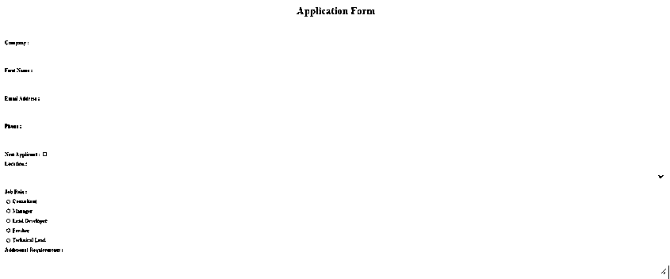
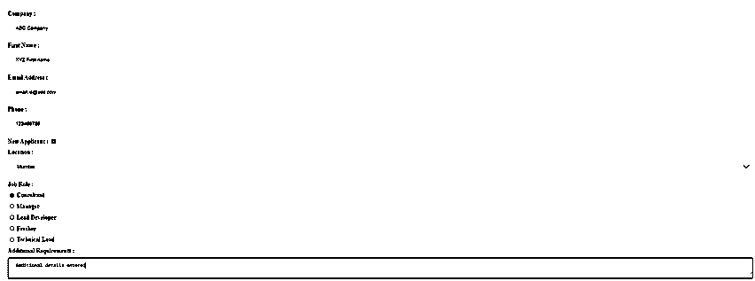
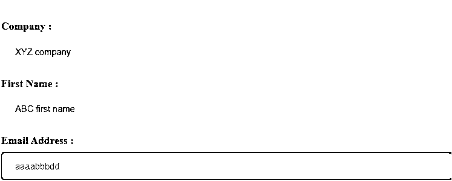
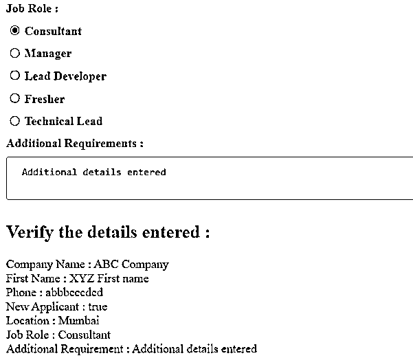

# angularjs 的 ng 模型

> 原文：<https://www.educba.com/angularjs-ng-model/>

## 角度模型的定义

AngularJS ng-model 是一个内置的 AngularJS 指令，它是 AngularJS 应用程序的核心，因为它在 HTML 视图中用于将视图绑定到模型中，并提供双向数据绑定。该指令是 input、select、textarea HTML 元素中的必备要求，可用于表单验证，如文本、数字、电子邮件、必填等。基于应用于特定元素的 CSS 类验证状态，例如 ng-priest、ng-dirty、ng-touched 等。

**语法:**

<small>网页开发、编程语言、软件测试&其他</small>

有各种各样的 HTML 元素与 ng-model 指令一起使用。

**1。使用带有输入类型**的 ng 模型

*   **复选框**

`<input type=”checkbox” ng-model=”modelValue”></input>`

*   **电子邮件**

`<input type=”email” ng-model=”modelValue”></input>`

*   **收音机**

`<input type=”radio” ng-model=”modelValue”></input>`

*   **日期**

`<input type=”date” ng-model=”modelValue”></input>`

*   **号**

`<input type=”number” ng-model=”modelValue”></input>`

*   **正文**

`<input type=”text” ng-model=”modelValue”></input>`

*   **电话**

`<input type=”tel” ng-model=”modelValue”></input>`

*   **网址**

`<input type=”url” ng-model=”modelValue”></input>`

**2。使用带选择类型**的 ng 模型

`<select ng-model=”modelValue” ng-options=”reason as reason.desc for reason in reasonsList”></select>`

**3。使用 ng-model 和 textarea**

`<textarea ng-model=” modelValue”></textarea>`

**4。使用带动画的 ng 模型**

`<input type=”number” ng-model=” modelValue” class=”my-class”></textarea>
.my-class.ng-invalid {
//CSS changes for invalid model value
}`

### ng-model 指令如何在 AngularJS 中工作？

在 AngularJS 框架中，知道 AngularJS 框架提供的所有内置指令将总是用 ng 前缀表示是非常重要的。

正如所述 ng-model 指令是 AngularJS 应用程序的核心，因为它提供双向数据绑定，并帮助将视图绑定到模型中。这样，每当模型值在视图中更新时，也会在控制器中得到反映，因此最后更新的值用于控制器中的进一步处理。ng-model 指令将监视它的引用，并在引用被修改时被触发，它永远不会检查实际值。Ng-model 只有在整个新对象值被赋值的情况下才会被触发，如果模型(对象或集合)的特定属性被更新，它不会被触发。ng-model 指令的工作方式是 angularJS 的$watchCollection()方法关注模型值并进行比较(不是深度比较)并相应地更新模型值。ng-model 指令以优先级 1 执行，它也可以与 AngularJS 中的 input type、select type、textarea 一起使用。

Ng-model 指令也用于处理动画和基于模型值触发 CSS 属性。有各种各样的 CSS 类与模型值相关联，当这些 CSS 类被添加或删除时，模型动画被触发。例如，如果输入类型是电子邮件，并且表单验证对于电子邮件类型无效，那么 ng-invalid CSS 类被触发，该类可以与输入类型类一起使用，并根据需要进行处理。更多这样的 CSS 类是。ng-有效，。ng-脏，。ng-感动等。每当添加或删除这些 CSS 类时，都将对 ngAnimate 进行评估。

在使用 ng-model 指令时，我要记住的另一件重要事情是，如果分配给 ng-model 指令的模型值不在范围内，那么 angularJS 会隐式创建并添加到使用 HTML 元素的现有控制器范围内。

### 例子

**Index.html**

`<html ng-app="modalapp">
<head>

</head>
<body>

<h1>Application Form</h1>  
<form>

Company :
<input type="text" ng-model="companyName"/>

First Name :
<input type="text" ng-model="fName"/>

Email Address :
<input type="email" ng-model="emailId"/>

Phone :
<input type="tel" ng-model="phone"/>

New Applicant :
<input type="checkbox" ng-model="newApplicant"/>

Location :
<select ng-model="locationValue" ng-options="location as location.name for location in locations"></select>

Job Role : 

<input type="radio" name="occurrences" ng-value="*role*" ng-model="*model*.selectedRole"/>
<label>{{ *role* }}</label>

Additional Requirements :  
<textarea ng-model="additionalReq"></textarea>

</form>
<h2>Verify the details entered : </h2>

Company Name : {{companyName}}

First Name : {{fName}}

Email Address : {{emailId}}

Phone : {{phone}}

New Applicant : {{newApplicant}}

Location : {{locationValue.name}}

Job Role : {{*model*.selectedRole}}

Additional Requirement : {{additionalReq}}

</body>
</html>`

**Script.js**

`angular.module('modalapp', [])
.controller('ModalController', function ($scope) {
$scope.locations = [{'name': 'Mumbai'}, {'name': 'Delhi'}, {'name': 'Noida'}, {'name': 'Banglore'}, {'name': 'Chennai'}];
$scope.roleList = [];
$scope.roleList.push('Consultant');
$scope.roleList.push('Manager');
$scope.roleList.push('Lead Developer');
$scope.roleList.push('Fresher');
$scope.roleList.push('Technical Lead');
$scope.model = {}; //declare model object
//$scope.model.selectedRole = 'Technical Lead'; //if default value needs to be selected
});`

以上示例显示了在 AngularJS 应用程序的 HTML 视图中使用 ng-model 指令的不同方式。我们采用了各种 HTML 元素来展示 ng-model 指令在 HTML 模板中的使用。该指令用于不同的输入类型，如复选框、文本、电话、电子邮件等。也用于显示从下拉列表和文本区域中选择的值。我们已经考虑了一个具有不同字段的应用程序表单的示例，当使用 ng-model 指令时，将完成不同字段的验证。

`<input type="text" ng-model="companyName"/>`

这是一个输入类型文本的示例，接受所有类型的文本，即包含任何字符的字母数字，输入值双向绑定到 ng-model companyName

`<input type="email" ng-model="emailId"/>`

这是一个输入类型电子邮件的示例，仅接受电子邮件 id 模式，输入值双向绑定到 ng-model **emailId** 。如果电子邮件 id 模式验证失败，则不会反映在模型值 **emailId** 中

`<input type="tel" ng-model="phone"/>`

这是一个输入类型 tel(电话)的示例，只接受数字，输入值双向绑定到 ng-model **电话**。如果电话号码模式验证失败，则不会反映在模型值中**电话**

`<input type="checkbox" ng-model="newApplicant"/>`

这是一个双向绑定到 ng-model**new application**的输入类型复选框的示例。每次选择或取消选择复选框时，此模型变量的值都会改变。

`<select ng-model="locationValue" ng-options="location as location.name for location in locations"></select>`

这是一个在 HTML 视图中使用 ng-model 指令和下拉菜单的例子。使用 HTML 的下拉选择标签来显示位置列表，使用 ng-options 指令。存储所选选项的整个位置对象的模型值。

`<input type="radio" name="occurrences" ng-value="role" ng-model="model.selectedRole"/>`

这是一个输入类型单选按钮的示例，用于从值列表中选择任意一个值。ng-model 将具有存储在对象 **model** 中的值，并且可以从该对象将所选名称称为 ***model*** **。选择角色**

`<textarea ng-model="additionalReq"></textarea>`

这是一个使用 ng-model 指令和 textarea 的例子，在 textarea 中可以输入文本

该值可以双向绑定到 ng-model **additionalReq。**

`input[type=email].ng-invalid`

在 CSS 样式中添加 ng-invalid 类有助于根据输入类型评估 ng-model 值，并根据有效性更新 CSS 样式。我们使用红色作为背景色，以防无效的电子邮件 id。这有助于用户知道该值是无效的。

angularJS 应用程序和在 HTML 视图中使用 ng-model 指令的另一个重要特性是，由于完成了双向绑定，因此在 HTML 视图中修改或输入的任何值都会立即在模型值中更新。如果你看到上面的例子，我们没有使用任何提交按钮来发送数据到 JS 并返回到 HTML 视图，相反，数据是使用插值直接在 HTML 视图上看到的。请参考下面的输出

**输出 1:使用不同输入类型的 ng-model 指令，select 和 textarea。**

<u>

</u> 

**输出 2:输入所有具有有效细节的字段**

**输出 HTML 视图中反映的所有值**

**输出 4:输入无效的电子邮件 id**

输出 5:除了邮件 id 以外的所有值都反映在 HTML 视图中。

### 结论

ng-model 是 AngularJS 中的一个指令，它非常重要，在 angularJS 应用中优先级别为 1。该指令用于将“视图”绑定到“模型”，并在 HTML 视图和控制器中利用模型值。除此之外，它还提供了执行不同表单验证的能力，并使用 CSS 类来处理输入类型的不同行为。知道 ng 模型将在何时何地被触发是非常重要的。有各种不同的 HTML 标签可以使用这个指令。

### 推荐文章

这是 AngularJS ng 模型的指南。在这里，我们还将讨论 ng-model 指令的定义以及如何在 AngularJS？以及不同的示例及其代码实现。您也可以看看以下文章，了解更多信息–

1.  [角度异常-禁用](https://www.educba.com/angularjs-ng-disabled/)
2.  [AngularJS 自定义滤镜](https://www.educba.com/angularjs-custom-filter/)
3.  [AngularJS 货币过滤器](https://www.educba.com/angularjs-currency-filter/)
4.  [角滤波器](https://www.educba.com/angularjs-filters/)