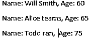
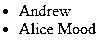
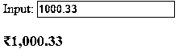
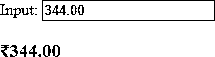

# AngularJS 自定义过滤器

> 原文：<https://www.educba.com/angularjs-custom-filter/>

## AngularJS 自定义过滤器简介

在 AngularJS 中，过滤器用于在视图或 UI 上呈现数据之前修改或更新数据。过滤器在表达式或指令中使用管道符号(|)组合在一起。AngularJS 框架提供了许多内置过滤器，我们可以根据自己的需求直接在项目(代码)中使用它们，内置过滤器的一些例子有大写、小写、货币、orderby 等。这些内置的过滤器涵盖了许多常见的用例，包括日期、货币、字符串等的格式。但有时这些常见的过滤器可能不符合我们的要求，在这种情况下，我们可以在 AngularJS 应用程序中创建自己的自定义过滤器。

### AngularJS 中的自定义过滤器

有时，我们可能需要在应用程序中使用自定义过滤器。AngularJS 框架向我们展示了一个用于创建自定义过滤器的 API。我们可以使用点(.)过滤器(点)到角度模块。创建自定义过滤器的语法

<small>网页开发、编程语言、软件测试&其他</small>

`.filter('filterName', function ( ) {} )`

**自定义过滤器的几个例子:**

可以通过创建自定义过滤器来解决的一些示例需求如下:

*   给输入的任何字符串添加前缀或后缀。
*   从数组中过滤偶数/奇数。
*   基于任何自定义逻辑的过滤器，例如 5 的倍数等。
*   反转字符串或。

### 创建自定义过滤器的步骤

1.  创建 AngularJS 应用程序。
2.  使用(点)。AngularJS 框架提供的过滤 API 来添加。
3.  将过滤器名称和过滤器函数传递给 custom。
4.  用于将输入转换为输出的写逻辑。

**代码:**

`/*Create myApp Angular module */
var myApp = angular.module('myApp' , [ ] );
/* As mentioned above, AngularJS exposes filter API to create custom filters, below code snippet uses filter API to create custom filter, the first parameter is the name of the filter that is firstFilter and second parameter is name of function, second parameter the function returns a function in itself, this is the place where we are supposed to write transformation logic of input to output. */
myApp.filter( 'firstFilter' , function ( ) {
/*return function returned by filter containing logic for transformation*/
return function (input, parameter_1, parameter_2) { let transformedOutput;
/* transform input here, function receives input of filter as input or first parameter */
input
/* Here we can write our custom logic to transform input to output, write logic here */
return transformedOutput;
} } ) ;`

### AngularJS 自定义过滤器示例

下面是 AngularJS 过滤器的框架:

`myApp.filter('filterNameHere', function () { return function () {
return;
} ;
} ) ;`

#### 示例#1

这是一个示例代码，它创建一个自定义的过滤器来创建一个人的数组的过滤器，并返回一个年龄超过 60 岁(老年人)的数组。让我们假设一个包含姓名和年龄的个体的输入数组，我们希望在我们的模块中有一个全局过滤器，以根据人的年龄和标记为老年人来过滤数组。

**代码:**

`persons = [ {
name: 'Andrew John', age:25
} ,
{
name: 'Will Smith', age:60
},
{
name: 'Mark Taylor', age:35
} , {
name: 'Alice teams', age:65
} ,
{
name: 'Todd ran',
age:75
} ] ;
var myApp = angular.module('myApp', []);
myApp.filter('seniorCitizenFilter', function () { return function (personsArray) {
let seniorCitizen = personsArray.filter((person) => { return person.age>59;
})
return seniorCitizen;
} ;
} ) ;`

**模板中过滤器的使用:**

`<ul>
<li ng-repeat="seniorCitizen in persons | seniorCitizenFilter"> Name : {{ seniorCitizen .name}} , Age: {{ seniorCitizen .age}}
</li>
</ul>`

**输出:**

这是我们的第一个自定义过滤器的输出，该过滤器接受一个具有的人员数组，每个人都是一个具有年龄属性的对象，seniorCitizenFilter 检查数组中的每个项目，如果每个项目的年龄大于 59，则检查每个项目的年龄，并返回一个新数组。

#### 实施例 2

这个自定义过滤器接受 Javascript 中的输入和单个字符串，如果字符串以提供的字符开头，则返回。这段代码使用 regex 检查字符串是否以提供的字符开头。

**代码:**

`var myApp = angular.module( 'myApp', [ ] ); myApp.controller('PersonController', function () {
this.personName = [ { name: 'Andrew'
} , {
name: 'Mill'
} , {
name: 'Mar Hut'
} , {
name: 'Alice Mood'
}, {
name: 'Mask Tor'
} ] ;
} ) ;
myApp.filter('startsWithChar', function () { return function (items, char) {
let filteredArray = [];
for (let i = 0; i < items.length; i++) { let item = items[ I ];
if (/char/i.test(item.name.substring ( 0, 1) ) ) { filteredArray.push(item);
}
}
return filteredArray;
} ;
} ) ;`

**HTML 代码:**

`

<ul>
<li ng-repeat="person in person. personName | startsWithChar :a">
{{person.name}}
</li>
</ul>

`

**输出:**

在输出中，我们可以看到过滤后的以字符“A”开头的名字，<李>标签运行两次，在 UI 上打印或呈现两个名字。上述两个自定义过滤器实际上是过滤输入数据或数组，并给我们一个新的数组，但在 AngularJS 中，我们也可以使用过滤器来转换数据并给我们提供新的数据，例如自定义货币过滤器。

#### 实施例 3

**代码:**

`var myApp = angular.module('myApp', []); myApp.controller('myController', function ($scope) {
$scope.amount = 1000.33;
});
app.filter('INRFormatter', function () { return function (input) {
if (! isNaN(input)) {
let currencySymbol = '₹';
let result = input.toString().split('.');
let lastThree = result[0].substring(result[0].length - 3);
let otherNum = result[0].substring(0, result[0].length - 3); if (otherNum != '')
lastThree = ',' + lastThree;
let output = otherNum.replace(/\B(?=(\d{2})+(?!\d))/g, ",") + lastThree;
if (result.length > 1) { output += "." + result[1];
}
}
});
return currencySymbol + output;
}`

*   **模板中的第一次使用**

`<! DOCTYPE html>
<html ng-app="app">
<head>
</head>
<body ng-controller="myController">
Input: <input type="text" ng-model="amount">
<h3>{{amount | INRFormatter}}</h3>
</body>
</html>`

**输出:**

*   **第二个** **在模板中的用法**

`<! DOCTYPE html>
<html ng-app="app">
<head>
</head>
<body ng-controller="testController">
Input: <input type="text" ng-model="amount">
<h3>{{344.00 | INRFormatter}}</h3>
</body>
</html>`

**输出:**

### 结论

AngularJS 是一个非常强大的 web 开发框架，它为我们提供了一种通过过滤器来转换和过滤 UI 本身上的数据的方法，框架为我们提供了一些内置的过滤器，如果需要的话，框架会公开。过滤器 API 创建自定义过滤器根据我们的要求。

### 推荐文章

这是一个 AngularJS 自定义过滤器的指南。在这里，我们讨论创建自定义过滤器的介绍和步骤，以及不同的示例和代码实现。您也可以看看以下文章，了解更多信息–

1.  [角度验证](https://www.educba.com/angularjs-validation/)
2.  [角滤波器](https://www.educba.com/angularjs-filters/)
3.  [AngularJS 服务](https://www.educba.com/angularjs-services/)
4.  [AngularJS 货币过滤器](https://www.educba.com/angularjs-currency-filter/)