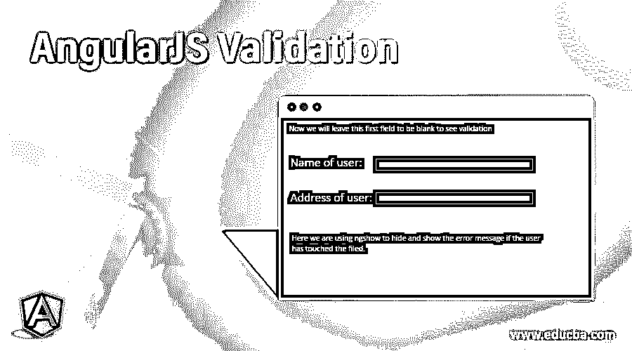
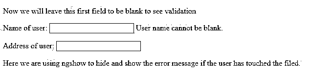
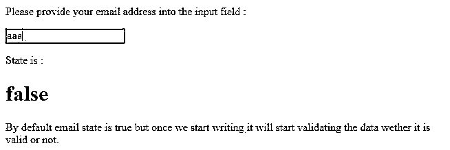
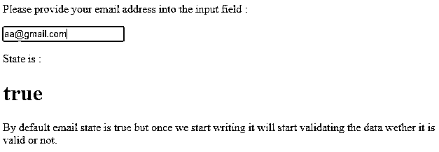
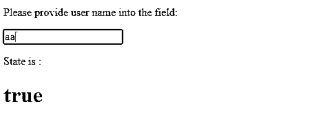
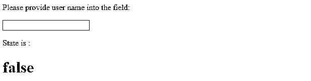
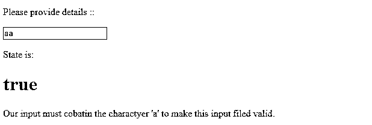

# AngularJS 验证

> 原文：<https://www.educba.com/angularjs-validation/>




## AngularJS 验证简介

AngularJS 提供客户端表单验证。我们使用 AngularJS 作为一个前端框架，非常容易扩展和编码，并开发了我们的单页 angular web 应用程序。除此之外，AngularJS 验证还为我们提供了一些更令人兴奋的[特性，比如表单验证](https://www.educba.com/jquery-form-validation/)，它只验证客户端的用户输入，而不会将它们发送到后端服务器进行验证。此外，它减少了我们的后端代码和代码维护的复杂性。在 angular 中，我们有表单验证，也可以创建自定义验证。

### 角度验证的状态

AngularJS 提供了用户表单验证来检查用户输入数据。这在将它们提交给服务器之前用作客户端验证。AngularJS 跟踪所有我们提供给用户输入数据的输入字段，它可以是任何像从下拉列表中选择，输入字段，文本区域等。如果我们对用户字段进行了任何类型的修改，它会不断通知用户验证的当前状态，还会跟踪被修改、被触碰或未被触碰的文件。

<small>网页开发、编程语言、软件测试&其他</small>

所以在 angular js 中，我们把状态分成了两部分。它们特定于表单和字段。

#### 1.输入字段状态

因为我们在表单中提供了不同的输入字段，所以它们具有不同的状态，如下所示，并且所有这些字段都具有布尔值 true 或 false:

*   **$dirty:** 该状态表示该文件是否被修改。
*   **$ touched:**这个状态基本上是用来表示当前表单字段是否被触摸。
*   **$valid:** 这个文件很重要，因为它显示我们提供的输入数据根据要求输入的内容是有效的。
*   **$touched:** 它简单的用来表示该字段被触摸。
*   **$invalid:** 该文件用于根据我们要求输入的内容，显示我们提供的输入内容无效。
*   **$ priest:**这表示我们没有对该文件做任何事情，也就是说用户没有修改它。

#### 2.表单状态

现在的表单状态如下所有的状态将适用于整个表单字段，而不是特定的一个或两个:

*   **$valid:** 适用于整个表单，用来显示字段是否有效。
*   **$dirty:** 用于显示多个字段是否被修改。
*   **$submitted:** 该状态用于表示表单已提交。
*   **$ priest:**应用于整个表单以显示多个尚未修改的字段。
*   **$invalid:** 用于显示要求输入的表单字段无效。

类似地，所有这些表单状态也有布尔值 true 或 false。我们可以用这些状态向用户显示一些消息，也可以说是错误消息或成功消息。

下面是一个演示验证的示例:

**代码:**

```
<!DOCTYPE html>
<html>
<script src="https://ajax.googleapis.com/ajax/libs/angularjs/1.6.9/angular.min.js"></script>
<body ng-app="">
<p>Now we will leave this first field to be blank to see validation</p>
<form name="myForm">
<p>Name of user:
<input name="myName1" ng-model="myName1" required>
User name cannot be blank.
</p>
<p>Address of user:
<input name="myAddress1" ng-model="myAddress1" required>
</p>
</form>
<p>Here we are using ngshow to hide and show the error message if the user has touched the filed.
</p>
</body>
</html>
```

****输出:****




### AngularJS 验证示例

在 angular 中，我们有一些内置的验证，如 email 和 required，它们可以直接应用到字段中进行验证。

#### 示例#1

电子邮件验证。

如果我们有包含用户电子邮件的用户输入，但我们需要验证输入数据，所以我们可以直接将此字段作为电子邮件类型。是 HTML5 的特色。下面是一个展示如何使用它的例子。

**代码:**

```
<!DOCTYPE html>
<html>
<script src="https://ajax.googleapis.com/ajax/libs/angularjs/1.6.9/angular.min.js"></script>
<body ng-app="">
<p>Please provide your email address into the input field :</p>
<form name="myForm1">
<input type="email" name="myInput" ng-model="myInput">
</form>
<p>State is :</p>
<h1>{{myForm1.myInput.$valid}}</h1>
<p>By default email state is true but once we start writing it will start validating the data whether it is valid or not.</p>
</body>
</html>
```

**输出:**




当我们提供正确的电子邮件格式时，它将显示以下输出:




#### 实施例 2

必需的验证。

这也是 HTML5 的一个特性，可以根据需要生成文件。下面是一个简单的例子来说明如何使用它。

**代码:**

```
<!DOCTYPE html>
<html>
<script src="https://ajax.googleapis.com/ajax/libs/angularjs/1.6.9/angular.min.js"></script>
<body ng-app="">
<p>Please provide user name into the field:</p>
<form name="myForm1">
<input name="myInput1" ng-model="myInput1" required>
</form>
<p>State is :</p>
<h1>{{myForm1.myInput1.$valid}}</h1>
</body>
</html>
```

**输出:**




当输入字段保持为空时，它将显示如下输出:




我们还可以进行自定义验证，这意味着我们可以根据需求构建自己的验证。但这并不容易，我们需要做很多事情，使代码难以理解。为此，我们需要向我们的应用程序添加一个新的指令，如下所示。

#### 实施例 3

自定义验证。

**代码:**

```
<!DOCTYPE html>
<html>
<script src="https://ajax.googleapis.com/ajax/libs/angularjs/1.6.9/angular.min.js"></script>
<body ng-app="myApp">
<p>Please provide details ::</p>
<form name="myForm">
<input name="myInput" ng-model="myInput" required my-directive1>
</form>
<p>State is:</p>
<h1>{{myForm.myInput.$valid}}</h1>
<script>
var app = angular.module('myApp', []);
app.directive('myDirective1', function() {
return {
require: 'ngModel',
link: function(scope, element, attr, mCtrl) {
function myValidation1(value) {
if (value.indexOf("a") > -1) {
mCtrl.$setValidity('charE', true);
} else {
mCtrl.$setValidity('charE', false);
}
return value;
}
mCtrl.$parsers.push(myValidation1);
}
};
});
</script>
<p>Our input must contain the character 'a' to make this input filed valid.</p>
</body>
</html>
```

**输出:**




这里我们添加了一个名为 mydirective1 的新指令。它有一些命名对流应该是 camel case，但是当我们试图调用这个指令时它应该用'-'隔开。我们还向 ngModel 返回一个对象。现在我们将创建一个函数，它根据需要接受参数，这里 mCTRL1 是 ngModelCotroller。现在，通过提供一些值来测试输入，它将根据传递的值返回 true 或 false。

### 结论

所以 AngularJS 验证在提交给后端之前为我们提供了客户端验证。所以它减少了一些后端调用来提高性能。此外，我们还可以通过在 AngularJS 中创建一个指令来创建自定义验证，并将它们与控制器链接起来，并在函数中提供逻辑。

### 推荐文章

这是 AngularJS 验证的指南。这里我们讨论 AngularJS 验证的介绍和状态，以及不同的例子和代码实现。您也可以阅读以下文章，了解更多信息——

1.  [角滤波器](https://www.educba.com/angularjs-filters/)
2.  [AngularJS 自定义滤镜](https://www.educba.com/angularjs-custom-filter/)
3.  [角度事件](https://www.educba.com/angularjs-events/)
4.  [AngularJS 货币过滤器](https://www.educba.com/angularjs-currency-filter/)