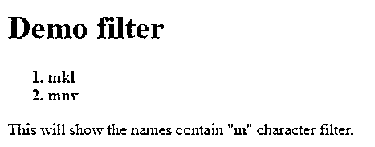
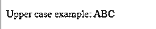
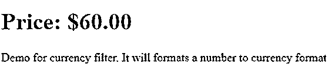
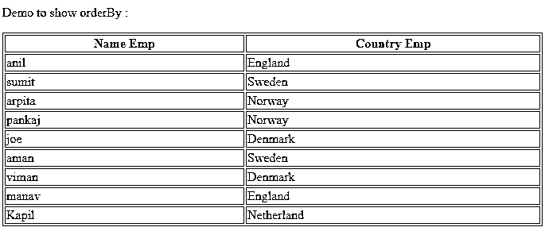
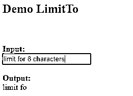
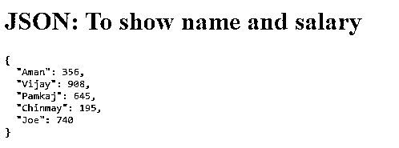
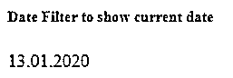
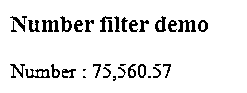

# AngularJS 过滤器

> 原文：<https://www.educba.com/angularjs-filters/>


## AngularJS 滤波器简介

过滤器用于过滤元素。换句话说，angular js 中的 filter 用于过滤元素和对象，并返回过滤后的项目。filter 从原始数组中选择一个子集。

**语法:**

<small>网页开发、编程语言、软件测试&其他</small>

```
{{ arrayexpression | filter : expression : comparator : anyPropertyKey }}
```

*   **comparator** :该属性用于确定值，比较过滤表达式的期望值和对象数组的实际值。
*   **anyPropertyKey** :这是一个特殊的属性，用于将值与给定的属性进行匹配。它有一个缺省值$。
*   **arrayexpression** :获取我们应用了过滤器的数组。
*   **表达式**:满足过滤条件后，从数组中选择项目。

### AngularJS 过滤器示例

以下是 angularjs 过滤器的示例:

```
<!DOCTYPE html>
<html>
<head>
<title>AngularJS | filter Filter</title>
<script src=
"https://ajax.googleapis.com/ajax/libs/angularjs/1.6.9/angular.min.js">
</script>
</head>
<body>
<div ng-app="myApp" ng-controller="namesCtrl">
<h1 style="color:green;">Demo filter</h1>
<ol>
<strong>
<li ng-repeat="x in names | filter : 'm'">
{{ x }}
</li>
</strong>
</ol>
</div&gt
<script>
angular.module('myApp', []).controller(
'namesCtrl', function($scope) {
$scope.names = [
'xyz',
'abc',
'uth',
'ert',
'opu',
'wrf',
'mkl',
'hgt',
'mnv'
];
});
</script>
<p>
This will show the names contain "m" character filter.
</p>
</body>
</html>
```

**输出:**




### AngularJS 中可用的过滤器列表

Angular js 提供了许多内置过滤器，如下所列。

*   **大写**:该过滤器用于将字符串格式化为大写。
*   **小写**:该过滤器用于将字符串格式化为小写。
*   **货币**:该过滤器用于将数字格式化为当前格式。
*   **orderBy** :该过滤器用于通过表达式对数组进行过滤或排序。
*   **limitTo** :该过滤器用于将字符串/数组限制为指定长度或数量的元素或字符。
*   json :这个过滤器用于将对象格式化为 json 字符串。
*   **过滤器**:这个过滤器从一个数组中选择项目的子集。
*   **日期**:该过滤器用于将日期格式化为指定的格式。
*   **数字**:该过滤器用于将数字格式化为字符串。

### 向表达式添加过滤器的示例

让我们借助例子来说明如何给表达式添加过滤器:

#### 例子#1:大写

**代码:**

```
<!DOCTYPE html>
<html>
<script src="https://ajax.googleapis.com/ajax/libs/angularjs/1.6.9/angular.min.js"></script>
<body>
<div ng-app="myApp" ng-controller="personCtrl">
<p>Upper case example: {{ lastName | uppercase }}</p>
</div>
<script>
angular.module('myApp', []).controller('personCtrl', function($scope) {
$scope.firstName = "xyz",
$scope.lastName = "abc"
});
</script>
</body>
</html>
```

**输出:**




#### 例子#2:小写

**代码:**

```
<!DOCTYPE html>
<html>
<script src="https://ajax.googleapis.com/ajax/libs/angularjs/1.6.9/angular.min.js"></script>
<body>
<div ng-app="myApp" ng-controller="personCtrl">
<p>Lower case example: {{ lastName | lowercase }}</p>
</div>
<script>
angular.module('myApp', []).controller('personCtrl', function($scope) {
$scope.firstName = "XYZ",
$scope.lastName = "ABC"
});
</script>
</body>
</html>
```

**输出:**


**例 3:货币**

**代码:**

```
<!DOCTYPE html>
<html>
<script src="https://ajax.googleapis.com/ajax/libs/angularjs/1.6.9/angular.min.js"></script>
<body>
<div ng-app="myApp" ng-controller="currencyCtrl">
<h1>Price: {{ price | currency }}</h1>
</div>
<script>
var app = angular.module('myApp', []);
app.controller('currencyCtrl', function($scope) {
$scope.price = 60;
});
</script>
<p>Demo for currency filter. It will format a number to currency format</p>
</body>
</html>
```

**输出:**




### 向指令添加过滤器的示例

让我们借助示例来看看如何向指令添加过滤器:

#### 示例#1:排序依据

**代码:**

```
<!DOCTYPE html>
<html>
<script src="https://ajax.googleapis.com/ajax/libs/angularjs/1.6.9/angular.min.js"></script>
<body>
<p>Demo to show orderBy : </p>
<div ng-app="myApp" ng-controller="nameandcountryCtrl">
<table border="1" width="100%">
<tr>
<th ng-click="orderByMe('nameEmp')">Name Emp</th>
<th ng-click="orderByMe('countryEmp')">Country Emp</th>
</tr>
<tr ng-repeat="x in names | orderBy:myOrderBy">
<td>{{x.nameEmp}}</td>
<td>{{x.countryEmp}}</td>
</tr>
</table>
</div>
<script>
angular.module('myApp', []).controller('nameandcountryCtrl', function($scope) {
$scope.names = [
{nameEmp:'anil',countryEmp:'England'},
{nameEmp:'sumit',countryEmp:'Sweden'},
{nameEmp:'arpita',countryEmp:'Norway'},
{nameEmp:'pankaj',countryEmp:'Norway'},
{nameEmp:'joe',countryEmp:'Denmark'},
{nameEmp:'aman',countryEmp:'Sweden'},
{nameEmp:'viman',countryEmp:'Denmark'},
{nameEmp:'manav',countryEmp:'England'},
{nameEmp:'Kapil',countryEmp:'Netherland'}
];
$scope.orderByMe = function(x) {
$scope.myOrderBy = x;
}
});
</script>
</body>
</html>
```

**输出:**




#### 例子 2: LimtTo

**代码:**

```
<!DOCTYPE html>
<html>
<script src=
"https://ajax.googleapis.com/ajax/libs/angularjs/1.6.9/angular.min.js">
</script>
<body>
<h2>Demo LimitTo </h2>
<br>
<br>
<div ng-app="myApp" ng-controller="myCtrl">
<strong>Input:</strong>
<br>
<input type="text" ng-model="string">
<br>
<br>
<strong>Output:</strong>
<br>
{{string|limitTo:8}}
</div>
<script>
var app = angular.module('myApp', []);
app.controller('myCtrl', function($scope) {
$scope.string = "";
});
</script>
</body>
</html>
```

**输出:**




#### 示例 3: Json

**代码:**

```
<!DOCTYPE html>
<html>
<head>
<script src=
"https://ajax.googleapis.com/ajax/libs/angularjs/1.6.9/angular.min.js">
</script>
</head>
<body>
<div ng-app="result" ng-controller="resultCtrl">
<h1>JSON: To show name and salary</h1>
<pre>{{names | json}}</pre>
</div>
<script>
var app = angular.module('result', []);
app.controller('resultCtrl', function($scope) {
$scope.names = {
"Aman" : 356,
"Vijay" : 908,
"Pamkaj" : 645,
"Chinmay" : 195,
"Joe" : 740
};
});
</script>
</body>
</html>
```

**输出:**




#### 例 4:日期

当我们不指定日期格式时，它采用默认格式 MMM d，yyyy’。这里时区参数是可选的。接受两个参数格式和时区。

**语法:**

```
{{ date | date : format : timezone }}
```

一些预定义的日期格式如下:

*   **“中时”:**相当于“时:分:秒 a”(凌晨 2:35:05)
*   **“短日期”:**相当于“年月日”(19 年 5 月 7 日)
*   **“中”:**相当于“MMM d，y h:mm: ss a”
*   **“长日期”:**相当于“MMMM d，y”(2019 . 5 . 7)
*   **“短”:**相当于“M/d/yy h: mm a”
*   **“短时”:**相当于“h: mm a”(凌晨 2:35)
*   **“完整日期”:**相当于“EEEE，MMMM d，y”(2019 年 5 月 7 日，星期二)
*   **“中日期”:**相当于“MMM d，y”(2019 . 5 . 7)

**代码:**

```
<!DOCTYPE html>
<html>
<head>
<title>Date Filter to show current date</title>
<script src=
"https://ajax.googleapis.com/ajax/libs/angularjs/1.6.9/angular.min.js">
</script>
</head>
<body>
<h5>Date Filter to show current date</h5>
<div ng-app="gfgApp" ng-controller="dateCntrl">
<p>{{ today | date : "dd.MM.y" }}</p>
</div>
<script>
var app = angular.module('gfgApp', []);
app.controller('dateCntrl', function($scope) {
$scope.today = new Date();
});
</script>
</body>
</html>
```

**输出:**




#### 例 5:数字

**代码:**

```
{{ string| number : fractionSize}}
<!DOCTYPE html>
<html>
<head>
<title>Number Filter</title>
<script src=
"https://ajax.googleapis.com/ajax/libs/angularjs/1.6.9/angular.min.js">
</script>
</head>
<body>
<div ng-app="gfgApp" ng-controller="numberCntrl">
<h3>Number filter demo</h3>
<p>Number : {{ value| number  : 2}}</p>
</div>
<script>
var app = angular.module('gfgApp', []);
app.controller('numberCntrl', function($scope) {
$scope.value = 75560.569;
});
</script>
</body>
</html>
```

**输出:**




### 角度过滤器的优势

Angular js 为我们提供了许多内置的过滤器，可以根据我们的需要过滤我们的数据。但是有更多的优势，我们可以创建自己的自定义过滤器。

过滤器用于处理我们的数据。它们提供了更快的处理速度，因此也提高了性能。过滤器也非常健壮。

### 结论

我们可以在角度应用的任何地方使用过滤器，如指令、表达式、控制器等。我们还可以根据我们希望对数据进行排序的属性来创建自定义过滤器。它还减少了代码，使其更具可读性和优化，通过创建自定义过滤器，我们可以将它们保存在单独的文件中。

### 推荐文章

这是一个 AngularJS 过滤器的指南。在这里，我们将讨论简介、AngularJS 中可用的过滤器列表、优点以及适当的示例。您也可以阅读以下文章，了解更多信息——

1.  [角度指令](https://www.educba.com/angularjs-directives/)
2.  [角度 JS 的用途](https://www.educba.com/uses-of-angular-js/)
3.  [角度选择](https://www.educba.com/angular-alternatives/)
4.  [角度验证](https://www.educba.com/angularjs-validation/)