# 安圭拉动画

> 原文：<https://www.educba.com/angularjs-animations/>

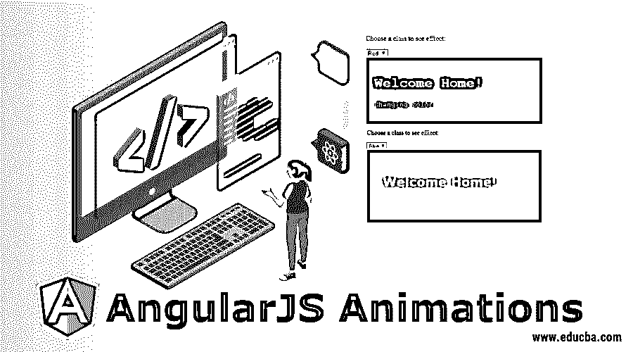


## AngularJS 动画简介

以下文章提供了 AngularJS 动画的概述。在 AngularJS 中，我们可以在 CSS 的帮助下[构建动画效果。这个 CSS 将转换 HTML 元素，给我们运动的错觉。如果我们想在 angular js 中创建动画运动，我们可以使用 ngAnimate 模块，它将为我们提供对基于 CSS 的动画的支持。但是这里有一个大问题什么是动画？所以动画是用来产生动态运动效果的东西。所以这里我们的 ngAnimate 给了我们 CSS 和 JavaScript 的组合效果。](https://www.educba.com/what-is-css/)

### 角度动画的类型

我们基本上有三种可以用 AngularJS 实现的动画类型，如下所示:

<small>网页开发、编程语言、软件测试&其他</small>

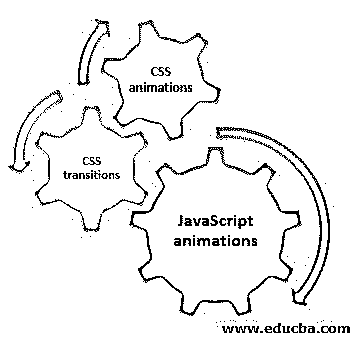


*   JavaScript 动画
*   [CSS 转换](https://www.educba.com/css-transition-effects/)
*   [CSS 动画](https://www.educba.com/css-animation-transition/)

每种类型的动画都有自己的效果，它们非常适合不同的环境。

### 角度动画事件的类型

我们有五个动画事件，如下所示:

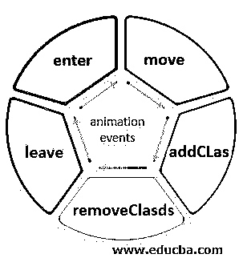


*   移动
*   添加类别
*   removeclass
*   离开
*   进入

**语法:**

如果我们想在 body 标签中引用 nganimate 模块:

```
<body ng-app="ngAnimate">
ng-app="ngAnimate"
```

但是为此，我们需要在我们的项目示例中包含一些库:

```
src="https://ajax.googleapis.com/ajax/libs/angularjs/1.6.9/angular-animate.js"
```

还有一件事，ngAnimate 模块为我们的 HTML 元素移除和添加类。

我们用来添加或删除类的指令如下:

*   ng 秀
*   ng 隐藏

展示上述属性的示例:

**代码:**

```
<html>
<style>
div {
transition: 0.6s;
border-radius: 500%;
height: 100px;
width: 100px;
background-color: blue;
display: inline-block;
}
.ng-hide {
background-color: green;
top: 5px;
left: 100px;
}
</style>
<script src=
"https://ajax.googleapis.com/ajax/libs/angularjs/1.6.9/angular.min.js">
</script>
<script src=
"https://ajax.googleapis.com/ajax/libs/angularjs/1.6.9/angular-animate.js">
</script>
<body ng-app="ngAnimate">
<h4>Click checkbox to hide the circle
<input type="checkbox"
ng-model="myCheck">
</h4>
<div ng-hide="myCheck"></div>
</body>
</html>
```

**输出:**

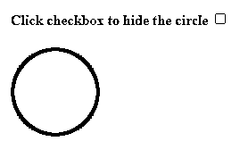


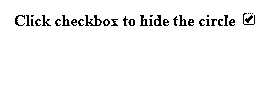


### 它在 AngularJS 中是如何工作的？

在 AngularJS 中，我们有 ngAnimate，当我们执行隐藏、显示等事件时，它只是添加或删除类。在 AngularJS 中，我们有很多内置指令，如下所示:

*   ng-重复
*   ng 级
*   ng 秀
*   ng 隐藏
*   天然气开关
*   ng-if
*   ng 视图

### 实现 AngularJS 动画的示例

以下是 AngularJS 动画的示例:

#### 示例 1:ng-重复

Angular js ng-repeat 用于迭代对象给定的次数。我们使用 ng-repeat 的元素将在集合中的每个项目上重复一次。但是为了迭代，它必须是一个数组。

**代码:**

```
<!DOCTYPE html>
<html>
<script src="https://ajax.googleapis.com/ajax/libs/angularjs/1.6.9/angular.min.js"></script>
<body ng-app="myApp" ng-controller="myCtrl">
<h5 ng-repeat="x in records">{{x}}</h5>
<script>
var app = angular.module("myApp", []);
app.controller("myCtrl", function($scope) {
$scope.records = [
"content one to be displayed",
"content two to be displayed",
"content three to be displayed",
"content four to be displayed",
]
});
</script>
</body>
</html>
```

**输出:**

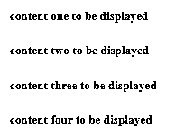


#### 示例#2: ng 类

ng-class 指令用于将 CSS 应用于 HTML 元素，或者使用 CSS 为 HTML 元素提供一些效果或运动。ng-class 将值作为对象、数组或字符串。如果值是一个字符串，那么它应该包含空格分隔的类名，一个或多个名称。对于数组元素，它可以是如上所述的字符串或对象。也可以是两者的结合。如果是对象，它应该是一个键-值对，其中键是类名，值是布尔值，只有当布尔值为真时，才会添加该类。

**语法:**

```
<element ng-class="expression"></element>
```

**代码:**

```
<!DOCTYPE html>
<html>
<script src="https://ajax.googleapis.com/ajax/libs/angularjs/1.6.9/angular.min.js"></script>
<style>
color:white;
background-color:red;
padding:20px;
font-family:"Courier New";
}
.tomato {
background-color:blue;
padding:40px;
font-family:Verdana;
}
</style>
<body ng-app="">
<p>Choose a class to see efftect:</p>
<select ng-model="home">
<option value="sky">Red</option>
<option value="tomato">Blue</option>
</select>
<div ng-class="home">
<h1>Welcome Home!</h1>
<p>Changing color.</p>
</div>
</body>
</html>
```

**输出:**

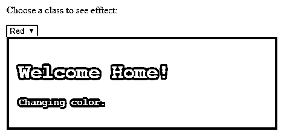


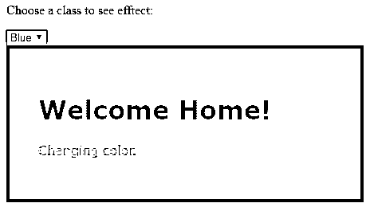


#### 示例#3: ng-show

ng-show 指令用于在值为 true 时显示 html 元素。否则，它将被隐藏。

**语法:**

```
<element ng-show="expression"></element>
```

**代码:**

```
<!DOCTYPE html>
<html>
<script src="https://ajax.googleapis.com/ajax/libs/angularjs/1.6.9/angular.min.js"></script>
<body ng-app="">
Show HTML Text: <input type="checkbox" ng-model="myVar">
<div ng-show="myVar">
<h1>Welcome</h1>
<p>it will display.</p>
</div>
</body>
</html>
```

**输出:**


单击复选框按钮后，输出如下所示:

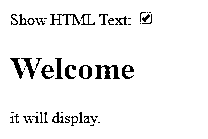


#### 示例 4: ng-hide

ng-hide 指令用于仅在布尔值为真时隐藏 HTML 元素。默认情况下，它是可见的。

**语法:**

```
<element ng-hide="expression"></element>
```

**代码:**

```
<!DOCTYPE html>
<html>
<script src="https://ajax.googleapis.com/ajax/libs/angularjs/1.6.9/angular.min.js"></script>
<body ng-app="">
Hide HTML: <input type="checkbox" ng-model="myVar">
<div ng-hide="myVar">
<h1>ng-hide example</h1>
<p>This will hide</p>
</div>
</body>
</html>
```

**输出:**

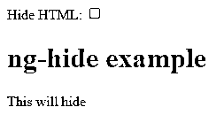


单击复选框按钮后，输出如下所示:

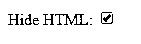


#### 示例 5:天然气开关

这用于隐藏或显示 html 元素，取决于表达式或值匹配参数。

**语法:**

```
<element ng-switch="expression">
<element ng-switch-when="value"></element>
<element ng-switch-when="value"></element>
<element ng-switch-default></element>
</element>
Supported by all
```

**代码:**

```
<!DOCTYPE html>
<html>
<script src="https://ajax.googleapis.com/ajax/libs/angularjs/1.6.9/angular.min.js"></script>
<body ng-app="">
Select one thing:
<select ng-model="myVar">
<option value="car">Car
<option value="choclate">Chocalte
<option value="language">language
</select>
<hr>
<div ng-switch="myVar">
<div ng-switch-when="car">
<h1>Car</h1>
<p>Welcome to a world of car.</p>
</div>
<div ng-switch-when="tuts">
<h1>Chocalte</h1>
<p>everyone favourite.</p>
</div>
<div ng-switch-when="choclate">
<h1>language</h1>
<p>Read about language.</p>
</div>
<div ng-switch-default>
<h1>Switch</h1>
<p>Need to select content.</p>
</div>
</div>
<hr>
<p>The ng-switch directive hides and shows HTML sections depending on a certain value.</p>
<p>If we select some value from dropdown so this example will change the content depending upon the expression</p>
</body>
</html>
```

**输出:**

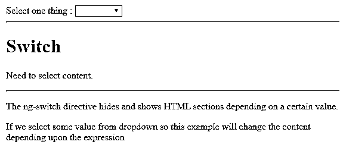


选择汽车选项后，输出如下所示:


#### 示例#6: ng-if

如果布尔值为假，ng-if 指令将删除 html 元素。如果表达式的值被评估为 true，那么将添加一个 DOM 元素。该指令不同于 ng-show 和 ng-hide，它们都隐藏或显示元素，但这将完全删除 DOM 元素。

**语法:**

```
<element ng-if="expression"></element>
```

**代码:**

```
<!DOCTYPE html>
<html>
<script src="https://ajax.googleapis.com/ajax/libs/angularjs/1.6.9/angular.min.js"></script>
<body ng-app="">
Demo for ng-if to show/hide: <input type="checkbox" ng-model="myVar" ng-init="myVar = true">
<div ng-if="myVar">
<h1>ng-if</h1>
<p>ng-if demo</p>
<hr>
</div>
<p>please click the checkbox to remove the content</p>
<p> This will return if check checkbox</p>
</body>
</html>
```

**输出:**

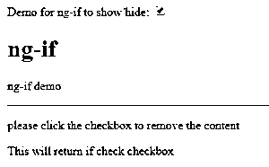


取消选择复选框按钮后，输出如下所示:

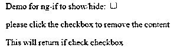


#### 示例#7: ng 视图

ng-view 指令将为特定视图创建占位符。我们需要将它定义到主模块中。

**语法:**

```
<div ng-app = "mainApp">
...
<div ng-view></div>
</div>
```

它使用脚本标签创建视图。

**代码:**

```
<div ng-app = "mainApp">
...
<script type = "text/ng-template" id = "add.htm">
<h2> Add employee </h2>
{{message}}
</script>
</div>
```

### 结论

因此 AngularJS 为我们提供了 ngAnimate 指令来对 HTML 元素执行动画或一些效果或动作，但为此，我们需要使用 CSS 来查看结果。

### 推荐文章

这是 AngularJS 动画的指南。这里我们讨论一下基本概念，AngularJS 中的动画是如何工作的？还有例子。您也可以看看以下文章，了解更多信息–

1.  [AngularJS 架构](https://www.educba.com/angularjs-architecture/)
2.  [角度单位测试](https://www.educba.com/angularjs-unit-testing/)
3.  [角度版本](https://www.educba.com/angularjs-versions/)
4.  [角度选择](https://www.educba.com/angularjs-alternatives/)