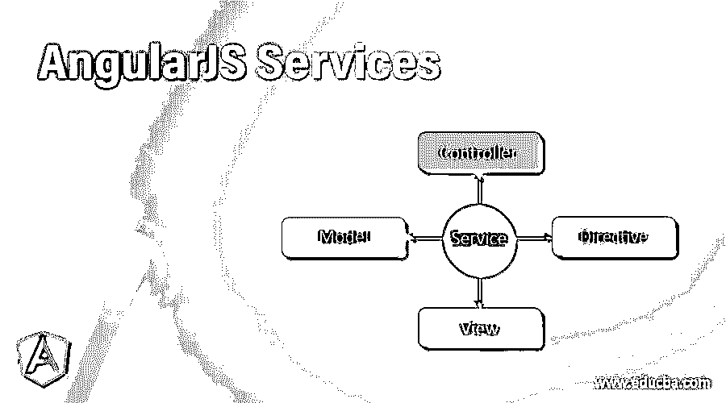

# 安古拉杰服务公司

> 原文：<https://www.educba.com/angularjs-services/>




## AngularJS 服务简介

Angular 是一个用 [JavaScript 编写的框架，](https://www.educba.com/what-is-javascript/)用来设计前端。这个框架非常强大，用来做单页应用。通过使用 angular 框架，我们可以编写遵循模型-视图-控制器方法的应用程序。在本主题中，我们将了解 AngularJS 服务。

Angular 还让我们创建用于与后端服务器通信的服务。Angular 为我们提供了许多内置服务，并让我们创建自己的服务。这些服务是可注入的，遵循[依赖注入机制](https://www.educba.com/dependency-injection-in-spring/)。这些服务是执行一些特定任务的 JavaScript 函数。我们有一些角度内置服务的例子，如$location、$route、$window 等等。但是 angular js 应用程序只有在组件依赖于服务或者必须使用服务执行某些任务时才会实例化服务。基本上每个组件都依赖于某种服务。

<small>网页开发、编程语言、软件测试&其他</small>

### 解释 AngularJS 服务

我们有这么多 angular js 提供的内置服务，我们也可以创建自己的定制服务。下面列出了一些内置服务:

**1。$** **解析:**该服务用于将任何角度表达式转换成适当的函数。

**2。$** **rootScope** :在 angular js 中，它用来给变量提供根作用域，或者我们可以说它给变量提供全局作用域。它提供了模型和视图之间的分离。每个 angular 应用程序都有一个根作用域。

**3。$rootElement** :这个服务可以说是 angular 应用的根元素。

**4。$locale:** 这个内置的 angular 服务为我们提供了 angular js 各个组件的本地化规则。

**5。$q:** 这个服务用于异步运行我们的任何函数。该服务使用返回值，当处理完成时，返回值可以是任何值。

**6。$sceDelegate:** 此服务由后端的另一个名为$sce 的服务使用。

7 .**。$log:** 这个 angular js 内置服务很有用。基本上[用于控制台记录器](https://www.educba.com/javascript-console-log/)跟踪日志。

**8。$location** :基本上，这个服务解析来自浏览器的 URL，并使这个 URL 对我们的 angular js 应用程序可用。它对 URL 所做的更改反映了$location 服务。

**9。$httpBackend** :这个 angular js 服务用于浏览器不兼容。

10。$filter: Filter 用于过滤元素。换句话说，angular js 中的 filter 用于过滤元素和对象，并返回过滤后的项目。filter 从原始数组中选择一个子集。

**语法:**

```
{{ arrayexpression | filter : expression : comparator : anyPropertyKey }}
```

*   **比较器**:我们用一个比较器来比较任何值。比较器主要是比较实际值和预期值，分别来自过滤后的数组和对象数组。这类似于 java 中的比较器。
*   **any property key**:any property key 用于比较给定键对应的值。它有一个缺省值$。
*   **arrayexpression** :获取我们应用了过滤器的数组。
*   **表达式**:满足过滤条件后，从数组中选择项目。

**11。$document** :该服务用于读取 jQuery 包装的引用。

**12。$http** :该服务提供浏览器和 http 服务器之间的通信。它可以通过浏览器的 XML 请求对象或使用 json 对象连接到 Http 服务器。

13。$httpParamSerializer :此服务用于将对象转换为字符串，它是默认的 param 序列化程序。

**14。$interval** :这个服务是一个有角度的包装器。

15。$xhrFactory :这个 angular js 服务用于创建 XMLHttpRequest 对象。

16。$exceptionHandler :每当我们在 angular 应用程序中得到一个未被捕获的异常时，这个异常就会被转移到这个服务中。它有一个压缩的实现，简单地将它转移到$log.error，用于将一个异常打印到浏览器控制台以备将来使用。

**17。$interpolate:** 这个服务被编译器用于数据绑定，它基本上是一个用于数据绑定的服务。它符合用于插值的字符串。

18。$httpParamSerializerJQLike :这是一个$http 参数序列化程序，这个序列化程序按字母顺序对参数进行排序。它还使用了 jQuery 的逻辑方法。

**19。$controller** :这是应用程序开始的主要点。这也负责实例化角度组件。所以基本上它实例化了角度控制器。

**举例:**

```
$controller(constructor, locals);
```

如果我们从字符串调用它，那么它将被认为是一个字符串，用于检索构造函数如下:

*   检查当前作用域上的字符串。
*   检查注册了给定名称的控制器。

如果这是从函数调用的，那么它被认为是一个构造函数。

20。$templateCache :如果我们第一次加载任何模板，那么它会被加载到模板缓存中，以便更快地检索。

**21。$window:** 这个服务用来引用浏览器窗口对象。因为它是一个全局变量，所以会导致测试问题，因为它在 JavaScript 中是全局存在的。所以在 angular 中，我们总是引用这个$window 服务来避免这种类型的问题。

**22。$templateRequest** :这个服务用于运行安全检查。成功运行安全检查后，它使用$http 下载模板，并在成功时将模板内容存储到$templateCache 中。

**23。$animateCss** :这个服务用于执行动画。但是为了这个，我们需要包含 ngAnimate 来拥有动画。

**24。$compile** :该服务用于将 DOM 或 HTML 元素编译成模板，并产生一个模板函数。我们进一步使用它将模板和范围链接在一起。

**25。$cacheFactory** :该服务用于创建缓存对象。该服务包含、检索并保存键值对，并提供对其他服务的访问。

**26。$timeout** :这是超时的角度包装器服务。

**27。$anchorScroll** :该服务用于滚动到$location.hash()中指定的页面。

**28。$sce** :发布此服务是为了提供上下文转义。

**29。$animate** :该服务用于提供对 DOM 实用程序方法的暴露，这些方法反过来提供对动画的支持。

### 结论

所以角度服务被用来过滤我们的数据，服务器和浏览器之间的通信，解析等等。我们也可以拥有自己的服务，根据需求执行自己的逻辑。

### 推荐文章

这是 AngularJS 服务指南。这里我们分别讨论 angular js 提供的简要概述和内置服务。您也可以看看以下文章，了解更多信息–

1.  [什么是 AngularJS](https://www.educba.com/what-is-angularjs/)
2.  [AngularJS 架构](https://www.educba.com/angularjs-architecture/)
3.  [角度选择](https://www.educba.com/angularjs-alternatives/)
4.  [角度版本](https://www.educba.com/angularjs-versions/)