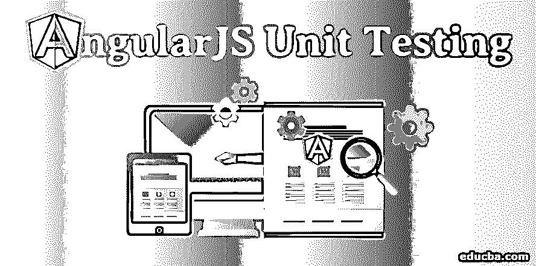
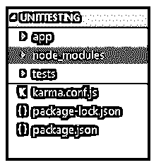
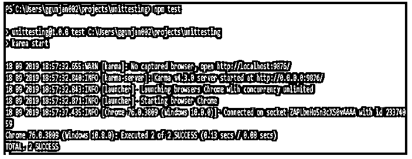

# 角度单位测试

> 原文：<https://www.educba.com/angularjs-unit-testing/>




## AngularJS 单元测试简介

使用 AngularJS，你可以构建令人惊叹的用户界面，但是当你的项目变得复杂时，单元测试就成为了一个重要的部分。为了提高代码质量，测试非常重要。在单元测试中，我们孤立地测试一个组件的功能，不需要任何外部资源例如数据库、文件等。单元测试易于编写，执行速度更快。在单元测试中，我们不测试应用程序的功能，因此可信度低。AngularJS 由各种构建模块组成，如服务、组件、[指令](https://www.educba.com/angularjs-directives/)等。对于它们中的每一个，我们需要编写单独的测试用例。

### 单元测试的基础

以下是单元测试的基础。

<small>网页开发、编程语言、软件测试&其他</small>

1.  我们需要遵循干净的编码实践。
2.  应用与功能代码相同的原则。
3.  测试用例是 10 行或更少的小函数/方法。
4.  使用适当的命名约定。
5.  他们只有一个责任，即只测试一件东西。

### AngularJS 测试工具

AngularJS 的测试工具如下。

#### 1)茉莉

测试 javascript 代码的开发框架。它提供了帮助构建测试用例的功能。随着项目变得越来越复杂，测试越来越多，保持项目的良好结构和文档记录是非常重要的，Jasmine 有助于实现这一点。要将 Jasmine 与 Karma 一起使用，请使用 karma-jasmine 测试运行程序。

#### 2)因果报应

用于在开发 AngularJS 应用程序时编写和运行单元测试的测试运行程序。它提高了开发人员的生产力。它将产生一个加载应用程序代码并执行测试用例的 web 服务器。
是通过 npm/yarn 安装的 NodeJS 应用。它可以配置为在各种浏览器上运行，以确保应用程序可以在所有可用的浏览器上运行。

#### 3)角模型

AngularJS 提供了 ngMock 模块，为我们提供了模拟测试。它们用于在单元测试中注入和模仿 [AngularJS 服务](https://www.educba.com/angularjs-services/)。

### 环境设置

1.  在您的系统上安装 NodeJS。([https://nodejs.org/en/download/](https://nodejs.org/en/download/))。
2.  安装任何 IDE(比如 VS 代码，括号等等。).
3.  在您的目录中创建一个空文件夹($mkdir 单元测试)。
4.  在 IDE 中打开单元测试文件夹。然后打开单元测试文件夹中的终端(命令提示符)。
5.  在终端中逐个执行以下命令:
    Create package . JSON:
    NPM initInstall Angular:
    NPM I Angular–save install Karma:
    NPM I-g Karma–save-devInstall Jasmine:
    NPM I Karma-Jasmine-core–save-devInstall Angular mocks:
    NPM I Angular-mocks–save-devInstall Karma Chrome 浏览器:
    NPM I Karma-Chrome-launcher–save-dev
6.  在单元测试文件夹中创建两个名为 app 和 tests 的文件夹。
7.  在终端中给出下面的命令:
    karma init
    它会问你一系列的问题。选择下面的答案。
    - >选择测试框架为 Jasmine。
    - >选择 Chrome 作为浏览器。
    - >指定你的 js 和 spec 文件的路径(app/*js 和 tests/*.spec.js)
    - >再多问几个问题就好了。
    - >打开 karma.config.js 文件，路径和插件如下图。下面是 karma.config.js 文件。

```
// Karma configuration
module.exports = function(config) {
config.set({
// base path is used to resolve all patterns
basePath: '',
plugins:['karma-jasmine','karma-chrome-launcher'],
frameworks: ['jasmine'],
// list of files to load in the browser
files: [
'node_modules/angular/angular.js',
'node_modules/angular-mocks/angular-mocks.js',
'app/*.js',
'tests/*.spec.js'
],
// list of files to exclude
exclude: [],
preprocessors: {},
reporters: ['progress'],
// server port
port: 9876,
// enable / disable colors in output
colors: true,
logLevel: config.LOG_INFO,
// enable / disable watch mode for files
autoWatch: true,
browsers: ['Chrome'],
singleRun: false,
// how many browser should start simultaneous
concurrency: Infinity
})
}
```

完成这些步骤后，文件夹的结构应该如下所示:




### 实施示例

让我们学习实现的例子。

#### 测试过滤器

过滤器是将数据转换为人类可读格式的方法。在本模块中，我们将创建一个过滤器，并为该过滤器编写单元测试，检查它是否按预期工作。
步骤:

在 app 文件夹中创建一个名为 filter.js 的文件。

**filter.js**

```
angular.module('MyApp', [])
.filter('compute',[function(){
return function(number){
if(number<0){
return 0;
}
return number+1;
}
}])
```

现在，让我们编写单元测试用例来检查过滤器是否按预期工作。

#### Jasmine 框架方法

*   Describe():它定义了一个测试套件——一组相关的测试。
*   It():定义一个规范或测试。
*   Expect():它接受一个实际值作为参数，并与一个匹配器函数链接。
*   Matcher 函数:将期望值作为参数。它负责向 Jasmine 报告预期是真是假。

**举例:**

toBe('value ')、to contin(' value ')、toEqual(12)、toBeNull()、toBeTruthy()、toBeDefined()。

在测试文件夹中创建一个名为 filter.spec.js 的文件。

**filter.spec.js**

**代码:**

```
//1\. Describe the object type
describe('Filters', function () {
//2\. Load the Angular App
beforeEach(module('MyApp'));
//3\. Describe the object by name
describe('compute', function () {
var compute;
//4\. Initialize the filter
beforeEach(inject(function ($filter) {
compute = $filter('compute', {});
}));
//5\. Write the test in the it block along with expectations.
it('Should return 0 if input is negative', function () {
const result = compute(-1);
expect(result).toBe(0); //pass
});
it('Should increment the input if input is positive', function () {
const result = compute(1);
expect(result).toBe(2);//pass
//expect(compute(3)).toBe(5);//fail
});
});
});
```

要运行测试，在单元测试文件夹终端中给出下面的命令。
Karma start
或者你可以在 package.json 测试脚本中设置“Karma start”并给出下面的命令。
npm 测试

这将打开 chrome 浏览器。

**端子输出:**




#### 测试控制器和服务

AngularJS 将逻辑与视图层分开，这使得控制器和服务易于测试。
步骤:
1。在 app 文件夹中创建一个名为 controller.js 的文件。

**controller.js**

```
var app = angular.module('Myapp', [])
app.service('calcService',[
function(){
function square(o1){
return o1*o1;
}
return {square:square};
}
]);
app.controller('MyController', function MyController($scope) {
$scope.title = "Hello MyController";
$scope.square = function() {
$scope.result = calcService.square($scope.number);
}
});
```

2.在测试文件夹中创建一个名为 controller.spec.js 的文件。

**控制器.规格. js**

```
describe('MyController', function() {
var controller, scope;
beforeEach(angular.mock.module('Myapp'));
beforeEach(angular.mock.inject(function($rootScope, $controller) {
scope = $rootScope.$new();
controller = $controller('MyController', { $scope : scope });
}));
it('Title should be defined', inject(function ($rootScope, $controller) {
expect(scope.title).toBeDefined();
}));
it('Title as Hello MyController', inject(function ($rootScope, $controller) {
expect(scope.title).toEqual('Hello MyController');
}));
});
describe('square', function(){
var calcService;
beforeEach(function(){
module('Myapp');
inject( function($injector){
calcService = $injector.get('calcService');
});
});
it('should square the number', function(){
var result = calcService.square(3);
expect(result).toBe(9);
});
});
```

**端子输出:**


### 结论

AngularJS 应用程序由模块组成。在应用层，这些是 AngularJS 模块。在模块级别，这些是服务、工厂、组件、指令和过滤器。它们中的每一个都能够通过其外部接口相互通信。为 AngularJS 应用程序编写单元测试用例可以加快调试和开发过程。

### 推荐文章

这是一个 AngularJS 单元测试指南。在这里，我们讨论单元测试的介绍和基础，以及 AngularJS 测试工具和实现的例子。您也可以阅读以下文章，了解更多信息——

1.  [职业生涯](https://www.educba.com/career-in-angularjs/)
2.  [反应与角度](https://www.educba.com/reactjs-vs-angularjs/)
3.  [角度 JS 应用](https://www.educba.com/angular-js-application/)
4.  [角度动画](https://www.educba.com/angularjs-animations/)