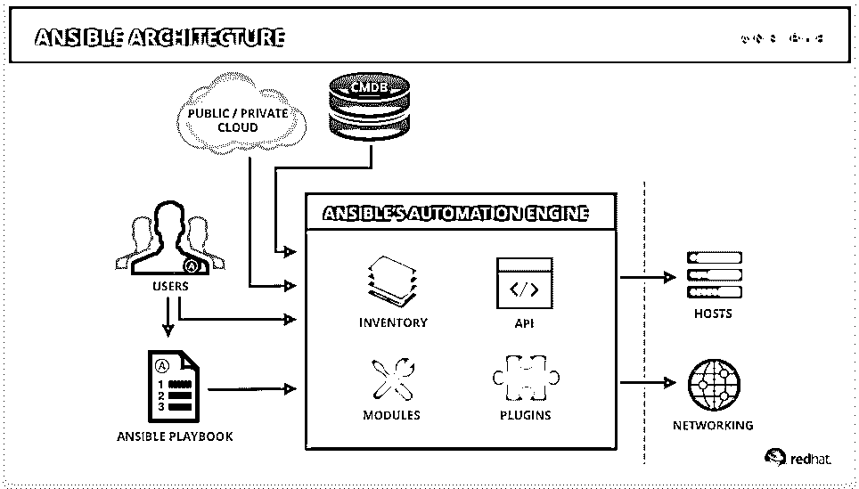
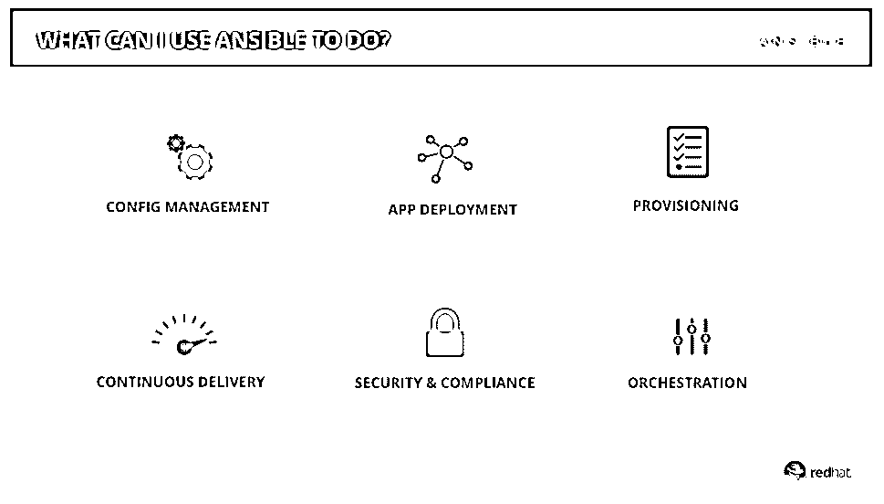

# 什么是 Ansible？

> 原文：<https://www.educba.com/what-is-ansible/>

## Ansible 简介

Ansible 是一个开源自动化框架(或平台),用于 IT 任务，如软件部署、配置管理、基础设施服务和供应的协调。如今，自动化至关重要，过于复杂的 IT 环境往往需要快速扩展，系统经理和设计人员无法手动掌握所有信息。自动化简化了复杂的任务，允许开发人员专注于为组织增加价值的其他任务，而不仅仅是使开发人员的工作得到更好的管理。

### 谅解

它简单、强大且无需代理。Ansible 和其他工具的最大区别在于架构；它采用“推送”模式，即不需要在服务器上安装额外的软件。默认情况下，它通过 SSH (Linux & Unix)或 WinRM (windows)管理远程连接。

<small>网页开发、编程语言、软件测试&其他</small>

下面是 Ansible 的架构图:

让我们详细了解一下各个组件的功能。

*   Ansible automation engine 包含清单、API、模块和插件。
*   可行的行动手册:它利用行动手册来自动化和编排 It 基础架构。本行动手册包含一个自动化任务，作为 ansible 自动化引擎的输入，它描述了一个特定的自动化部分将如何工作。
*   本行动手册由一系列“行动”组成，这些行动定义了跨一组称为“清单”的主机的自动化任务。每个“行动”由多个任务组成，这些任务可以为清单中的一个或多个主机提供服务。所有这些任务都调用了 Ansible 模块，ansi ble 模块是执行特定任务的一小段代码。
*   任务的典型示例可能是安装任何软件或将配置文件放在服务器上。更复杂的任务可能是在 Amazon EC2 中旋转整个云形成基础设施。
*   它配备了数百个模块，从管理网络设备的[、简单的配置管理到维护每个云提供商基础设施的模块。](https://www.educba.com/types-of-network-devices/)
*   这些模块的设计方式是，它首先检查任务是否需要执行；例如，如果一个 ansible 任务要启动一个 Tomcat 服务器，那么这个任务只有在它还没有运行的时候才会被执行。这种现象被称为“等幂”,它允许重复执行配置而不会造成任何混乱。
*   这些剧本任务也可以重用；这些可重用的单元被称为“角色”。可以轻松利用这些角色来执行冗余任务，例如跨开发、UAT 和生产服务器应用通用服务器配置。

**Note:** You don’t have to write these roles from scratch, Ansible Galaxy community site contains thousand of roles that you can use and customize as per your needs.

### 你能用 Ansible 做什么？

这样，您就可以自动化下面提到的任务。

假设您有一个 java web 应用程序，需要部署在多个服务器上，例如开发、UAT 和生产。为了部署 war 文件，首先，您需要在所有机器上设置 web 服务器和数据库服务器。同样，[相同的 SQL 脚本需要](https://www.educba.com/what-is-sql/)在所有数据库中运行来设置数据库。现在手动执行这个多余的任务已经没有意义了。

有了这个，你需要做的就是在剧本里写下简单的任务，Ansible 会替你执行这些多余的任务。

### 所需技能

与 puppet & chef(类似 ansible 的自动化工具)需要具备 ruby 的知识不同，有了 ansible，你不需要学习任何复杂的编程语言。Ansible 使用 YAML，这是一种高级的人类可读语言，IT 管理员可以很容易理解。此外，大多数常见任务都可以在 [Ansible Galaxy](https://www.educba.com/ansible-galaxy/) 社区中以剧本的形式获得，您可以根据自己的需求进行扩展。

### 为什么要用 Ansible？

现在让我们看看为什么我们应该在我们的项目中使用 Ansible。

*   使用它，你可以将某些过程从几个小时缩短到几分钟。
*   它消除了重复性的任务。
*   它节省了时间，提高了生产率。
*   更少的错误和失误。
*   增强问责制和合规性。

### 谁是学习这些技术的合适受众？

您一定认为这项技术与 IT 基础设施和维护相关，这通常由 IT 管理员或部署团队负责，而您作为开发人员，不需要理解这一点，但让我打破这种刻板印象。如您所知，在 DevOps 中，开发和运营工作是集成的，它为开发和运营提供了一个稳定的环境。因此，开发人员必须理解剧本中所写的任务，这一点很重要，如果开发环境中有任何变化，他/她应该能够针对其他环境相应地对剧本进行更改，以实现应用程序生命周期的平稳编排。

### 这项技术将如何帮助你的职业发展？

是简历中必备的技术。如今，所有其他公司都在努力实现所有流程的自动化，以提高应用程序和资源的整体生产率和效率。通常部署在全球不同服务器上的企业应用程序需要持续的服务器配置和管理，这需要大量的时间和精力。如果你对 Ansible 之类的自动化工具非常了解，并且能够编写剧本来自动化这项多余的任务，这肯定会让你脱颖而出，并有助于你的职业发展。

### 结论

读完这篇文章后，您一定对 Ansible 是什么，ansible 有什么能力，以及如何通过实现 Ansible 来提高项目的整体效率和生产率有了清晰的了解。如果您想深入了解这个主题，可以查看 Red Hat Ansible 官方网站上提供的白皮书和示例行动手册。

### 推荐文章

这是一个什么是可行的指南？在这里，我们讨论了 Ansible 的工作方式，以及它如何以及在哪些方面有助于职业发展。您也可以浏览我们推荐的其他文章，了解更多信息——

1.  [可执行的命令](https://www.educba.com/ansible-commands/)
2.  [可替换替换](https://www.educba.com/ansible-replace/)
3.  [可翻译版本](https://www.educba.com/ansible-versions/)
4.  [副本](https://www.educba.com/ansible-copy/)

