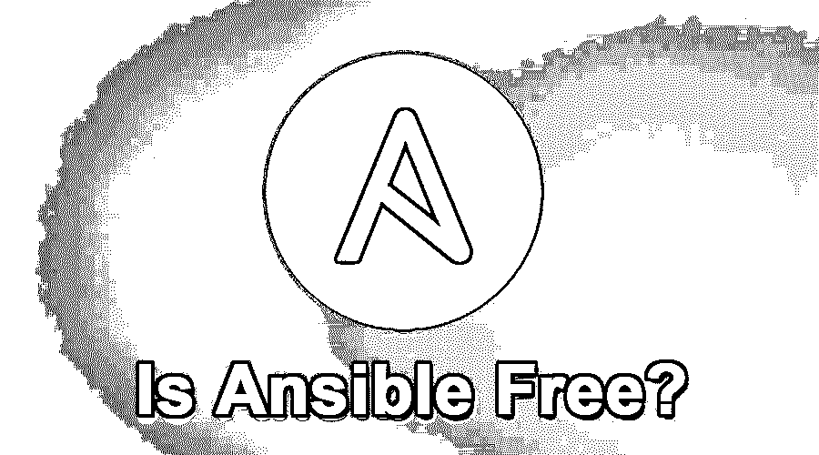

# Ansible 免费吗？

> 原文：<https://www.educba.com/is-ansible-free/>

## Ansible 免费吗？

是的，Ansible 是一个完全免费的开源工具，用于上述目的。因为 Ansible 采用了标准的 GNU(通用公共许可证)，所以只要遵守 GNU 的政策，它就可以用于商业目的。

1.  基于 CLI 的使用是免费的，没有任何限制。
2.  Ansible Tower 可免费处理多达 10 个节点。超过这个范围可能需要付费许可。Ansible Tower 提供了一个简洁的图形用户界面，带有一个仪表盘，可以用来对主机、变量、作业等进行分组。
3.  Ansible AWX 是免费的，即 Ansible 塔的开源上游项目。

### 什么是 Ansible？

Ansible 是一个简单的现代 IT 自动化引擎，可以自动化数千台服务器的配置管理、云供应、应用程序部署等。从在服务器上安装软件包开始，甚至是重新启动服务，无论是任何类型的本地或远程任务。Ansible 将为您无缝完成。

<small>网页开发、编程语言、软件测试&其他</small>

### 为什么是 Ansible？

如果您必须管理和配置单个系统，您是单个用户，而您的用户是单个机器，那么单个 bash 脚本将非常有用。但是当您扩展到更多数量的计算机、多个任务、更多用户和更多管理员时，您会发现 bash 脚本是不够的和高效的。这正是 Ansible 发挥作用的地方。Ansible 可以被视为精心培育的 bash 或 [shell 脚本，可以](https://www.educba.com/shell-scripting-commands/)一次性配置您庞大的基础设施拓扑。

另外，Ansible 以 Ansible playbooks 的形式使用了一种非常简单的语言，叫做 YAML (YAML 不是标记语言),它允许你以一种和口语一样好的方式来描述你的自动化任务。

### Ansible Free 的架构

Ansible 基本上是用 Python 语言写的[。Ansible 连接到你的节点，推送叫做“模块”的小代码。这些程序针对多个节点运行，以达到所需的状态。例如，可能会要求一个 Ansible 模块在一台机器上运行几组命令来安装某个包，并在执行结束时检查包的状态是否为已安装。Ansible 创建一个与节点的 SSH 连接，运行模块，一旦执行完成，它就从节点中删除这些模块。您的模块可以驻留在集群中的任何节点上。](https://www.educba.com/what-is-python/)

### Ansible 的组件

*   **Master** :这是负责 Ansible 机器配置的主机。
*   **Inventory**:Inventory 是一个描述 Ansible 可以访问的节点的文件。可以在清单文件中对节点进行分组，并相应地进行命名。

典型的库存文件应该是这样的

`[webservers] server1
[application] server1
server2`

服务器名称可以是它们的 DNS 或 IP 地址。

*   **剧本**:描述 Ansible 要完成的自动化任务的 YAML 文件。

典型的剧本应该是这样的——

`---
hosts: localhost
- name: install python
yum: name=python state=installed`

*   任务:这是描述 Ansible 在语句中要采取的动作的块。例如:安装 httpd。
*   模块:这些是为我们完成任务的可执行插件。Ansible 为我们提供了许多内置模块。我们也可以编写自己的定制模块。
*   角色:随着时间的推移，一个可行的剧本会变得非常庞大，维护它会非常困难。因此，通过角色，人们可以将任务分组为子集，并有效地管理内容。这些角色(任务组)可以相应地重用。
*   **Play** :剧本的执行被称为 Play。
*   **事实**:这些是将在可翻译剧本中引用的全局变量。
*   **处理程序**:用于调用服务状态变化，如重启或停止服务，安装或卸载软件包。

### Ansible Free 的优势

以下是下面提到的优点:

1.  Ansible 以无代理方式管理机器，您不必在客户端机器上安装任何 Ansible 代理/服务软件。
2.  Ansible 支持文件/命令/代码的推和拉。
3.  Ansible 是一个关注安全性的工具。它使用 OpenSSH 作为安全传输协议。
4.  剧本(通常被称为剧本)是在 YAML 写的，因此非常容易阅读。
5.  Ansible 在这里的核心思想是，你只做那些需要的事情，以及那些重复做而没有副作用的事情。
6.  如果需要，那么 Ansible 可以轻松[连接 Kerberos](https://www.educba.com/kerberos/) ，LDAP(轻量级目录访问协议)等集中式认证管理系统。
7.  高阶重要性的一个优点是不需要成为 bash 或 shell 脚本专家。Ansible 自己处理。因此，使用 Ansible，工作变得非常简单和直接。
8.  在节点上运行 Ansible playbook 任务并不真的需要成为根用户。它可以获得根用户权限。

### 我们为什么关心 Ansible？

1.  Ansible 正在形成 DevOps 工具的[核心。](https://www.educba.com/career-in-devops/)
2.  Ansible 是最小的，学习和使用都很简单。Ansible 的创造者迈克尔·德哈安(Michael DeHaan)说:“这是一种 6 个月不用的工具，回来后你仍然记得。”
3.  Ansible 遵循并行任务执行机制，这使得它更快更好。

### Ansible 与其他自动化工具

除了 Ansible，还有很多其他的配置和管理工具，比如 Chef、Puppet、Salt 等等。

1.  Ansible 使用一个更好的源代码控制系统选项作为其真实的来源，而其他工具如 Chef 将自己的服务器作为真实的来源。我说的真理来源，是指权威的配置。
2.  Ansible 更关注编排而不是管理。
3.  与其他工具不同，Ansible 利用主机系统的动态和静态清单。

### 从 Ansible 开始

1.  您可以通过参考此处的 Ansible 文档开始。
2.  你可以找到所有来自 [Ansible Galaxy](https://www.educba.com/ansible-galaxy/) 的社区剧本。
3.  你可以在这里找到一些好的视频。

### 结论

正如他们所说，“世界上最好的东西都是免费的”。Ansible 是最好的免费开源自动化引擎，无论你是想自动化他的配置和管理还是 DevOps 任务，你都必须接受它。

### 推荐文章

这是一个指南，可以免费吗？这里我们讨论了它的组件、优点和架构。您也可以浏览我们推荐的其他文章，了解更多信息——

1.  [可执行的命令](https://www.educba.com/ansible-commands/)
2.  [可回答的面试问题及答案](https://www.educba.com/ansible-interview-questions/)
3.  [可行的架构](https://www.educba.com/ansible-architecture/)
4.  [可回答的标签](https://www.educba.com/ansible-tags/)

