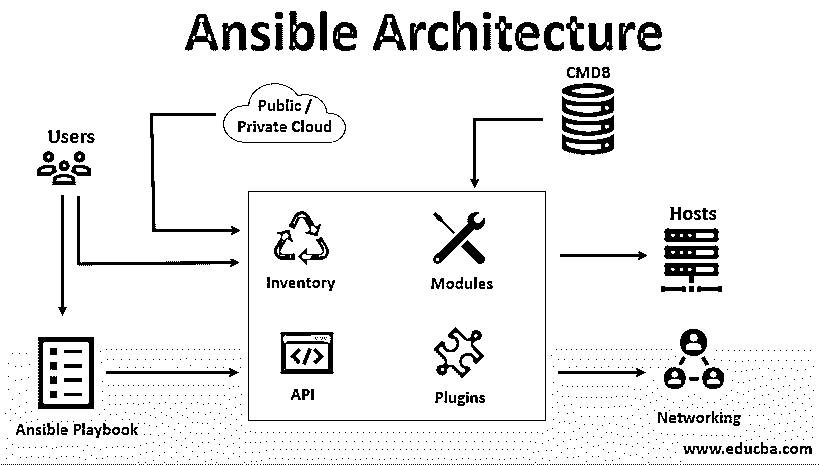
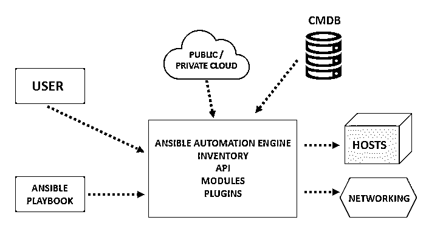

# 可行建筑

> 原文：<https://www.educba.com/ansible-architecture/>

## Ansible 架构简介

任何组织的共同任务都是频繁部署应用程序，包括自动化、云配置和许多其他 IT 工具。Ansible 是一个非常容易理解的开源工具，它不使用任何其他第三方工具或任何复杂的安全机制。它利用剧本来执行组件的整个端到端自动化。基本上，剧本是用简单的人类可读语言编写的，包括 YAML(另一种标记语言)。所有的配置文件大部分是用 YAML 写的。因此，使用它的总体优势是，任何新的 it 人员也可以阅读它，了解机器级自动化或代码级的东西，并提供调试功能。在本文中，我们将详细了解 ansible 的架构。

Ansible 的美妙之处在于它不仅仅是为单层部署而构建的。它适用于多层系统和基础设施。它通常被称为无代理，这意味着它通过默认登录(ssh)连接节点来工作。

<small>网页开发、编程语言、软件测试&其他</small>

每当它[涉及机器的软件或硬件](https://www.educba.com/hardware-vs-software/)时，它明显地进入产品的图像配置管理，因此，非常需要跟踪整个健康检查和更新细节的记录。

例如，任何软件的新版本发布时，组织的 IT 团队如何检查它。一个可能的解决方案是在企业的所有机器上安装所有更新的软件，如 [WebLogic serve](https://www.educba.com/weblogic-vs-jboss/) r。不可能在所有服务器上手动安装所有软件。

一个非常简单的方法或替代方法是安装 Ansible playbook，它是用非常用户友好的语法和语言编写的。从您的控制机器上运行剧本，所有节点都将更新为最新版本。

### 安斯比尔的建筑

Ansible 架构很容易理解:

从上图中可以看出:

*   **用户:**创建 Ansible 剧本的用户与 ansible 自动化引擎有直接联系。
*   **Ansible 剧本:**它还与 Ansible 自动化引擎和配置管理数据库交互
*   **公共云或私有云:**它们有助于与所有模块和 API 进行交互，也有助于与整个云进行交互，这证明它也有安全措施。
*   **库存:**库存是自动化引擎的一部分，有助于使用自动化进行供应和内部供应。
*   **API:** 帮助创建端到端模块交互所需的 API。
*   **模块:**模块使用行动手册直接运行。模块可以控制所有服务、包、AWS 云形成等。
*   **插件:**所有必要的缓存、日志目的、可扩展功能都有助于创建增强的可扩展内核。
*   **联网:**它有助于自动化利用所有无代理框架的不同网络，并生成有用的配置。
*   **主机:**这里的主机指的是使用 Ansible 实现自动化的 Linux 或 Unix 机器。
*   **CMDB(配置管理数据库):**它是一种存储库，由运营或 It 基础设施的整个计算机网络组成。

### 可行基础设施的优势

下面是解释的优点。

*   **简单易懂:** Ansible 非常简单易懂，语法非常简单，可以被人类可读的数据序列化语言使用。对于初学者理解特别是对于设计基础设施的人来说是非常好的。
*   **功能强大、用途广泛:**这是一个非常强大、用途广泛的工具，有助于真正的协调和管理整个应用或配置管理环境。
*   **高效:**它非常高效，因为它可以根据您的需求进行定制，就像模块可以在部署应用程序的剧本的帮助下调用一样。
*   **无代理:**完全独立的工具，不使用第三方厂商或代理的软件，无代理。
*   **供应:**需要协调的应用从 ansible 获得[总援助，因为它帮助](https://www.educba.com/ansible-versions/)根据项目需求供应资源。
*   **应用程序部署:**便于团队管理从开发到部署的整个生命周期。
*   **编排:** ONAP 编排和所有云原生平台都很好地利用了 ansible 工具。
*   **安全:**安全性是维护安全基础设施的关键，因为所有应用程序都需要安全基础设施来保护应用程序免受安全破坏。

### 结论

我们可以断定 [DevOps 是集成的](https://www.educba.com/what-is-devops/),因为开发和运营团队一起工作。Ansible 扮演了一个非常重要的角色，因为它允许两者一起执行自动化活动，然后进行监控。这是一个非常有前途的工具，事实上，NASA 也使用 Ansible 工具，因为它有能力管理和协调整个基础设施，为开发和运营团队提供更好的提升。在不久的将来，我们可以预测 Ansible 将根据项目生命周期或管道的要求，通过整合升级版本和工具，帮助创建一个更加通用和灵活的环境。

### 推荐文章

这是一个可行的建筑指南。在这里，我们讨论了简介和 ansible 架构，包括用户，ansible 剧本，API，模块等及其优势。您也可以阅读以下文章，了解更多信息——

1.  [如何安装 Ansible？](https://www.educba.com/install-ansible/)
2.  Ansible 是免费的吗？
3.  [可执行的命令](https://www.educba.com/ansible-commands/)
4.  [可回答的面试问题](https://www.educba.com/ansible-interview-questions/)

