# 可行的临时命令

> 原文：<https://www.educba.com/ansible-ad-hoc-commands/>

## Ansible 即席命令简介

Ansible 即席命令是我们可以在一个或多个受管客户机上从终端直接运行的命令。这是在任何客户端上运行命令的最简单、最快捷的方式。它主要用于测试我们不会重复使用的命令。这是一个不需要编写剧本的单行命令，例如检查受管节点与 Ansible 主服务器的连接，管理文件、服务、用户等。它展示了 Ansible 的简单和强大，然而，我们可以一次运行一个模块。

**语法:**

<small>网页开发、编程语言、软件测试&其他</small>

`$ansible [pattern] -m  [module] -a “[module options]”`

*   **模式:**我们在清单中定义受管节点或组。
*   **module:** 在这里，我们定义我们希望针对模式执行 Ansible 的哪个模块。
*   **模块选项:**我们传递模块工作所需的选项，它是可选的。

### 可行的临时命令示例

下面是提到的例子:

**代码:**

`$ansible ansible_client.lab.com -m ping`

**输出:**

**说明:**

在上面的命令中，我们使用“ping”模块来测试主服务器和名为“ansible_client.lab.com”的客户端之间的连接。

### 可行的临时命令

下面给出了一些在我们基础架构的日常管理中使用的可行的特别命令:

1.如果我们想要收集特定主机或主机组的信息。

**例#1**

**代码:**

`$ansible webservers –m setup`

**输出:**

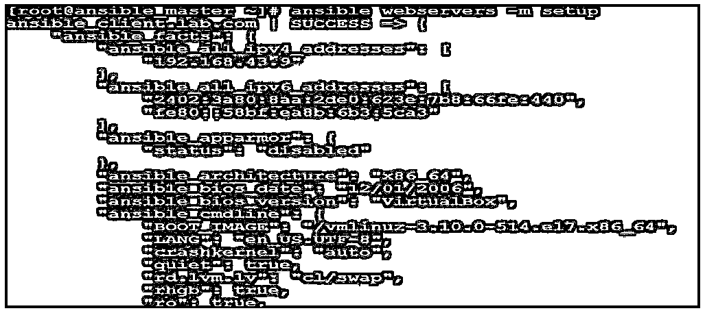

**说明:**

在上面的示例中，我们使用了“setup”模块来获取 webservers 组中节点的详细信息。我们得到了大量的数据作为输出，但是，如果我们对特定的事实感兴趣，我们可以使用“过滤器”选项，如下所示。

**例 2**

**代码:**

`$ansible webservers -m setup -a "filter=ansible_nodename"`

**输出:**

**说明:**

在上面的例子中，我们已经使用‘ansi ble _ nodename’过滤掉了服务器的主机名。

2.我们可以管理软件包，例如安装和卸载软件包，或者在节点上检查软件包的状态。

**例#1:**

**代码:**

`$ansibletest_group -b -m yum -a "name=nginx state=latest"`

**输出:**

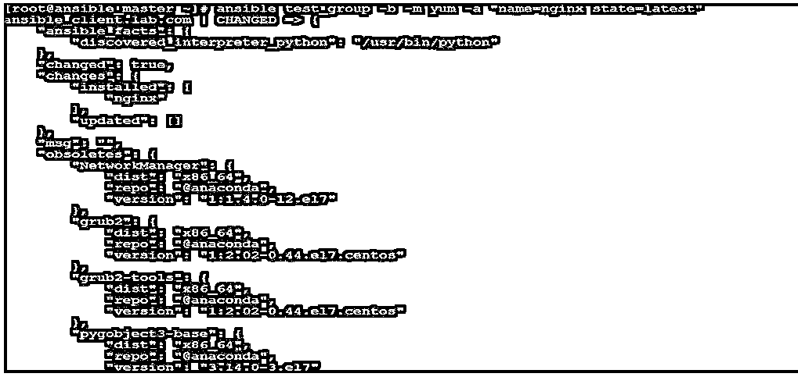

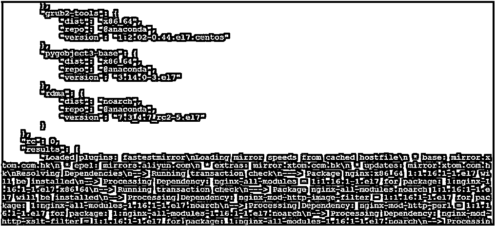

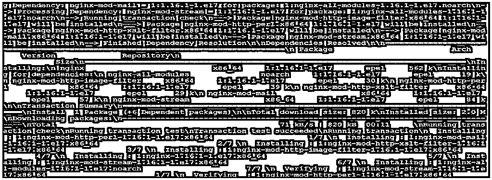

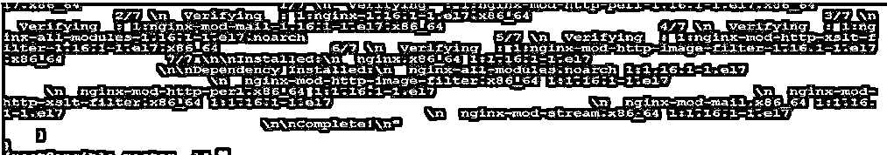

**说明:**

在上面的例子中，我们已经将“nginx”包安装到客户端节点。'-b '选项用于以 root 用户身份运行命令，因为它需要 sudo 权限。我们在临时命令中使用“state = existing”来卸载任何软件包，如下所示。

**例 2:**

**代码:**

`$ansibletest_group -b -m yum -a "name=nginx state=absent"`

**输出:**

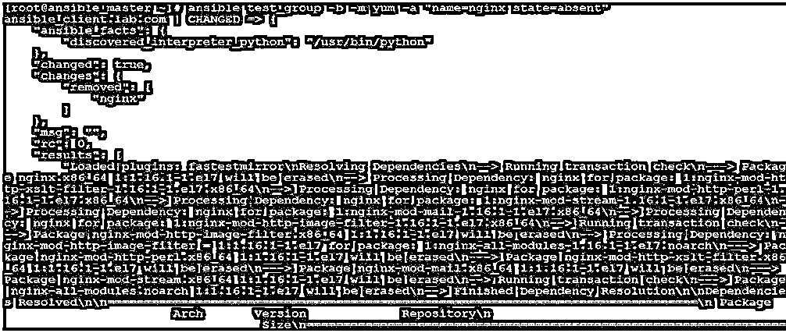

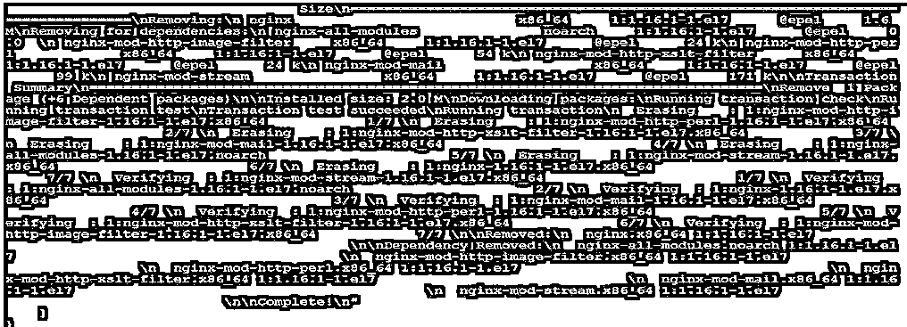

**说明:**

在上面的例子中，我们可以看到 changed 等于 true。这意味着“nginx”包已成功卸载。

3.我们可以使用简单的特别命令来管理文件，例如，创建新文件、删除现有文件和修改文件等。我们使用“文件”模块来管理文件。

**举例:**

**代码:**

`$ansibletest_group -m file -a "path=/root/my_testfile state=touch”`

**输出:**

**说明:**

在上面的示例中，它在“/root”文件夹中创建了一个名为“my_testfile”的文件。如果我们想得到任何文件的细节，只需给出如下路径。

**代码:**

`$ ansibletest_group -m file -a "path=/root/my_testfile"`

**输出:**

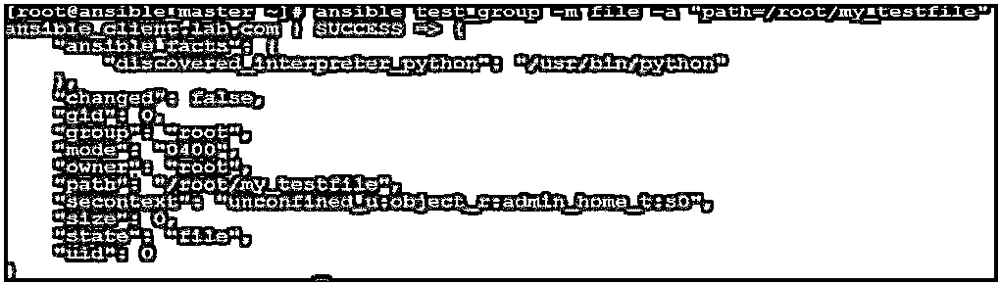

我们也可以改变模式，所有者和文件组，如果我们想如下。

**代码:**

`$ansibletest_group -m file -a "path=/root/my_testfile mode=0400"`

**输出:**

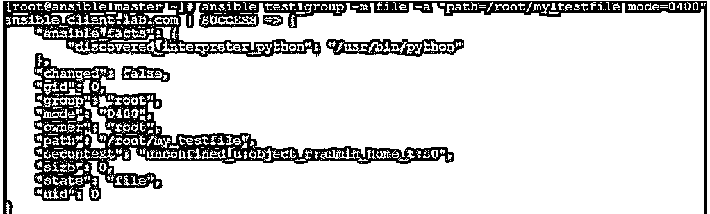

**说明:**

在上面的示例中，如果我们比较之前快照的模式，我们会看到模式已从“0644”更改为“0400”。我们可以在同一个命令中对多项内容进行更改，如组和文件的所有权。如果我们想要删除该文件，将状态值更改为“缺席”,如下所示。

**代码:**

`$ansibletest_group -m file -a "path=/root/my_testfile state=absent"`

**输出:**

4.我们还可以管理用户，如创建新用户、删除任何现有用户、修改组等。

我们使用“用户”模块来管理用户，如下所示。

**例#1:**

**代码:**

`$ansible webservers -b -m user -a "name=jon"`

**输出:**

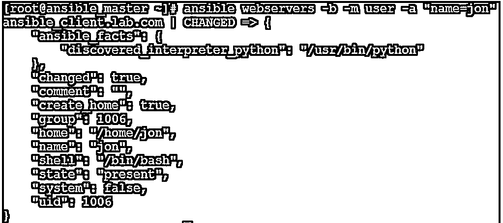

**例 2:**

在上面的示例中，它创建了一个名为“jon”的新用户，现在我们希望将该用户添加到 wheel group，如下所示。

**代码:**

`$ ansible webservers -b -m user -a "name=jon append=yes group=wheel"`

**输出:**

**说明:**

在上面的示例中，它将用户“jon”添加到“wheel”组，我们使用了 append flag 并将其设置为 yes，因为如果我们不使用 append flag 和 yes，它将清除该用户的前一组的详细信息。要删除用户，我们使用“状态”标志，并将其设置为“缺席”，如下所示。

**代码:**

`$ansible webservers -b -m user -a "name=jon state=absent"`

**输出:**

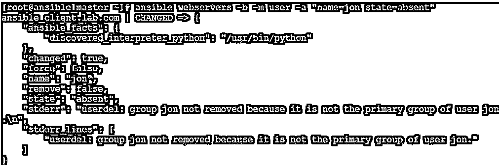

5.我们还可以使用可行的特别命令来管理服务，例如，启动服务、停止服务、检查服务的状态等。我们使用“服务”模块启动服务，如下所示。

**举例:**

**代码:**

`$ansible ansible_client.lab.com -m service -a "name=httpd state=started"`

**输出:**

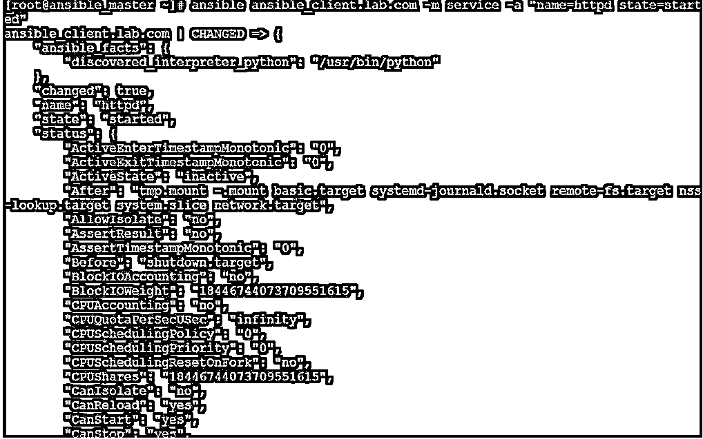

**说明:**

在上面的示例中，我们已经使用客户机节点上的“service”模块启动了“httpd”服务。只需登录到客户机节点，验证服务是否正在运行。

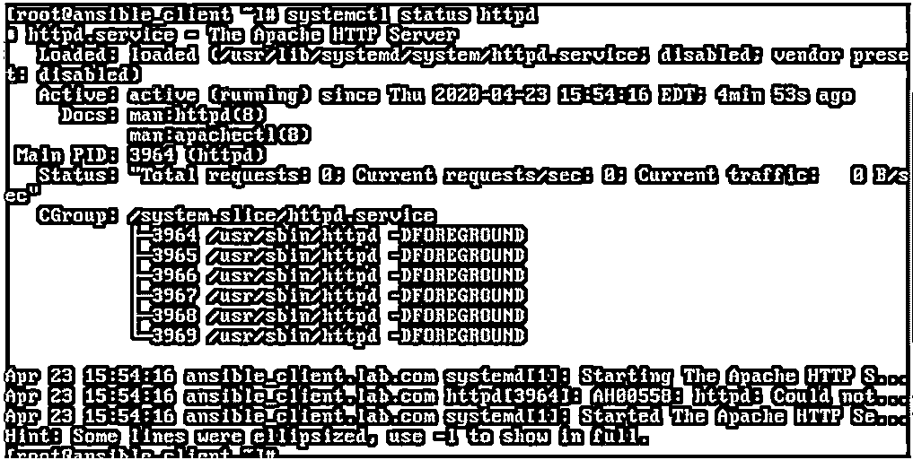

6.我们还可以使用 Ansible ad-hoc 命令重启我们的服务器，如下所示。

**举例:**

**代码:**

`$ansible webservers -i inventory.ini -b -a "/sbin/reboot" -f 10`

**输出:**

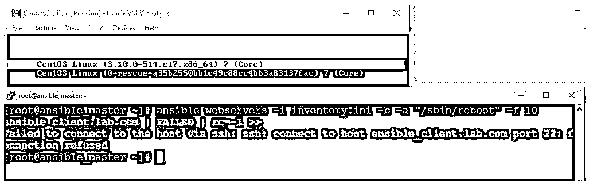

**说明:**

在上面的示例中，我们可以看到，只要我们运行该命令，客户端节点就会重新启动，但是会出现一个错误，因为主机在重新启动时变得不可访问。

**Note:** We need to specify the number by using ‘-f’ flag to reboot more than 5 servers simultaneously as Ansible can fork only 5 simultaneous processes by default. Also, we can use ‘-i’ flag to use any other inventory file rather than the default one.

7.我们可以使用“shell”模块在客户端节点上执行 shell 命令。我们需要注意 shell 引用规则以避免任何错误。

**举例:**

**代码:**

`$ansible webservers -m shell -a ‘df -h’`

**输出:**

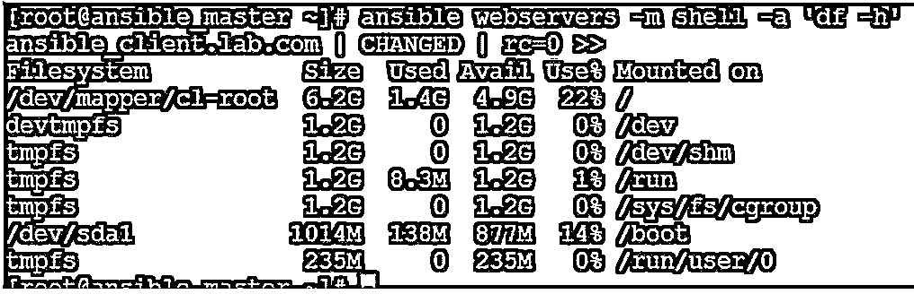

**说明:**

在上面的示例中，我们运行了“df -h”命令来检查客户端节点上的磁盘利用率。我们可以远程运行我们在系统上运行的任何 shell 命令。

### 结论

当我们必须从终端快速运行任何命令而无需编写任何剧本时，Ansible 特别命令非常有用。我们可以使用重定向将输出发送到一个文件，并可以通过管道将输出发送给另一个命令，如 less、more、grep 等。这是非常容易和简单的使用，但是，它不是有用的，而写复杂的任务。

### 推荐文章

这是一个关于 Ansible 即席命令的指南。为了更好地理解，我们在这里讨论 Ansible 临时命令的介绍。您也可以看看以下文章，了解更多信息–

1.  YAML
2.  [可旋转拱顶](https://www.educba.com/ansible-vault/)
3.  [可承担的角色](https://www.educba.com/ansible-roles/)
4.  [可回答的标签](https://www.educba.com/ansible-tags/)

