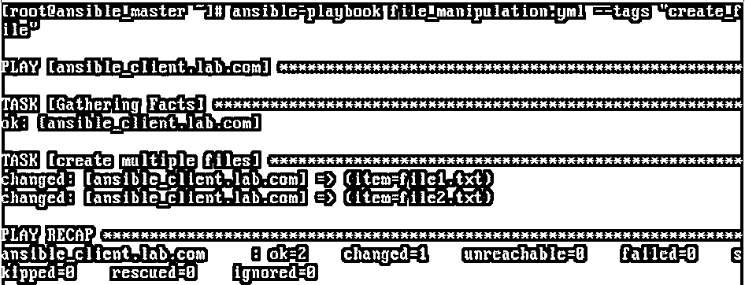
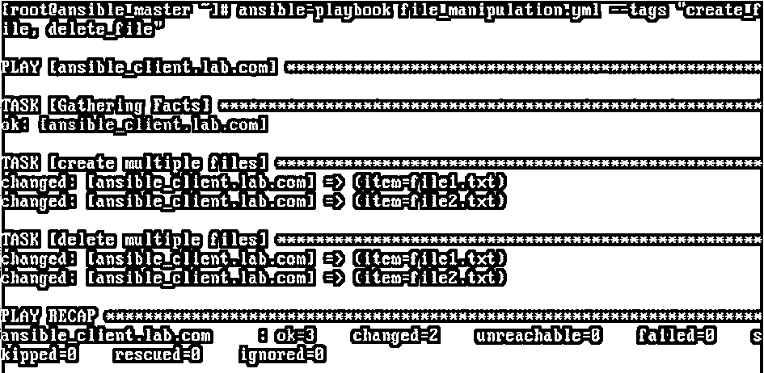
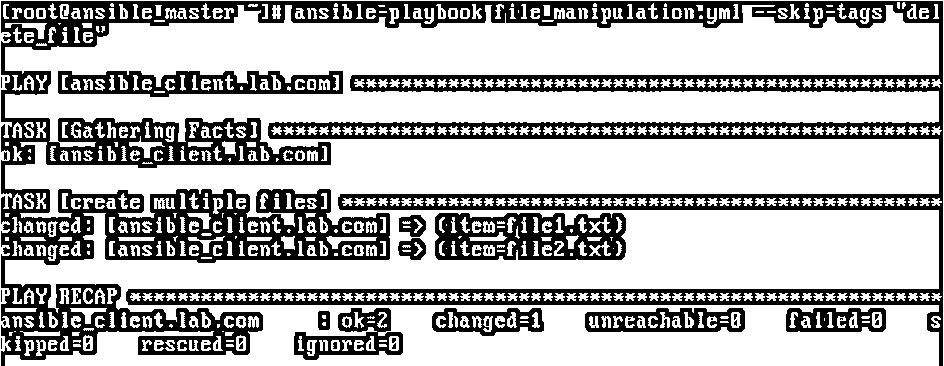
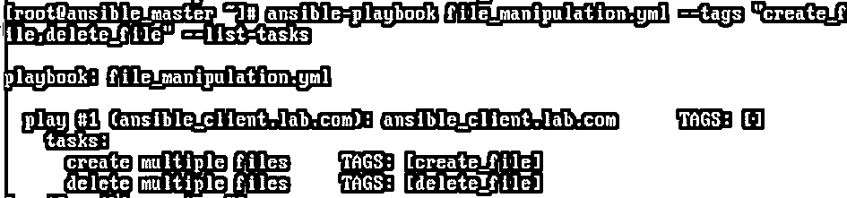
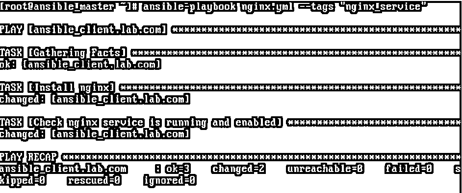
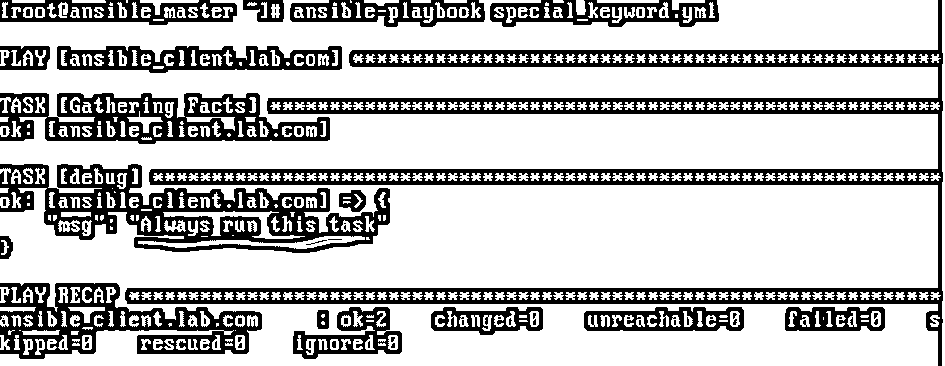
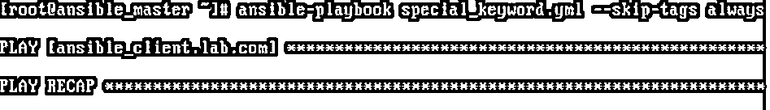
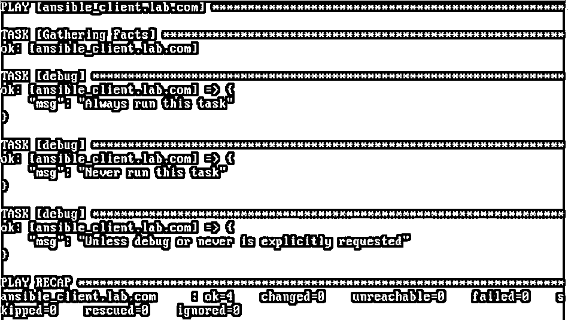

# 可翻译标签

> 原文：<https://www.educba.com/ansible-tags/>

## Ansible 标签简介

Ansible 标记用于运行大型行动手册中的一个或一些特定任务，而不是运行整个行动手册。我们使用“tags:”属性来使用 Ansible 标签。例如，我们在行动手册中有 3 项任务，第一项是安装软件包，第二项是设置配置，第三项是检查已安装软件包的状态，如已安装的服务正在运行且已启用等。但是，我们只想检查一些主机上的包的状态，在这种情况下，我们使用 Ansible 标记来运行特定的任务，而不是运行行动手册中的所有任务。它有助于我们将所有相关任务保存在一个行动手册中，并节省执行时间，因为它提供了仅运行特定任务的能力。

**代码:**

<small>网页开发、编程语言、软件测试&其他</small>

`- name: create multiple files from a location
file:
path: ‘/home/ansible/{{ item }}’
state: touch
loop:
- file1
- file2
tags:
- create_file
- name: delete multiple files from a locatoion
file:
path: ‘/home/ansible/{{ item }}’
state: absent
loop:
- file1
- file2
tags:
- delete_file`

**输出:**

**代码解释:**在上面的例子中，我们有一个可翻译的文件操作剧本，用于创建文件、删除文件或修改文件。正如代码片段中提到的，我们为每个任务附加了标签。我们将文件创建任务标记为“创建文件”，将文件删除任务标记为“删除文件”。因此，当我们必须仅创建文件时，我们在执行行动手册时使用–tags 选项仅运行文件创建任务，这里提到了与文件创建相关的标记，我们有“create_file”。

### 可转换标签的例子

在执行剧本时，我们有两种方法可以根据标签过滤出任务:-

*   在命令行上执行行动手册时，使用–tags 和–skip-tags 选项
*   使用配置文件中的 TAGS_RUN 和 TAGS_SKIPS 选项。

#### 1.使用–标记和–跳过标记选项

如果我们有多个任务需要同时执行，我们使用–标签如下:–

**语法:**

`$ansible-playbook <name_of_the_playbook> --tags “<tag1>, <tag2>, <tag3>, ..”`

##### 例子

`$ansible-playbook file_manipulation.yml --tags “create_file, delete_file”`

**输出:**

**代码解释:**在上面的例子中，我们使用了两个执行两个任务的标签。

#### 2.使用–跳过标签

如果我们必须执行所有任务，但想跳过一些任务，我们可以使用–skip-tags，如下所示:–

**语法:**

`$ansible-playbook <name_of_the_playbook> --skip-tags “<tag1>, <tag2>, <tag3>, ..”`

##### 例子

`$ansible-playbook file_manipulation.yml --skip-tags “delete_file”`

**输出:**

**代码解释:**在上面的例子中，我们想要跳过标记为 delete_file 的任务，因此它已经执行了创建该文件的剩余任务，因为剧本中只有两个任务。

#### 3.将–list-tasks 与–tags 或–skip-tags 一起使用

如果我们想确认在使用某个标签的情况下将执行哪些任务，我们使用–list-tasks with–tags 或–skip-tags，如下所示:–

**语法:**

`$ansible-playbook <name_of_the_playbook> --tags “<tag1>, <tag2>, <tag3>, ..” --list-tasks`

##### 例子

`$ansible-playbook file_manipulation.yml --tags “create_file, delete_file” --list-tasks`

**输出:**

我们还可以将同一个标签应用于多个任务，在这种情况下，所有具有相似标签的任务都将被执行。例如，每当我们创建一个新的 web 服务器时，我们需要安装 nginx 服务，配置它并验证服务是否已启动和启用。我们可以给这些任务赋予相同的标签，这样每当我们有一个新的 web 服务器时，我们将使用该标签执行剧本，它将执行所有的任务。

**代码:**

`---
- hosts: ansible_client.lab.com
become: yes
tasks:
- name: Install nginx
yum:
name: nginx
state: present
tags: nginx_service
- name: Check nginx service is running and enabled
service:
name: nginx
state: started
enabled: yes
tags: nginx_service­­­­`

**输出:**

我们还有一些特殊的标签，如“总是”、“从不”和“调试”。如果我们想在每次运行剧本时运行一个或多个任务，那么我们可以用‘always’关键字标记这些任务。但是，如果我们由于某种原因不想运行这些任务，我们必须使用'–skip-tags always '来跳过这些任务。同样，如果您不想运行一个或多个任务，请用“never”关键字标记这些任务。类似地，如果你有时想运行那些任务，我们必须显式地使用'–tags never '。“debug”关键字主要用于获取剧本的详细输出，但是我们在编写剧本时必须使用调试模块。我们用 debug 关键字标记这些调试任务，这样它将在 stdout 上打印消息。

#### 4.使用[]用多个关键字标记任务

此外，我们可以使用[]用多个关键字标记一个任务。让我们用如下例所示的调试模块来理解这些关键字:–

**代码:**

`---
- hosts: ansible_client.lab.com
become: yes
tasks:
- debug:
msg: Always run this task
tags: always
- debug:
msg: Never run this task
tags: never
- debug:
msg: Unless debug or never is explicitly requested
tags: [never, debug]`

**场景 1—**运行上面的剧本，不带任何标签，如下所示:

`$ansible-playbook special_keyword.yml`

**输出:**

**代码解释:**在上面的例子中，没有指定标签，但是带有‘always’标签的任务成功运行。

**场景 2—**使用“总是跳过标签”选项运行行动手册，如下所示:

`$ansible-playbook special_keyword.yml --skip-tags always`

**输出:**

**代码解释:**在上面的例子中，我们将‘–skip-tags’选项与‘always’一起使用，因此带有‘always’标记的任务不会运行。

**Note:** Here is one more thing to notice, ‘Gathering Facts’ task is also not executed as ‘Gathering Facts’ task has ‘always’ tag by default. It is skipped if we use ‘–skip-tags’ while executing our playbook.

**场景 3—**运行剧本，选择“从不标记”选项，如下所示:—

`$ansible-playbook special_keyword.yml --tags never`

**输出:**

**代码解释:**在上面的例子中，所有的任务都被执行了，因为我们已经明确地请求运行带有‘never’关键字的任务。带有“always”关键字的任务已运行，因为它没有显式跳过。

除此之外，我们还有 3 个特殊的关键字“标记”、“未标记”和“全部”。如果我们只想运行有任何标签的任务，我们使用'标签'关键字，如果只想运行无标签的任务。Ansible 默认使用'–tags all '关键字。

### 结论

当我们必须运行 Ansible 剧本的一部分时，Ansible 标签非常有用。它提供了使用特殊关键字运行行动手册的灵活性。在执行过程中，它能更好地控制我们的剧本。在编写复杂的剧本时，也可以继承它。

### 推荐文章

这是一个关于 Ansible 标签的指南。这里我们还讨论了 ansible 标签的介绍和语法，以及不同的例子和代码实现。您也可以看看以下文章，了解更多信息–

1.  [可翻译版本](https://www.educba.com/ansible-versions/)
2.  [可承担的角色](https://www.educba.com/ansible-roles/)
3.  [可变服务模块](https://www.educba.com/ansible-service-module/)
4.  [可变滤波器](https://www.educba.com/ansible-filters/)

