# 易变 Apt

> 原文：<https://www.educba.com/ansible-apt/>

## Ansible Apt 简介

Ansible Apt 是 Ansible 的一个模块，用于管理基于 Debian 或 Ubuntu 的操作系统上的包。例如，将软件包安装到主机上、从主机上删除软件包以及更新软件包。它的工作方式类似于用于 RedHat 的“yum”包管理器，它有一些高级功能，但是如果我们想使用 apt-get，我们可以在任务中使用属性“force_apt_get”。它需要在执行模块的主机上安装 python-apt 和 python3-apt。

### 实现 Ansible Apt 的示例

下面是提到的例子:

<small>网页开发、编程语言、软件测试&其他</small>

#### 示例#1

使用 apt 模块将软件包安装到主机

为了使用 apt-module 安装任何包，我们只需要提供包的名称，可选地，我们可以将“state”属性设置为“present ”,如下图所示。我们还可以将“state”属性设置为“latest ”,以便安装软件包的最新版本。

**代码:**

`- hosts: ubuntu-k8s-node01
become: yes
remote_user: user1
tasks:
- name: Install nginx
apt:
name: nginx
state: present`

**输出:**

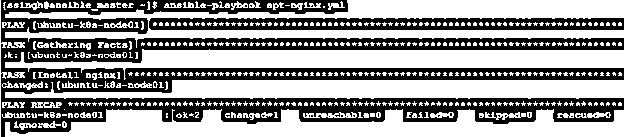

**解释:**在上面的示例中，剧本在用户“user1”下运行，它需要 sudo 权限来管理包，因此也将“变成”属性设置为“是”，并在主机“ubuntu-k8s-node01”上安装了“nginx”。

我们也可以安装任何软件包的特定版本，如下所示:

`- hosts: ubuntu-k8s-node01
become: yes
remote_user: user1
tasks:
- name: Installing specific version of nginx package
apt:
name: nginx=1.14.0-0ubuntu1.7`

**焦虑-apt-engine . yml**播放手册

*   上述行动手册的等效 Ansible ad-command:
*   **ansi ble Ubuntu-k8s-node 01-m apt-a " name = nginx "-b**

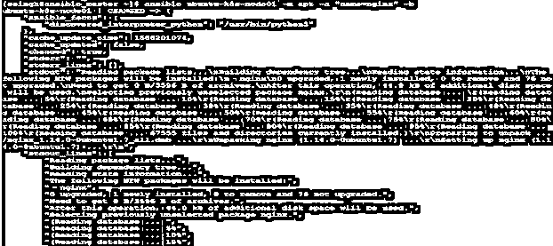

**ansi ble Ubuntu-k8s-node 01-m apt-a " name = nginx = 1 . 14 . 0-0 Ubuntu 1.7 "-b**

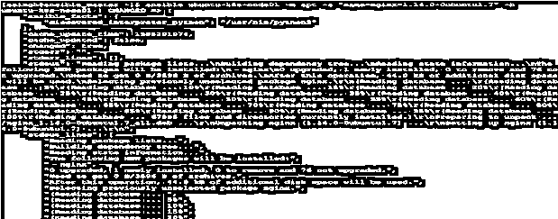

#### 实施例 2

使用 apt 模块将多个软件包安装到主机

使用 apt 安装多个包有不同的方法，第一种是使用“pkg”属性并编写所有需要安装在主机上的包，第二种是使用“Ansible Loop”并逐个将值传递给“name”属性，最后一种是定义一个包列表并直接将其传递给“name”属性。我们也可以使用“with_items”来代替循环。

**代码:**

`- hosts: ubuntu-k8s-node01
become: yes
remote_user: user1
tasks:
- name: Install mulitple packages
apt:
pkg:
- nginx
- curl
state: present`

**焦虑-apt-engine . yml**播放手册

`- hosts: ubuntu-k8s-node01
become: yes
remote_user: user1
tasks:
- name: Install mulitple packages
apt:
name: "{{ item }}"
state: present
loop:
- nginx
- curl`

**焦虑-apt-engine . yml**播放手册

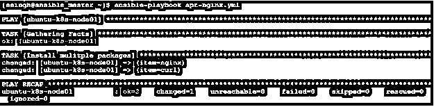

**代码:**

`- hosts: ubuntu-k8s-node01
become: yes
remote_user: user1
vars:
list_of_pkgs:
- nginx
- curl
tasks:
- name: Install mulitple packages
apt:
name: "{{ list_of_pkgs }}"
state: present`

**焦虑-apt-engine . yml**播放手册

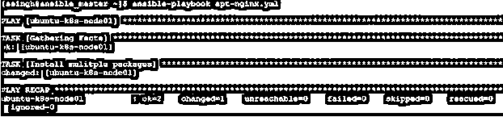

*   上述行动手册的等效 Ansible 专用命令
*   **Ubuntu-k8s-node 01-m apt-a " pkg = nginx，curl state = present "-b**

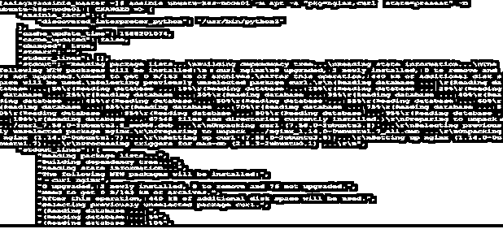

**ansi ble Ubuntu-k8s-node 01-m apt-e list _ of _ pkgs = nginx，curl-a ' name = " { { list _ of _ pkgs } } " state = present '-b**

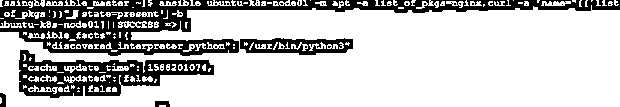

**解释:**在上面的示例中，输出是绿色的，因为主机已经安装，所以没有进行任何更改。

**Note:** It is not possible to use the loop as an ad-hoc command.

#### 实施例 3

使用 apt 模块从主机上删除或卸载软件包

我们只需要将“状态”属性更改为“不存在”,以便从主机上删除或卸载任何软件包，如下图所示。

**代码:**

`- hosts: ubuntu-k8s-node01
become: yes
remote_user: user1
tasks:
- name: Uninstall/removenginx
apt:
name: Nginx
state: absent`

**焦虑-apt-engine . yml**播放手册

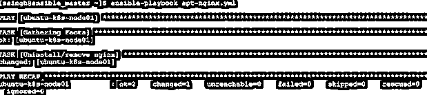

**解释:**在上面的例子中，playbook 从主机“ubuntu-k8s-node01”中卸载了“nginx ”,但是，与“Install nginx”任务的输出相比，除了任务的名称之外，控制台输出没有太大的区别。

**Note:** We can remove multiple packages in the same way we install multiple packages.

*   删除软件包的等效 Ansible 专用命令:–
*   **Ubuntu-k8s-node 01-m apt-a " name = nginx state = absent "-b**

#### 实施例 4

更新存储库缓存并安装软件包

我们使用' update_cache '属性来更新存储库缓存和要安装的包的名称，这里我们不需要使用' state '属性。我们还可以使用“cache_vlaid_time”属性来更新缓存，前提是上次更新是在 3600 秒之前。

`- hosts: ubuntu-k8s-node01
become: yes
remote_user: user1
tasks:
- name: update repositories cache and install nginx package
apt:
name: nginx
update_cache: yes
cache_valid_time: 3600`

**apt-engine . yml**播放手册

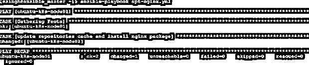

#### 实施例 5

使用 apt 模块安装 Debian 软件包

我们可以安装。使用' deb '属性将 deb 包发送到主机，并传递 Debian 包的路径。Debian 包必须在我们需要安装 deb 包的主机上可用，我们提供了包在本地可用的路径。

`- hosts: ubuntu-k8s-node01
become: yes
remote_user: user1
tasks:
- name: Installing debian package
apt:
deb: /home/ssingh/curl_7.58.0-2ubuntu3.8_amd64.deb`

**焦虑-apt-engine . yml 播放手册**

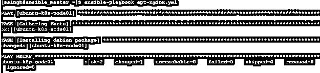

我们还可以安装。deb 包直接从网上下载。我们需要传递 Debian 包的“URL ”,而不是本地路径。

**代码:**

`- hosts: ubuntu-k8s-node01
become: yes
remote_user: user1
tasks:
- name: Installing debian package from the internet
apt:
deb: http://archive.ubuntu.com/ubuntu/pool/main/c/curl/curl_7.58.0-2ubuntu3.8_amd64.deb`

**焦虑-apt-engine . yml**播放手册

*   在主机上安装 Debian 软件包的等效专用命令:-
*   **Ubuntu-k8s-node 01-m apt-a " deb =/home/ssingh/curl _ 7 . 58 . 0-2ubuntu 3.8 _ amd64 . deb "-b**

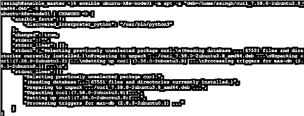

**Ubuntu-k8s-node 01-m apt-a " deb = http://archive . Ubuntu . com/Ubuntu/pool/main/c/curl/curl _ 7 . 58 . 0-2ubuntu 3.8 _ amd64 . deb "-b**

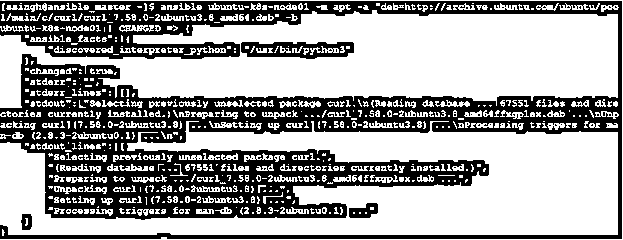

#### 实施例 6

从缓存中删除无用的包

我们需要将“autoclean”属性设置为“yes ”,以便从缓存中删除无用的包，如下所示:–

**代码:**

`- hosts: ubuntu-k8s-node01
become: yes
remote_user: ssingh
tasks:
- name: Removing useless packages from the cache
apt:
autoclean: yes`

**ansi ble-playbook apt-auticlean . yml**

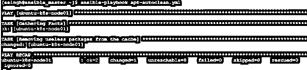

*   删除无用软件包的等效专用命令如下:-
*   **Ubuntu-k8s-node 01-m apt-a " auto clean = yes "-b**

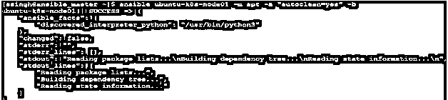

#### 实施例 7

从主机中删除不需要的依赖项

我们使用“自动删除”属性来删除主机上不再需要的依赖项。相同的剧本如下:–

**代码:**

`- hosts: ubuntu-k8s-node01
become: yes
remote_user: ssingh
tasks:
- name: Removing old dependencies that is no longer required
apt:
autoremove: yes`

**ansi ble-playbook apt-autoremove . yml .**

*   删除无用依赖项的等效专用命令如下:–
*   **Ubuntu-k8s-node 01-m apt-a " autoremove = yes "-b**

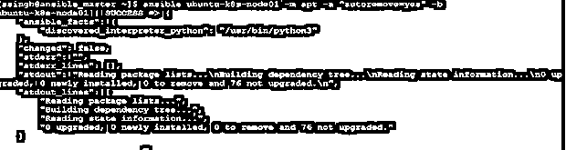

### 结论

apt 模块只能在基于 Debian 或 Ubuntu 的操作系统上管理软件包。还有一些属性，如 purge、force、install _ recommends、upgrade 等。我们可以将 apt 模块作为一个特别的命令或在行动手册中使用。我们可以根据需要一起使用一些属性。

### 推荐文章

这是一个 Ansible Apt 的指南。在这里，我们讨论了一个简单的 Apt，并给出了 7 个实现 Apt 的例子。您也可以浏览我们的其他相关文章，了解更多信息——

1.  什么是 Ansible？
2.  [可翻译版本](https://www.educba.com/ansible-versions/)
3.  [可旋转拱顶](https://www.educba.com/ansible-vault/)
4.  [可变循环](https://www.educba.com/ansible-loop/)

