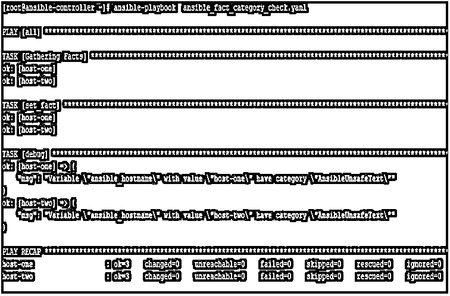
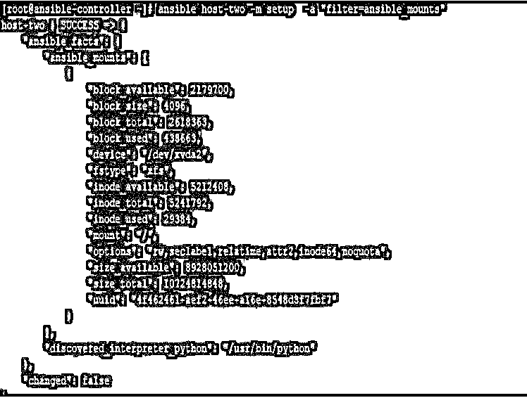
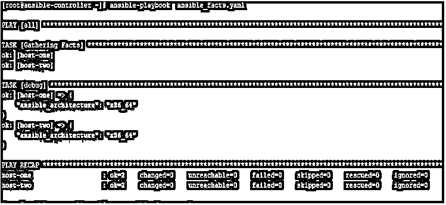
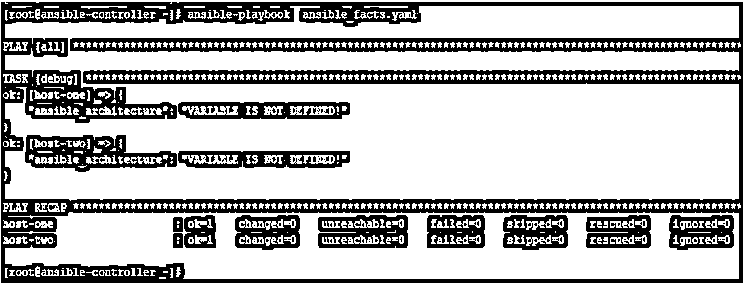
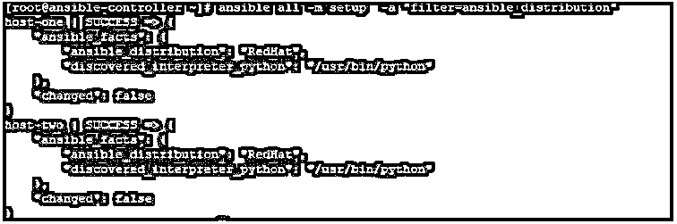
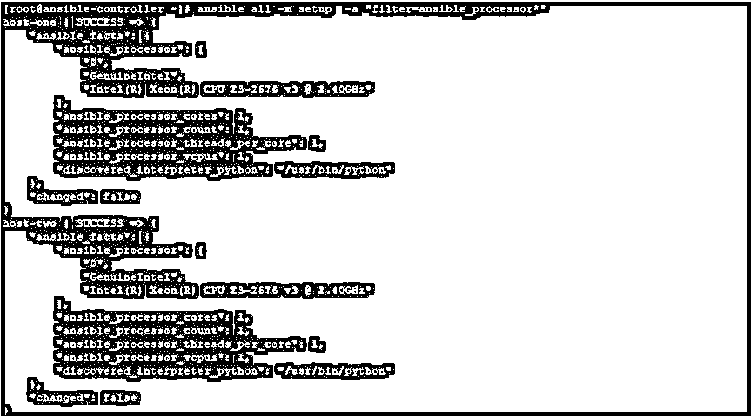
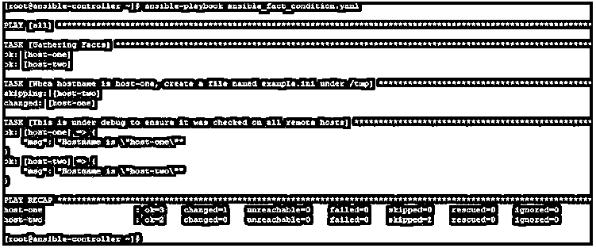

# 可能的事实

> 原文：<https://www.educba.com/ansible-facts/>

## 可抗辩事实介绍

可回答的事实是由可回答的控制器收集的远程主机的信息。该信息存储在控制器节点上的预定义变量中，整套信息以 JSON 格式准备。这是一个非常重要的特性，因为我们可以根据这些事实来决定在哪个远程机器上执行哪个任务。

此外，当您处理实时数据时，获取这些事实并在剧本中将其作为变量使用是非常有用的。该信息可以是主机名、IP 地址、mac 地址、安装的 OS 相关信息、机器的当前状态等。

<small>网页开发、编程语言、软件测试&其他</small>

### 解释可能的事实

使用设置模块收集可能的事实，该模块每次都在后台运行。但这可以通过在行动手册中提及 gather_facts: no 来关闭。我们可以运行设置模块并将输出注册到一个变量中，整套信息将采用 JSON 格式，如果您需要其中的一条信息，您可以将它拆开，只使用这条信息。

从远程主机收集的事实集可以分为三类:

*   **列表:**这是物品列表。这可以是接口列表等。列表中的信息放在方括号[]中。
*   **字典:**这是密钥对值的集合，字典里面的信息放在花括号{}里。
*   **Ansible unsafe text:** 它是一个变量，包含值，并且没有

下面是收集到的事实的一小部分。在这里，您可以看到，远程主机的信息被收集并放置在变量中，如 ansible_all_ipv4_addresses 变量，该变量将获取我们所有的 ipv4 地址。

另外，请注意，一些事实在[]中包含值，如 ansible_all_ipv4_addresses，这意味着它是一个列表，一些变量如 ansible_apparmor 在{}中包含信息，这意味着它是一个字典，还有一些只是在冒号(:)后放置值，如 ansible_architecture，这意味着它是一个 ansible 不安全文本类别。

`ansible host-one –m setup`

要获得事实的类别，可以使用一个过滤器 type_debug，它会告诉你的变量/事实是一个列表、一个字典还是一个不安全的文本。要检查这一点，请创建如下行动手册:

`---
- hosts:
all
tasks:
- set_fact:
check_category: "{{ ansible_hostname|type_debug }}"
- debug:
msg: 'Variable "ansible_hostname" with value "{{ ansible_hostname }}" have category "{{ check_category }}"'`

然后执行它，您将得到如下所示的输出，其中您可以看到事实 ansible_hostname 的类别

`ansible-playbook ansible_fact_category_check.yaml`

### 事实是如何做到的？

使用设置模块从远程主机获取可回答的事实，如果没有禁用，该模块每次都会自动运行。这可以通过使用即席方法在命令行上运行设置模块来完成，或者默认在行动手册中完成。

#### <u>临时方法</u>

 <u>在 Ansible 控制器节点上运行以下命令以获取所有可用的事实。

`ansible host-one -m setup`

同样，通过在 adhoc 命令下运行也是可能的。

`ansible all -m gather_facts --tree /tmp/facts`

同样，如果你只需要展示一个特定的事实，那么你可以使用 like 如下:

`ansible host-two -m setup -a "filter=ansible_mounts"`

JSON 格式的输出会很长。如下图。

#### <u><u>剧本法</u></u>

 <u><u>如果您有一个如下的行动手册，其中我们没有提到设置模块。

`---
- hosts:
all
tasks:
- debug:
var: ansible_architecture`

运行后。在输出中，您将看到我们获得了变量 ansible_architecture 的值。

`ansible-playbook ansible_fact.yaml`

但是如果你提到了 gather_facts:没有像下面这样。

`---
- hosts: all
gather_facts:
no tasks:
debug:
var: ansible_architecture`

然后你会看到，在输出中，变量 ansible_architecture 将显示为未定义。

`ansible-playbook ansible_fact.yaml`

### 可回答事实的例子

现在，通过使用示例，我们将尝试了解一些可能的事实，这些事实在日常操作中可能会用到。我们将举一些例子，但在去那里之前，我们首先了解我们的实验室用于测试的目的。

这里我们有一个名为 ansible-controller 的 Ansible 控制服务器和两个名为 host-1 和 host-2 的远程主机。我们将创建剧本，在 ansible-controller 节点上运行 Ansible 命令，并在远程主机上管理用户。下面是一些特别的命令，它们易于使用，但不能像行动手册一样重复使用。

使用过滤器和设置获取事实:

`ansible all -m setup -a "filter=ansible_distribution"`

输出如下所示:

`ansible all -m setup -a "filter=ansible_distribution"`

获取与关键字相关的所有事实，如处理器、内存、产品等。我们可以使用如下通配符:–

`ansible all -m setup -a "filter=ansible_processor*"`

输出如下所示:

您可以使用 gather_subset，只获取与主题相关的事实。子集的名称可以是 all、min、hardware、network、virtual、ohai 和 factor。如果感叹号(！)作为一个子集的初始值，那么该子集的事实将不会被获取。就像下面的例子，我们将只获取虚拟子集相关的事实，并使用！全部，！min，我们甚至不允许默认最小事实。

`ansible host-one -m setup -a 'gather_subset=virtual,!all,!min'`

输出如下所示:

在下面的示例中，我们将使用一个条件，在该条件中，我们将检查远程主机上的事实值，然后基于该值，我们的条件将允许执行任务。

这里，我们希望只在 host-one 上创建一个文件，所以我们使用 ansible facts 检查 ansible_hostname 的值是否等于 host-one。如果是这样，将创建该文件，对于其他远程主机，将跳过该操作。

`---
hosts:
all
tasks:
name: When hostname is host-one, create a file named example.ini under /tmp file:
path:
/tmp/example.ini
state: touch
when: ansible_hostname == "host-one"
name: This is under debug to ensure it was checked on all remote hosts debug:
msg: Hostname is "{{ ansible_hostname }}"`

输出如下所示:

`ansible-playbook ansible_fact_condition.yaml`

### 结论

事实是一个有用的工具。它将运行并帮助您从远程主机收集信息。但是您可能会承认，如果您有很多主机需要 Ansible 管理，那么收集事实而不使用这些事实只会增加您的带宽和处理能力的负担。所以最好先分析你是否需要事实，然后据此使用它们。

### 推荐文章

这是一份可回答事实的指南。为了更好地理解，我们在这里讨论事实是如何解释的，并给出了相应的例子。您也可以阅读以下文章，了解更多信息——

1.  [可旋转拱顶](https://www.educba.com/ansible-vault/)
2.  [可回答的标签](https://www.educba.com/ansible-tags/)
3.  [可变循环](https://www.educba.com/ansible-loop/)
4.  什么是 Ansible？

</u></u></u>